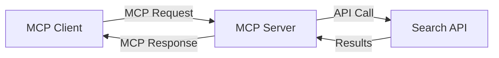
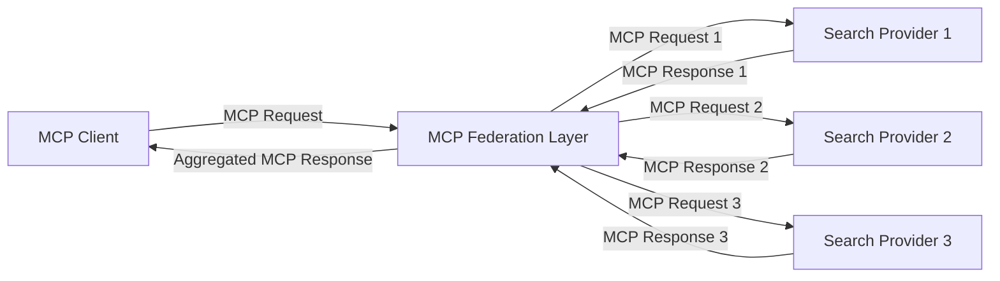
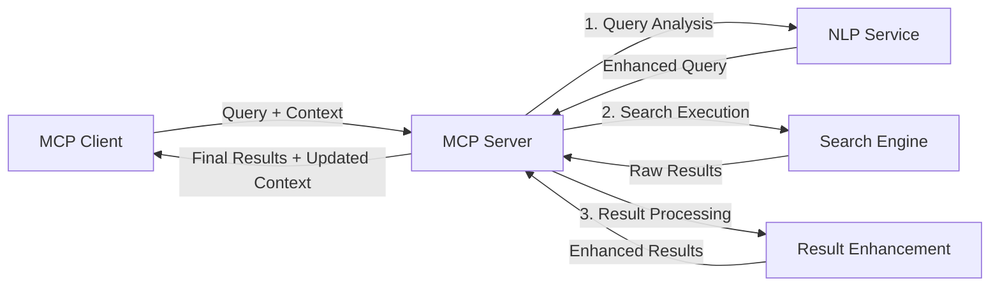

<!--
CO_OP_TRANSLATOR_METADATA:
{
  "original_hash": "eb12652eb7bd17f2193b835a344425c6",
  "translation_date": "2025-06-26T14:26:59+00:00",
  "source_file": "05-AdvancedTopics/mcp-realtimesearch/README.md",
  "language_code": "sl"
}
-->
## Opozorilo glede primerov kode

> **Pomembna opomba**: spodnji primeri kode prikazujejo integracijo Model Context Protocol (MCP) z funkcionalnostjo spletnega iskanja. Čeprav sledijo vzorcem in strukturam uradnih MCP SDK-jev, so poenostavljeni za izobraževalne namene.
> 
> Ti primeri prikazujejo:
> 
> 1. **Implementacija v Pythonu**: implementacijo FastMCP strežnika, ki ponuja orodje za spletno iskanje in se povezuje z zunanjim iskalnim API-jem. Ta primer prikazuje pravilno upravljanje življenjske dobe, ravnanje s kontekstom in implementacijo orodja po vzorcih [uradnega MCP Python SDK-ja](https://github.com/modelcontextprotocol/python-sdk). Strežnik uporablja priporočeni Streamable HTTP transport, ki je nadomestil starejši SSE transport za produkcijsko rabo.
> 
> 2. **Implementacija v JavaScriptu**: implementacijo v TypeScript/JavaScriptu z uporabo FastMCP vzorca iz [uradnega MCP TypeScript SDK-ja](https://github.com/modelcontextprotocol/typescript-sdk), za ustvarjanje iskalnega strežnika s pravilnimi definicijami orodij in povezavami s klienti. Sledi najnovejšim priporočilom za upravljanje sej in ohranjanje konteksta.
> 
> Ti primeri bi za produkcijsko uporabo zahtevali dodatno obravnavo napak, avtentikacijo in specifično integracijo API-jev. Prikazani iskalni API končni točki (`https://api.search-service.example/search`) so nadomestni in jih je treba zamenjati z dejanskimi iskalnimi storitvami.
> 
> Za popolne podrobnosti implementacije in najnovejše pristope si oglejte [uradno MCP specifikacijo](https://spec.modelcontextprotocol.io/) in dokumentacijo SDK.

## Osnovni pojmi

### Okvir Model Context Protocol (MCP)

Na osnovi MCP omogoča standardiziran način izmenjave konteksta med AI modeli, aplikacijami in storitvami. Pri realnočasovnem spletnem iskanju je ta okvir ključnega pomena za ustvarjanje koherentnih, večkrožnih iskalnih izkušenj. Ključne sestavine so:

1. **Arhitektura klient-strežnik**: MCP vzpostavi jasno ločnico med iskalnimi klienti (zahtevki) in iskalnimi strežniki (ponudniki), kar omogoča prilagodljive modele namestitve.

2. **JSON-RPC komunikacija**: protokol uporablja JSON-RPC za izmenjavo sporočil, kar je združljivo s spletnimi tehnologijami in enostavno za implementacijo na različnih platformah.

3. **Upravljanje konteksta**: MCP definira strukturirane metode za ohranjanje, posodabljanje in izkoriščanje iskalnega konteksta skozi več interakcij.

4. **Definicije orodij**: iskalne zmogljivosti so predstavljene kot standardizirana orodja z dobro določenimi parametri in vrnjenimi vrednostmi.

5. **Podpora pretakanju**: protokol podpira pretakanje rezultatov, kar je bistveno za realnočasovno iskanje, kjer rezultati prihajajo postopoma.

### Vzorci integracije spletnega iskanja

Pri integraciji MCP s spletnim iskanjem se pojavljajo različni vzorci:

#### 1. Neposredna integracija ponudnika iskanja

V tem vzorcu MCP strežnik neposredno komunicira z enim ali več iskalnimi API-ji, prevaja MCP zahteve v API-specifične klice in rezultate oblikuje kot MCP odzive.

#### 2. Federativno iskanje s ohranjanjem konteksta

Ta vzorec razporeja iskalne poizvedbe med več MCP-kompatibilnimi ponudniki iskanja, ki so lahko specializirani za različne vrste vsebin ali zmogljivosti, pri čemer ohranja enoten kontekst.

#### 3. Iskalni proces z obogatenim kontekstom

V tem vzorcu je iskalni proces razdeljen na več stopenj, pri čemer se kontekst na vsakem koraku bogati, kar vodi do postopoma bolj relevantnih rezultatov.

### Komponente iskalnega konteksta

V spletnem iskanju, ki temelji na MCP, kontekst običajno vključuje:

- **Zgodovina poizvedb**: prejšnje iskalne poizvedbe v seji
- **Uporabniške preference**: jezik, regija, nastavitve varnega iskanja
- **Zgodovina interakcij**: kateri rezultati so bili kliknjeni, čas, preživet na rezultatih
- **Iskalni parametri**: filtri, vrstni redi in drugi iskalni modifikatorji
- **Strokovno znanje**: predmetno specifičen kontekst, pomemben za iskanje
- **Časovni kontekst**: dejavniki relevantnosti, povezani s časom
- **Preference virov**: zaupanja vredni ali prednostni viri informacij

## Primeri uporabe in aplikacije

### Raziskovanje in zbiranje informacij

MCP izboljšuje raziskovalne procese z:

- Ohranjanjem raziskovalnega konteksta skozi seje iskanja
- Omogočanjem bolj sofisticiranih in kontekstualno relevantnih poizvedb
- Podporo federativnemu iskanju iz več virov
- Olajšanjem izvlečka znanja iz iskalnih rezultatov

### Spremljanje novic in trendov v realnem času

Iskanje, podprto z MCP, ponuja prednosti pri spremljanju novic:

- Odkritje nastajajočih novic skoraj v realnem času
- Kontekstualno filtriranje relevantnih informacij
- Sledenje tem in entitetam preko več virov
- Personalizirana obvestila o novicah na podlagi uporabniškega konteksta

### Brskanje in raziskovanje, podprto z AI

MCP odpira nove možnosti za brskanje, podprto z AI:

- Kontekstualni predlogi iskanja na podlagi trenutne aktivnosti v brskalniku
- Brezšivna integracija spletnega iskanja z asistenti, podprtimi z velikimi jezikovnimi modeli (LLM)
- Večkrožno izboljševanje iskanja z ohranjanjem konteksta
- Izboljšano preverjanje dejstev in verifikacija informacij

## Prihodnji trendi in inovacije

### Razvoj MCP v spletnem iskanju

V prihodnosti pričakujemo, da se bo MCP razvijal za:

- **Multimodalno iskanje**: integracija iskanja po besedilu, slikah, zvoku in videu z ohranjanjem konteksta
- **Decentralizirano iskanje**: podpora za distribuirane in federativne iskalne ekosisteme
- **Zasebnost iskanja**: mehanizmi za varovanje zasebnosti, ki upoštevajo kontekst
- **Razumevanje poizvedb**: globoko semantično razčlenjevanje naravnih jezikovnih iskalnih poizvedb

### Potencialni tehnološki napredki

Nove tehnologije, ki bodo oblikovale prihodnost MCP iskanja:

1. **Nevralne iskalne arhitekture**: iskalni sistemi, optimizirani za MCP, ki temeljijo na vdelavah (embedding)
2. **Personaliziran iskalni kontekst**: učenje vzorcev iskanja posameznih uporabnikov skozi čas
3. **Integracija znanstvenih grafov**: kontekstualno iskanje, izboljšano z domeno specifičnimi znanstvenimi grafi
4. **Medmodalni kontekst**: ohranjanje konteksta preko različnih iskalnih modalitet

## Praktične vaje

### Vaja 1: Nastavitev osnovnega MCP iskalnega procesa

V tej vaji se boste naučili:
- Konfigurirati osnovno MCP iskalno okolje
- Implementirati upravljalce konteksta za spletno iskanje
- Testirati in preveriti ohranjanje konteksta skozi več iteracij iskanja

### Vaja 2: Izgradnja raziskovalnega asistenta z MCP iskanjem

Ustvarite celovito aplikacijo, ki:
- Obdeluje naravne jezikovne raziskovalne poizvedbe
- Izvaja iskanje po spletu z upoštevanjem konteksta
- Sintetizira informacije iz več virov
- Predstavlja organizirane raziskovalne ugotovitve

### Vaja 3: Implementacija federacije iskanja iz več virov z MCP

Napredna vaja, ki zajema:
- Kontekstualno usmerjanje poizvedb na več iskalnikov
- Razvrščanje in združevanje rezultatov
- Kontekstualno odstranjevanje podvojenih rezultatov
- Upravljanje metapodatkov, specifičnih za posamezne vire

## Dodatni viri

- [Model Context Protocol Specification](https://spec.modelcontextprotocol.io/) - Uradna MCP specifikacija in podrobna dokumentacija protokola
- [Model Context Protocol Documentation](https://modelcontextprotocol.io/) - Podrobni vodiči in navodila za implementacijo
- [MCP Python SDK](https://github.com/modelcontextprotocol/python-sdk) - Uradna Python implementacija MCP protokola
- [MCP TypeScript SDK](https://github.com/modelcontextprotocol/typescript-sdk) - Uradna TypeScript implementacija MCP protokola
- [MCP Reference Servers](https://github.com/modelcontextprotocol/servers) - Referenčne implementacije MCP strežnikov
- [Bing Web Search API Documentation](https://learn.microsoft.com/en-us/bing/search-apis/bing-web-search/overview) - Microsoftov spletni iskalni API
- [Google Custom Search JSON API](https://developers.google.com/custom-search/v1/overview) - Googlov programabilni iskalnik
- [SerpAPI Documentation](https://serpapi.com/search-api) - API za rezultate iskalnih strani
- [Meilisearch Documentation](https://www.meilisearch.com/docs) - Odprtokodni iskalni motor
- [Elasticsearch Documentation](https://www.elastic.co/guide/index.html) - Distribuirani iskalni in analitični motor
- [LangChain Documentation](https://python.langchain.com/docs/get_started/introduction) - Gradnja aplikacij z LLM-ji

## Pričakovani rezultati učenja

Po zaključku tega modula boste sposobni:

- Razumeti temelje realnočasovnega spletnega iskanja in njegove izzive
- Razložiti, kako Model Context Protocol (MCP) izboljšuje zmogljivosti realnočasovnega spletnega iskanja
- Implementirati rešitve iskanja, ki temeljijo na MCP, z uporabo priljubljenih ogrodij in API-jev
- Načrtovati in uvajati razširljive, zmogljive iskalne arhitekture z MCP
- Uporabiti koncepte MCP za različne primere uporabe, vključno s semantičnim iskanjem, raziskovalno pomočjo in brskanjem, podprtim z AI
- Ovrednotiti nastajajoče trende in prihodnje inovacije v tehnologijah iskanja, ki temeljijo na MCP

### Premisleki o zaupanju in varnosti

Pri implementaciji MCP-baziranih rešitev spletnega iskanja upoštevajte naslednja pomembna načela iz MCP specifikacije:

1. **Soglasje in nadzor uporabnika**: uporabniki morajo izrecno soglašati in razumeti vse dostope do podatkov in operacije. To je posebej pomembno za implementacije spletnega iskanja, ki lahko dostopajo do zunanjih virov podatkov.

2. **Zasebnost podatkov**: zagotovite ustrezno ravnanje z iskalnimi poizvedbami in rezultati, zlasti kadar vsebujejo občutljive informacije. Uvedite ustrezne kontrole dostopa za zaščito uporabniških podatkov.

3. **Varnost orodij**: implementirajte ustrezno avtorizacijo in validacijo za iskalna orodja, saj predstavljajo potencialno varnostno tveganje zaradi izvajanja poljubne kode. Opisi vedenja orodij naj bodo nezaupljivi, razen če so pridobljeni z zaupanja vrednega strežnika.

4. **Jasna dokumentacija**: zagotovite jasno dokumentacijo o zmogljivostih, omejitvah in varnostnih premislekih vaše MCP-bazirane implementacije iskanja, skladno z navodili MCP specifikacije.

5. **Robustni postopki soglasja**: zgradite robustne postopke za soglasje in avtorizacijo, ki jasno razložijo, kaj vsako orodje počne, preden dovolijo njegovo uporabo, zlasti za orodja, ki dostopajo do zunanjih spletnih virov.

Za popolne podrobnosti o varnosti in zaupanju MCP si oglejte [uradno dokumentacijo](https://modelcontextprotocol.io/specification/2025-03-26#security-and-trust-%26-safety).

## Kaj sledi

- [5.11 Avtentikacija Entra ID za Model Context Protocol strežnike](../mcp-security-entra/README.md)

**Opozorilo**:  
Ta dokument je bil preveden z uporabo storitve za avtomatski prevod AI [Co-op Translator](https://github.com/Azure/co-op-translator). Čeprav si prizadevamo za natančnost, upoštevajte, da lahko avtomatski prevodi vsebujejo napake ali netočnosti. Izvirni dokument v izvorni jezikovni različici velja za avtoritativni vir. Za ključne informacije priporočamo strokovni človeški prevod. Nismo odgovorni za morebitna nesporazume ali napačne interpretacije, ki izhajajo iz uporabe tega prevoda.