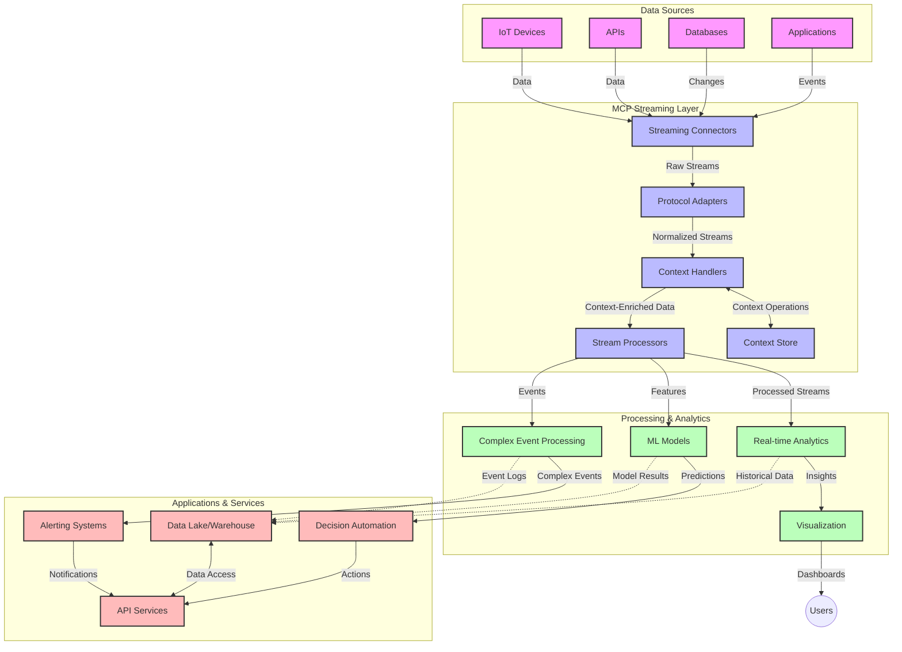

<!--
CO_OP_TRANSLATOR_METADATA:
{
  "original_hash": "195f7287638b77a549acadd96c8f981c",
  "translation_date": "2025-06-13T01:25:44+00:00",
  "source_file": "05-AdvancedTopics/mcp-realtimestreaming/README.md",
  "language_code": "sl"
}
-->
# Model Context Protocol za Real-Time Data Streaming

## Pregled

Real-time data streaming je postal ključnega pomena v današnjem svetu, ki temelji na podatkih, kjer podjetja in aplikacije potrebujejo takojšen dostop do informacij za pravočasno sprejemanje odločitev. Model Context Protocol (MCP) predstavlja pomemben napredek pri optimizaciji teh real-time streaming procesov, izboljšuje učinkovitost obdelave podatkov, ohranja kontekstualno celovitost in izboljšuje splošno zmogljivost sistema.

Ta modul raziskuje, kako MCP spreminja real-time data streaming z zagotavljanjem standardiziranega pristopa k upravljanju konteksta med AI modeli, streaming platformami in aplikacijami.

## Uvod v Real-Time Data Streaming

Real-time data streaming je tehnološki pristop, ki omogoča neprekinjen prenos, obdelavo in analizo podatkov takoj, ko so ustvarjeni, kar omogoča sistemom, da se takoj odzovejo na nove informacije. Za razliko od tradicionalne obdelave v serijah, ki deluje na statičnih podatkih, streaming obdeluje podatke v gibanju, kar omogoča vpoglede in ukrepe z minimalno zakasnitvijo.

### Osnovni pojmi Real-Time Data Streaming:

- **Neprekinjen pretok podatkov**: Podatki se obdelujejo kot neprekinjen, neskončen tok dogodkov ali zapisov.
- **Nizka zakasnitev obdelave**: Sistemi so zasnovani tako, da zmanjšajo čas med generiranjem in obdelavo podatkov.
- **Prilagodljivost**: Streaming arhitekture morajo obvladovati spremenljive količine in hitrost podatkov.
- **Odpornost na napake**: Sistemi morajo biti odporni na napake, da zagotovijo neprekinjen pretok podatkov.
- **Stanje obdelave**: Ohranjanje konteksta med dogodki je ključno za smiselno analizo.

### Model Context Protocol in Real-Time Streaming

Model Context Protocol (MCP) naslavlja več ključnih izzivov v real-time streaming okoljih:

1. **Kontekstualna kontinuiteta**: MCP standardizira način ohranjanja konteksta med razpršenimi streaming komponentami, zagotavlja, da imajo AI modeli in procesni vozli dostop do relevantnega zgodovinskega in okoljskega konteksta.

2. **Učinkovito upravljanje stanja**: Z zagotavljanjem strukturiranih mehanizmov za prenos konteksta MCP zmanjšuje obremenitev upravljanja stanja v streaming cevovodih.

3. **Medsebojna združljivost**: MCP ustvarja skupni jezik za deljenje konteksta med različnimi streaming tehnologijami in AI modeli, kar omogoča bolj fleksibilne in razširljive arhitekture.

4. **Streaming-optimiran kontekst**: Implementacije MCP lahko prednostno obravnavajo, kateri elementi konteksta so najbolj pomembni za real-time odločanje, optimizirajo zmogljivost in natančnost.

5. **Prilagodljiva obdelava**: Z ustreznim upravljanjem konteksta preko MCP lahko streaming sistemi dinamično prilagajajo obdelavo glede na spreminjajoče se pogoje in vzorce v podatkih.

V sodobnih aplikacijah, od IoT senzornih omrežij do finančnih trgovalnih platform, integracija MCP s streaming tehnologijami omogoča pametnejšo, kontekstualno ozaveščeno obdelavo, ki se lahko ustrezno odzove na kompleksne in spreminjajoče se situacije v realnem času.

## Cilji učenja

Na koncu te lekcije boste lahko:

- Razumeli temelje real-time data streaminga in njegove izzive
- Pojasnili, kako Model Context Protocol (MCP) izboljšuje real-time data streaming
- Implementirali rešitve za streaming z MCP z uporabo priljubljenih ogrodij, kot sta Kafka in Pulsar
- Načrtovali in uvajali odporne in zmogljive streaming arhitekture z MCP
- Uporabili koncepte MCP v primerih uporabe IoT, finančnega trgovanja in analitike, ki jo poganja AI
- Ocenili nove trende in prihodnje inovacije v tehnologijah streaming z MCP

### Definicija in pomen

Real-time data streaming vključuje neprekinjeno generiranje, obdelavo in dostavo podatkov z minimalno zakasnitvijo. Za razliko od obdelave v serijah, kjer se podatki zbirajo in obdelujejo v skupinah, se streaming podatki obdelujejo postopoma, takoj ko prispejo, kar omogoča takojšnje vpoglede in ukrepe.

Ključne značilnosti real-time data streaminga so:

- **Nizka zakasnitev**: Obdelava in analiza podatkov v milisekundah do sekundah
- **Neprekinjen pretok**: Neprekinjeni tokovi podatkov iz različnih virov
- **Takojšnja obdelava**: Analiza podatkov takoj ob prihodu, ne v serijah
- **Arhitektura, ki temelji na dogodkih**: Odzivanje na dogodke, ko se zgodijo

### Izzivi tradicionalnega data streaminga

Tradicionalni pristopi k data streamingu se soočajo z več omejitvami:

1. **Izguba konteksta**: Težave pri ohranjanju konteksta med razpršenimi sistemi
2. **Težave s prilagodljivostjo**: Izzivi pri skaliranju za obvladovanje velike količine in hitrosti podatkov
3. **Kompleksnost integracije**: Problemi z medsebojno združljivostjo različnih sistemov
4. **Upravljanje zakasnitve**: Uravnoteženje prepustnosti in časa obdelave
5. **Konsistentnost podatkov**: Zagotavljanje točnosti in popolnosti podatkov skozi tok

## Razumevanje Model Context Protocol (MCP)

### Kaj je MCP?

Model Context Protocol (MCP) je standardiziran komunikacijski protokol, zasnovan za učinkovito interakcijo med AI modeli in aplikacijami. V kontekstu real-time data streaminga MCP zagotavlja okvir za:

- Ohranjanje konteksta skozi celoten podatkovni cevovod
- Standardizacijo formatov izmenjave podatkov
- Optimizacijo prenosa velikih podatkovnih nizov
- Izboljšanje komunikacije med modeli in med modeli ter aplikacijami

### Glavne komponente in arhitektura

Arhitektura MCP za real-time streaming obsega več ključnih komponent:

1. **Context Handlers**: Upravljajo in ohranjajo kontekstualne informacije skozi streaming cevovod
2. **Stream Processors**: Obdelujejo prihajajoče podatkovne tokove z uporabo tehnik, ki upoštevajo kontekst
3. **Protocol Adapters**: Pretvarjajo med različnimi streaming protokoli ob ohranjanju konteksta
4. **Context Store**: Učinkovito shranjuje in pridobiva kontekstualne informacije
5. **Streaming Connectors**: Povezujejo se z različnimi streaming platformami (Kafka, Pulsar, Kinesis itd.)



### Kako MCP izboljšuje obdelavo real-time podatkov

MCP rešuje tradicionalne izzive streaminga z:

- **Kontekstualno celovitostjo**: Ohranjanje povezav med podatkovnimi točkami skozi celoten cevovod
- **Optimiziranim prenosom**: Zmanjševanje podvajanja v izmenjavi podatkov z inteligentnim upravljanjem konteksta
- **Standardiziranimi vmesniki**: Zagotavljanje doslednih API-jev za streaming komponente
- **Zmanjšano zakasnitvijo**: Minimiziranje obremenitve obdelave z učinkovitim upravljanjem konteksta
- **Izboljšano prilagodljivostjo**: Podpora horizontalnemu skaliranju ob ohranjanju konteksta

## Integracija in implementacija

Sistemi za real-time data streaming zahtevajo skrbno arhitekturno zasnovo in implementacijo, da ohranijo tako zmogljivost kot tudi kontekstualno celovitost. Model Context Protocol ponuja standardiziran pristop k integraciji AI modelov in streaming tehnologij, kar omogoča bolj sofisticirane, kontekstualno ozaveščene cevovode za obdelavo.

### Pregled integracije MCP v streaming arhitekture

Implementacija MCP v real-time streaming okoljih vključuje več ključnih vidikov:

1. **Serilizacija in prenos konteksta**: MCP zagotavlja učinkovite mehanizme za kodiranje kontekstualnih informacij znotraj streaming podatkovnih paketov, s čimer zagotavlja, da ključni kontekst spremlja podatke skozi cevovod. Vključuje standardizirane formate serializacije, optimizirane za streaming prenos.

2. **Stanje obdelave toka**: MCP omogoča bolj inteligentno obdelavo s stanjem z ohranjanjem dosledne predstavitve konteksta med procesnimi vozlišči. To je še posebej dragoceno v razpršenih streaming arhitekturah, kjer je upravljanje stanja običajno zahtevno.

3. **Čas dogodka proti času obdelave**: Implementacije MCP morajo reševati izziv razlikovanja med časom, ko se je dogodek zgodil, in časom, ko je bil obdelan. Protokol lahko vključuje temporalni kontekst, ki ohranja semantiko časa dogodka.

4. **Upravljanje povratnega pritiska**: Z standardiziranim upravljanjem konteksta MCP pomaga pri obvladovanju povratnega pritiska v streaming sistemih, kar omogoča komponentam, da sporočajo svoje zmogljivosti obdelave in ustrezno prilagajajo pretok.

5. **Okno in agregacija konteksta**: MCP omogoča bolj sofisticirane operacije okna z zagotavljanjem strukturiranih predstavitev časovnega in relacijskega konteksta, kar omogoča smiselnejše agregacije preko tokov dogodkov.

6. **Obdelava z natančno enkratno semantiko**: V streaming sistemih, ki zahtevajo natančno enkratno obdelavo, MCP lahko vključuje metapodatke o obdelavi za sledenje in preverjanje stanja obdelave med razpršenimi komponentami.

Implementacija MCP preko različnih streaming tehnologij ustvarja enoten pristop k upravljanju konteksta, zmanjšuje potrebo po prilagojenem integracijskem kodiranju in hkrati izboljšuje sposobnost sistema, da ohranja smiselni kontekst skozi celoten podatkovni tok.

### MCP v različnih streaming ogrodjih

Ti primeri sledijo trenutni specifikaciji MCP, ki temelji na JSON-RPC protokolu z različnimi transportnimi mehanizmi. Koda prikazuje, kako lahko implementirate prilagojene transporte, ki integrirajo streaming platforme, kot sta Kafka in Pulsar, ob popolni združljivosti s protokolom MCP.

Primeri so zasnovani tako, da pokažejo, kako se streaming platforme lahko povežejo z MCP za zagotavljanje real-time obdelave podatkov ob ohranjanju kontekstualne zavesti, ki je osrednjega pomena za MCP. Ta pristop zagotavlja, da vzorci kode natančno odražajo trenutno stanje MCP specifikacije s stanjem junij 2025.

MCP je mogoče integrirati z naslednjimi priljubljenimi streaming ogrodji:

#### Integracija Apache Kafka

```python
import asyncio
import json
from typing import Dict, Any, Optional
from confluent_kafka import Consumer, Producer, KafkaError
from mcp.client import Client, ClientCapabilities
from mcp.core.message import JsonRpcMessage
from mcp.core.transports import Transport

# Custom transport class to bridge MCP with Kafka
class KafkaMCPTransport(Transport):
    def __init__(self, bootstrap_servers: str, input_topic: str, output_topic: str):
        self.bootstrap_servers = bootstrap_servers
        self.input_topic = input_topic
        self.output_topic = output_topic
        self.producer = Producer({'bootstrap.servers': bootstrap_servers})
        self.consumer = Consumer({
            'bootstrap.servers': bootstrap_servers,
            'group.id': 'mcp-client-group',
            'auto.offset.reset': 'earliest'
        })
        self.message_queue = asyncio.Queue()
        self.running = False
        self.consumer_task = None
        
    async def connect(self):
        """Connect to Kafka and start consuming messages"""
        self.consumer.subscribe([self.input_topic])
        self.running = True
        self.consumer_task = asyncio.create_task(self._consume_messages())
        return self
        
    async def _consume_messages(self):
        """Background task to consume messages from Kafka and queue them for processing"""
        while self.running:
            try:
                msg = self.consumer.poll(1.0)
                if msg is None:
                    await asyncio.sleep(0.1)
                    continue
                
                if msg.error():
                    if msg.error().code() == KafkaError._PARTITION_EOF:
                        continue
                    print(f"Consumer error: {msg.error()}")
                    continue
                
                # Parse the message value as JSON-RPC
                try:
                    message_str = msg.value().decode('utf-8')
                    message_data = json.loads(message_str)
                    mcp_message = JsonRpcMessage.from_dict(message_data)
                    await self.message_queue.put(mcp_message)
                except Exception as e:
                    print(f"Error parsing message: {e}")
            except Exception as e:
                print(f"Error in consumer loop: {e}")
                await asyncio.sleep(1)
    
    async def read(self) -> Optional[JsonRpcMessage]:
        """Read the next message from the queue"""
        try:
            message = await self.message_queue.get()
            return message
        except Exception as e:
            print(f"Error reading message: {e}")
            return None
    
    async def write(self, message: JsonRpcMessage) -> None:
        """Write a message to the Kafka output topic"""
        try:
            message_json = json.dumps(message.to_dict())
            self.producer.produce(
                self.output_topic,
                message_json.encode('utf-8'),
                callback=self._delivery_report
            )
            self.producer.poll(0)  # Trigger callbacks
        except Exception as e:
            print(f"Error writing message: {e}")
    
    def _delivery_report(self, err, msg):
        """Kafka producer delivery callback"""
        if err is not None:
            print(f'Message delivery failed: {err}')
        else:
            print(f'Message delivered to {msg.topic()} [{msg.partition()}]')
    
    async def close(self) -> None:
        """Close the transport"""
        self.running = False
        if self.consumer_task:
            self.consumer_task.cancel()
            try:
                await self.consumer_task
            except asyncio.CancelledError:
                pass
        self.consumer.close()
        self.producer.flush()

# Example usage of the Kafka MCP transport
async def kafka_mcp_example():
    # Create MCP client with Kafka transport
    client = Client(
        {"name": "kafka-mcp-client", "version": "1.0.0"},
        ClientCapabilities({})
    )
    
    # Create and connect the Kafka transport
    transport = KafkaMCPTransport(
        bootstrap_servers="localhost:9092",
        input_topic="mcp-responses",
        output_topic="mcp-requests"
    )
    
    await client.connect(transport)
    
    try:
        # Initialize the MCP session
        await client.initialize()
        
        # Example of executing a tool via MCP
        response = await client.execute_tool(
            "process_data",
            {
                "data": "sample data",
                "metadata": {
                    "source": "sensor-1",
                    "timestamp": "2025-06-12T10:30:00Z"
                }
            }
        )
        
        print(f"Tool execution response: {response}")
        
        # Clean shutdown
        await client.shutdown()
    finally:
        await transport.close()

# Run the example
if __name__ == "__main__":
    asyncio.run(kafka_mcp_example())
```

#### Implementacija Apache Pulsar

```python
import asyncio
import json
import pulsar
from typing import Dict, Any, Optional
from mcp.core.message import JsonRpcMessage
from mcp.core.transports import Transport
from mcp.server import Server, ServerOptions
from mcp.server.tools import Tool, ToolExecutionContext, ToolMetadata

# Create a custom MCP transport that uses Pulsar
class PulsarMCPTransport(Transport):
    def __init__(self, service_url: str, request_topic: str, response_topic: str):
        self.service_url = service_url
        self.request_topic = request_topic
        self.response_topic = response_topic
        self.client = pulsar.Client(service_url)
        self.producer = self.client.create_producer(response_topic)
        self.consumer = self.client.subscribe(
            request_topic,
            "mcp-server-subscription",
            consumer_type=pulsar.ConsumerType.Shared
        )
        self.message_queue = asyncio.Queue()
        self.running = False
        self.consumer_task = None
    
    async def connect(self):
        """Connect to Pulsar and start consuming messages"""
        self.running = True
        self.consumer_task = asyncio.create_task(self._consume_messages())
        return self
    
    async def _consume_messages(self):
        """Background task to consume messages from Pulsar and queue them for processing"""
        while self.running:
            try:
                # Non-blocking receive with timeout
                msg = self.consumer.receive(timeout_millis=500)
                
                # Process the message
                try:
                    message_str = msg.data().decode('utf-8')
                    message_data = json.loads(message_str)
                    mcp_message = JsonRpcMessage.from_dict(message_data)
                    await self.message_queue.put(mcp_message)
                    
                    # Acknowledge the message
                    self.consumer.acknowledge(msg)
                except Exception as e:
                    print(f"Error processing message: {e}")
                    # Negative acknowledge if there was an error
                    self.consumer.negative_acknowledge(msg)
            except Exception as e:
                # Handle timeout or other exceptions
                await asyncio.sleep(0.1)
    
    async def read(self) -> Optional[JsonRpcMessage]:
        """Read the next message from the queue"""
        try:
            message = await self.message_queue.get()
            return message
        except Exception as e:
            print(f"Error reading message: {e}")
            return None
    
    async def write(self, message: JsonRpcMessage) -> None:
        """Write a message to the Pulsar output topic"""
        try:
            message_json = json.dumps(message.to_dict())
            self.producer.send(message_json.encode('utf-8'))
        except Exception as e:
            print(f"Error writing message: {e}")
    
    async def close(self) -> None:
        """Close the transport"""
        self.running = False
        if self.consumer_task:
            self.consumer_task.cancel()
            try:
                await self.consumer_task
            except asyncio.CancelledError:
                pass
        self.consumer.close()
        self.producer.close()
        self.client.close()

# Define a sample MCP tool that processes streaming data
@Tool(
    name="process_streaming_data",
    description="Process streaming data with context preservation",
    metadata=ToolMetadata(
        required_capabilities=["streaming"]
    )
)
async def process_streaming_data(
    ctx: ToolExecutionContext,
    data: str,
    source: str,
    priority: str = "medium"
) -> Dict[str, Any]:
    """
    Process streaming data while preserving context
    
    Args:
        ctx: Tool execution context
        data: The data to process
        source: The source of the data
        priority: Priority level (low, medium, high)
        
    Returns:
        Dict containing processed results and context information
    """
    # Example processing that leverages MCP context
    print(f"Processing data from {source} with priority {priority}")
    
    # Access conversation context from MCP
    conversation_id = ctx.conversation_id if hasattr(ctx, 'conversation_id') else "unknown"
    
    # Return results with enhanced context
    return {
        "processed_data": f"Processed: {data}",
        "context": {
            "conversation_id": conversation_id,
            "source": source,
            "priority": priority,
            "processing_timestamp": ctx.get_current_time_iso()
        }
    }

# Example MCP server implementation using Pulsar transport
async def run_mcp_server_with_pulsar():
    # Create MCP server
    server = Server(
        {"name": "pulsar-mcp-server", "version": "1.0.0"},
        ServerOptions(
            capabilities={"streaming": True}
        )
    )
    
    # Register our tool
    server.register_tool(process_streaming_data)
    
    # Create and connect Pulsar transport
    transport = PulsarMCPTransport(
        service_url="pulsar://localhost:6650",
        request_topic="mcp-requests",
        response_topic="mcp-responses"
    )
    
    try:
        # Start the server with the Pulsar transport
        await server.run(transport)
    finally:
        await transport.close()

# Run the server
if __name__ == "__main__":
    asyncio.run(run_mcp_server_with_pulsar())
```

### Najboljše prakse za uvajanje

Pri implementaciji MCP za real-time streaming:

1. **Načrtujte odpornost na napake**:
   - Uporabite ustrezno ravnanje z napakami
   - Uporabite dead-letter queue za neuspešna sporočila
   - Oblikujte idempotentne procesorje

2. **Optimizirajte za zmogljivost**:
   - Nastavite primerne velikosti predpomnilnikov
   - Uporabljajte serijsko obdelavo, kjer je smiselno
   - Implementirajte mehanizme za upravljanje povratnega pritiska

3. **Spremljajte in opazujte**:
   - Spremljajte metrike obdelave toka
   - Nadzorujte propagacijo konteksta
   - Nastavite opozorila za nepravilnosti

4. **Zavarujte svoje tokove**:
   - Implementirajte šifriranje za občutljive podatke
   - Uporabite avtentikacijo in avtorizacijo
   - Uvedite ustrezne kontrole dostopa

### MCP v IoT in Edge računalništvu

MCP izboljšuje IoT streaming z:

- Ohranjanjem konteksta naprav skozi cevovod obdelave
- Omogočanjem učinkovitega edge-to-cloud podatkovnega streaminga
- Podporo real-time analitiki na IoT podatkovnih tokovih
- Olajšanjem komunikacije med napravami s kontekstom

Primer: Pametna mestna senzorna omrežja  
```
Sensors → Edge Gateways → MCP Stream Processors → Real-time Analytics → Automated Responses
```

### Vloga v finančnih transakcijah in visoko-frekvenčnem trgovanju

MCP prinaša pomembne prednosti za finančni streaming podatkov:

- Izjemno nizka zakasnitev obdelave za trgovalne odločitve
- Ohranjanje konteksta transakcij skozi celotno obdelavo
- Podpora kompleksni obdelavi dogodkov s kontekstualno zavestjo
- Zagotavljanje konsistentnosti podatkov v razpršenih trgovalnih sistemih

### Izboljšanje AI-poganjane analitike podatkov

MCP odpira nove možnosti za streaming analitiko:

- Real-time usposabljanje in sklepanje modelov
- Neprekinjeno učenje iz streaming podatkov
- Ekstrakcija lastnosti, ki upošteva kontekst
- Večmodelni inferenčni cevovodi z ohranjenim kontekstom

## Prihodnji trendi in inovacije

### Razvoj MCP v real-time okoljih

V prihodnosti pričakujemo, da se bo MCP razvijal za reševanje:

- **Integracije kvantnega računalništva**: Priprava na kvantne streaming sisteme
- **Edge-native obdelave**: Več kontekstualno ozaveščene obdelave na edge napravah
- **Avtonomno upravljanje tokov**: Samooptimizirajoči streaming cevovodi
- **Federirani streaming**: Razpršena obdelava ob ohranjanju zasebnosti

### Potencialni tehnološki napredki

Nove tehnologije, ki bodo oblikovale prihodnost MCP streaminga:

1. **AI-optimizirani streaming protokoli**: Prilagojeni protokoli za AI delovne obremenitve
2. **Integracija nevromorfnega računalništva**: Računalništvo, navdahnjeno z delovanjem možganov za obdelavo tokov
3. **Serverless streaming**: Dogodkovno voden, skalabilen streaming brez upravljanja infrastrukture
4. **Razpršene shrambe konteksta**: Globalno razpršeno, a visoko konsistentno upravljanje konteksta

## Praktične vaje

### Vaja 1: Nastavitev osnovnega MCP streaming cevovoda

V tej vaji se boste naučili:

- Konfigurirati osnovno MCP streaming okolje
- Implementirati context handlerje za obdelavo tokov
- Testirati in preveriti ohranjanje konteksta

### Vaja 2: Izgradnja nadzorne plošče za real-time analitiko

Ustvarite celovito aplikacijo, ki:

- Sprejema streaming podatke preko MCP
- Obdeluje tok ob ohranjanju konteksta
- Vizualizira rezultate v realnem času

### Vaja 3: Implementacija kompleksne obdelave dogodkov z MCP

Napredna vaja, ki pokriva:

- Prepoznavanje vzorcev v tokovih
- Kontekstualno korelacijo med več tokovi
- Generiranje kompleksnih dogodkov z ohranjenim kontekstom

## Dodatni viri

- [Model Context Protocol Specification](https://github.com/modelcontextprotocol) - Uradna MCP specifikacija in dokumentacija
- [Apache Kafka Documentation](https://kafka.apache.org/documentation/) - Spoznajte Kafka za obdelavo tokov
- [Apache Pulsar](https://pulsar.apache.org/) - Združena platforma za sporočanje in streaming
- [Streaming Systems: The What, Where, When, and How of Large-Scale Data Processing](https://www.oreilly.com/library/view/streaming-systems/9781491983867/) - Obsežna knjiga o streaming arhitekturah
- [Microsoft Azure Event Hubs](https://learn.microsoft.com/azure/event-hubs/event-hubs-about) - Upravljana storitev za dogodkovni streaming
- [MLflow Documentation](https://mlflow.org/docs/latest/index.html) - Za sledenje in uvajanje ML modelov
- [Real-Time Analytics with Apache Storm](https://storm.apache.org/releases/current/index.html) - Okvir za obdelavo real-time izračunov
- [Flink ML](https://nightlies.apache.org/flink/flink-ml-docs-master/) - Knjižnica za strojno učenje za Apache Flink
- [LangChain Documentation](https://python.langchain.com/docs/get_started/introduction) - Izgradnja aplikacij z LLM-ji

## Rezultati učenja

Po zaključku tega modula boste lahko:

- Razumeli temelje real-time data streaminga in njegove izzive
- Pojasnili, kako Model

**Izjava o omejitvi odgovornosti**:  
Ta dokument je bil preveden z uporabo AI prevajalske storitve [Co-op Translator](https://github.com/Azure/co-op-translator). Čeprav si prizadevamo za natančnost, upoštevajte, da avtomatizirani prevodi lahko vsebujejo napake ali netočnosti. Izvirni dokument v njegovem izvorni jezik je treba obravnavati kot avtoritativni vir. Za kritične informacije priporočamo strokovni človeški prevod. Nismo odgovorni za kakršnekoli nesporazume ali napačne interpretacije, ki izhajajo iz uporabe tega prevoda.