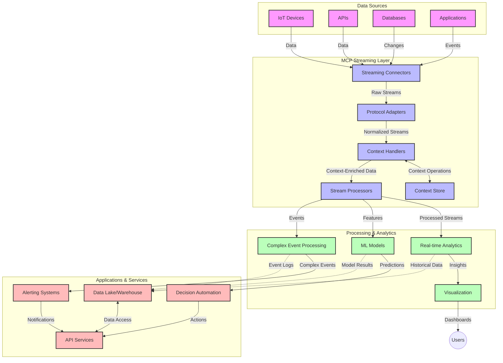

<!--
CO_OP_TRANSLATOR_METADATA:
{
  "original_hash": "195f7287638b77a549acadd96c8f981c",
  "translation_date": "2025-07-14T01:54:24+00:00",
  "source_file": "05-AdvancedTopics/mcp-realtimestreaming/README.md",
  "language_code": "sl"
}
-->
# Model Context Protocol za pretakanje podatkov v realnem času

## Pregled

Pretakanje podatkov v realnem času je postalo ključno v današnjem svetu, ki temelji na podatkih, kjer podjetja in aplikacije potrebujejo takojšen dostop do informacij za pravočasno sprejemanje odločitev. Model Context Protocol (MCP) predstavlja pomemben napredek pri optimizaciji teh procesov pretakanja v realnem času, saj izboljšuje učinkovitost obdelave podatkov, ohranja kontekstualno celovitost in izboljšuje splošno zmogljivost sistema.

Ta modul raziskuje, kako MCP spreminja pretakanje podatkov v realnem času z zagotavljanjem standardiziranega pristopa k upravljanju konteksta med AI modeli, platformami za pretakanje in aplikacijami.

## Uvod v pretakanje podatkov v realnem času

Pretakanje podatkov v realnem času je tehnološki pristop, ki omogoča neprekinjen prenos, obdelavo in analizo podatkov takoj, ko so ustvarjeni, kar sistemom omogoča takojšnje odzivanje na nove informacije. V nasprotju s tradicionalno obdelavo v serijah, ki deluje na statičnih podatkovnih nizih, pretakanje obdeluje podatke v gibanju in zagotavlja vpoglede ter ukrepe z minimalno zakasnitvijo.

### Osnovni pojmi pretakanja podatkov v realnem času:

- **Neprekinjen tok podatkov**: Podatki se obdelujejo kot neprekinjen, neskončen tok dogodkov ali zapisov.
- **Obdelava z nizko zakasnitvijo**: Sistemi so zasnovani tako, da zmanjšajo čas med generiranjem in obdelavo podatkov.
- **Razširljivost**: Arhitekture za pretakanje morajo obvladovati spremenljive količine in hitrost podatkov.
- **Odpornost na napake**: Sistemi morajo biti odporni na okvare, da zagotovijo neprekinjen pretok podatkov.
- **Stanje obdelave**: Ohranjanje konteksta med dogodki je ključno za smiselno analizo.

### Model Context Protocol in pretakanje v realnem času

Model Context Protocol (MCP) rešuje več ključnih izzivov v okoljih pretakanja v realnem času:

1. **Kontekstualna kontinuiteta**: MCP standardizira način ohranjanja konteksta med razpršenimi komponentami pretakanja, kar zagotavlja, da imajo AI modeli in obdelovalni vozli dostop do relevantnega zgodovinskega in okoljskega konteksta.

2. **Učinkovito upravljanje stanja**: Z zagotavljanjem strukturiranih mehanizmov za prenos konteksta MCP zmanjšuje obremenitev upravljanja stanja v pretakalnih cevovodih.

3. **Medsebojna združljivost**: MCP ustvarja skupni jezik za deljenje konteksta med različnimi tehnologijami pretakanja in AI modeli, kar omogoča bolj prilagodljive in razširljive arhitekture.

4. **Kontekst optimiziran za pretakanje**: Implementacije MCP lahko prednostno obravnavajo, kateri elementi konteksta so najbolj pomembni za odločitve v realnem času, s čimer optimizirajo tako zmogljivost kot natančnost.

5. **Prilagodljiva obdelava**: Z ustreznim upravljanjem konteksta prek MCP lahko sistemi za pretakanje dinamično prilagajajo obdelavo glede na spreminjajoče se pogoje in vzorce v podatkih.

V sodobnih aplikacijah, od IoT omrežij senzorjev do finančnih trgovalnih platform, integracija MCP s tehnologijami pretakanja omogoča bolj inteligentno, kontekstualno ozaveščeno obdelavo, ki se lahko ustrezno odzove na kompleksne, spreminjajoče se situacije v realnem času.

## Cilji učenja

Ob koncu te lekcije boste znali:

- Razumeti osnove pretakanja podatkov v realnem času in njegove izzive
- Pojasniti, kako Model Context Protocol (MCP) izboljšuje pretakanje podatkov v realnem času
- Implementirati rešitve za pretakanje na osnovi MCP z uporabo priljubljenih ogrodij, kot sta Kafka in Pulsar
- Načrtovati in uvajati odporne na napake, zmogljive arhitekture pretakanja z MCP
- Uporabiti koncepte MCP v primerih uporabe IoT, finančnega trgovanja in analitike, ki temelji na AI
- Oceniti nastajajoče trende in prihodnje inovacije v tehnologijah pretakanja na osnovi MCP

### Definicija in pomen

Pretakanje podatkov v realnem času vključuje neprekinjeno generiranje, obdelavo in dostavo podatkov z minimalno zakasnitvijo. V nasprotju z obdelavo v serijah, kjer se podatki zbirajo in obdelujejo v skupinah, se podatki v pretakanju obdelujejo postopoma, takoj ko prispejo, kar omogoča takojšnje vpoglede in ukrepe.

Ključne značilnosti pretakanja podatkov v realnem času so:

- **Nizka zakasnitev**: Obdelava in analiza podatkov v milisekundah do sekundah
- **Neprekinjen tok**: Neprekinjeni tokovi podatkov iz različnih virov
- **Takojšnja obdelava**: Analiza podatkov takoj ob prihodu, ne v serijah
- **Arhitektura, ki temelji na dogodkih**: Odzivanje na dogodke takoj, ko se zgodijo

### Izzivi tradicionalnega pretakanja podatkov

Tradicionalni pristopi pretakanja podatkov se soočajo z več omejitvami:

1. **Izguba konteksta**: Težave pri ohranjanju konteksta med razpršenimi sistemi
2. **Težave z razširljivostjo**: Izzivi pri prilagajanju za obvladovanje velikih količin in hitrosti podatkov
3. **Kompleksnost integracije**: Težave z medsebojno združljivostjo med različnimi sistemi
4. **Upravljanje zakasnitve**: Uravnoteženje prepustnosti in časa obdelave
5. **Konsistentnost podatkov**: Zagotavljanje natančnosti in popolnosti podatkov v toku

## Razumevanje Model Context Protocol (MCP)

### Kaj je MCP?

Model Context Protocol (MCP) je standardiziran komunikacijski protokol, zasnovan za učinkovito interakcijo med AI modeli in aplikacijami. V kontekstu pretakanja podatkov v realnem času MCP zagotavlja okvir za:

- Ohranjanje konteksta skozi celoten podatkovni cevovod
- Standardizacijo formatov izmenjave podatkov
- Optimizacijo prenosa velikih podatkovnih nizov
- Izboljšanje komunikacije med modeli in med modeli ter aplikacijami

### Osnovne komponente in arhitektura

Arhitektura MCP za pretakanje v realnem času vključuje več ključnih komponent:

1. **Upravitelji konteksta**: Upravljajo in ohranjajo kontekstualne informacije skozi cevovod pretakanja
2. **Procesorji toka**: Obdelujejo vhodne tokove podatkov z uporabo tehnik, ki upoštevajo kontekst
3. **Protokolni adapterji**: Pretvarjajo med različnimi protokoli pretakanja ob ohranjanju konteksta
4. **Shramba konteksta**: Učinkovito shranjuje in pridobiva kontekstualne informacije
5. **Povezovalniki za pretakanje**: Povezujejo se z različnimi platformami za pretakanje (Kafka, Pulsar, Kinesis itd.)



### Kako MCP izboljšuje obdelavo podatkov v realnem času

MCP rešuje tradicionalne izzive pretakanja z:

- **Kontekstualno celovitostjo**: Ohranjanje povezav med podatkovnimi točkami skozi celoten cevovod
- **Optimiziranim prenosom**: Zmanjševanje podvajanja pri izmenjavi podatkov z inteligentnim upravljanjem konteksta
- **Standardiziranimi vmesniki**: Zagotavljanje doslednih API-jev za komponente pretakanja
- **Zmanjšano zakasnitvijo**: Minimiziranje obremenitve obdelave z učinkovitim upravljanjem konteksta
- **Izboljšano razširljivostjo**: Podpora horizontalnemu skaliranju ob ohranjanju konteksta

## Integracija in implementacija

Sistemi za pretakanje podatkov v realnem času zahtevajo skrbno arhitekturno zasnovo in implementacijo, da ohranijo tako zmogljivost kot kontekstualno celovitost. Model Context Protocol ponuja standardiziran pristop za integracijo AI modelov in tehnologij pretakanja, kar omogoča bolj sofisticirane, kontekstualno ozaveščene cevovode obdelave.

### Pregled integracije MCP v arhitekture pretakanja

Implementacija MCP v okoljih pretakanja v realnem času vključuje več ključnih vidikov:

1. **Serilizacija in prenos konteksta**: MCP zagotavlja učinkovite mehanizme za kodiranje kontekstualnih informacij znotraj paketov podatkov za pretakanje, kar zagotavlja, da bistveni kontekst spremlja podatke skozi celoten cevovod obdelave. To vključuje standardizirane formate serializacije, optimizirane za prenos v pretakanju.

2. **Stanje obdelave toka**: MCP omogoča bolj inteligentno obdelavo s stanjem z ohranjanjem dosledne predstavitve konteksta med obdelovalnimi vozlišči. To je še posebej dragoceno v razpršenih arhitekturah pretakanja, kjer je upravljanje stanja tradicionalno zahtevno.

3. **Čas dogodka proti času obdelave**: Implementacije MCP v sistemih pretakanja morajo nasloviti pogost izziv razlikovanja med časom, ko so se dogodki zgodili, in časom njihove obdelave. Protokol lahko vključuje časovni kontekst, ki ohranja semantiko časa dogodka.

4. **Upravljanje povratnega pritiska**: S standardizacijo upravljanja konteksta MCP pomaga pri upravljanju povratnega pritiska v sistemih pretakanja, kar omogoča komponentam, da sporočajo svoje zmogljivosti obdelave in ustrezno prilagajajo tok.

5. **Okna konteksta in agregacija**: MCP omogoča bolj sofisticirane operacije okenskega združevanja z zagotavljanjem strukturiranih predstavitev časovnega in relacijskega konteksta, kar omogoča smiselnejše agregacije preko tokov dogodkov.

6. **Obdelava natančno enkrat**: V sistemih pretakanja, ki zahtevajo semantiko natančno enkrat, lahko MCP vključuje metapodatke obdelave za pomoč pri sledenju in preverjanju stanja obdelave med razpršenimi komponentami.

Implementacija MCP v različnih tehnologijah pretakanja ustvarja enoten pristop k upravljanju konteksta, zmanjšuje potrebo po prilagojenih integracijskih kodah in hkrati izboljšuje sposobnost sistema za ohranjanje smiselnega konteksta med pretokom podatkov skozi cevovod.

### MCP v različnih ogrodjih za pretakanje podatkov

Ti primeri sledijo trenutni specifikaciji MCP, ki temelji na protokolu JSON-RPC z različnimi mehanizmi prenosa. Koda prikazuje, kako lahko implementirate prilagojene prenose, ki integrirajo platforme za pretakanje, kot sta Kafka in Pulsar, ob ohranjanju popolne združljivosti s protokolom MCP.

Primeri so zasnovani tako, da pokažejo, kako je mogoče platforme za pretakanje povezati z MCP za zagotavljanje obdelave podatkov v realnem času ob ohranjanju kontekstualne ozaveščenosti, ki je osrednjega pomena za MCP. Ta pristop zagotavlja, da vzorci kode natančno odražajo trenutno stanje specifikacije MCP s stanjem junija 2025.

MCP je mogoče integrirati s priljubljenimi ogrodji za pretakanje, vključno z:

#### Integracija Apache Kafka

```python
import asyncio
import json
from typing import Dict, Any, Optional
from confluent_kafka import Consumer, Producer, KafkaError
from mcp.client import Client, ClientCapabilities
from mcp.core.message import JsonRpcMessage
from mcp.core.transports import Transport

# Custom transport class to bridge MCP with Kafka
class KafkaMCPTransport(Transport):
    def __init__(self, bootstrap_servers: str, input_topic: str, output_topic: str):
        self.bootstrap_servers = bootstrap_servers
        self.input_topic = input_topic
        self.output_topic = output_topic
        self.producer = Producer({'bootstrap.servers': bootstrap_servers})
        self.consumer = Consumer({
            'bootstrap.servers': bootstrap_servers,
            'group.id': 'mcp-client-group',
            'auto.offset.reset': 'earliest'
        })
        self.message_queue = asyncio.Queue()
        self.running = False
        self.consumer_task = None
        
    async def connect(self):
        """Connect to Kafka and start consuming messages"""
        self.consumer.subscribe([self.input_topic])
        self.running = True
        self.consumer_task = asyncio.create_task(self._consume_messages())
        return self
        
    async def _consume_messages(self):
        """Background task to consume messages from Kafka and queue them for processing"""
        while self.running:
            try:
                msg = self.consumer.poll(1.0)
                if msg is None:
                    await asyncio.sleep(0.1)
                    continue
                
                if msg.error():
                    if msg.error().code() == KafkaError._PARTITION_EOF:
                        continue
                    print(f"Consumer error: {msg.error()}")
                    continue
                
                # Parse the message value as JSON-RPC
                try:
                    message_str = msg.value().decode('utf-8')
                    message_data = json.loads(message_str)
                    mcp_message = JsonRpcMessage.from_dict(message_data)
                    await self.message_queue.put(mcp_message)
                except Exception as e:
                    print(f"Error parsing message: {e}")
            except Exception as e:
                print(f"Error in consumer loop: {e}")
                await asyncio.sleep(1)
    
    async def read(self) -> Optional[JsonRpcMessage]:
        """Read the next message from the queue"""
        try:
            message = await self.message_queue.get()
            return message
        except Exception as e:
            print(f"Error reading message: {e}")
            return None
    
    async def write(self, message: JsonRpcMessage) -> None:
        """Write a message to the Kafka output topic"""
        try:
            message_json = json.dumps(message.to_dict())
            self.producer.produce(
                self.output_topic,
                message_json.encode('utf-8'),
                callback=self._delivery_report
            )
            self.producer.poll(0)  # Trigger callbacks
        except Exception as e:
            print(f"Error writing message: {e}")
    
    def _delivery_report(self, err, msg):
        """Kafka producer delivery callback"""
        if err is not None:
            print(f'Message delivery failed: {err}')
        else:
            print(f'Message delivered to {msg.topic()} [{msg.partition()}]')
    
    async def close(self) -> None:
        """Close the transport"""
        self.running = False
        if self.consumer_task:
            self.consumer_task.cancel()
            try:
                await self.consumer_task
            except asyncio.CancelledError:
                pass
        self.consumer.close()
        self.producer.flush()

# Example usage of the Kafka MCP transport
async def kafka_mcp_example():
    # Create MCP client with Kafka transport
    client = Client(
        {"name": "kafka-mcp-client", "version": "1.0.0"},
        ClientCapabilities({})
    )
    
    # Create and connect the Kafka transport
    transport = KafkaMCPTransport(
        bootstrap_servers="localhost:9092",
        input_topic="mcp-responses",
        output_topic="mcp-requests"
    )
    
    await client.connect(transport)
    
    try:
        # Initialize the MCP session
        await client.initialize()
        
        # Example of executing a tool via MCP
        response = await client.execute_tool(
            "process_data",
            {
                "data": "sample data",
                "metadata": {
                    "source": "sensor-1",
                    "timestamp": "2025-06-12T10:30:00Z"
                }
            }
        )
        
        print(f"Tool execution response: {response}")
        
        # Clean shutdown
        await client.shutdown()
    finally:
        await transport.close()

# Run the example
if __name__ == "__main__":
    asyncio.run(kafka_mcp_example())
```

#### Implementacija Apache Pulsar

```python
import asyncio
import json
import pulsar
from typing import Dict, Any, Optional
from mcp.core.message import JsonRpcMessage
from mcp.core.transports import Transport
from mcp.server import Server, ServerOptions
from mcp.server.tools import Tool, ToolExecutionContext, ToolMetadata

# Create a custom MCP transport that uses Pulsar
class PulsarMCPTransport(Transport):
    def __init__(self, service_url: str, request_topic: str, response_topic: str):
        self.service_url = service_url
        self.request_topic = request_topic
        self.response_topic = response_topic
        self.client = pulsar.Client(service_url)
        self.producer = self.client.create_producer(response_topic)
        self.consumer = self.client.subscribe(
            request_topic,
            "mcp-server-subscription",
            consumer_type=pulsar.ConsumerType.Shared
        )
        self.message_queue = asyncio.Queue()
        self.running = False
        self.consumer_task = None
    
    async def connect(self):
        """Connect to Pulsar and start consuming messages"""
        self.running = True
        self.consumer_task = asyncio.create_task(self._consume_messages())
        return self
    
    async def _consume_messages(self):
        """Background task to consume messages from Pulsar and queue them for processing"""
        while self.running:
            try:
                # Non-blocking receive with timeout
                msg = self.consumer.receive(timeout_millis=500)
                
                # Process the message
                try:
                    message_str = msg.data().decode('utf-8')
                    message_data = json.loads(message_str)
                    mcp_message = JsonRpcMessage.from_dict(message_data)
                    await self.message_queue.put(mcp_message)
                    
                    # Acknowledge the message
                    self.consumer.acknowledge(msg)
                except Exception as e:
                    print(f"Error processing message: {e}")
                    # Negative acknowledge if there was an error
                    self.consumer.negative_acknowledge(msg)
            except Exception as e:
                # Handle timeout or other exceptions
                await asyncio.sleep(0.1)
    
    async def read(self) -> Optional[JsonRpcMessage]:
        """Read the next message from the queue"""
        try:
            message = await self.message_queue.get()
            return message
        except Exception as e:
            print(f"Error reading message: {e}")
            return None
    
    async def write(self, message: JsonRpcMessage) -> None:
        """Write a message to the Pulsar output topic"""
        try:
            message_json = json.dumps(message.to_dict())
            self.producer.send(message_json.encode('utf-8'))
        except Exception as e:
            print(f"Error writing message: {e}")
    
    async def close(self) -> None:
        """Close the transport"""
        self.running = False
        if self.consumer_task:
            self.consumer_task.cancel()
            try:
                await self.consumer_task
            except asyncio.CancelledError:
                pass
        self.consumer.close()
        self.producer.close()
        self.client.close()

# Define a sample MCP tool that processes streaming data
@Tool(
    name="process_streaming_data",
    description="Process streaming data with context preservation",
    metadata=ToolMetadata(
        required_capabilities=["streaming"]
    )
)
async def process_streaming_data(
    ctx: ToolExecutionContext,
    data: str,
    source: str,
    priority: str = "medium"
) -> Dict[str, Any]:
    """
    Process streaming data while preserving context
    
    Args:
        ctx: Tool execution context
        data: The data to process
        source: The source of the data
        priority: Priority level (low, medium, high)
        
    Returns:
        Dict containing processed results and context information
    """
    # Example processing that leverages MCP context
    print(f"Processing data from {source} with priority {priority}")
    
    # Access conversation context from MCP
    conversation_id = ctx.conversation_id if hasattr(ctx, 'conversation_id') else "unknown"
    
    # Return results with enhanced context
    return {
        "processed_data": f"Processed: {data}",
        "context": {
            "conversation_id": conversation_id,
            "source": source,
            "priority": priority,
            "processing_timestamp": ctx.get_current_time_iso()
        }
    }

# Example MCP server implementation using Pulsar transport
async def run_mcp_server_with_pulsar():
    # Create MCP server
    server = Server(
        {"name": "pulsar-mcp-server", "version": "1.0.0"},
        ServerOptions(
            capabilities={"streaming": True}
        )
    )
    
    # Register our tool
    server.register_tool(process_streaming_data)
    
    # Create and connect Pulsar transport
    transport = PulsarMCPTransport(
        service_url="pulsar://localhost:6650",
        request_topic="mcp-requests",
        response_topic="mcp-responses"
    )
    
    try:
        # Start the server with the Pulsar transport
        await server.run(transport)
    finally:
        await transport.close()

# Run the server
if __name__ == "__main__":
    asyncio.run(run_mcp_server_with_pulsar())
```

### Najboljše prakse za uvajanje

Pri implementaciji MCP za pretakanje v realnem času:

1. **Zasnova za odpornost na napake**:
   - Uvedite ustrezno ravnanje z napakami
   - Uporabite dead-letter queue za neuspešna sporočila
   - Oblikujte idempotentne procesorje

2. **Optimizacija zmogljivosti**:
   - Nastavite primerne velikosti predpomnilnikov
   - Uporabite združevanje (batching) tam, kjer je primerno
   - Implementirajte mehanizme za upravljanje povratnega pritiska

3. **Nadzor in opazovanje**:
   - Spremljajte metrike obdelave toka
   - Nadzorujte propagacijo konteksta
   - Nastavite opozorila za anomalije

4. **Zavarujte svoje tokove**:
   - Uvedite šifriranje za občutljive podatke
   - Uporabite avtentikacijo in avtorizacijo
   - Uporabite ustrezne kontrole dostopa

### MCP v IoT in edge računalništvu

MCP izboljšuje pretakanje v IoT z:

- Ohranjanjem konteksta naprav skozi cevovod obdelave
- Omogočanjem učinkovitega pretakanja podatkov od roba do oblaka
- Podporo analitiki v realnem času na IoT tokovih podatkov
- Olajšanjem komunikacije med napravami s kontekstom

Primer: Omrežja senzorjev pametnih mest  
```
Sensors → Edge Gateways → MCP Stream Processors → Real-time Analytics → Automated Responses
```

### Vloga pri finančnih transakcijah in trgovanju z visoko frekvenco

MCP prinaša pomembne prednosti za pretakanje finančnih podatkov:

- Izjemno nizka zakasnitev obdelave za trgovalne odločitve
- Ohranjanje konteksta transakcij skozi celotno obdelavo
- Podpora kompleksni obdelavi dogodkov s kontekstualno ozaveščenostjo
- Zagotavljanje konsistentnosti podatkov v razpršenih trgovalnih sistemih

### Izboljšanje analitike, ki temelji na AI

MCP odpira nove možnosti za analitiko pretakanja:

- Treniranje in sklepanje modelov v realnem času
- Neprekinjeno učenje iz pretakanih podatkov
- Ekstrakcija značilnosti, ki upošteva kontekst
- Večmodelni cevovodi sklepov z ohranjenim kontekstom

## Prihodnji trendi in inovacije

### Razvoj MCP v okoljih realnega časa

V prihodnosti pričakujemo, da se bo MCP razvijal za reševanje:

- **Integracije kvantnega računalništva**: Priprava na sisteme pretakanja, ki temeljijo na kvantnem računalništvu
- **Obdelave na robu, ki je naravna za edge**: Premik več kontekstualno ozaveščene obdelave na robne naprave
- **Avtonomnega upravljanja tokov**: Samooptimizirajoči se cevovodi pretakanja
- **Federiranega pretakanja**: Razpršena obdelava ob ohranjanju zasebnosti

### Potencialni tehnološki napredki

Nastajajoče tehnologije, ki bodo oblikovale prihodnost MCP pretakanja:

1. **Protokoli za pretakanje, optimizirani za AI**: Prilagojeni protokoli, zasnovani posebej za AI delovne obremenitve
2. **Integracija nevromorfnega računalništva**: Računalništvo, navdihnjeno z delovanjem možganov, za obdelavo tokov
3. **Brezstrežni streaming**: Dogodkovno voden, razširljiv streaming brez upravljanja infrastrukture
4. **Razpršene shrambe konteksta**: Globalno razpršeno, a visoko konsistentno upravljanje konteksta

## Praktične vaje

### Vaja 1: Nastavitev osnovnega MCP cevovoda za pretakanje

V tej vaji se boste naučili:
- Konfigurirati osnovno okolje za MCP pretakanje
- Implementirati upravljalce konteksta za obdelavo toka
- Testirati in potrditi ohranjanje konteksta

### Vaja 2: Izgradnja nadzorne plošče za analitiko v realnem času

Ustvarite celovito aplikacijo, ki:
- Sprejema podatke v pretakanju z uporabo MCP
- Obdeluje tok ob ohranjanju konteksta
- Vizualizira rezultate v realnem času

### Vaja 3: Implementacija kompleksne obdelave dogodkov z MCP

Napredna vaja, ki zajema:
- Odkrivanje vzorcev v tokovih
- Kontekstualno korelacijo med več tokovi
- Generiranje kompleksnih dogodkov z ohranjenim kontekstom

## Dodatni viri

- [Model Context Protocol Specification](https://github.com/modelcontextprotocol) - Uradna specifikacija in dokumentacija MCP
- [Apache Kafka Documentation](https://kafka.apache.org/documentation/) - Spoznajte Kafka za ob

**Omejitev odgovornosti**:  
Ta dokument je bil preveden z uporabo storitve za avtomatski prevod AI [Co-op Translator](https://github.com/Azure/co-op-translator). Čeprav si prizadevamo za natančnost, vas opozarjamo, da lahko avtomatski prevodi vsebujejo napake ali netočnosti. Izvirni dokument v njegovem izvirnem jeziku velja za avtoritativni vir. Za pomembne informacije priporočamo strokovni človeški prevod. Za morebitna nesporazume ali napačne interpretacije, ki izhajajo iz uporabe tega prevoda, ne odgovarjamo.