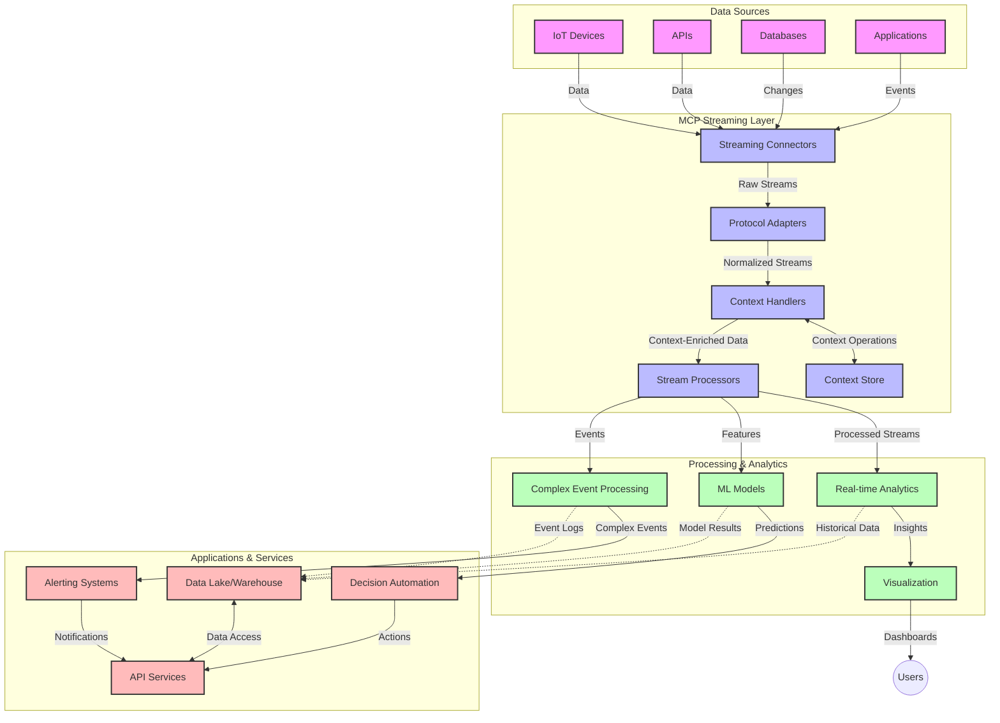

<!--
CO_OP_TRANSLATOR_METADATA:
{
  "original_hash": "68c518dbff8a3b127ed2aa934054c56c",
  "translation_date": "2025-06-11T17:35:23+00:00",
  "source_file": "05-AdvancedTopics/mcp-realtimestreaming/README.md",
  "language_code": "sl"
}
-->
# Protokol Modelnega Konteksta za Tokovne Podatke v Realnem Času

## Pregled

Tokovno predvajanje podatkov v realnem času je danes ključnega pomena v svetu, ki temelji na podatkih, kjer podjetja in aplikacije potrebujejo takojšen dostop do informacij za pravočasno sprejemanje odločitev. Protokol Modelnega Konteksta (MCP) predstavlja pomemben napredek pri optimizaciji teh procesov pretakanja v realnem času, izboljšuje učinkovitost obdelave podatkov, ohranja kontekstualno celovitost in povečuje splošno zmogljivost sistema.

Ta modul raziskuje, kako MCP spreminja tokovno predvajanje podatkov v realnem času z zagotavljanjem standardiziranega pristopa k upravljanju konteksta med AI modeli, tokovnimi platformami in aplikacijami.

## Uvod v Tokovno Predvajanje Podatkov v Realnem Času

Tokovno predvajanje podatkov v realnem času je tehnološki pristop, ki omogoča neprekinjeno prenašanje, obdelavo in analizo podatkov, takoj ko so ustvarjeni, kar sistemom omogoča takojšnje odzivanje na nove informacije. V nasprotju s tradicionalno obdelavo v serijah, ki deluje na statičnih podatkovnih nizih, tokovno predvajanje obdeluje podatke v gibanju in zagotavlja vpoglede ter ukrepe z minimalno zakasnitvijo.

### Ključni Pojmi Tokovnega Predvajanja Podatkov v Realnem Času:

- **Neprekinjen Tok Podatkov**: Podatki se obdelujejo kot neprekinjen, neskončen tok dogodkov ali zapisov.
- **Obdelava z Nizko Zakasnitvijo**: Sistemi so zasnovani za minimiziranje časa med generiranjem in obdelavo podatkov.
- **Razširljivost**: Arhitekture za tokovno predvajanje morajo obvladovati spreminjajoče se količine in hitrost podatkov.
- **Odpornost na Napake**: Sistemi morajo biti odporni na napake, da zagotovijo neprekinjen tok podatkov.
- **Stanje Obdelave**: Ohranjanje konteksta med dogodki je ključno za smiselno analizo.

### Protokol Modelnega Konteksta in Tokovno Predvajanje v Realnem Času

Protokol Modelnega Konteksta (MCP) rešuje več ključnih izzivov v okoljih tokovnega predvajanja v realnem času:

1. **Kontekstualna Neprekinjenost**: MCP standardizira način ohranjanja konteksta med razpršenimi komponentami tokovnega sistema, kar zagotavlja, da imajo AI modeli in procesni vozli dostop do relevantnega zgodovinskega in okoljskega konteksta.

2. **Učinkovito Upravljanje Stanja**: Z zagotavljanjem strukturiranih mehanizmov za prenos konteksta MCP zmanjšuje stroške upravljanja stanja v tokovnih cevovodih.

3. **Medsebojna Združljivost**: MCP ustvarja skupni jezik za izmenjavo konteksta med različnimi tokovnimi tehnologijami in AI modeli, kar omogoča bolj prilagodljive in razširljive arhitekture.

4. **Kontekst, Optimiziran za Tokovno Predvajanje**: Implementacije MCP lahko prednostno obravnavajo, kateri elementi konteksta so najbolj pomembni za odločanje v realnem času, s čimer optimizirajo tako zmogljivost kot natančnost.

5. **Prilagodljiva Obdelava**: Z ustreznim upravljanjem konteksta preko MCP lahko tokovni sistemi dinamično prilagajajo obdelavo glede na spreminjajoče se pogoje in vzorce v podatkih.

V sodobnih aplikacijah, od IoT senzornih omrežij do finančnih trgovalnih platform, integracija MCP s tokovnimi tehnologijami omogoča bolj inteligentno, kontekstualno ozaveščeno obdelavo, ki se lahko ustrezno odzove na kompleksne, spreminjajoče se situacije v realnem času.

## Cilji Učenja

Na koncu te lekcije boste znali:

- Razumeti osnove tokovnega predvajanja podatkov v realnem času in njegove izzive
- Pojasniti, kako Protokol Modelnega Konteksta (MCP) izboljšuje tokovno predvajanje v realnem času
- Implementirati rešitve za tokovno predvajanje na osnovi MCP z uporabo priljubljenih ogrodij, kot sta Kafka in Pulsar
- Oblikovati in izvajati odpornosti na napake ter zmogljive tokovne arhitekture z MCP
- Uporabiti koncepte MCP v primerih uporabe IoT, finančnega trgovanja in analitike, ki temelji na AI
- Oceniti nastajajoče trende in prihodnje inovacije v tehnologijah tokovnega predvajanja na osnovi MCP

### Definicija in Pomen

Tokovno predvajanje podatkov v realnem času vključuje neprekinjeno generiranje, obdelavo in dostavo podatkov z minimalno zakasnitvijo. V nasprotju z obdelavo v serijah, kjer se podatki zbirajo in obdelujejo v skupinah, se tokovni podatki obdelujejo postopoma, takoj ko prispejo, kar omogoča takojšnje vpoglede in ukrepe.

Ključne značilnosti tokovnega predvajanja podatkov v realnem času vključujejo:

- **Nizka Zakasnitev**: Obdelava in analiza podatkov v milisekundah do sekundah
- **Neprekinjen Tok**: Neprekinjeni tokovi podatkov iz različnih virov
- **Takojšnja Obdelava**: Analiza podatkov takoj ob prihodu, ne v serijah
- **Arhitektura, Ki Temelji na Dogodkih**: Odzivanje na dogodke takoj, ko se zgodijo

### Izzivi Tradicionalnega Tokovnega Predvajanja Podatkov

Tradicionalni pristopi tokovnega predvajanja se soočajo z več omejitvami:

1. **Izguba Konteksta**: Težave pri ohranjanju konteksta med razpršenimi sistemi
2. **Težave z Razširljivostjo**: Izzivi pri prilagajanju na velike količine in hitrost podatkov
3. **Kompleksnost Integracije**: Težave z medsebojno združljivostjo med različnimi sistemi
4. **Upravljanje Zakasnitve**: Uravnoteženje prepustnosti in časa obdelave
5. **Konsistentnost Podatkov**: Zagotavljanje natančnosti in popolnosti podatkov skozi tok

## Razumevanje Protokola Modelnega Konteksta (MCP)

### Kaj je MCP?

Protokol Modelnega Konteksta (MCP) je standardiziran komunikacijski protokol, zasnovan za učinkovito interakcijo med AI modeli in aplikacijami. V kontekstu tokovnega predvajanja podatkov v realnem času MCP zagotavlja okvir za:

- Ohranjanje konteksta skozi celoten podatkovni cevovod
- Standardizacijo formatov izmenjave podatkov
- Optimizacijo prenosa velikih podatkovnih nizov
- Izboljšanje komunikacije med modeli in med modeli ter aplikacijami

### Glavne Komponente in Arhitektura

Arhitektura MCP za tokovno predvajanje vključuje več ključnih komponent:

1. **Upravitelji Konteksta**: Upravljajo in vzdržujejo kontekstualne informacije skozi tokovni cevovod
2. **Procesorji Tokov**: Obdelujejo vhodne tokove podatkov s tehnikami, ki upoštevajo kontekst
3. **Protokolni Adapterji**: Pretvarjajo med različnimi tokovnimi protokoli ob ohranjanju konteksta
4. **Shramba Konteksta**: Učinkovito shranjuje in pridobiva kontekstualne informacije
5. **Tokovni Povezovalniki**: Povezujejo z različnimi tokovnimi platformami (Kafka, Pulsar, Kinesis itd.)



### Kako MCP Izboljšuje Obdelavo Podatkov v Realnem Času

MCP rešuje tradicionalne izzive tokovnega predvajanja z:

- **Kontekstualno Celovitostjo**: Ohranjanjem povezav med podatkovnimi točkami skozi celoten cevovod
- **Optimiziranim Prenosom**: Zmanjševanjem podvajanja pri izmenjavi podatkov z inteligentnim upravljanjem konteksta
- **Standardiziranimi Vmesniki**: Zagotavljanjem doslednih API-jev za tokovne komponente
- **Zmanjšano Zakasnitvijo**: Minimiziranjem stroškov obdelave z učinkovitim upravljanjem konteksta
- **Izboljšano Razširljivostjo**: Podporo horizontalnemu skaliranju ob ohranjanju konteksta

## Integracija in Implementacija

Sistemi za tokovno predvajanje podatkov v realnem času zahtevajo skrbno arhitekturno zasnovo in izvedbo, da ohranijo tako zmogljivost kot kontekstualno celovitost. Protokol Modelnega Konteksta ponuja standardiziran pristop k integraciji AI modelov in tokovnih tehnologij, kar omogoča bolj sofisticirane cevovode za obdelavo, ki upoštevajo kontekst.

### Pregled Integracije MCP v Tokovne Arhitekture

Implementacija MCP v okolju tokovnega predvajanja v realnem času vključuje več ključnih vidikov:

1. **Seralizacija in Prenos Konteksta**: MCP zagotavlja učinkovite mehanizme za kodiranje kontekstualnih informacij znotraj tokovnih podatkovnih paketov, kar zagotavlja, da bistveni kontekst spremlja podatke skozi celoten cevovod. To vključuje standardizirane formate seralizacije, optimizirane za tokovni prenos.

2. **Stanje Obdelave Tokov**: MCP omogoča pametnejšo obdelavo, ki upošteva stanje, z ohranjanjem dosledne predstavitve konteksta med procesnimi vozlišči. To je še posebej pomembno v razpršenih tokovnih arhitekturah, kjer je upravljanje stanja običajno zahtevno.

3. **Čas Dogodka proti Času Obdelave**: Implementacije MCP v tokovnih sistemih morajo rešiti pogost izziv razlikovanja med časom, ko se je dogodek zgodil, in časom, ko je obdelan. Protokol lahko vključuje časovni kontekst, ki ohranja semantiko časa dogodka.

4. **Upravljanje Povratnega Toka (Backpressure)**: Z standardizacijo upravljanja konteksta MCP pomaga pri obvladovanju povratnega toka v tokovnih sistemih, kar omogoča komponentam, da sporočijo svoje zmožnosti obdelave in prilagodijo tok.

5. **Okna Konteksta in Agregacija**: MCP omogoča bolj sofisticirane operacije okenskega obdelovanja z zagotavljanjem strukturiranih predstavitev časovnih in relacijskih kontekstov, kar omogoča smiselnejše agregacije čez tokove dogodkov.

6. **Obdelava z Natančno Enkratno Izvedbo**: V tokovnih sistemih, ki zahtevajo natančno enkratno obdelavo, lahko MCP vključuje metapodatke o obdelavi, ki pomagajo slediti in preverjati stanje obdelave med razpršenimi komponentami.

Implementacija MCP v različnih tokovnih tehnologijah ustvarja enoten pristop k upravljanju konteksta, zmanjšuje potrebo po prilagojenih integracijskih kodah in izboljšuje sposobnost sistema za ohranjanje smiselnega konteksta med pretokom podatkov skozi cevovod.

### MCP v Različnih Okoljih za Tokovno Predvajanje Podatkov

MCP je mogoče integrirati s priljubljenimi tokovnimi ogrodji, vključno z:

#### Integracija Apache Kafka

```python
from mcp_streaming import MCPKafkaConnector

# Initialize MCP Kafka connector
connector = MCPKafkaConnector(
    bootstrap_servers='localhost:9092',
    context_preservation=True
)

# Create a context-aware consumer
consumer = connector.create_consumer('input-topic')

# Process streaming data with context
for message in consumer:
    context = message.get_context()
    data = message.get_value()
    
    # Process with context awareness
    result = process_with_context(data, context)
    
    # Produce output with preserved context
    connector.produce('output-topic', result, context=context)
```

#### Implementacija Apache Pulsar

```python
from mcp_streaming import MCPPulsarClient

# Initialize MCP Pulsar client
client = MCPPulsarClient('pulsar://localhost:6650')

# Subscribe with context awareness
consumer = client.subscribe('input-topic', 'subscription-name', 
                           context_enabled=True)

# Process messages with context preservation
while True:
    message = consumer.receive()
    context = message.get_context()
    
    # Process with context
    result = process_with_context(message.data(), context)
    
    # Acknowledge the message
    consumer.acknowledge(message)
    
    # Send result with preserved context
    producer = client.create_producer('output-topic')
    producer.send(result, context=context)
```

### Najboljše Prakse za Uvajanje

Pri implementaciji MCP za tokovno predvajanje:

1. **Oblikujte za Odpornost na Napake**:
   - Uvedite ustrezno obravnavo napak
   - Uporabljajte dead-letter vrste za sporočila, ki niso bila uspešno obdelana
   - Oblikujte idempotentne procesorje

2. **Optimizirajte za Zmogljivost**:
   - Nastavite ustrezne velikosti predpomnilnikov
   - Uporabljajte serijsko obdelavo tam, kjer je smiselno
   - Uvedite mehanizme za upravljanje povratnega toka

3. **Spremljajte in Opazujte**:
   - Spremljajte metrike obdelave tokov
   - Nadzorujte propagacijo konteksta
   - Nastavite opozorila za nepravilnosti

4. **Zavarujte Svoje Tokove**:
   - Uvedite šifriranje za občutljive podatke
   - Uporabljajte preverjanje pristnosti in avtorizacijo
   - Uporabljajte ustrezne kontrole dostopa

### MCP v IoT in Edge Računalništvu

MCP izboljšuje tokovno predvajanje v IoT z:

- Ohranjanjem konteksta naprav skozi cevovod obdelave
- Omogočanjem učinkovitega tokovnega prenosa podatkov od roba do oblaka
- Podporo analitiki v realnem času na IoT tokovih podatkov
- Olajšanjem komunikacije med napravami s kontekstom

Primer: Senzorska Omrežja Pametnih Mest  
```
Sensors → Edge Gateways → MCP Stream Processors → Real-time Analytics → Automated Responses
```

### Vloga v Finančnih Transakcijah in Visokofrekvenčnem Trgovanju

MCP prinaša pomembne prednosti za finančno tokovno predvajanje podatkov:

- Izjemno nizka zakasnitev obdelave za trgovalne odločitve
- Ohranjanje konteksta transakcij skozi celotno obdelavo
- Podpora kompleksni obdelavi dogodkov s kontekstualno ozaveščenostjo
- Zagotavljanje konsistentnosti podatkov v razpršenih trgovalnih sistemih

### Izboljšanje Analitike, Ki Temelji na AI

MCP odpira nove možnosti za tokovno analitiko:

- Učenje in sklepanje modelov v realnem času
- Neprekinjeno učenje iz tokovnih podatkov
- Ekstrakcija funkcij, ki upošteva kontekst
- Večmodelne cevovode za sklepanje z ohranjenim kontekstom

## Prihodnji Trendi in Inovacije

### Razvoj MCP v Okoljih Realnega Časa

V prihodnosti pričakujemo, da se bo MCP razvijal za reševanje:

- **Integracije Kvantnega Računalništva**: Priprave na kvantno osnovane tokovne sisteme
- **Obdelave, Usmerjene na Rob**: Premik več kontekstualno ozaveščene obdelave na robne naprave
- **Avtonomnega Upravljanja Tokov**: Samooptimizirajoči cevovodi za tokovno predvajanje
- **Federiranega Tokovnega Predvajanja**: Razpršena obdelava ob ohranjanju zasebnosti

### Potencialni Tehnološki Napredki

Nastajajoče tehnologije, ki bodo oblikovale prihodnost MCP tokovnega predvajanja:

1. **AI-optimizirani Tokovni Protokoli**: Prilagojeni protokoli, posebej zasnovani za AI delovne obremenitve
2. **Integracija Neuromorfnega Računalništva**: Računalništvo, navdihnjeno z delovanjem možganov, za obdelavo tokov
3. **Brezstrežni Tokovni Sistemi**: Dogodkovno usmerjeno, skalabilno tokovno predvajanje brez upravljanja infrastrukture
4. **Razpršene Shrambe Konteksta**: Globalno razpršeno, a zelo dosledno upravljanje konteksta

## Praktične Vaje

### Vaja 1: Nastavitev Osnovnega MCP Tokovnega Cevovoda

V tej vaji se boste naučili:

- Konfigurirati osnovno okolje za tokovno predvajanje MCP
- Implementirati upravitelje konteksta za obdelavo tokov
- Testirati in potrditi ohranjanje konteksta

### Vaja 2: Izgradnja Nadzorne Plošče za Analitiko v Realnem Času

Ustvarite celovito aplikacijo, ki:

- Pridobiva tokovne podatke z uporabo MCP
- Obdeluje tok z ohranjanjem konteksta
- Vizualizira rezultate v realnem času

### Vaja 3: Implementacija Kompleksne Obdelave Dogodkov z MCP

Napredna vaja, ki zajema:

- Odkrivanje vzorcev v tokovih
- Kontekstualno korelacijo med več tokovi
- Generiranje kompleksnih dogodkov z ohranjenim kontekstom

## Dodatni Viri

- [Model Context Protocol Specification](https://github.com/microsoft/model-context-protocol) - Uradna specifikacija in dokumentacija MCP
- [Apache Kafka Documentation](https://kafka.apache.org/documentation/) - Naučite se o Kafka za tokovno obdelavo
- [Apache Pulsar](https://pulsar.apache.org/) - Združena platforma za sporočanje in tokovno predvajanje
- [Streaming Systems: The What, Where

**Omejitev odgovornosti**:  
Ta dokument je bil preveden z uporabo AI prevajalske storitve [Co-op Translator](https://github.com/Azure/co-op-translator). Čeprav si prizadevamo za natančnost, upoštevajte, da avtomatizirani prevodi lahko vsebujejo napake ali netočnosti. Izvirni dokument v njegovem izvirnem jeziku velja za avtoritativni vir. Za ključne informacije priporočamo strokovni človeški prevod. Za morebitna nesporazume ali napačne interpretacije, ki izhajajo iz uporabe tega prevoda, ne odgovarjamo.