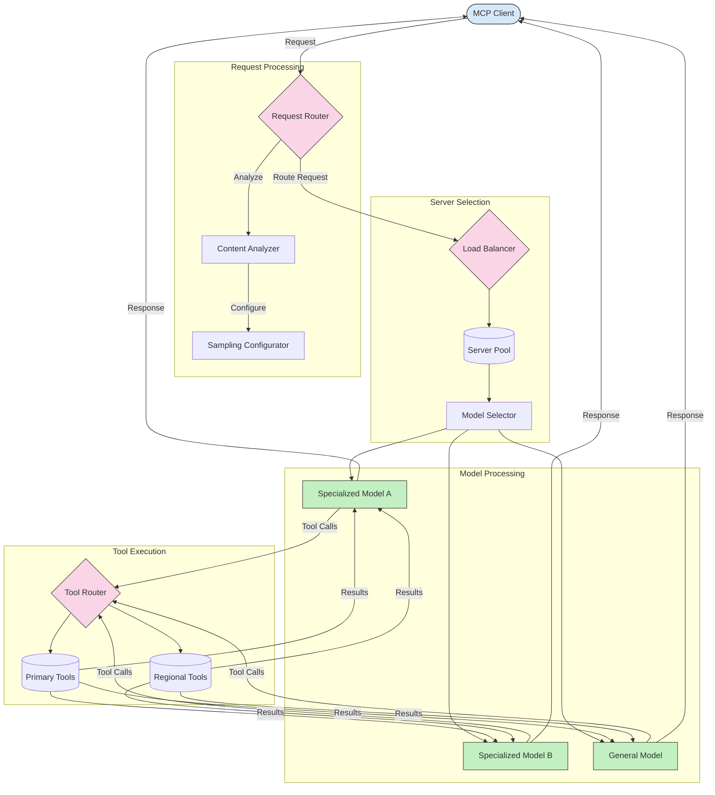

<!--
CO_OP_TRANSLATOR_METADATA:
{
  "original_hash": "af40eab7bd6ebf7e607f982a5506a5b5",
  "translation_date": "2025-07-14T02:17:25+00:00",
  "source_file": "05-AdvancedTopics/mcp-routing/README.md",
  "language_code": "sl"
}
-->
## Dinamično usmerjanje orodij

Usmerjanje orodij zagotavlja, da so klici orodij usmerjeni na najbolj primerno storitev glede na kontekst. Na primer, klic orodja za vremensko napoved je morda treba usmeriti na regionalno točko glede na lokacijo uporabnika, ali pa mora orodje za kalkulator uporabljati določeno različico API-ja.

Poglejmo primer implementacije, ki prikazuje dinamično usmerjanje orodij na podlagi analize zahtevka, regionalnih točk in podpore za različice.

## Arhitektura vzorčenja in usmerjanja v MCP

Vzorčenje je ključni del Model Context Protocol (MCP), ki omogoča učinkovito obdelavo in usmerjanje zahtevkov. Vključuje analizo dohodnih zahtevkov za določitev najbolj primernega modela ali storitve za njihovo obravnavo, glede na različne kriterije, kot so vrsta vsebine, kontekst uporabnika in obremenitev sistema.

Vzorčenje in usmerjanje lahko združimo v robustno arhitekturo, ki optimizira izrabo virov in zagotavlja visoko razpoložljivost. Proces vzorčenja se lahko uporabi za klasifikacijo zahtevkov, medtem ko jih usmerjanje vodi do ustreznih modelov ali storitev.

Spodnja shema prikazuje, kako vzorčenje in usmerjanje delujeta skupaj v celoviti arhitekturi MCP:

## Kaj sledi

- [5.6 Sampling](../mcp-sampling/README.md)

**Omejitev odgovornosti**:  
Ta dokument je bil preveden z uporabo storitve za avtomatski prevod AI [Co-op Translator](https://github.com/Azure/co-op-translator). Čeprav si prizadevamo za natančnost, vas opozarjamo, da lahko avtomatski prevodi vsebujejo napake ali netočnosti. Izvirni dokument v njegovem izvirnem jeziku velja za avtoritativni vir. Za pomembne informacije priporočamo strokovni človeški prevod. Za morebitna nesporazume ali napačne interpretacije, ki izhajajo iz uporabe tega prevoda, ne odgovarjamo.