<!--
CO_OP_TRANSLATOR_METADATA:
{
  "original_hash": "6e562d7e5a77c8982da4aa8f762ad1d8",
  "translation_date": "2025-07-14T03:18:58+00:00",
  "source_file": "05-AdvancedTopics/mcp-security-entra/README.md",
  "language_code": "sl"
}
-->
# Zavarovanje AI potekov dela: Entra ID overjanje za strežnike Model Context Protocol

## Uvod
Zavarovanje vašega Model Context Protocol (MCP) strežnika je prav tako pomembno kot zaklepanje vhodnih vrat vašega doma. Če pustite MCP strežnik odprt, so vaša orodja in podatki izpostavljeni nepooblaščenemu dostopu, kar lahko vodi do varnostnih kršitev. Microsoft Entra ID ponuja zanesljivo oblačno rešitev za upravljanje identitet in dostopa, ki zagotavlja, da lahko z vašim MCP strežnikom komunicirajo le pooblaščeni uporabniki in aplikacije. V tem poglavju boste spoznali, kako zaščititi svoje AI poteke dela z uporabo Entra ID overjanja.

## Cilji učenja
Na koncu tega poglavja boste znali:

- Razumeti pomen zavarovanja MCP strežnikov.
- Pojasniti osnove Microsoft Entra ID in OAuth 2.0 overjanja.
- Prepoznati razliko med javnimi in zaupnimi odjemalci.
- Uvesti Entra ID overjanje v lokalnih (javni odjemalec) in oddaljenih (zaupni odjemalec) scenarijih MCP strežnikov.
- Uporabiti varnostne dobre prakse pri razvoju AI potekov dela.

## Varnost in MCP

Tako kot ne bi pustili vhodnih vrat svojega doma odklenjenih, ne smete pustiti MCP strežnika odprtega za vsakogar. Zavarovanje vaših AI potekov dela je ključno za gradnjo robustnih, zaupanja vrednih in varnih aplikacij. To poglavje vas bo seznanilo z uporabo Microsoft Entra ID za zaščito vaših MCP strežnikov, s čimer zagotovite, da lahko z vašimi orodji in podatki komunicirajo le pooblaščeni uporabniki in aplikacije.

## Zakaj je varnost pomembna za MCP strežnike

Predstavljajte si, da ima vaš MCP strežnik orodje, ki lahko pošilja e-pošto ali dostopa do baze podatkov strank. Nezavarovan strežnik pomeni, da lahko kdorkoli uporabi to orodje, kar lahko vodi do nepooblaščenega dostopa do podatkov, pošiljanja nezaželene pošte ali drugih zlonamernih dejavnosti.

Z uvedbo overjanja zagotovite, da je vsak zahtevek do strežnika preverjen in potrjen, kar potrjuje identiteto uporabnika ali aplikacije, ki zahtevek pošilja. To je prvi in najpomembnejši korak pri zavarovanju vaših AI potekov dela.

## Uvod v Microsoft Entra ID

[**Microsoft Entra ID**](https://adoption.microsoft.com/microsoft-security/entra/) je oblačna storitev za upravljanje identitet in dostopa. Lahko si ga predstavljate kot univerzalnega varnostnika za vaše aplikacije. Obvladuje zapleten postopek preverjanja identitete uporabnikov (overjanje) in določanja, kaj jim je dovoljeno početi (avtorizacija).

Z uporabo Entra ID lahko:

- Omogočite varen prijavni postopek za uporabnike.
- Zaščitite API-je in storitve.
- Upravljate politike dostopa iz osrednje točke.

Za MCP strežnike Entra ID nudi robustno in široko zaupanja vredno rešitev za upravljanje, kdo lahko dostopa do zmogljivosti vašega strežnika.

---

## Razumevanje čarovnije: Kako deluje Entra ID overjanje

Entra ID uporablja odprte standarde, kot je **OAuth 2.0**, za upravljanje overjanja. Čeprav so podrobnosti lahko zapletene, je osnovni koncept preprost in ga lahko razumemo z analogijo.

### Nežen uvod v OAuth 2.0: Ključ za parkirnega služabnika

OAuth 2.0 si lahko predstavljate kot storitev parkirnega služabnika za vaš avto. Ko pridete v restavracijo, ne date služabniku svojega glavnega ključa. Namesto tega mu daste **ključ za parkirnega služabnika**, ki ima omejene pravice – lahko zažene avto in zaklene vrata, vendar ne more odpreti prtljažnika ali predala za rokavice.

V tej analogiji:

- **Vi** ste **Uporabnik**.
- **Vaš avto** je **MCP strežnik** z njegovimi dragocenimi orodji in podatki.
- **Parkirni služabnik** je **Microsoft Entra ID**.
- **Parkirni služabnik** (v vlogi strežnika) je **MCP odjemalec** (aplikacija, ki poskuša dostopati do strežnika).
- **Ključ za parkirnega služabnika** je **dostopni žeton (Access Token)**.

Dostopni žeton je varen niz znakov, ki ga MCP odjemalec prejme od Entra ID po vaši prijavi. Odjemalec nato ta žeton predloži MCP strežniku ob vsakem zahtevku. Strežnik lahko preveri žeton, da zagotovi, da je zahtevek zakonit in da ima odjemalec potrebna dovoljenja, vse to brez potrebe po upravljanju vaših dejanskih poverilnic (kot je geslo).

### Potek overjanja

Tako poteka postopek v praksi:

```mermaid
sequenceDiagram
    actor User as 👤 User
    participant Client as 🖥️ MCP Client
    participant Entra as 🔐 Microsoft Entra ID
    participant Server as 🔧 MCP Server

    Client->>+User: Please sign in to continue.
    User->>+Entra: Enters credentials (username/password).
    Entra-->>Client: Here is your access token.
    User-->>-Client: (Returns to the application)

    Client->>+Server: I need to use a tool. Here is my access token.
    Server->>+Entra: Is this access token valid?
    Entra-->>-Server: Yes, it is.
    Server-->>-Client: Token is valid. Here is the result of the tool.
```



### Predstavitev Microsoft Authentication Library (MSAL)

Preden se poglobimo v kodo, je pomembno predstaviti ključno komponento, ki jo boste videli v primerih: **Microsoft Authentication Library (MSAL)**.

MSAL je knjižnica, ki jo je razvil Microsoft in razvijalcem močno olajša upravljanje overjanja. Namesto da bi sami pisali zapleteno kodo za upravljanje varnostnih žetonov, prijav in osveževanja sej, MSAL opravi večino dela namesto vas.

Uporaba knjižnice, kot je MSAL, je zelo priporočljiva, ker:

- **Je varna:** Uporablja industrijske standarde in varnostne dobre prakse, kar zmanjša tveganje ranljivosti v vaši kodi.
- **Poenostavi razvoj:** Skrije kompleksnost protokolov OAuth 2.0 in OpenID Connect, tako da lahko z nekaj vrsticami kode dodate robustno overjanje v svojo aplikacijo.
- **Je vzdrževana:** Microsoft aktivno vzdržuje in posodablja MSAL, da se prilagodi novim varnostnim grožnjam in spremembam platform.

MSAL podpira širok nabor jezikov in razvojnih ogrodij, vključno z .NET, JavaScript/TypeScript, Python, Java, Go ter mobilnimi platformami, kot sta iOS in Android. To pomeni, da lahko uporabljate enake vzorce overjanja po celotnem tehnološkem skladu.

Več o MSAL si lahko preberete v uradni [MSAL pregledni dokumentaciji](https://learn.microsoft.com/entra/identity-platform/msal-overview).

---

## Zavarovanje vašega MCP strežnika z Entra ID: korak za korakom

Zdaj si poglejmo, kako zavarovati lokalni MCP strežnik (ki komunicira prek `stdio`) z uporabo Entra ID. Ta primer uporablja **javnega odjemalca**, ki je primeren za aplikacije, ki tečejo na uporabnikovem računalniku, kot so namizne aplikacije ali lokalni razvojni strežniki.

### Scenarij 1: Zavarovanje lokalnega MCP strežnika (z javnim odjemalcem)

V tem scenariju bomo obravnavali MCP strežnik, ki teče lokalno, komunicira prek `stdio` in uporablja Entra ID za overjanje uporabnika, preden mu dovoli dostop do orodij. Strežnik bo imel eno orodje, ki pridobi uporabniške podatke iz Microsoft Graph API.

#### 1. Nastavitev aplikacije v Entra ID

Preden začnete s pisanjem kode, morate svojo aplikacijo registrirati v Microsoft Entra ID. To Entra ID sporoči, da obstaja vaša aplikacija in ji podeli dovoljenje za uporabo overjevalne storitve.

1. Obiščite **[Microsoft Entra portal](https://entra.microsoft.com/)**.
2. Pojdite na **App registrations** in kliknite **New registration**.
3. Poimenujte svojo aplikacijo (npr. "My Local MCP Server").
4. Za **Supported account types** izberite **Accounts in this organizational directory only**.
5. Za ta primer lahko pustite **Redirect URI** prazno.
6. Kliknite **Register**.

Po registraciji si zabeležite **Application (client) ID** in **Directory (tenant) ID**, saj ju boste potrebovali v kodi.

#### 2. Koda: razčlenitev

Poglejmo ključne dele kode, ki upravljajo overjanje. Celotna koda tega primera je na voljo v mapi [Entra ID - Local - WAM](https://github.com/Azure-Samples/mcp-auth-servers/tree/main/src/entra-id-local-wam) v [mcp-auth-servers GitHub repozitoriju](https://github.com/Azure-Samples/mcp-auth-servers).

**`AuthenticationService.cs`**

Ta razred je odgovoren za interakcijo z Entra ID.

- **`CreateAsync`**: Ta metoda inicializira `PublicClientApplication` iz MSAL. Konfigurirana je z `clientId` in `tenantId` vaše aplikacije.
- **`WithBroker`**: Omogoča uporabo posrednika (brokerja), kot je Windows Web Account Manager, ki zagotavlja varnejšo in bolj gladko izkušnjo enotne prijave.
- **`AcquireTokenAsync`**: Glavna metoda. Najprej poskuša pridobiti žeton tiho (brez interakcije z uporabnikom, če je veljavna seja že vzpostavljena). Če tiho pridobivanje žetona ni mogoče, bo uporabnika pozvala k interaktivni prijavi.

```csharp
// Simplified for clarity
public static async Task<AuthenticationService> CreateAsync(ILogger<AuthenticationService> logger)
{
    var msalClient = PublicClientApplicationBuilder
        .Create(_clientId) // Your Application (client) ID
        .WithAuthority(AadAuthorityAudience.AzureAdMyOrg)
        .WithTenantId(_tenantId) // Your Directory (tenant) ID
        .WithBroker(new BrokerOptions(BrokerOptions.OperatingSystems.Windows))
        .Build();

    // ... cache registration ...

    return new AuthenticationService(logger, msalClient);
}

public async Task<string> AcquireTokenAsync()
{
    try
    {
        // Try silent authentication first
        var accounts = await _msalClient.GetAccountsAsync();
        var account = accounts.FirstOrDefault();

        AuthenticationResult? result = null;

        if (account != null)
        {
            result = await _msalClient.AcquireTokenSilent(_scopes, account).ExecuteAsync();
        }
        else
        {
            // If no account, or silent fails, go interactive
            result = await _msalClient.AcquireTokenInteractive(_scopes).ExecuteAsync();
        }

        return result.AccessToken;
    }
    catch (Exception ex)
    {
        _logger.LogError(ex, "An error occurred while acquiring the token.");
        throw; // Optionally rethrow the exception for higher-level handling
    }
}
```

**`Program.cs`**

Tu je nastavljen MCP strežnik in integrirana storitev overjanja.

- **`AddSingleton<AuthenticationService>`**: Registrira `AuthenticationService` v kontejner za odvisnosti, da ga lahko uporabljajo druge komponente aplikacije (kot je naše orodje).
- Orodje **`GetUserDetailsFromGraph`** potrebuje instanco `AuthenticationService`. Preden karkoli naredi, pokliče `authService.AcquireTokenAsync()`, da pridobi veljaven dostopni žeton. Če je overjanje uspešno, uporabi žeton za klic Microsoft Graph API in pridobi uporabniške podatke.

```csharp
// Simplified for clarity
[McpServerTool(Name = "GetUserDetailsFromGraph")]
public static async Task<string> GetUserDetailsFromGraph(
    AuthenticationService authService)
{
    try
    {
        // This will trigger the authentication flow
        var accessToken = await authService.AcquireTokenAsync();

        // Use the token to create a GraphServiceClient
        var graphClient = new GraphServiceClient(
            new BaseBearerTokenAuthenticationProvider(new TokenProvider(authService)));

        var user = await graphClient.Me.GetAsync();

        return System.Text.Json.JsonSerializer.Serialize(user);
    }
    catch (Exception ex)
    {
        return $"Error: {ex.Message}";
    }
}
```

#### 3. Kako vse skupaj deluje

1. Ko MCP odjemalec poskuša uporabiti orodje `GetUserDetailsFromGraph`, orodje najprej pokliče `AcquireTokenAsync`.
2. `AcquireTokenAsync` sproži MSAL knjižnico, da preveri, ali je na voljo veljaven žeton.
3. Če žeton ni najden, MSAL preko posrednika pozove uporabnika, da se prijavi z Entra ID računom.
4. Ko se uporabnik prijavi, Entra ID izda dostopni žeton.
5. Orodje prejme žeton in ga uporabi za varen klic Microsoft Graph API.
6. Podatki o uporabniku se vrnejo MCP odjemalcu.

Ta postopek zagotavlja, da lahko orodje uporablja le overjeni uporabniki, s čimer učinkovito zavarujete svoj lokalni MCP strežnik.

### Scenarij 2: Zavarovanje oddaljenega MCP strežnika (z zaupnim odjemalcem)

Ko vaš MCP strežnik teče na oddaljenem računalniku (npr. v oblaku) in komunicira prek protokola, kot je HTTP Streaming, so varnostne zahteve drugačne. V tem primeru uporabite **zaupni odjemalec** in **Authorization Code Flow**. To je varnejša metoda, saj skrivnosti aplikacije nikoli niso izpostavljene brskalniku.

Ta primer uporablja MCP strežnik, napisan v TypeScriptu, ki uporablja Express.js za upravljanje HTTP zahtev.

#### 1. Nastavitev aplikacije v Entra ID

Nastavitev v Entra ID je podobna kot pri javnem odjemalcu, vendar z eno ključno razliko: morate ustvariti **client secret**.

1. Obiščite **[Microsoft Entra portal](https://entra.microsoft.com/)**.
2. V registraciji aplikacije pojdite na zavihek **Certificates & secrets**.
3. Kliknite **New client secret**, vnesite opis in kliknite **Add**.
4. **Pomembno:** Takoj kopirajte vrednost skrivnosti. Kasneje je ne boste mogli več videti.
5. Prav tako morate nastaviti **Redirect URI**. Pojdite na zavihek **Authentication**, kliknite **Add a platform**, izberite **Web** in vnesite URI za preusmeritev vaše aplikacije (npr. `http://localhost:3001/auth/callback`).

> **⚠️ Pomembno varnostno opozorilo:** Za produkcijske aplikacije Microsoft močno priporoča uporabo metod overjanja brez skrivnosti, kot so **Managed Identity** ali **Workload Identity Federation**, namesto uporabe client secretov. Client secreti predstavljajo varnostno tveganje, saj se lahko izpostavijo ali kompromitirajo. Upravljane identitete nudijo varnejši pristop, saj ni potrebe po shranjevanju poverilnic v kodi ali konfiguraciji.
>
> Za več informacij o upravljanih identitetah in njihovi implementaciji si oglejte [Pregled upravljanih identitet za Azure vire](https://learn.microsoft.com/entra/identity/managed-identities-azure-resources/overview).

#### 2. Koda: razčlenitev

Ta primer uporablja pristop na osnovi sej. Ko se uporabnik overi, strežnik shrani dostopni in osvežitveni žeton v sejo ter uporabniku dodeli sejni žeton. Ta sejni žeton se nato uporablja za nadaljnje zahtevke. Celotna koda je na voljo v mapi [Entra ID - Confidential client](https://github.com/Azure-Samples/mcp-auth-servers/tree/main/src/entra-id-cca-session) v [mcp-auth-servers GitHub repozitoriju](https://github.com/Azure-Samples/mcp-auth-servers).

**`Server.ts`**

Ta datoteka nastavi Express strežnik in MCP transportni sloj.

- **`requireBearerAuth`**: Middleware, ki ščiti `/sse` in `/message` končne točke. Preverja veljaven bearer žeton v `Authorization` glavi zahtevka.
- **`EntraIdServerAuthProvider`**: Prilagojen razred, ki implementira vmesnik `McpServerAuthorizationProvider`. Odgovoren je za upravljanje OAuth 2.0 poteka.
- **`/auth/callback`**: Ta končna točka obravnava preusmeritev iz Entra ID po uporabnikovi overitvi. Zamenja avtentikacijsko kodo za dostopni in osvežitveni žeton.

```typescript
// Simplified for clarity
const app = express();
const { server } = createServer();
const provider = new EntraIdServerAuthProvider();

// Protect the SSE endpoint
app.get("/sse", requireBearerAuth({
  provider,
  requiredScopes: ["User.Read"]
}), async (req, res) => {
  // ... connect to the transport ...
});

// Protect the message endpoint
app.post("/message", requireBearerAuth({
  provider,
  requiredScopes: ["User.Read"]
}), async (req, res) => {
  // ... handle the message ...
});

// Handle the OAuth 2.0 callback
app.get("/auth/callback", (req, res) => {
  provider.handleCallback(req.query.code, req.query.state)
    .then(result => {
      // ... handle success or failure ...
    });
});
```

**`Tools.ts`**

Ta datoteka definira orodja, ki jih strežnik MCP ponuja. Orodje `getUserDetails` je podobno kot v prejšnjem primeru, vendar pridobi dostopni žeton iz seje.

```typescript
// Simplified for clarity
server.setRequestHandler(CallToolRequestSchema, async (request) => {
  const { name } = request.params;
  const context = request.params?.context as { token?: string } | undefined;
  const sessionToken = context?.token;

  if (name === ToolName.GET_USER_DETAILS) {
    if (!sessionToken) {
      throw new AuthenticationError("Authentication token is missing or invalid. Ensure the token is provided in the request context.");
    }

    // Get the Entra ID token from the session store
    const tokenData = tokenStore.getToken(sessionToken);
    const entraIdToken = tokenData.accessToken;

    const graphClient = Client.init({
      authProvider: (done) => {
        done(null, entraIdToken);
      }
    });

    const user = await graphClient.api('/me').get();

    // ... return user details ...
  }
});
```

**`auth/EntraIdServerAuthProvider.ts`**

Ta razred upravlja logiko za:

- Preusmeritev uporabnika na prijavno stran Entra ID.
- Zamenjavo avtentikacijske kode za dostopni žeton.
- Shranjevanje žetonov v `tokenStore`.
- Osveževanje dostopnega žetona, ko poteče.

#### 3. Kako vse skupaj deluje

1. Ko uporabnik prvič poskuša vzpostaviti povezavo z MCP strežnikom, middleware `requireBearerAuth` ugotovi, da nima veljavne seje, in ga preusmeri na prijavno stran Entra ID.
2. Uporabnik se prijavi z računom Entra ID.
3. Entra ID preusmeri uporabnika nazaj na končno točko `/auth/callback` z avtentikacijsko kodo.
4. Strežnik zamenja kodo za dostopni žeton in osvežitveni žeton, ju shrani ter ustvari sejo žeton, ki se pošlje odjemalcu.  
5. Odjemalec lahko zdaj uporablja ta sejo žeton v glavi `Authorization` za vse prihodnje zahteve do MCP strežnika.  
6. Ko se pokliče orodje `getUserDetails`, uporabi sejo žeton za iskanje Entra ID dostopnega žetona in nato uporabi ta žeton za klic Microsoft Graph API.

Ta potek je bolj zapleten kot potek javnega odjemalca, vendar je potreben za internetno dostopne končne točke. Ker so oddaljeni MCP strežniki dostopni prek javnega interneta, potrebujejo močnejše varnostne ukrepe za zaščito pred nepooblaščenim dostopom in morebitnimi napadi.


## Najboljše varnostne prakse

- **Vedno uporabljajte HTTPS**: Šifrirajte komunikacijo med odjemalcem in strežnikom, da zaščitite žetone pred prestrezanjem.  
- **Implementirajte nadzor dostopa na podlagi vlog (RBAC)**: Ne preverjajte le *če* je uporabnik avtenticiran, ampak tudi *kaj* je pooblaščen početi. V Entra ID lahko definirate vloge in jih preverjate v vašem MCP strežniku.  
- **Spremljajte in revidirajte**: Beležite vse dogodke avtentikacije, da lahko zaznate in ukrepate ob sumljivih aktivnostih.  
- **Upravljajte omejevanje hitrosti in dušenje zahtevkov**: Microsoft Graph in drugi API-ji izvajajo omejevanje hitrosti, da preprečijo zlorabe. V vašem MCP strežniku implementirajte eksponentno vračanje in logiko ponovnih poskusov za elegantno obravnavo HTTP 429 (Preveč zahtevkov) odgovorov. Razmislite o predpomnjenju pogosto dostopnih podatkov za zmanjšanje klicev API.  
- **Varnostno shranjevanje žetonov**: Dostopne in osvežitvene žetone shranjujte varno. Za lokalne aplikacije uporabite varnostne mehanizme sistema. Za strežniške aplikacije razmislite o uporabi šifriranega shranjevanja ali varnih storitev za upravljanje ključev, kot je Azure Key Vault.  
- **Upravljanje poteka žetonov**: Dostopni žetoni imajo omejeno življenjsko dobo. Implementirajte samodejno osveževanje žetonov z uporabo osvežitvenih žetonov, da zagotovite nemoteno uporabniško izkušnjo brez ponovne avtentikacije.  
- **Razmislite o uporabi Azure API Management**: Medtem ko implementacija varnosti neposredno v vašem MCP strežniku omogoča natančen nadzor, lahko API prehodi, kot je Azure API Management, samodejno obravnavajo številne varnostne vidike, vključno z avtentikacijo, avtorizacijo, omejevanjem hitrosti in spremljanjem. Nudijo centralizirano varnostno plast med vašimi odjemalci in MCP strežniki. Za več podrobnosti o uporabi API prehodov z MCP si oglejte naš [Azure API Management Your Auth Gateway For MCP Servers](https://techcommunity.microsoft.com/blog/integrationsonazureblog/azure-api-management-your-auth-gateway-for-mcp-servers/4402690).


## Ključne ugotovitve

- Varnost vašega MCP strežnika je ključna za zaščito vaših podatkov in orodij.  
- Microsoft Entra ID nudi robustno in razširljivo rešitev za avtentikacijo in avtorizacijo.  
- Za lokalne aplikacije uporabite **javni odjemalec**, za oddaljene strežnike pa **zaupnega odjemalca**.  
- **Authorization Code Flow** je najsodobnejša in najvarnejša možnost za spletne aplikacije.


## Vaja

1. Razmislite o MCP strežniku, ki bi ga lahko zgradili. Bi bil lokalni ali oddaljeni strežnik?  
2. Glede na vaš odgovor, bi uporabili javnega ali zaupanja vrednega odjemalca?  
3. Katere pravice bi vaš MCP strežnik zahteval za izvajanje dejanj proti Microsoft Graph?


## Praktične vaje

### Vaja 1: Registracija aplikacije v Entra ID  
Pojdite na Microsoft Entra portal.  
Registrirajte novo aplikacijo za vaš MCP strežnik.  
Zabeležite Application (client) ID in Directory (tenant) ID.

### Vaja 2: Zavarovanje lokalnega MCP strežnika (javni odjemalec)  
- Sledite primerom kode za integracijo MSAL (Microsoft Authentication Library) za avtentikacijo uporabnikov.  
- Preizkusite avtentikacijski potek z uporabo MCP orodja, ki pridobi podrobnosti uporabnika iz Microsoft Graph.

### Vaja 3: Zavarovanje oddaljenega MCP strežnika (zaupni odjemalec)  
- Registrirajte zaupanja vrednega odjemalca v Entra ID in ustvarite skrivnost odjemalca.  
- Konfigurirajte vaš Express.js MCP strežnik za uporabo Authorization Code Flow.  
- Preizkusite zaščitene končne točke in potrdite dostop na podlagi žetonov.

### Vaja 4: Uporaba najboljših varnostnih praks  
- Omogočite HTTPS za vaš lokalni ali oddaljeni strežnik.  
- Implementirajte nadzor dostopa na podlagi vlog (RBAC) v vaši strežniški logiki.  
- Dodajte upravljanje poteka žetonov in varno shranjevanje žetonov.

## Viri

1. **MSAL pregledna dokumentacija**  
   Spoznajte, kako Microsoft Authentication Library (MSAL) omogoča varno pridobivanje žetonov na različnih platformah:  
   [MSAL Overview on Microsoft Learn](https://learn.microsoft.com/en-gb/entra/msal/overview)

2. **Azure-Samples/mcp-auth-servers GitHub repozitorij**  
   Referenčne implementacije MCP strežnikov, ki prikazujejo avtentikacijske poteke:  
   [Azure-Samples/mcp-auth-servers on GitHub](https://github.com/Azure-Samples/mcp-auth-servers)

3. **Pregled upravljanih identitet za Azure vire**  
   Razumite, kako odpraviti skrivnosti z uporabo sistemskih ali uporabniško dodeljenih upravljanih identitet:  
   [Managed Identities Overview on Microsoft Learn](https://learn.microsoft.com/en-us/entra/identity/managed-identities-azure-resources/)

4. **Azure API Management: Vaš avtentikacijski prehod za MCP strežnike**  
   Podroben vpogled v uporabo APIM kot varnega OAuth2 prehoda za MCP strežnike:  
   [Azure API Management Your Auth Gateway For MCP Servers](https://techcommunity.microsoft.com/blog/integrationsonazureblog/azure-api-management-your-auth-gateway-for-mcp-servers/4402690)

5. **Microsoft Graph referenca dovoljenj**  
   Celovit seznam delegiranih in aplikacijskih dovoljenj za Microsoft Graph:  
   [Microsoft Graph Permissions Reference](https://learn.microsoft.com/zh-tw/graph/permissions-reference)


## Cilji učenja  
Po zaključku tega poglavja boste znali:

- Pojasniti, zakaj je avtentikacija ključna za MCP strežnike in AI delovne tokove.  
- Nastaviti in konfigurirati Entra ID avtentikacijo za lokalne in oddaljene MCP strežnike.  
- Izbrati ustrezen tip odjemalca (javni ali zaupanja vreden) glede na namestitev strežnika.  
- Uvesti varne prakse kodiranja, vključno s shranjevanjem žetonov in avtorizacijo na podlagi vlog.  
- Zanesljivo zaščititi vaš MCP strežnik in njegova orodja pred nepooblaščenim dostopom.

## Kaj sledi

- [5.13 Model Context Protocol (MCP) integracija z Azure AI Foundry](../mcp-foundry-agent-integration/README.md)

**Omejitev odgovornosti**:  
Ta dokument je bil preveden z uporabo AI prevajalske storitve [Co-op Translator](https://github.com/Azure/co-op-translator). Čeprav si prizadevamo za natančnost, vas opozarjamo, da avtomatizirani prevodi lahko vsebujejo napake ali netočnosti. Izvirni dokument v njegovem izvirnem jeziku velja za avtoritativni vir. Za ključne informacije priporočamo strokovni človeški prevod. Za morebitna nesporazume ali napačne interpretacije, ki izhajajo iz uporabe tega prevoda, ne odgovarjamo.