<!--
CO_OP_TRANSLATOR_METADATA:
{
  "original_hash": "9abe1d303ab126f9a8b87f03cebe5213",
  "translation_date": "2025-06-26T15:01:11+00:00",
  "source_file": "05-AdvancedTopics/mcp-security-entra/README.md",
  "language_code": "sl"
}
-->
# Varnost AI delovnih tokov: Entra ID avtentikacija za strežnike Model Context Protocol

## Uvod  
Zavarovanje vašega strežnika Model Context Protocol (MCP) je prav tako pomembno kot zaklepanje vhodnih vrat vašega doma. Če pustite strežnik MCP odprt, so vaša orodja in podatki izpostavljeni nepooblaščenemu dostopu, kar lahko privede do varnostnih kršitev. Microsoft Entra ID nudi zanesljivo rešitev za upravljanje identitet in dostopa v oblaku, ki zagotavlja, da lahko do vašega MCP strežnika dostopajo le pooblaščeni uporabniki in aplikacije. V tem poglavju se boste naučili, kako zaščititi vaše AI delovne tokove z uporabo Entra ID avtentikacije.

## Cilji učenja  
Na koncu tega poglavja boste znali:

- Razumeti pomen varovanja MCP strežnikov.  
- Pojasniti osnove Microsoft Entra ID in OAuth 2.0 avtentikacije.  
- Prepoznati razliko med javnimi in zaupnimi odjemalci.  
- Uvesti Entra ID avtentikacijo v lokalnih (javni odjemalec) in oddaljenih (zaupni odjemalec) scenarijih MCP strežnikov.  
- Uporabiti najboljše varnostne prakse pri razvoju AI delovnih tokov.  

# Varnost AI delovnih tokov: Entra ID avtentikacija za strežnike Model Context Protocol

Tako kot ne bi pustili vhodnih vrat svojega doma odklenjenih, ne smete pustiti svojega MCP strežnika odprtega za vsakogar. Varnost vaših AI delovnih tokov je ključna za razvoj robustnih, zaupanja vrednih in varnih aplikacij. To poglavje vas bo seznanilo z uporabo Microsoft Entra ID za zaščito vaših MCP strežnikov, kar zagotavlja, da lahko do vaših orodij in podatkov dostopajo le pooblaščeni uporabniki in aplikacije.

## Zakaj je varnost pomembna za MCP strežnike

Predstavljajte si, da ima vaš MCP strežnik orodje, ki lahko pošilja e-pošto ali dostopa do baze podatkov strank. Nezaščiten strežnik bi pomenil, da lahko kdorkoli uporabi to orodje, kar vodi do nepooblaščenega dostopa do podatkov, pošiljanja neželene pošte ali drugih zlonamernih dejavnosti.

Z uvedbo avtentikacije zagotovite, da je vsak zahtevek do strežnika preverjen, s čimer potrdite identiteto uporabnika ali aplikacije, ki zahtevek pošilja. To je prvi in najpomembnejši korak pri varovanju vaših AI delovnih tokov.

## Uvod v Microsoft Entra ID

**Microsoft Entra ID** je storitev za upravljanje identitet in dostopa v oblaku. Lahko si ga predstavljate kot univerzalnega varnostnika za vaše aplikacije. Skrbi za zapleten proces preverjanja identitete uporabnikov (avtentikacija) in določanja, kaj jim je dovoljeno početi (avtorizacija).

Z uporabo Entra ID lahko:

- Omogočite varen prijavni proces za uporabnike.  
- Zaščitite API-je in storitve.  
- Upravljate dostopne politike na enem mestu.

Za MCP strežnike Entra ID nudi zanesljivo in široko zaupanja vredno rešitev za upravljanje dostopa do zmogljivosti vašega strežnika.

---

## Kako deluje čarovnija: delovanje Entra ID avtentikacije

Entra ID uporablja odprte standarde, kot je **OAuth 2.0**, za upravljanje avtentikacije. Čeprav so podrobnosti lahko zapletene, je osnovni koncept preprost in ga lahko razložimo z analogijo.

### Nežen uvod v OAuth 2.0: ključ za parkirnega služabnika

OAuth 2.0 si lahko predstavljate kot storitev parkirnega služabnika za vaš avto. Ko pridete v restavracijo, ne date parkirnemu služabniku svojega glavnega ključa. Namesto tega mu daste **ključ za parkirnega služabnika**, ki ima omejene pravice – lahko vžge avto in zaklene vrata, vendar ne more odpreti prtljažnika ali predala.

V tej analogiji:

- **Vi** ste **uporabnik**.  
- **Vaš avto** je **MCP strežnik** z njegovimi dragocenimi orodji in podatki.  
- **Parkirni služabnik** je **Microsoft Entra ID**.  
- **Parkirni služabnik** je **MCP odjemalec** (aplikacija, ki poskuša dostopati do strežnika).  
- **Ključ za parkirnega služabnika** je **dostopni žeton (Access Token)**.

Dostopni žeton je varen niz znakov, ki ga MCP odjemalec prejme od Entra ID po vaši prijavi. Odjemalec nato ta žeton priloži vsakemu zahtevku do MCP strežnika. Strežnik lahko preveri žeton, da zagotovi, da je zahtevek legitimna in da ima odjemalec potrebna dovoljenja, vse to brez, da bi moral kdajkoli obravnavati vaše dejanske poverilnice (kot je geslo).

### Potek avtentikacije

Tako poteka postopek v praksi:

```mermaid
sequenceDiagram
    actor User as 👤 User
    participant Client as 🖥️ MCP Client
    participant Entra as 🔐 Microsoft Entra ID
    participant Server as 🔧 MCP Server

    Client->>+User: Please sign in to continue.
    User->>+Entra: Enters credentials (username/password).
    Entra-->>Client: Here is your access token.
    User-->>-Client: (Returns to the application)

    Client->>+Server: I need to use a tool. Here is my access token.
    Server->>+Entra: Is this access token valid?
    Entra-->>-Server: Yes, it is.
    Server-->>-Client: Token is valid. Here is the result of the tool.
```



### Predstavitev Microsoft Authentication Library (MSAL)

Preden se poglobimo v kodo, je pomembno, da spoznate ključno komponento, ki jo boste videli v primerih: **Microsoft Authentication Library (MSAL)**.

MSAL je knjižnica, ki jo je razvil Microsoft in razvijalcem močno olajša upravljanje avtentikacije. Namesto da bi morali sami pisati zapleteno kodo za upravljanje varnostnih žetonov, prijav in osveževanja sej, MSAL opravi večino dela namesto vas.

Uporaba knjižnice, kot je MSAL, je zelo priporočljiva, ker:

- **Je varna:** Uporablja industrijske standarde in najboljše varnostne prakse, kar zmanjša tveganje ranljivosti v vaši kodi.  
- **Poenostavi razvoj:** Skrije zapletenost protokolov OAuth 2.0 in OpenID Connect, kar vam omogoča, da v svojo aplikacijo dodate robustno avtentikacijo z le nekaj vrsticami kode.  
- **Je vzdrževana:** Microsoft aktivno vzdržuje in posodablja MSAL, da se odziva na nove varnostne grožnje in spremembe platform.  

MSAL podpira številne programske jezike in razvojne okvirje, vključno z .NET, JavaScript/TypeScript, Python, Java, Go ter mobilne platforme, kot sta iOS in Android. To pomeni, da lahko uporabite enake vzorce avtentikacije v celotnem tehnološkem skladu.

Več o MSAL si lahko preberete v uradni [MSAL pregledni dokumentaciji](https://learn.microsoft.com/entra/identity-platform/msal-overview).

---

## Kako zavarovati vaš MCP strežnik z Entra ID: vodič po korakih

Zdaj si poglejmo, kako zavarovati lokalni MCP strežnik (ki komunicira preko `stdio`) using Entra ID. This example uses a **public client**, which is suitable for applications running on a user's machine, like a desktop app or a local development server.

### Scenario 1: Securing a Local MCP Server (with a Public Client)

In this scenario, we'll look at an MCP server that runs locally, communicates over `stdio`, and uses Entra ID to authenticate the user before allowing access to its tools. The server will have a single tool that fetches the user's profile information from the Microsoft Graph API.

#### 1. Setting Up the Application in Entra ID

Before writing any code, you need to register your application in Microsoft Entra ID. This tells Entra ID about your application and grants it permission to use the authentication service.

1. Navigate to the **[Microsoft Entra portal](https://entra.microsoft.com/)**.
2. Go to **App registrations** and click **New registration**.
3. Give your application a name (e.g., "My Local MCP Server").
4. For **Supported account types**, select **Accounts in this organizational directory only**.
5. You can leave the **Redirect URI** blank for this example.
6. Click **Register**.

Once registered, take note of the **Application (client) ID** and **Directory (tenant) ID**. You'll need these in your code.

#### 2. The Code: A Breakdown

Let's look at the key parts of the code that handle authentication. The full code for this example is available in the [Entra ID - Local - WAM](https://github.com/Azure-Samples/mcp-auth-servers/tree/main/src/entra-id-local-wam) folder of the [mcp-auth-servers GitHub repository](https://github.com/Azure-Samples/mcp-auth-servers).

**`AuthenticationService.cs`**

This class is responsible for handling the interaction with Entra ID.

- **`CreateAsync`**: This method initializes the `PublicClientApplication` from the MSAL (Microsoft Authentication Library). It's configured with your application's `clientId` and `tenantId`.
- **`WithBroker`**: This enables the use of a broker (like the Windows Web Account Manager), which provides a more secure and seamless single sign-on experience.
- **`AcquireTokenAsync`**: To je osrednja metoda. Najprej poskuša pridobiti žeton tiho (kar pomeni, da uporabnik ne bo moral ponovno potrditi prijave, če ima veljavno sejo). Če tihega žetona ni mogoče pridobiti, bo uporabnika pozvala k interaktivni prijavi.

```csharp
// Simplified for clarity
public static async Task<AuthenticationService> CreateAsync(ILogger<AuthenticationService> logger)
{
    var msalClient = PublicClientApplicationBuilder
        .Create(_clientId) // Your Application (client) ID
        .WithAuthority(AadAuthorityAudience.AzureAdMyOrg)
        .WithTenantId(_tenantId) // Your Directory (tenant) ID
        .WithBroker(new BrokerOptions(BrokerOptions.OperatingSystems.Windows))
        .Build();

    // ... cache registration ...

    return new AuthenticationService(logger, msalClient);
}

public async Task<string> AcquireTokenAsync()
{
    try
    {
        // Try silent authentication first
        var accounts = await _msalClient.GetAccountsAsync();
        var account = accounts.FirstOrDefault();

        AuthenticationResult? result = null;

        if (account != null)
        {
            result = await _msalClient.AcquireTokenSilent(_scopes, account).ExecuteAsync();
        }
        else
        {
            // If no account, or silent fails, go interactive
            result = await _msalClient.AcquireTokenInteractive(_scopes).ExecuteAsync();
        }

        return result.AccessToken;
    }
    catch (Exception ex)
    {
        _logger.LogError(ex, "An error occurred while acquiring the token.");
        throw; // Optionally rethrow the exception for higher-level handling
    }
}
```

**`Program.cs`**

This is where the MCP server is set up and the authentication service is integrated.

- **`AddSingleton<AuthenticationService>`**: This registers the `AuthenticationService` with the dependency injection container, so it can be used by other parts of the application (like our tool).
- **`GetUserDetailsFromGraph` tool**: This tool requires an instance of `AuthenticationService`. Before it does anything, it calls `authService.AcquireTokenAsync()` za pridobitev veljavnega dostopnega žetona. Če je avtentikacija uspešna, uporabi žeton za klic Microsoft Graph API in pridobi podatke o uporabniku.

```csharp
// Simplified for clarity
[McpServerTool(Name = "GetUserDetailsFromGraph")]
public static async Task<string> GetUserDetailsFromGraph(
    AuthenticationService authService)
{
    try
    {
        // This will trigger the authentication flow
        var accessToken = await authService.AcquireTokenAsync();

        // Use the token to create a GraphServiceClient
        var graphClient = new GraphServiceClient(
            new BaseBearerTokenAuthenticationProvider(new TokenProvider(authService)));

        var user = await graphClient.Me.GetAsync();

        return System.Text.Json.JsonSerializer.Serialize(user);
    }
    catch (Exception ex)
    {
        return $"Error: {ex.Message}";
    }
}
```

#### 3. Kako vse skupaj deluje

1. Ko MCP odjemalec poskuša uporabiti `GetUserDetailsFromGraph` tool, the tool first calls `AcquireTokenAsync`.
2. `AcquireTokenAsync` triggers the MSAL library to check for a valid token.
3. If no token is found, MSAL, through the broker, will prompt the user to sign in with their Entra ID account.
4. Once the user signs in, Entra ID issues an access token.
5. The tool receives the token and uses it to make a secure call to the Microsoft Graph API.
6. The user's details are returned to the MCP client.

This process ensures that only authenticated users can use the tool, effectively securing your local MCP server.

### Scenario 2: Securing a Remote MCP Server (with a Confidential Client)

When your MCP server is running on a remote machine (like a cloud server) and communicates over a protocol like HTTP Streaming, the security requirements are different. In this case, you should use a **confidential client** and the **Authorization Code Flow**. This is a more secure method because the application's secrets are never exposed to the browser.

This example uses a TypeScript-based MCP server that uses Express.js to handle HTTP requests.

#### 1. Setting Up the Application in Entra ID

The setup in Entra ID is similar to the public client, but with one key difference: you need to create a **client secret**.

1. Navigate to the **[Microsoft Entra portal](https://entra.microsoft.com/)**.
2. In your app registration, go to the **Certificates & secrets** tab.
3. Click **New client secret**, give it a description, and click **Add**.
4. **Important:** Copy the secret value immediately. You will not be able to see it again.
5. You also need to configure a **Redirect URI**. Go to the **Authentication** tab, click **Add a platform**, select **Web**, and enter the redirect URI for your application (e.g., `http://localhost:3001/auth/callback`).

> **⚠️ Important Security Note:** For production applications, Microsoft strongly recommends using **secretless authentication** methods such as **Managed Identity** or **Workload Identity Federation** instead of client secrets. Client secrets pose security risks as they can be exposed or compromised. Managed identities provide a more secure approach by eliminating the need to store credentials in your code or configuration.
>
> For more information about managed identities and how to implement them, see the [Managed identities for Azure resources overview](https://learn.microsoft.com/entra/identity/managed-identities-azure-resources/overview).

#### 2. The Code: A Breakdown

This example uses a session-based approach. When the user authenticates, the server stores the access token and refresh token in a session and gives the user a session token. This session token is then used for subsequent requests. The full code for this example is available in the [Entra ID - Confidential client](https://github.com/Azure-Samples/mcp-auth-servers/tree/main/src/entra-id-cca-session) folder of the [mcp-auth-servers GitHub repository](https://github.com/Azure-Samples/mcp-auth-servers).

**`Server.ts`**

This file sets up the Express server and the MCP transport layer.

- **`requireBearerAuth`**: This is middleware that protects the `/sse` and `/message` endpoints. It checks for a valid bearer token in the `Authorization` header of the request.
- **`EntraIdServerAuthProvider`**: This is a custom class that implements the `McpServerAuthorizationProvider` interface. It's responsible for handling the OAuth 2.0 flow.
- **`/auth/callback`**: Ta končna točka obravnava preusmeritev iz Entra ID po tem, ko se je uporabnik prijavil. Zamenja avtorizacijsko kodo za dostopni in osvežitveni žeton.

```typescript
// Simplified for clarity
const app = express();
const { server } = createServer();
const provider = new EntraIdServerAuthProvider();

// Protect the SSE endpoint
app.get("/sse", requireBearerAuth({
  provider,
  requiredScopes: ["User.Read"]
}), async (req, res) => {
  // ... connect to the transport ...
});

// Protect the message endpoint
app.post("/message", requireBearerAuth({
  provider,
  requiredScopes: ["User.Read"]
}), async (req, res) => {
  // ... handle the message ...
});

// Handle the OAuth 2.0 callback
app.get("/auth/callback", (req, res) => {
  provider.handleCallback(req.query.code, req.query.state)
    .then(result => {
      // ... handle success or failure ...
    });
});
```

**`Tools.ts`**

This file defines the tools that the MCP server provides. The `getUserDetails` orodje je podobno kot v prejšnjem primeru, vendar pridobi dostopni žeton iz seje.

```typescript
// Simplified for clarity
server.setRequestHandler(CallToolRequestSchema, async (request) => {
  const { name } = request.params;
  const context = request.params?.context as { token?: string } | undefined;
  const sessionToken = context?.token;

  if (name === ToolName.GET_USER_DETAILS) {
    if (!sessionToken) {
      throw new AuthenticationError("Authentication token is missing or invalid. Ensure the token is provided in the request context.");
    }

    // Get the Entra ID token from the session store
    const tokenData = tokenStore.getToken(sessionToken);
    const entraIdToken = tokenData.accessToken;

    const graphClient = Client.init({
      authProvider: (done) => {
        done(null, entraIdToken);
      }
    });

    const user = await graphClient.api('/me').get();

    // ... return user details ...
  }
});
```

Ko je orodje **`auth/EntraIdServerAuthProvider.ts`**

This class handles the logic for:

- Redirecting the user to the Entra ID sign-in page.
- Exchanging the authorization code for an access token.
- Storing the tokens in the `tokenStore`.
- Refreshing the access token when it expires.

#### 3. How It All Works Together

1. When a user first tries to connect to the MCP server, the `requireBearerAuth` middleware will see that they don't have a valid session and will redirect them to the Entra ID sign-in page.
2. The user signs in with their Entra ID account.
3. Entra ID redirects the user back to the `/auth/callback` endpoint with an authorization code.
4. The server exchanges the code for an access token and a refresh token, stores them, and creates a session token which is sent to the client.
5. The client can now use this session token in the `Authorization` header for all future requests to the MCP server.
6. When the `getUserDetails`** klicano, uporabi žeton iz seje za iskanje Entra ID dostopnega žetona in nato uporabi ta žeton za klic Microsoft Graph API.

Ta potek je bolj zapleten kot pri javnem odjemalcu, vendar je potreben za internetno dostopne končne točke. Ker so oddaljeni MCP strežniki dostopni prek javnega interneta, potrebujejo močnejše varnostne ukrepe za zaščito pred nepooblaščenim dostopom in morebitnimi napadi.

## Najboljše varnostne prakse

- **Vedno uporabljajte HTTPS**: Šifrirajte komunikacijo med odjemalcem in strežnikom, da zaščitite žetone pred prestrezanjem.  
- **Uvedite nadzor dostopa na podlagi vlog (RBAC)**: Ne preverjajte le, *ali* je uporabnik avtenticiran, ampak tudi *kaj* sme početi. V Entra ID lahko definirate vloge in jih preverjate v vašem MCP strežniku.  
- **Spremljajte in revidirajte**: Beležite vse dogodke avtentikacije, da lahko zaznate in ukrepate ob sumljivih dejavnostih.  
- **Obvladujte omejitve zahtevkov in omejevanje hitrosti**: Microsoft Graph in drugi API-ji uporabljajo omejitve zahtevkov, da preprečijo zlorabe. V vašem MCP strežniku implementirajte eksponentno vračanje nazaj in logiko ponovnega poizkusa za prijazno ravnanje s HTTP 429 (Preveč zahtevkov) odgovori. Razmislite o predpomnjenju pogosto dostopanih podatkov za zmanjšanje števila API klicev.  
- **Varnostno shranjujte žetone**: Dostopne in osvežitvene žetone shranjujte varno. Za lokalne aplikacije uporabite varnostne mehanizme sistema. Za strežniške aplikacije razmislite o šifriranem shranjevanju ali varnih upravljavskih storitvah, kot je Azure Key Vault.  
- **Upravljanje poteka žetonov**: Dostopni žetoni imajo omejeno življenjsko dobo. Implementirajte samodejno osveževanje žetonov z uporabo osvežitvenih žetonov, da zagotovite nemoteno uporabniško izkušnjo brez ponovne prijave.  
- **Razmislite o uporabi Azure API Management**: Čeprav vam implementacija varnosti neposredno v MCP strežniku omogoča natančen nadzor, lahko API Gateway-i, kot je Azure API Management, samodejno upravljajo številne varnostne vidike, vključno z avtentikacijo, avtorizacijo, omejevanjem hitrosti in nadzorom. Zagotavljajo centralizirano varnostno plast med vašimi odjemalci in MCP strežniki. Več o uporabi API Gateway-jev z MCP najdete v našem [Azure API Management Your Auth Gateway For MCP Servers](https://techcommunity.microsoft.com/blog/integrationsonazureblog/azure-api-management-your-auth-gateway-for-mcp-servers/4402690).

## Ključne ugotovitve

- Varnost MCP strežnika je ključna za zaščito vaših podatkov in orodij.  
- Microsoft Entra ID nudi robustno in razširljivo rešitev za avtentikacijo in avtorizacijo.  
- Za lokalne aplikacije uporabite **javnega odjemalca**, za oddaljene strežnike pa **zaupnega odjemalca**.  
- **Authorization Code Flow** je najsvarnejša možnost za spletne aplikacije.  

## Vaja

1. Pomislite na MCP strežnik, ki bi ga morda zgradili. Bi bil lokalni ali oddaljeni strežnik?  
2. Glede na vaš odgovor, ali bi uporabili javnega ali zaupanega odjemalca?  
3. Katere pravice bi vaš MCP strežnik zahteval za izvajanje dejanj proti Microsoft Graph?

## Praktične vaje

### Vaja 1: Registracija aplikacije v Entra ID  
Pojdite na Microsoft Entra portal.  
Registrirajte novo aplikacijo za vaš MCP strežnik.  
Zabeležite Application (client) ID in Directory (tenant) ID.

### Vaja 2: Zaščita lokalnega MCP strežnika (javni odjemalec)  
Sledite primerom kode za integracijo MSAL (Microsoft Authentication Library) za avtentikacijo uporabnikov.  
Preizkusite potek avtentikacije z uporabo MCP orodja, ki pridobiva podatke o uporabniku iz Microsoft Graph.

### Vaja 3: Zaščita oddaljenega MCP strežnika (zaupni odjemalec)  
Registrirajte zaupanega odjemalca v Entra ID in ustvarite skrivnost odjemalca.  
Konfigurirajte vaš Express.js MCP strežnik za uporabo Authorization Code Flow.  
Preizkusite zaščitene končne točke in potrdite dostop na osnovi žetonov.

### Vaja 4: Uporaba najboljših varnostnih praks  
Omogočite HTTPS za vaš lokalni ali oddaljeni strežnik.  
Implementirajte nadzor dostopa na podlagi vlog (RBAC) v vaši strežniški logiki.  
Dodajte upravljanje poteka žetonov in varno shranjevanje žetonov.

## Viri

1. **MSAL pregledna dokumentacija**  
   Spoznajte, kako Microsoft Authentication Library (MSAL) omogoča varen pridobivanje žetonov na različnih platformah:  
   [MSAL Overview on Microsoft Learn](https://learn.microsoft.com/en-gb/entra/msal/overview)

2. **Azure-Samples/mcp-auth-servers GitHub repozitorij**  
   Referenčne implementacije MCP strežnikov, ki prikazujejo poteke avtentikacije:  
   [Azure-Samples/mcp-auth-servers on GitHub](https://github.com/Azure-Samples/mcp-auth-servers)

3. **Pregled upravljanih identitet za Azure vire**  
   Razumite, kako odpraviti skrivnosti z uporabo sistemskih ali uporabniško dodeljenih upravljanih identitet:  
   [Managed Identities Overview on Microsoft Learn](https://learn.microsoft.com/en-us/entra/identity/managed-identities-azure-resources/)

4. **Azure API Management: vaš avtentikacijski prehod za MCP strežnike**  
   Poglobljen vpogled v uporabo APIM kot varnega OAuth2 prehoda za MCP strežnike:  
   [Azure API Management Your Auth Gateway For MCP Servers](https://techcommunity.microsoft.com/blog/integrationsonazureblog/azure-api-management-your-auth-gateway-for-mcp-servers/4402690)

5. **Microsoft Graph referenca dovoljenj**  
   Celovit seznam delegiranih in aplikacijskih dovoljenj za Microsoft Graph:  
   [Microsoft Graph Permissions Reference](https://learn.microsoft.com/zh-tw/graph/permissions-reference)

## Rezultati učenja  
Po zaključku tega poglavja boste znali:

- Pojasniti, zakaj je avtentikacija ključna za MCP strežnike in AI delovne tokove.  
- Nastaviti in konfigurirati Entra ID avtentikacijo za lokalne in oddaljene MCP strežnike.  
- Izbrati ustrezen tip odjemalca (javni ali zaupni) glede na način nameščanja strežnika.  
- Uvesti varne razvojne prakse, vključno s shranjevanjem žetonov in avtorizacijo na podlagi vlog.  
- Zanesljivo zaščititi vaš MCP strežnik in njegova orodja pred nepooblaščenim dostopom.

## Kaj sledi

- [6. Prispevki skupnosti](../../06-CommunityContributions/README.md)

**Omejitev odgovornosti**:  
Ta dokument je bil preveden z uporabo storitve za avtomatski prevod AI [Co-op Translator](https://github.com/Azure/co-op-translator). Čeprav si prizadevamo za natančnost, vas opozarjamo, da lahko avtomatski prevodi vsebujejo napake ali netočnosti. Izvirni dokument v njegovem izvirnem jeziku velja za avtoritativni vir. Za pomembne informacije priporočamo strokovni človeški prevod. Za kakršnekoli nesporazume ali napačne interpretacije, ki izhajajo iz uporabe tega prevoda, ne odgovarjamo.