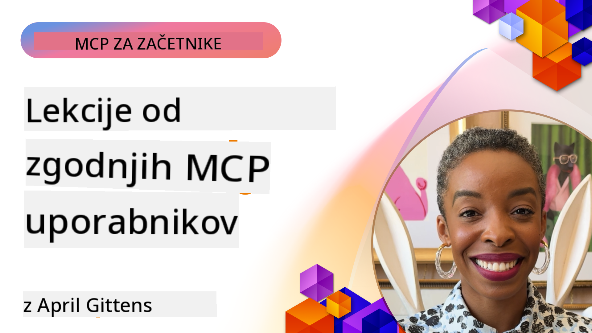

<!--
CO_OP_TRANSLATOR_METADATA:
{
  "original_hash": "41f16dac486d2086a53bc644a01cbe42",
  "translation_date": "2025-08-19T18:08:07+00:00",
  "source_file": "07-LessonsfromEarlyAdoption/README.md",
  "language_code": "sl"
}
-->
# 🌟 Lekcije zgodnjih uporabnikov

[](https://youtu.be/jds7dSmNptE)

_(Kliknite zgornjo sliko za ogled videa te lekcije)_

## 🎯 Kaj zajema ta modul

Ta modul raziskuje, kako resnične organizacije in razvijalci uporabljajo Model Context Protocol (MCP) za reševanje dejanskih izzivov in spodbujanje inovacij. S pomočjo podrobnih študij primerov in praktičnih projektov boste odkrili, kako MCP omogoča varno in skalabilno integracijo AI, ki povezuje jezikovne modele, orodja in podatke podjetja.

### 📚 Oglejte si MCP v praksi

Želite videti, kako se ta načela uporabljajo v orodjih, pripravljenih za proizvodnjo? Oglejte si naš [**10 Microsoft MCP strežnikov, ki spreminjajo produktivnost razvijalcev**](microsoft-mcp-servers.md), kjer so predstavljeni resnični Microsoft MCP strežniki, ki jih lahko uporabite že danes.

## Pregled

Ta lekcija raziskuje, kako so zgodnji uporabniki izkoristili Model Context Protocol (MCP) za reševanje resničnih izzivov in spodbujanje inovacij v različnih panogah. S pomočjo podrobnih študij primerov in praktičnih projektov boste videli, kako MCP omogoča standardizirano, varno in skalabilno integracijo AI—povezovanje velikih jezikovnih modelov, orodij in podatkov podjetja v enoten okvir. Pridobili boste praktične izkušnje pri oblikovanju in gradnji rešitev na osnovi MCP, se učili iz preverjenih vzorcev implementacije ter odkrili najboljše prakse za uvajanje MCP v proizvodnih okoljih. Lekcija prav tako poudarja nastajajoče trende, prihodnje smernice in odprtokodne vire, ki vam pomagajo ostati na čelu tehnologije MCP in njenega razvijajočega se ekosistema.

## Cilji učenja

- Analizirati resnične implementacije MCP v različnih panogah
- Oblikovati in zgraditi popolne aplikacije na osnovi MCP
- Raziskati nastajajoče trende in prihodnje smernice v tehnologiji MCP
- Uporabiti najboljše prakse v dejanskih razvojnih scenarijih

## Resnične implementacije MCP

### Študija primera 1: Avtomatizacija podpore strankam v podjetju

Multinacionalka je uvedla rešitev na osnovi MCP za standardizacijo AI interakcij v svojih sistemih za podporo strankam. To jim je omogočilo:

- Ustvariti enoten vmesnik za več ponudnikov LLM
- Ohraniti dosledno upravljanje pozivov med oddelki
- Uvesti robustne varnostne in skladnostne kontrole
- Enostavno preklapljanje med različnimi AI modeli glede na specifične potrebe

**Tehnična implementacija:**

```python
# Python MCP server implementation for customer support
import logging
import asyncio
from modelcontextprotocol import create_server, ServerConfig
from modelcontextprotocol.server import MCPServer
from modelcontextprotocol.transports import create_http_transport
from modelcontextprotocol.resources import ResourceDefinition
from modelcontextprotocol.prompts import PromptDefinition
from modelcontextprotocol.tool import ToolDefinition

# Configure logging
logging.basicConfig(level=logging.INFO)

async def main():
    # Create server configuration
    config = ServerConfig(
        name="Enterprise Customer Support Server",
        version="1.0.0",
        description="MCP server for handling customer support inquiries"
    )
    
    # Initialize MCP server
    server = create_server(config)
    
    # Register knowledge base resources
    server.resources.register(
        ResourceDefinition(
            name="customer_kb",
            description="Customer knowledge base documentation"
        ),
        lambda params: get_customer_documentation(params)
    )
    
    # Register prompt templates
    server.prompts.register(
        PromptDefinition(
            name="support_template",
            description="Templates for customer support responses"
        ),
        lambda params: get_support_templates(params)
    )
    
    # Register support tools
    server.tools.register(
        ToolDefinition(
            name="ticketing",
            description="Create and update support tickets"
        ),
        handle_ticketing_operations
    )
    
    # Start server with HTTP transport
    transport = create_http_transport(port=8080)
    await server.run(transport)

if __name__ == "__main__":
    asyncio.run(main())
```

**Rezultati:** 30 % zmanjšanje stroškov modelov, 45 % izboljšanje doslednosti odgovorov in izboljšana skladnost v globalnih operacijah.

### Študija primera 2: Pomočnik za zdravstveno diagnostiko

Ponudnik zdravstvenih storitev je razvil infrastrukturo MCP za integracijo več specializiranih medicinskih AI modelov, hkrati pa zagotovil zaščito občutljivih podatkov pacientov:

- Nemoteno preklapljanje med splošnimi in specialističnimi medicinskimi modeli
- Stroge kontrole zasebnosti in revizijske sledi
- Integracija z obstoječimi sistemi elektronskih zdravstvenih kartotek (EHR)
- Dosledno oblikovanje pozivov za medicinsko terminologijo

**Tehnična implementacija:**

```csharp
// C# MCP host application implementation in healthcare application
using Microsoft.Extensions.DependencyInjection;
using ModelContextProtocol.SDK.Client;
using ModelContextProtocol.SDK.Security;
using ModelContextProtocol.SDK.Resources;

public class DiagnosticAssistant
{
    private readonly MCPHostClient _mcpClient;
    private readonly PatientContext _patientContext;
    
    public DiagnosticAssistant(PatientContext patientContext)
    {
        _patientContext = patientContext;
        
        // Configure MCP client with healthcare-specific settings
        var clientOptions = new ClientOptions
        {
            Name = "Healthcare Diagnostic Assistant",
            Version = "1.0.0",
            Security = new SecurityOptions
            {
                Encryption = EncryptionLevel.Medical,
                AuditEnabled = true
            }
        };
        
        _mcpClient = new MCPHostClientBuilder()
            .WithOptions(clientOptions)
            .WithTransport(new HttpTransport("https://healthcare-mcp.example.org"))
            .WithAuthentication(new HIPAACompliantAuthProvider())
            .Build();
    }
    
    public async Task<DiagnosticSuggestion> GetDiagnosticAssistance(
        string symptoms, string patientHistory)
    {
        // Create request with appropriate resources and tool access
        var resourceRequest = new ResourceRequest
        {
            Name = "patient_records",
            Parameters = new Dictionary<string, object>
            {
                ["patientId"] = _patientContext.PatientId,
                ["requestingProvider"] = _patientContext.ProviderId
            }
        };
        
        // Request diagnostic assistance using appropriate prompt
        var response = await _mcpClient.SendPromptRequestAsync(
            promptName: "diagnostic_assistance",
            parameters: new Dictionary<string, object>
            {
                ["symptoms"] = symptoms,
                patientHistory = patientHistory,
                relevantGuidelines = _patientContext.GetRelevantGuidelines()
            });
            
        return DiagnosticSuggestion.FromMCPResponse(response);
    }
}
```

**Rezultati:** Izboljšane diagnostične predloge za zdravnike ob popolni skladnosti s HIPAA ter znatno zmanjšanje preklapljanja med sistemi.

### Študija primera 3: Analiza tveganj v finančnih storitvah

Finančna institucija je uvedla MCP za standardizacijo procesov analize tveganj v različnih oddelkih:

- Ustvarila enoten vmesnik za modele kreditnega tveganja, odkrivanja goljufij in naložbenih tveganj
- Uvedla stroge kontrole dostopa in različice modelov
- Zagotovila revizijsko sled vseh AI priporočil
- Ohranila dosledno oblikovanje podatkov v različnih sistemih

**Tehnična implementacija:**

```java
// Java MCP server for financial risk assessment
import org.mcp.server.*;
import org.mcp.security.*;

public class FinancialRiskMCPServer {
    public static void main(String[] args) {
        // Create MCP server with financial compliance features
        MCPServer server = new MCPServerBuilder()
            .withModelProviders(
                new ModelProvider("risk-assessment-primary", new AzureOpenAIProvider()),
                new ModelProvider("risk-assessment-audit", new LocalLlamaProvider())
            )
            .withPromptTemplateDirectory("./compliance/templates")
            .withAccessControls(new SOCCompliantAccessControl())
            .withDataEncryption(EncryptionStandard.FINANCIAL_GRADE)
            .withVersionControl(true)
            .withAuditLogging(new DatabaseAuditLogger())
            .build();
            
        server.addRequestValidator(new FinancialDataValidator());
        server.addResponseFilter(new PII_RedactionFilter());
        
        server.start(9000);
        
        System.out.println("Financial Risk MCP Server running on port 9000");
    }
}
```

**Rezultati:** Izboljšana skladnost z regulativami, 40 % hitrejši cikli uvajanja modelov in izboljšana doslednost ocene tveganj med oddelki.

### Študija primera 4: Microsoft Playwright MCP strežnik za avtomatizacijo brskalnika

Microsoft je razvil [Playwright MCP strežnik](https://github.com/microsoft/playwright-mcp) za omogočanje varne, standardizirane avtomatizacije brskalnika prek Model Context Protocol. Ta strežnik, pripravljen za proizvodnjo, omogoča AI agentom in LLM-jem interakcijo z brskalniki na nadzorovan, revizijski in razširljiv način—omogoča primere uporabe, kot so avtomatizirano testiranje spletnih strani, pridobivanje podatkov in celoviti delovni tokovi.

> **🎯 Orodje, pripravljeno za proizvodnjo**
> 
> Ta študija primera prikazuje resnični MCP strežnik, ki ga lahko uporabite že danes! Več o Playwright MCP strežniku in drugih Microsoft MCP strežnikih, pripravljenih za proizvodnjo, si preberite v našem [**Microsoft MCP Servers Guide**](microsoft-mcp-servers.md#8--playwright-mcp-server).

**Ključne funkcije:**
- Omogoča funkcije avtomatizacije brskalnika (navigacija, izpolnjevanje obrazcev, zajem zaslonskih slik itd.) kot MCP orodja
- Uvaja stroge kontrole dostopa in peskovnike za preprečevanje nepooblaščenih dejanj
- Zagotavlja podrobne revizijske dnevnike vseh interakcij z brskalnikom
- Podpira integracijo z Azure OpenAI in drugimi ponudniki LLM za avtomatizacijo, ki jo vodijo agenti
- Poganja GitHub Copilotov Coding Agent z zmogljivostmi brskanja po spletu

**Tehnična implementacija:**

```typescript
// TypeScript: Registering Playwright browser automation tools in an MCP server
import { createServer, ToolDefinition } from 'modelcontextprotocol';
import { launch } from 'playwright';

const server = createServer({
  name: 'Playwright MCP Server',
  version: '1.0.0',
  description: 'MCP server for browser automation using Playwright'
});

// Register a tool for navigating to a URL and capturing a screenshot
server.tools.register(
  new ToolDefinition({
    name: 'navigate_and_screenshot',
    description: 'Navigate to a URL and capture a screenshot',
    parameters: {
      url: { type: 'string', description: 'The URL to visit' }
    }
  }),
  async ({ url }) => {
    const browser = await launch();
    const page = await browser.newPage();
    await page.goto(url);
    const screenshot = await page.screenshot();
    await browser.close();
    return { screenshot };
  }
);

// Start the MCP server
server.listen(8080);
```

**Rezultati:**

- Omogočena varna, programatična avtomatizacija brskalnika za AI agente in LLM-je
- Zmanjšan ročni napor pri testiranju in izboljšana pokritost testov za spletne aplikacije
- Zagotovljen ponovno uporaben, razširljiv okvir za integracijo orodij, ki temeljijo na brskalniku, v podjetniških okoljih
- Poganja zmogljivosti brskanja po spletu za GitHub Copilot

**Reference:**

- [Playwright MCP strežnik GitHub repozitorij](https://github.com/microsoft/playwright-mcp)
- [Microsoft AI in avtomatizacijske rešitve](https://azure.microsoft.com/en-us/products/ai-services/)

### Študija primera 5: Azure MCP – Model Context Protocol kot storitev na ravni podjetja

Azure MCP strežnik ([https://aka.ms/azmcp](https://aka.ms/azmcp)) je Microsoftova upravljana, podjetniška implementacija Model Context Protocol, zasnovana za zagotavljanje skalabilnih, varnih in skladnih zmogljivosti MCP strežnika kot storitve v oblaku. Azure MCP omogoča organizacijam hitro uvajanje, upravljanje in integracijo MCP strežnikov z Azure AI, podatki in varnostnimi storitvami, kar zmanjšuje operativne obremenitve in pospešuje sprejemanje AI.

> **🎯 Orodje, pripravljeno za proizvodnjo**
> 
> To je resnični MCP strežnik, ki ga lahko uporabite že danes! Več o Azure AI Foundry MCP strežniku si preberite v našem [**Microsoft MCP Servers Guide**](microsoft-mcp-servers.md).

- Popolnoma upravljano gostovanje MCP strežnika z vgrajenim skaliranjem, spremljanjem in varnostjo
- Nativna integracija z Azure OpenAI, Azure AI Search in drugimi Azure storitvami
- Avtentikacija in avtorizacija na ravni podjetja prek Microsoft Entra ID
- Podpora za prilagojena orodja, predloge pozivov in povezovalnike virov
- Skladnost z varnostnimi zahtevami podjetja in regulativnimi zahtevami

**Tehnična implementacija:**

```yaml
# Example: Azure MCP server deployment configuration (YAML)
apiVersion: mcp.microsoft.com/v1
kind: McpServer
metadata:
  name: enterprise-mcp-server
spec:
  modelProviders:
    - name: azure-openai
      type: AzureOpenAI
      endpoint: https://<your-openai-resource>.openai.azure.com/
      apiKeySecret: <your-azure-keyvault-secret>
  tools:
    - name: document_search
      type: AzureAISearch
      endpoint: https://<your-search-resource>.search.windows.net/
      apiKeySecret: <your-azure-keyvault-secret>
  authentication:
    type: EntraID
    tenantId: <your-tenant-id>
  monitoring:
    enabled: true
    logAnalyticsWorkspace: <your-log-analytics-id>
```

**Rezultati:**  
- Zmanjšan čas do vrednosti za AI projekte v podjetjih z zagotavljanjem platforme MCP strežnika, pripravljene za uporabo in skladne
- Poenostavljena integracija LLM-jev, orodij in virov podatkov podjetja
- Izboljšana varnost, opazljivost in operativna učinkovitost za delovne obremenitve MCP
- Izboljšana kakovost kode z najboljšimi praksami Azure SDK in trenutnimi vzorci avtentikacije

**Reference:**  
- [Azure MCP dokumentacija](https://aka.ms/azmcp)
- [Azure MCP strežnik GitHub repozitorij](https://github.com/Azure/azure-mcp)
- [Azure AI storitve](https://azure.microsoft.com/en-us/products/ai-services/)
- [Microsoft MCP Center](https://mcp.azure.com)

### Študija primera 6: NLWeb

MCP (Model Context Protocol) je nastajajoči protokol za klepetalne bote in AI asistente za interakcijo z orodji. Vsaka instanca NLWeb je tudi MCP strežnik, ki podpira eno osnovno metodo, ask, ki se uporablja za postavljanje vprašanj spletni strani v naravnem jeziku. Vrnjeni odgovor uporablja schema.org, široko uporabljeno besedišče za opisovanje spletnih podatkov. Poenostavljeno rečeno, MCP je NLWeb, kot je Http za HTML. NLWeb združuje protokole, formate Schema.org in vzorčno kodo, da pomaga spletnim mestom hitro ustvariti te končne točke, kar koristi tako ljudem prek pogovornih vmesnikov kot strojem prek naravne interakcije med agenti.

Obstajata dve ločeni komponenti NLWeb:
- Protokol, zelo preprost za začetek, za vmesnik s spletnim mestom v naravnem jeziku in format, ki uporablja json in schema.org za vrnjeni odgovor. Več podrobnosti najdete v dokumentaciji o REST API.
- Preprosta implementacija (1), ki izkorišča obstoječo označbo za spletna mesta, ki jih je mogoče abstrahirati kot sezname elementov (izdelki, recepti, znamenitosti, ocene itd.). Skupaj z naborom pripomočkov uporabniškega vmesnika lahko spletna mesta enostavno zagotovijo pogovorne vmesnike za svojo vsebino. Več podrobnosti o tem, kako to deluje, najdete v dokumentaciji o življenju klepetalnega vprašanja.

**Reference:**  
- [Azure MCP dokumentacija](https://aka.ms/azmcp)
- [NLWeb](https://github.com/microsoft/NlWeb)

### Študija primera 7: Azure AI Foundry MCP strežnik – Integracija AI agentov v podjetjih

Azure AI Foundry MCP strežniki prikazujejo, kako se MCP lahko uporablja za orkestracijo in upravljanje AI agentov ter delovnih tokov v podjetniških okoljih. Z integracijo MCP z Azure AI Foundry lahko organizacije standardizirajo interakcije agentov, izkoristijo Foundryjevo upravljanje delovnih tokov in zagotovijo varne, skalabilne uvedbe.

> **🎯 Orodje, pripravljeno za proizvodnjo**
> 
> To je resnični MCP strežnik, ki ga lahko uporabite že danes! Več o Azure AI Foundry MCP strežniku si preberite v našem [**Microsoft MCP Servers Guide**](microsoft-mcp-servers.md#9--azure-ai-foundry-mcp-server).

**Ključne funkcije:**
- Celovit dostop do Azure AI ekosistema, vključno s katalogi modelov in upravljanjem uvedb
- Indeksiranje znanja z Azure AI Search za RAG aplikacije
- Orodja za ocenjevanje zmogljivosti modelov AI in zagotavljanje kakovosti
- Integracija z Azure AI Foundry Catalog in Labs za najnovejše raziskovalne modele
- Zmogljivosti upravljanja in ocenjevanja agentov za proizvodne scenarije

**Rezultati:**
- Hitro prototipiranje in robustno spremljanje delovnih tokov AI agentov
- Nemotena integracija z Azure AI storitvami za napredne scenarije
- Enoten vmesnik za gradnjo, uvajanje in spremljanje agentnih cevovodov
- Izboljšana varnost, skladnost in operativna učinkovitost za podjetja
- Pospešeno sprejemanje AI ob ohranjanju nadzora nad kompleksnimi procesi, ki jih vodijo agenti

**Reference:**
- [Azure AI Foundry MCP strežnik GitHub repozitorij](https://github.com/azure-ai-foundry/mcp-foundry)
- [Integracija Azure AI agentov z MCP (Microsoft Foundry Blog)](https://devblogs.microsoft.com/foundry/integrating-azure-ai-agents-mcp/)

### Študija primera 8: Foundry MCP Playground – Eksperimentiranje in prototipiranje

Foundry MCP Playground ponuja okolje, pripravljeno za uporabo, za eksperimentiranje z MCP strežniki in integracijami Azure AI Foundry. Razvijalci lahko hitro prototipirajo, testirajo in ocenjujejo AI modele ter delovne tokove agentov z viri iz Azure AI Foundry Catalog in Labs. Playground poenostavi nastavitev, zagotavlja vzorčne projekte in podpira sodelovalni razvoj, kar olajša raziskovanje najboljših praks in novih scenarijev z minimalnimi stroški. Še posebej je koristen za ekipe, ki želijo potrditi ideje, deliti eksperimente in pospešiti učenje brez potrebe po kompleksni infrastrukturi. Z znižanjem vstopne ovire Playground spodbuja inovacije in prispevke skupnosti v ekosistemu MCP in Azure AI Foundry.

**Reference:**

- [Foundry MCP Playground GitHub repozitorij](https://github.com/azure-ai-foundry/foundry-mcp-playground)

### Študija primera 9: Microsoft Learn Docs MCP strežnik – Dostop do dokumentacije, ki jo poganja AI

Microsoft Learn Docs MCP strežnik je storitev v oblaku, ki AI asistentom omogoča dostop v realnem času do uradne Microsoftove dokumentacije prek Model Context Protocol. Ta strežnik, pripravljen za proizvodnjo, se povezuje s celovitim ekosistemom Microsoft Learn in omogoča semantično iskanje po vseh uradnih Microsoftovih virih.
> **🎯 Orodje pripravljeno za proizvodnjo**
> 
> To je pravi MCP strežnik, ki ga lahko uporabite že danes! Več o Microsoft Learn Docs MCP strežniku si preberite v našem [**Vodniku za Microsoft MCP strežnike**](microsoft-mcp-servers.md#1--microsoft-learn-docs-mcp-server).
**Ključne značilnosti:**
- Dostop v realnem času do uradne Microsoftove dokumentacije, Azure dokumentacije in dokumentacije za Microsoft 365
- Napredne semantične iskalne zmogljivosti, ki razumejo kontekst in namen
- Vedno posodobljene informacije, saj se vsebine Microsoft Learn redno objavljajo
- Celovita pokritost virov Microsoft Learn, Azure dokumentacije in Microsoft 365
- Vrnitev do 10 visokokakovostnih vsebinskih odlomkov z naslovi člankov in URL-ji

**Zakaj je to ključno:**
- Rešuje problem "zastarelega znanja AI" za Microsoftove tehnologije
- Zagotavlja, da imajo AI pomočniki dostop do najnovejših funkcij .NET, C#, Azure in Microsoft 365
- Ponuja avtoritativne, prvovrstne informacije za natančno generiranje kode
- Ključno za razvijalce, ki delajo z hitro razvijajočimi se Microsoftovimi tehnologijami

**Rezultati:**
- Znatno izboljšana natančnost AI-generirane kode za Microsoftove tehnologije
- Zmanjšan čas iskanja aktualne dokumentacije in najboljših praks
- Povečana produktivnost razvijalcev z iskanjem dokumentacije, ki razume kontekst
- Brezhibna integracija z delovnimi tokovi razvoja brez zapuščanja IDE

**Reference:**
- [Microsoft Learn Docs MCP Server GitHub Repository](https://github.com/MicrosoftDocs/mcp)
- [Microsoft Learn Documentation](https://learn.microsoft.com/)

## Praktični projekti

### Projekt 1: Izdelava večponudniškega MCP strežnika

**Cilj:** Ustvariti MCP strežnik, ki lahko usmerja zahteve na več ponudnikov AI modelov glede na določena merila.

**Zahteve:**

- Podpora za vsaj tri različne ponudnike modelov (npr. OpenAI, Anthropic, lokalni modeli)
- Implementacija mehanizma za usmerjanje na podlagi metapodatkov zahtev
- Ustvarjanje sistema za konfiguracijo za upravljanje poverilnic ponudnikov
- Dodajanje predpomnjenja za optimizacijo zmogljivosti in stroškov
- Izdelava preprostega nadzornega panela za spremljanje uporabe

**Koraki implementacije:**

1. Postavitev osnovne infrastrukture MCP strežnika
2. Implementacija adapterjev ponudnikov za vsako storitev AI modela
3. Ustvarjanje logike za usmerjanje na podlagi atributov zahtev
4. Dodajanje mehanizmov za predpomnjenje pogostih zahtev
5. Razvoj nadzornega panela za spremljanje
6. Testiranje z različnimi vzorci zahtev

**Tehnologije:** Izbira med Python (.NET/Java/Python glede na vaše preference), Redis za predpomnjenje in preprost spletni okvir za nadzorni panel.

### Projekt 2: Sistem za upravljanje pozivov na ravni podjetja

**Cilj:** Razviti sistem na osnovi MCP za upravljanje, različice in uvajanje predlog pozivov v celotni organizaciji.

**Zahteve:**

- Ustvarjanje centraliziranega repozitorija za predloge pozivov
- Implementacija sistema za različice in poteke odobritev
- Izdelava zmogljivosti za testiranje predlog z vzorčnimi vnosi
- Razvoj nadzora dostopa na podlagi vlog
- Ustvarjanje API-ja za pridobivanje in uvajanje predlog

**Koraki implementacije:**

1. Oblikovanje sheme baze podatkov za shranjevanje predlog
2. Ustvarjanje osnovnega API-ja za CRUD operacije predlog
3. Implementacija sistema za različice
4. Razvoj poteka odobritev
5. Izdelava testnega okvira
6. Ustvarjanje preprostega spletnega vmesnika za upravljanje
7. Integracija z MCP strežnikom

**Tehnologije:** Izbira ogrodja za zaledje, SQL ali NoSQL baze podatkov in ogrodja za sprednji del za upravljalni vmesnik.

### Projekt 3: Platforma za generiranje vsebin na osnovi MCP

**Cilj:** Izdelati platformo za generiranje vsebin, ki uporablja MCP za zagotavljanje doslednih rezultatov za različne vrste vsebin.

**Zahteve:**

- Podpora za več formatov vsebin (blog objave, družbena omrežja, marketinška besedila)
- Implementacija generiranja na osnovi predlog z možnostmi prilagoditve
- Ustvarjanje sistema za pregled in povratne informacije o vsebinah
- Sledenje metrikam uspešnosti vsebin
- Podpora za različice in iteracije vsebin

**Koraki implementacije:**

1. Postavitev infrastrukture MCP odjemalca
2. Ustvarjanje predlog za različne vrste vsebin
3. Izdelava cevovoda za generiranje vsebin
4. Implementacija sistema za pregled
5. Razvoj sistema za sledenje metrikam
6. Ustvarjanje uporabniškega vmesnika za upravljanje predlog in generiranje vsebin

**Tehnologije:** Vaš priljubljen programski jezik, spletni okvir in sistem baze podatkov.

## Prihodnje smeri za MCP tehnologijo

### Pojavljajoči se trendi

1. **Večmodalni MCP**
   - Razširitev MCP za standardizacijo interakcij z modeli za slike, zvok in video
   - Razvoj zmogljivosti za sklepanje med različnimi modalnostmi
   - Standardizirani formati pozivov za različne modalnosti

2. **Federirana MCP infrastruktura**
   - Porazdeljena MCP omrežja, ki lahko delijo vire med organizacijami
   - Standardizirani protokoli za varno deljenje modelov
   - Tehnike za ohranjanje zasebnosti pri računalniških operacijah

3. **MCP tržnice**
   - Ekosistemi za deljenje in monetizacijo MCP predlog in vtičnikov
   - Procesi za zagotavljanje kakovosti in certificiranje
   - Integracija s tržnicami modelov

4. **MCP za robno računalništvo**
   - Prilagoditev MCP standardov za naprave z omejenimi viri
   - Optimizirani protokoli za okolja z nizko pasovno širino
   - Specializirane MCP implementacije za IoT ekosisteme

5. **Regulativni okviri**
   - Razvoj MCP razširitev za skladnost z regulativami
   - Standardizirane revizijske sledi in vmesniki za razlago
   - Integracija z nastajajočimi okviri za upravljanje AI

### MCP rešitve iz Microsofta

Microsoft in Azure sta razvila več odprtokodnih repozitorijev za pomoč razvijalcem pri implementaciji MCP v različnih scenarijih:

#### Microsoftova organizacija

1. [playwright-mcp](https://github.com/microsoft/playwright-mcp) - Playwright MCP strežnik za avtomatizacijo brskalnika in testiranje
2. [files-mcp-server](https://github.com/microsoft/files-mcp-server) - Implementacija OneDrive MCP strežnika za lokalno testiranje in prispevke skupnosti
3. [NLWeb](https://github.com/microsoft/NlWeb) - NLWeb je zbirka odprtih protokolov in povezanih odprtokodnih orodij. Glavni poudarek je na vzpostavitvi osnovnega sloja za AI splet

#### Azure-Samples organizacija

1. [mcp](https://github.com/Azure-Samples/mcp) - Povezave do vzorcev, orodij in virov za gradnjo in integracijo MCP strežnikov na Azure z uporabo več jezikov
2. [mcp-auth-servers](https://github.com/Azure-Samples/mcp-auth-servers) - Referenčni MCP strežniki, ki prikazujejo avtentikacijo z aktualno specifikacijo Model Context Protocol
3. [remote-mcp-functions](https://github.com/Azure-Samples/remote-mcp-functions) - Ciljna stran za implementacije oddaljenih MCP strežnikov v Azure Functions z povezavami do jezikovno specifičnih repozitorijev
4. [remote-mcp-functions-python](https://github.com/Azure-Samples/remote-mcp-functions-python) - Predloga za hiter začetek gradnje in uvajanja prilagojenih oddaljenih MCP strežnikov z uporabo Azure Functions in Pythona
5. [remote-mcp-functions-dotnet](https://github.com/Azure-Samples/remote-mcp-functions-dotnet) - Predloga za hiter začetek gradnje in uvajanja prilagojenih oddaljenih MCP strežnikov z uporabo Azure Functions in .NET/C#
6. [remote-mcp-functions-typescript](https://github.com/Azure-Samples/remote-mcp-functions-typescript) - Predloga za hiter začetek gradnje in uvajanja prilagojenih oddaljenih MCP strežnikov z uporabo Azure Functions in TypeScripta
7. [remote-mcp-apim-functions-python](https://github.com/Azure-Samples/remote-mcp-apim-functions-python) - Azure API Management kot AI prehod do oddaljenih MCP strežnikov z uporabo Pythona
8. [AI-Gateway](https://github.com/Azure-Samples/AI-Gateway) - Eksperimenti APIM ❤️ AI, vključno z MCP zmogljivostmi, integracijo z Azure OpenAI in AI Foundry

Ti repozitoriji ponujajo različne implementacije, predloge in vire za delo z Model Context Protocol v različnih programskih jezikih in storitvah Azure. Pokrivajo širok spekter primerov uporabe, od osnovnih implementacij strežnikov do avtentikacije, uvajanja v oblak in scenarijev za integracijo na ravni podjetja.

#### MCP Resources Directory

[MCP Resources Directory](https://github.com/microsoft/mcp/tree/main/Resources) v uradnem Microsoftovem MCP repozitoriju ponuja kurirano zbirko vzorčnih virov, predlog pozivov in definicij orodij za uporabo z Model Context Protocol strežniki. Ta imenik je zasnovan za pomoč razvijalcem pri hitrem začetku dela z MCP z zagotavljanjem ponovno uporabnih gradnikov in primerov najboljših praks za:

- **Predloge pozivov:** Pripravljene predloge pozivov za pogoste AI naloge in scenarije, ki jih je mogoče prilagoditi za lastne implementacije MCP strežnikov.
- **Definicije orodij:** Primeri shem orodij in metapodatkov za standardizacijo integracije in klicanja orodij med različnimi MCP strežniki.
- **Vzorčni viri:** Primeri definicij virov za povezovanje z viri podatkov, API-ji in zunanjimi storitvami znotraj MCP okvira.
- **Referenčne implementacije:** Praktični vzorci, ki prikazujejo, kako strukturirati in organizirati vire, pozive in orodja v resničnih MCP projektih.

Ti viri pospešujejo razvoj, spodbujajo standardizacijo in pomagajo zagotavljati najboljše prakse pri gradnji in uvajanju rešitev na osnovi MCP.

#### MCP Resources Directory

- [MCP Resources (Sample Prompts, Tools, and Resource Definitions)](https://github.com/microsoft/mcp/tree/main/Resources)

### Raziskovalne priložnosti

- Učinkovite tehnike optimizacije pozivov znotraj MCP okvirov
- Varnostni modeli za večnajemniške MCP implementacije
- Primerjalno testiranje zmogljivosti različnih MCP implementacij
- Formalne metode za preverjanje pravilnosti MCP strežnikov

## Zaključek

Model Context Protocol (MCP) hitro oblikuje prihodnost standardizirane, varne in interoperabilne AI integracije v različnih panogah. Skozi študije primerov in praktične projekte v tej lekciji ste videli, kako zgodnji uporabniki—vključno z Microsoftom in Azure—izkoriščajo MCP za reševanje resničnih izzivov, pospeševanje sprejemanja AI in zagotavljanje skladnosti, varnosti ter razširljivosti. Modularni pristop MCP omogoča organizacijam povezovanje velikih jezikovnih modelov, orodij in podatkov podjetja v enoten, revizijski okvir. Ker se MCP še naprej razvija, bo ključno ostati povezan s skupnostjo, raziskovati odprtokodne vire in uporabljati najboljše prakse za gradnjo robustnih, prihodnosti pripravljenih AI rešitev.

## Dodatni viri

- [MCP Foundry GitHub Repository](https://github.com/azure-ai-foundry/mcp-foundry)
- [Foundry MCP Playground](https://github.com/azure-ai-foundry/foundry-mcp-playground)
- [Integrating Azure AI Agents with MCP (Microsoft Foundry Blog)](https://devblogs.microsoft.com/foundry/integrating-azure-ai-agents-mcp/)
- [MCP GitHub Repository (Microsoft)](https://github.com/microsoft/mcp)
- [MCP Resources Directory (Sample Prompts, Tools, and Resource Definitions)](https://github.com/microsoft/mcp/tree/main/Resources)
- [MCP Community & Documentation](https://modelcontextprotocol.io/introduction)
- [Azure MCP Documentation](https://aka.ms/azmcp)
- [Playwright MCP Server GitHub Repository](https://github.com/microsoft/playwright-mcp)
- [Files MCP Server (OneDrive)](https://github.com/microsoft/files-mcp-server)
- [Azure-Samples MCP](https://github.com/Azure-Samples/mcp)
- [MCP Auth Servers (Azure-Samples)](https://github.com/Azure-Samples/mcp-auth-servers)
- [Remote MCP Functions (Azure-Samples)](https://github.com/Azure-Samples/remote-mcp-functions)
- [Remote MCP Functions Python (Azure-Samples)](https://github.com/Azure-Samples/remote-mcp-functions-python)
- [Remote MCP Functions .NET (Azure-Samples)](https://github.com/Azure-Samples/remote-mcp-functions-dotnet)
- [Remote MCP Functions TypeScript (Azure-Samples)](https://github.com/Azure-Samples/remote-mcp-functions-typescript)
- [Remote MCP APIM Functions Python (Azure-Samples)](https://github.com/Azure-Samples/remote-mcp-apim-functions-python)
- [AI-Gateway (Azure-Samples)](https://github.com/Azure-Samples/AI-Gateway)
- [Microsoft AI and Automation Solutions](https://azure.microsoft.com/en-us/products/ai-services/)

## Vaje

1. Analizirajte eno od študij primerov in predlagajte alternativni pristop k implementaciji.
2. Izberite eno od idej za projekte in ustvarite podrobno tehnično specifikacijo.
3. Raziskujte industrijo, ki ni zajeta v študijah primerov, in opišite, kako bi MCP lahko rešil njene specifične izzive.
4. Raziščite eno od prihodnjih smeri in ustvarite koncept za novo MCP razširitev, ki bi jo podpirala.

Naprej: [Microsoft MCP Server](../07-LessonsfromEarlyAdoption/microsoft-mcp-servers.md)

**Omejitev odgovornosti**:  
Ta dokument je bil preveden z uporabo storitve za strojno prevajanje [Co-op Translator](https://github.com/Azure/co-op-translator). Čeprav si prizadevamo za natančnost, vas prosimo, da se zavedate, da lahko avtomatizirani prevodi vsebujejo napake ali netočnosti. Izvirni dokument v njegovem izvirnem jeziku je treba obravnavati kot avtoritativni vir. Za ključne informacije priporočamo strokovno človeško prevajanje. Ne prevzemamo odgovornosti za morebitna nesporazumevanja ali napačne razlage, ki izhajajo iz uporabe tega prevoda.