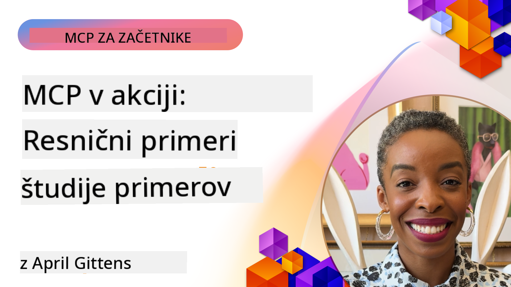

<!--
CO_OP_TRANSLATOR_METADATA:
{
  "original_hash": "1611dc5f6a2a35a789fc4c95fc5bfbe8",
  "translation_date": "2025-09-26T19:17:35+00:00",
  "source_file": "09-CaseStudy/README.md",
  "language_code": "sl"
}
-->
# MCP v praksi: Študije primerov iz resničnega sveta

_(Kliknite na zgornjo sliko za ogled videa te lekcije)_

Model Context Protocol (MCP) spreminja način, kako aplikacije z umetno inteligenco komunicirajo s podatki, orodji in storitvami. Ta razdelek predstavlja študije primerov iz resničnega sveta, ki prikazujejo praktične uporabe MCP v različnih poslovnih scenarijih.

## Pregled

Ta razdelek prikazuje konkretne primere implementacij MCP, ki poudarjajo, kako organizacije uporabljajo ta protokol za reševanje kompleksnih poslovnih izzivov. S preučevanjem teh študij primerov boste pridobili vpogled v vsestranskost, skalabilnost in praktične koristi MCP v resničnih scenarijih.

## Ključni cilji učenja

S preučevanjem teh študij primerov boste:

- Razumeli, kako MCP lahko uporabite za reševanje specifičnih poslovnih težav
- Spoznali različne vzorce integracije in arhitekturne pristope
- Prepoznali najboljše prakse za implementacijo MCP v poslovnih okoljih
- Pridobili vpogled v izzive in rešitve, s katerimi se srečujejo pri resničnih implementacijah
- Identificirali priložnosti za uporabo podobnih vzorcev v svojih projektih

## Izbrane študije primerov

### 1. [Azure AI Travel Agents – Referenčna implementacija](./travelagentsample.md)

Ta študija primera preučuje Microsoftovo celovito referenčno rešitev, ki prikazuje, kako zgraditi večagentno aplikacijo za načrtovanje potovanj, ki temelji na umetni inteligenci, z uporabo MCP, Azure OpenAI in Azure AI Search. Projekt vključuje:

- Orkestracijo več agentov prek MCP
- Integracijo poslovnih podatkov z Azure AI Search
- Varnostno in skalabilno arhitekturo z uporabo storitev Azure
- Razširljiva orodja z večkratno uporabo MCP komponent
- Pogovorno uporabniško izkušnjo, ki jo omogoča Azure OpenAI

Arhitekturne in implementacijske podrobnosti ponujajo dragocene vpoglede v gradnjo kompleksnih večagentnih sistemov z MCP kot koordinacijsko plastjo.

### 2. [Posodabljanje elementov Azure DevOps z YouTube podatki](./UpdateADOItemsFromYT.md)

Ta študija primera prikazuje praktično uporabo MCP za avtomatizacijo delovnih procesov. Pokaže, kako lahko MCP orodja uporabite za:

- Ekstrakcijo podatkov z spletnih platform (YouTube)
- Posodabljanje delovnih elementov v sistemih Azure DevOps
- Ustvarjanje ponovljivih avtomatiziranih delovnih tokov
- Integracijo podatkov med različnimi sistemi

Ta primer prikazuje, kako lahko že relativno preproste implementacije MCP prinesejo pomembne izboljšave učinkovitosti z avtomatizacijo rutinskih nalog in izboljšanjem doslednosti podatkov med sistemi.

### 3. [Pridobivanje dokumentacije v realnem času z MCP](./docs-mcp/README.md)

Ta študija primera vas vodi skozi povezovanje Python konzolnega odjemalca z MCP strežnikom za pridobivanje in beleženje Microsoftove dokumentacije v realnem času, prilagojene kontekstu. Naučili se boste:

- Povezati se z MCP strežnikom z uporabo Python odjemalca in uradnega MCP SDK
- Uporabljati pretočne HTTP odjemalce za učinkovito pridobivanje podatkov v realnem času
- Klicati orodja za dokumentacijo na strežniku in beležiti odgovore neposredno v konzolo
- Integrirati najnovejšo Microsoftovo dokumentacijo v svoj delovni tok brez zapuščanja terminala

Poglavje vključuje praktično nalogo, minimalni delujoči vzorec kode in povezave do dodatnih virov za poglobljeno učenje. Celoten vodič in kodo si oglejte v povezanem poglavju, da razumete, kako MCP lahko spremeni dostop do dokumentacije in produktivnost razvijalcev v okolju konzole.

### 4. [Interaktivna spletna aplikacija za generiranje študijskih načrtov z MCP](./docs-mcp/README.md)

Ta študija primera prikazuje, kako zgraditi interaktivno spletno aplikacijo z uporabo Chainlit in MCP za generiranje personaliziranih študijskih načrtov za katerokoli temo. Uporabniki lahko določijo predmet (npr. "AI-900 certifikacija") in trajanje študija (npr. 8 tednov), aplikacija pa bo ponudila tedenski razpored priporočene vsebine. Chainlit omogoča pogovorni vmesnik, ki izkušnjo naredi privlačno in prilagodljivo.

- Pogovorna spletna aplikacija, ki jo poganja Chainlit
- Uporabniško vodeni pozivi za temo in trajanje
- Tedenska priporočila vsebine z uporabo MCP
- Odzivi v realnem času v pogovornem vmesniku

Projekt prikazuje, kako lahko pogovorna umetna inteligenca in MCP združita moči za ustvarjanje dinamičnih, uporabniško usmerjenih izobraževalnih orodij v sodobnem spletnem okolju.

### 5. [Dokumentacija v urejevalniku z MCP strežnikom v VS Code](./docs-mcp/README.md)

Ta študija primera prikazuje, kako lahko Microsoft Learn dokumentacijo pripeljete neposredno v svoje okolje VS Code z uporabo MCP strežnika—brez preklapljanja med zavihki brskalnika! Videli boste, kako:

- Takoj poiščete in preberete dokumentacijo znotraj VS Code z uporabo MCP plošče ali ukazne palete
- Vstavite povezave do dokumentacije neposredno v svoje README ali markdown datoteke tečaja
- Uporabite GitHub Copilot in MCP skupaj za brezhibne delovne tokove dokumentacije in kode
- Validirate in izboljšate svojo dokumentacijo z odzivi v realnem času in Microsoftovo natančnostjo
- Integrirate MCP z GitHub delovnimi tokovi za neprekinjeno validacijo dokumentacije

Implementacija vključuje:

- Primer konfiguracije `.vscode/mcp.json` za enostavno nastavitev
- Vodiče s posnetki zaslona za izkušnjo v urejevalniku
- Nasvete za kombiniranje Copilot in MCP za maksimalno produktivnost

Ta scenarij je idealen za avtorje tečajev, pisce dokumentacije in razvijalce, ki želijo ostati osredotočeni v svojem urejevalniku, medtem ko delajo z dokumentacijo, Copilotom in orodji za validacijo—vse to omogoča MCP.

### 6. [Ustvarjanje MCP strežnika z APIM](./apimsample.md)

Ta študija primera ponuja korak za korakom vodič o tem, kako ustvariti MCP strežnik z uporabo Azure API Management (APIM). Pokriva:

- Nastavitev MCP strežnika v Azure API Management
- Izpostavljanje API operacij kot MCP orodij
- Konfiguracijo politik za omejevanje hitrosti in varnost
- Testiranje MCP strežnika z uporabo Visual Studio Code in GitHub Copilot

Ta primer prikazuje, kako izkoristiti zmogljivosti Azure za ustvarjanje robustnega MCP strežnika, ki ga je mogoče uporabiti v različnih aplikacijah, izboljšuje integracijo sistemov umetne inteligence z poslovnimi API-ji.

### 7. [GitHub MCP Registry — Pospeševanje agentne integracije](https://github.com/mcp)

Ta študija primera preučuje, kako GitHubov MCP Registry, lansiran septembra 2025, rešuje ključen izziv v ekosistemu umetne inteligence: razdrobljeno odkrivanje in uvajanje MCP strežnikov.

#### Pregled
**MCP Registry** rešuje naraščajoče težave razpršenih MCP strežnikov po repozitorijih in registrih, kar je prej oteževalo integracijo in povzročalo napake. Ti strežniki omogočajo AI agentom interakcijo z zunanjimi sistemi, kot so API-ji, baze podatkov in viri dokumentacije.

#### Izjava o problemu
Razvijalci, ki gradijo agentne delovne tokove, so se soočali z več izzivi:
- **Slaba odkrivnost** MCP strežnikov na različnih platformah
- **Odvečne nastavitve** razpršene po forumih in dokumentaciji
- **Varnostna tveganja** zaradi nepreverjenih in nezanesljivih virov
- **Pomanjkanje standardizacije** v kakovosti in združljivosti strežnikov

#### Arhitektura rešitve
GitHubov MCP Registry centralizira zanesljive MCP strežnike s ključnimi funkcijami:
- **Namestitev z enim klikom** prek VS Code za poenostavljeno nastavitev
- **Razvrščanje po pomembnosti** glede na zvezdice, aktivnost in validacijo skupnosti
- **Neposredna integracija** z GitHub Copilot in drugimi MCP združljivimi orodji
- **Odprti model prispevkov**, ki omogoča prispevke skupnosti in poslovnih partnerjev

#### Poslovni vpliv
Register je prinesel merljive izboljšave:
- **Hitrejše uvajanje** za razvijalce z orodji, kot je Microsoft Learn MCP Server, ki neposredno pretaka uradno dokumentacijo v agente
- **Izboljšana produktivnost** prek specializiranih strežnikov, kot je `github-mcp-server`, ki omogoča naravno jezikovno GitHub avtomatizacijo (ustvarjanje PR-jev, ponovni zagon CI, skeniranje kode)
- **Močnejše zaupanje v ekosistem** prek kuriranih seznamov in transparentnih standardov konfiguracije

#### Strateška vrednost
Za strokovnjake, ki se ukvarjajo z življenjskim ciklom agentov in ponovljivimi delovnimi tokovi, MCP Registry ponuja:
- **Modularno uvajanje agentov** z standardiziranimi komponentami
- **Validacijske cevovode, podprte z registrom** za dosledno testiranje in validacijo
- **Medsebojno združljivost orodij** za brezhibno integracijo med različnimi AI platformami

Ta študija primera prikazuje, da MCP Registry ni zgolj imenik—je temeljna platforma za skalabilno, resnično integracijo modelov in uvajanje agentnih sistemov.

## Zaključek

Teh sedem celovitih študij primerov prikazuje izjemno vsestranskost in praktične uporabe Model Context Protocol v različnih scenarijih iz resničnega sveta. Od kompleksnih večagentnih sistemov za načrtovanje potovanj in upravljanja poslovnih API-jev do poenostavljenih delovnih tokov dokumentacije in revolucionarnega GitHub MCP Registry, ti primeri prikazujejo, kako MCP zagotavlja standardiziran, skalabilen način povezovanja AI sistemov z orodji, podatki in storitvami, ki jih potrebujejo za ustvarjanje izjemne vrednosti.

Študije primerov pokrivajo več dimenzij implementacije MCP:
- **Poslovna integracija**: Avtomatizacija z Azure API Management in Azure DevOps
- **Orkestracija več agentov**: Načrtovanje potovanj z usklajenimi AI agenti
- **Produktivnost razvijalcev**: Integracija v VS Code in dostop do dokumentacije v realnem času
- **Razvoj ekosistema**: GitHubov MCP Registry kot temeljna platforma
- **Izobraževalne aplikacije**: Interaktivni generatorji študijskih načrtov in pogovorni vmesniki

S preučevanjem teh implementacij pridobite ključne vpoglede v:
- **Arhitekturne vzorce** za različne obsege in primere uporabe
- **Strategije implementacije**, ki uravnotežijo funkcionalnost in vzdržljivost
- **Varnostne in skalabilne** vidike za produkcijske implementacije
- **Najboljše prakse** za razvoj MCP strežnikov in integracijo odjemalcev
- **Razmišljanje o ekosistemu** za gradnjo medsebojno povezanih rešitev, ki temeljijo na AI

Ti primeri skupaj dokazujejo, da MCP ni zgolj teoretični okvir, temveč zrel, produkcijsko pripravljen protokol, ki omogoča praktične rešitve za kompleksne poslovne izzive. Ne glede na to, ali gradite preprosta orodja za avtomatizacijo ali sofisticirane večagentne sisteme, vzorci in pristopi, prikazani tukaj, ponujajo trdno osnovo za vaše lastne MCP projekte.

## Dodatni viri

- [Azure AI Travel Agents GitHub repozitorij](https://github.com/Azure-Samples/azure-ai-travel-agents)
- [Azure DevOps MCP orodje](https://github.com/microsoft/azure-devops-mcp)
- [Playwright MCP orodje](https://github.com/microsoft/playwright-mcp)
- [Microsoft Docs MCP strežnik](https://github.com/MicrosoftDocs/mcp)
- [GitHub MCP Registry — Pospeševanje agentne integracije](https://github.com/mcp)
- [MCP primeri skupnosti](https://github.com/microsoft/mcp)

Naprej: Praktična delavnica [Poenostavitev AI delovnih tokov: Gradnja MCP strežnika z AI orodjem](../10-StreamliningAIWorkflowsBuildingAnMCPServerWithAIToolkit/README.md)

---

