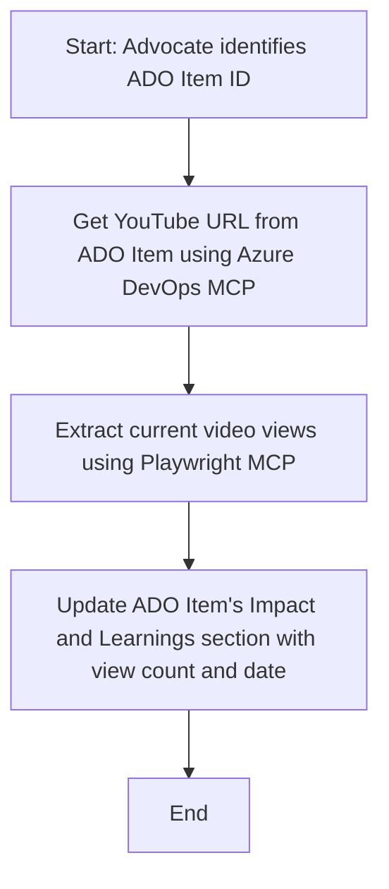

<!--
CO_OP_TRANSLATOR_METADATA:
{
  "original_hash": "14a2dfbea55ef735660a06bd6bdfe5f3",
  "translation_date": "2025-06-13T21:39:30+00:00",
  "source_file": "09-CaseStudy/UpdateADOItemsFromYT.md",
  "language_code": "sl"
}
-->
# Case Study: Posodabljanje Azure DevOps elementov z YouTube podatki preko MCP

> **Opozorilo:** Obstajajo že obstoječa spletna orodja in poročila, ki lahko avtomatizirajo posodabljanje Azure DevOps elementov z podatki s platform, kot je YouTube. Spodnji primer je predstavljen zgolj kot vzorčni primer, ki prikazuje, kako lahko orodja MCP uporabimo za avtomatizacijo in integracijo.

## Pregled

Ta študija primera prikazuje, kako se Model Context Protocol (MCP) in njegova orodja lahko uporabijo za avtomatizacijo posodabljanja Azure DevOps (ADO) delovnih elementov z informacijami, pridobljenimi s spletnih platform, kot je YouTube. Opisani scenarij je le ena izmed mnogih možnosti uporabe teh orodij, ki jih je mogoče prilagoditi številnim podobnim avtomatizacijskim potrebam.

V tem primeru zagovornik spremlja spletne seje z uporabo ADO elementov, kjer vsak element vsebuje URL YouTube videa. Z uporabo orodij MCP lahko zagovornik na avtomatiziran in ponovljiv način posodablja ADO elemente z najnovejšimi metrikami videa, kot so število ogledov. Ta pristop se lahko posploši na druge primere, kjer je potrebno integrirati informacije s spletnih virov v ADO ali druge sisteme.

## Scenarij

Zagovornik je odgovoren za spremljanje vpliva spletnih sej in skupnostnih angažmajev. Vsaka seja je zabeležena kot ADO delovni element v projektu 'DevRel', pri čemer element vsebuje polje za URL YouTube videa. Za natančno poročanje o dosegu seje mora zagovornik posodobiti ADO element z aktualnim številom ogledov videa in datumom pridobitve teh podatkov.

## Uporabljena orodja

- [Azure DevOps MCP](https://github.com/microsoft/azure-devops-mcp): Omogoča programatičen dostop in posodobitve ADO delovnih elementov preko MCP.
- [Playwright MCP](https://github.com/microsoft/playwright-mcp): Avtomatizira brskalniške akcije za pridobivanje živih podatkov s spletnih strani, kot so statistike YouTube videov.

## Korak za korakom potek dela

1. **Identificiraj ADO element**: Začni z ID delovnega elementa ADO (npr. 1234) v projektu 'DevRel'.
2. **Pridobi YouTube URL**: Z orodjem Azure DevOps MCP pridobi YouTube URL iz delovnega elementa.
3. **Izvleci število ogledov videa**: Z orodjem Playwright MCP obišči YouTube URL in pridobi trenutno število ogledov.
4. **Posodobi ADO element**: Zapiši najnovejše število ogledov in datum pridobitve v razdelek 'Impact and Learnings' delovnega elementa ADO z uporabo orodja Azure DevOps MCP.

## Primer poziva

```bash
- Work with the ADO Item ID: 1234
- The project is '2025-Awesome'
- Get the YouTube URL for the ADO item
- Use Playwright to get the current views from the YouTube video
- Update the ADO item with the current video views and the updated date of the information
```

## Diagram poteka (Mermaid)



## Tehnična izvedba

- **MCP orkestracija**: Potek dela vodi MCP strežnik, ki usklajuje uporabo orodij Azure DevOps MCP in Playwright MCP.
- **Avtomatizacija**: Proces se lahko sproži ročno ali pa se ga načrtuje za redno izvajanje, da so ADO elementi vedno posodobljeni.
- **Razširljivost**: Enak vzorec se lahko uporabi za posodabljanje ADO elementov z drugimi spletnimi metrikami (npr. všečki, komentarji) ali podatki z drugih platform.

## Rezultati in vpliv

- **Učinkovitost**: Zmanjša ročno delo zagovornikov z avtomatizacijo pridobivanja in posodabljanja video metrik.
- **Natančnost**: Zagotavlja, da ADO elementi odražajo najnovejše razpoložljive podatke s spletnih virov.
- **Ponovljivost**: Omogoča ponovno uporabo poteka dela za podobne scenarije z drugimi podatkovnimi viri ali metrikami.

## Reference

- [Azure DevOps MCP](https://github.com/microsoft/azure-devops-mcp)
- [Playwright MCP](https://github.com/microsoft/playwright-mcp)
- [Model Context Protocol (MCP)](https://modelcontextprotocol.io/)

**Izjava o omejitvi odgovornosti**:  
Ta dokument je bil preveden z uporabo AI prevajalske storitve [Co-op Translator](https://github.com/Azure/co-op-translator). Čeprav si prizadevamo za natančnost, upoštevajte, da lahko avtomatizirani prevodi vsebujejo napake ali netočnosti. Izvirni dokument v njegovem izvirnem jeziku velja za avtoritativni vir. Za ključne informacije priporočamo strokovni človeški prevod. Nismo odgovorni za morebitna nesporazume ali napačne interpretacije, ki izhajajo iz uporabe tega prevoda.