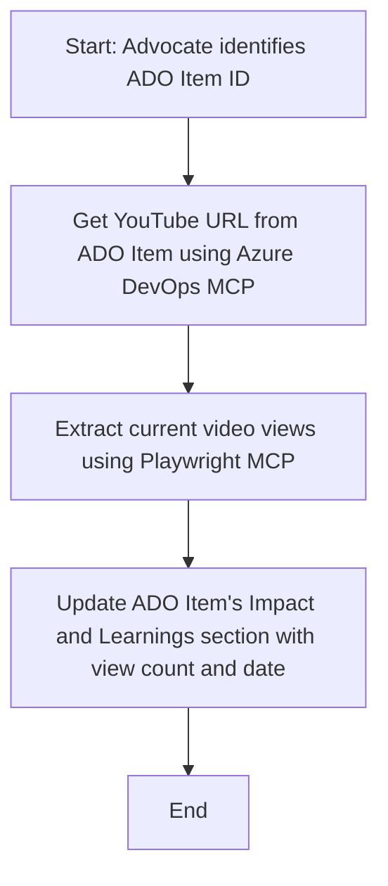

<!--
CO_OP_TRANSLATOR_METADATA:
{
  "original_hash": "14a2dfbea55ef735660a06bd6bdfe5f3",
  "translation_date": "2025-07-14T06:16:14+00:00",
  "source_file": "09-CaseStudy/UpdateADOItemsFromYT.md",
  "language_code": "sl"
}
-->
# Študija primera: Posodabljanje elementov Azure DevOps z YouTube podatki z MCP

> **Opozorilo:** Obstajajo že obstoječa spletna orodja in poročila, ki lahko avtomatizirajo postopek posodabljanja elementov Azure DevOps z podatki s platform, kot je YouTube. Naslednji primer je podan zgolj kot vzorčni primer uporabe, ki prikazuje, kako se orodja MCP lahko uporabijo za avtomatizacijo in integracijske naloge.

## Pregled

Ta študija primera prikazuje en primer, kako se lahko Model Context Protocol (MCP) in njegova orodja uporabijo za avtomatizacijo postopka posodabljanja delovnih elementov Azure DevOps (ADO) z informacijami, pridobljenimi s spletnih platform, kot je YouTube. Opisani scenarij je le ena izmed mnogih možnosti uporabe teh orodij, ki jih je mogoče prilagoditi številnim podobnim potrebam avtomatizacije.

V tem primeru Advocate spremlja spletne seje z uporabo ADO elementov, kjer vsak element vsebuje URL YouTube videa. Z uporabo orodij MCP lahko Advocate posodablja ADO elemente z najnovejšimi podatki o videu, kot so število ogledov, na ponovljiv in avtomatiziran način. Ta pristop je mogoče posplošiti na druge primere, kjer je treba informacije s spletnih virov integrirati v ADO ali druge sisteme.

## Scenarij

Advocate je odgovoren za spremljanje vpliva spletnih sej in sodelovanja skupnosti. Vsaka seja je zabeležena kot delovni element ADO v projektu 'DevRel', delovni element pa vsebuje polje za URL YouTube videa. Za natančno poročanje o dosegu seje mora Advocate posodobiti ADO element s trenutnim številom ogledov videa in datumom, ko so bili ti podatki pridobljeni.

## Uporabljena orodja

- [Azure DevOps MCP](https://github.com/microsoft/azure-devops-mcp): Omogoča programatičen dostop in posodobitve delovnih elementov ADO preko MCP.
- [Playwright MCP](https://github.com/microsoft/playwright-mcp): Avtomatizira brskalniške akcije za pridobivanje živih podatkov s spletnih strani, kot so statistike YouTube videov.

## Korak za korakom potek dela

1. **Identificirajte ADO element**: Začnite z ID delovnega elementa ADO (npr. 1234) v projektu 'DevRel'.
2. **Pridobite YouTube URL**: Uporabite orodje Azure DevOps MCP za pridobitev YouTube URL iz delovnega elementa.
3. **Pridobite število ogledov videa**: Uporabite orodje Playwright MCP za navigacijo do YouTube URL in pridobitev trenutnega števila ogledov.
4. **Posodobite ADO element**: Zapišite najnovejše število ogledov in datum pridobitve v razdelek 'Impact and Learnings' delovnega elementa ADO z uporabo orodja Azure DevOps MCP.

## Primer poziva

```bash
- Work with the ADO Item ID: 1234
- The project is '2025-Awesome'
- Get the YouTube URL for the ADO item
- Use Playwright to get the current views from the YouTube video
- Update the ADO item with the current video views and the updated date of the information
```

## Mermaid diagram poteka



## Tehnična izvedba

- **MCP orkestracija**: Potek dela usklajuje MCP strežnik, ki koordinira uporabo orodij Azure DevOps MCP in Playwright MCP.
- **Avtomatizacija**: Postopek je mogoče sprožiti ročno ali pa ga načrtovati za redno izvajanje, da so ADO elementi vedno posodobljeni.
- **Razširljivost**: Enak vzorec je mogoče razširiti za posodabljanje ADO elementov z drugimi spletnimi metričnimi podatki (npr. všečki, komentarji) ali s podatki z drugih platform.

## Rezultati in vpliv

- **Učinkovitost**: Zmanjšuje ročno delo Advocate-ov z avtomatizacijo pridobivanja in posodabljanja podatkov o videih.
- **Natančnost**: Zagotavlja, da ADO elementi odražajo najnovejše razpoložljive podatke s spletnih virov.
- **Ponovljivost**: Omogoča ponovno uporabo poteka dela za podobne scenarije z drugimi viri podatkov ali metričnimi podatki.

## Viri

- [Azure DevOps MCP](https://github.com/microsoft/azure-devops-mcp)
- [Playwright MCP](https://github.com/microsoft/playwright-mcp)
- [Model Context Protocol (MCP)](https://modelcontextprotocol.io/)

**Omejitev odgovornosti**:  
Ta dokument je bil preveden z uporabo AI prevajalske storitve [Co-op Translator](https://github.com/Azure/co-op-translator). Čeprav si prizadevamo za natančnost, vas opozarjamo, da avtomatizirani prevodi lahko vsebujejo napake ali netočnosti. Izvirni dokument v njegovem izvirnem jeziku velja za avtoritativni vir. Za ključne informacije priporočamo strokovni človeški prevod. Za morebitna nesporazume ali napačne interpretacije, ki izhajajo iz uporabe tega prevoda, ne odgovarjamo.