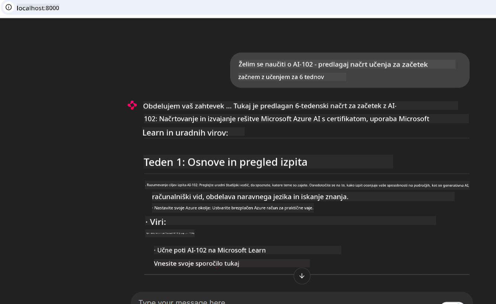
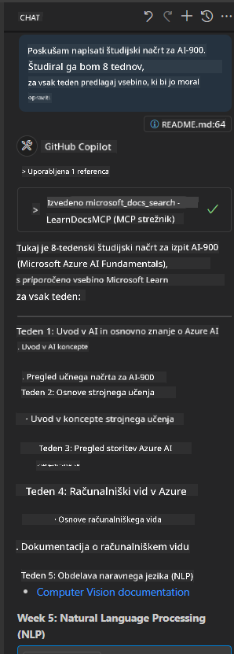

<!--
CO_OP_TRANSLATOR_METADATA:
{
  "original_hash": "4319d291c9d124ecafea52b3d04bfa0e",
  "translation_date": "2025-07-14T06:30:38+00:00",
  "source_file": "09-CaseStudy/docs-mcp/README.md",
  "language_code": "sl"
}
-->
# Študija primera: Povezava s strežnikom Microsoft Learn Docs MCP iz odjemalca

Ste se kdaj znašli v situaciji, ko preklapljate med spletnimi stranmi z dokumentacijo, Stack Overflow in neskončnimi zavihki iskalnikov, medtem ko poskušate rešiti težavo v svoji kodi? Morda imate drugi zaslon samo za dokumentacijo ali pa ves čas preklapljate med IDE-jem in brskalnikom. Bi bilo ne boljše, če bi lahko dokumentacijo pripeljali neposredno v svoj delovni proces — integrirano v vaše aplikacije, IDE ali celo lastna orodja? V tej študiji primera bomo raziskali, kako to storiti tako, da se neposredno povežete s strežnikom Microsoft Learn Docs MCP iz svoje odjemalske aplikacije.

## Pregled

Sodobni razvoj ni le pisanje kode — gre za iskanje pravih informacij ob pravem času. Dokumentacija je povsod, a redko tam, kjer jo najbolj potrebujete: znotraj vaših orodij in delovnih tokov. Z integracijo pridobivanja dokumentacije neposredno v vaše aplikacije lahko prihranite čas, zmanjšate preklapljanje med konteksti in povečate produktivnost. V tem razdelku vam bomo pokazali, kako povezati odjemalca s strežnikom Microsoft Learn Docs MCP, da boste lahko dostopali do dokumentacije v realnem času, prilagojene kontekstu, brez da bi zapustili svojo aplikacijo.

Vodili vas bomo skozi postopek vzpostavitve povezave, pošiljanja zahtevka in učinkovitega upravljanja s pretočnimi odgovori. Ta pristop ne le poenostavi vaš delovni proces, ampak odpira vrata za gradnjo pametnejših in bolj uporabnih orodij za razvijalce.

## Cilji učenja

Zakaj to počnemo? Ker so najboljše izkušnje za razvijalce tiste, ki odpravijo ovire. Predstavljajte si svet, kjer vaš urejevalnik kode, klepetalni robot ali spletna aplikacija takoj odgovori na vaša vprašanja o dokumentaciji, z uporabo najnovejših vsebin iz Microsoft Learn. Ob koncu tega poglavja boste znali:

- Razumeti osnove komunikacije med MCP strežnikom in odjemalcem za dokumentacijo
- Implementirati konzolno ali spletno aplikacijo za povezavo s strežnikom Microsoft Learn Docs MCP
- Uporabiti pretočne HTTP odjemalce za pridobivanje dokumentacije v realnem času
- Beležiti in interpretirati odgovore dokumentacije v vaši aplikaciji

Videli boste, kako vam te veščine pomagajo graditi orodja, ki niso le reaktivna, ampak resnično interaktivna in prilagojena kontekstu.

## Scenarij 1 - Pridobivanje dokumentacije v realnem času z MCP

V tem scenariju vam bomo pokazali, kako povezati odjemalca s strežnikom Microsoft Learn Docs MCP, da boste lahko dostopali do dokumentacije v realnem času, prilagojene kontekstu, brez da bi zapustili svojo aplikacijo.

Pojdimo v prakso. Vaša naloga je napisati aplikacijo, ki se poveže s strežnikom Microsoft Learn Docs MCP, pokliče orodje `microsoft_docs_search` in zabeleži pretočni odgovor v konzolo.

### Zakaj ta pristop?
Ker je to osnova za gradnjo bolj naprednih integracij — ne glede na to, ali želite poganjati klepetalnega robota, razširitev IDE ali spletno nadzorno ploščo.

Kodo in navodila za ta scenarij boste našli v mapi [`solution`](./solution/README.md) znotraj te študije primera. Koraki vas bodo vodili skozi vzpostavitev povezave:
- Uporabite uradni MCP SDK in pretočnega HTTP odjemalca za povezavo
- Pokličite orodje `microsoft_docs_search` z iskalnim parametrom za pridobitev dokumentacije
- Implementirajte ustrezno beleženje in obravnavo napak
- Ustvarite interaktivni konzolni vmesnik, ki uporabnikom omogoča vnos več iskalnih poizvedb

Ta scenarij prikazuje, kako:
- Povezati se s strežnikom Docs MCP
- Poslati poizvedbo
- Razčleniti in izpisati rezultate

Tako bi lahko izgledalo izvajanje rešitve:

```
Prompt> What is Azure Key Vault?
Answer> Azure Key Vault is a cloud service for securely storing and accessing secrets. ...
```

Spodaj je minimalen primer rešitve. Celotna koda in podrobnosti so na voljo v mapi rešitve.

<details>
<summary>Python</summary>

```python
import asyncio
from mcp.client.streamable_http import streamablehttp_client
from mcp import ClientSession

async def main():
    async with streamablehttp_client("https://learn.microsoft.com/api/mcp") as (read_stream, write_stream, _):
        async with ClientSession(read_stream, write_stream) as session:
            await session.initialize()
            result = await session.call_tool("microsoft_docs_search", {"query": "Azure Functions best practices"})
            print(result.content)

if __name__ == "__main__":
    asyncio.run(main())
```

- Za popolno implementacijo in beleženje glejte [`scenario1.py`](../../../../09-CaseStudy/docs-mcp/solution/python/scenario1.py).
- Za navodila za namestitev in uporabo glejte datoteko [`README.md`](./solution/python/README.md) v isti mapi.
</details>

## Scenarij 2 - Interaktivna spletna aplikacija za ustvarjanje študijskega načrta z MCP

V tem scenariju se boste naučili, kako integrirati Docs MCP v spletni razvojni projekt. Cilj je omogočiti uporabnikom iskanje dokumentacije Microsoft Learn neposredno iz spletnega vmesnika, s čimer bo dokumentacija takoj dostopna znotraj vaše aplikacije ali spletne strani.

Videli boste, kako:
- Nastaviti spletno aplikacijo
- Povezati se s strežnikom Docs MCP
- Obravnavati uporabniški vnos in prikazati rezultate

Tako bi lahko izgledalo izvajanje rešitve:

```
User> I want to learn about AI102 - so suggest the roadmap to get it started from learn for 6 weeks

Assistant> Here’s a detailed 6-week roadmap to start your preparation for the AI-102: Designing and Implementing a Microsoft Azure AI Solution certification, using official Microsoft resources and focusing on exam skills areas:

---
## Week 1: Introduction & Fundamentals
- **Understand the Exam**: Review the [AI-102 exam skills outline](https://learn.microsoft.com/en-us/credentials/certifications/exams/ai-102/).
- **Set up Azure**: Sign up for a free Azure account if you don't have one.
- **Learning Path**: [Introduction to Azure AI services](https://learn.microsoft.com/en-us/training/modules/intro-to-azure-ai/)
- **Focus**: Get familiar with Azure portal, AI capabilities, and necessary tools.

....more weeks of the roadmap...

Let me know if you want module-specific recommendations or need more customized weekly tasks!
```

Spodaj je minimalen primer rešitve. Celotna koda in podrobnosti so na voljo v mapi rešitve.



<details>
<summary>Python (Chainlit)</summary>

Chainlit je ogrodje za gradnjo pogovornih AI spletnih aplikacij. Omogoča enostavno ustvarjanje interaktivnih klepetalnih robotov in asistentov, ki lahko kličejo MCP orodja in v realnem času prikazujejo rezultate. Idealno je za hitro prototipiranje in uporabniku prijazne vmesnike.

```python
import chainlit as cl
import requests

MCP_URL = "https://learn.microsoft.com/api/mcp"

@cl.on_message
def handle_message(message):
    query = {"question": message}
    response = requests.post(MCP_URL, json=query)
    if response.ok:
        result = response.json()
        cl.Message(content=result.get("answer", "No answer found.")).send()
    else:
        cl.Message(content="Error: " + response.text).send()
```

- Za popolno implementacijo glejte [`scenario2.py`](../../../../09-CaseStudy/docs-mcp/solution/python/scenario2.py).
- Za navodila za namestitev in zagon glejte [`README.md`](./solution/python/README.md).
</details>

## Scenarij 3: Dokumentacija v urejevalniku z MCP strežnikom v VS Code

Če želite Microsoft Learn Docs neposredno v VS Code (namesto preklapljanja med zavihki brskalnika), lahko uporabite MCP strežnik v svojem urejevalniku. To vam omogoča:
- Iskanje in branje dokumentacije v VS Code brez zapuščanja razvojnega okolja.
- Navedbo dokumentacije in vstavljanje povezav neposredno v vaše README ali učne datoteke.
- Uporabo GitHub Copilot in MCP skupaj za nemoten, AI-podprt delovni proces z dokumentacijo.

**Videli boste, kako:**
- Dodati veljavno datoteko `.vscode/mcp.json` v koren vaše delovne mape (primer spodaj).
- Odpreti MCP ploščo ali uporabiti ukazno paleto v VS Code za iskanje in vstavljanje dokumentacije.
- Navedbo dokumentacije neposredno v vaših markdown datotekah med delom.
- Združiti ta delovni proces z GitHub Copilot za še večjo produktivnost.

Tukaj je primer, kako nastaviti MCP strežnik v VS Code:

```json
{
  "servers": {
    "LearnDocsMCP": {
      "url": "https://learn.microsoft.com/api/mcp"
    }
  }
}
```

</details>

> Za podroben vodič s posnetki zaslona in korak za korakom navodili glejte [`README.md`](./solution/scenario3/README.md).



Ta pristop je idealen za vse, ki gradijo tehnične tečaje, pišejo dokumentacijo ali razvijajo kodo z rednimi potrebami po referencah.

## Ključne ugotovitve

Integracija dokumentacije neposredno v vaša orodja ni le priročnost — je prelomnica za produktivnost. Z povezavo s strežnikom Microsoft Learn Docs MCP iz vašega odjemalca lahko:

- Odpravite preklapljanje med kodo in dokumentacijo
- Pridobite ažurno, kontekstno prilagojeno dokumentacijo v realnem času
- Gradite pametnejša, bolj interaktivna orodja za razvijalce

Te veščine vam bodo pomagale ustvariti rešitve, ki niso le učinkovite, ampak tudi prijetne za uporabo.

## Dodatni viri

Za poglobljeno razumevanje si oglejte te uradne vire:

- [Microsoft Learn Docs MCP Server (GitHub)](https://github.com/MicrosoftDocs/mcp)
- [Začetek z Azure MCP Server (mcp-python)](https://learn.microsoft.com/en-us/azure/developer/azure-mcp-server/get-started#create-the-python-app)
- [Kaj je Azure MCP Server?](https://learn.microsoft.com/en-us/azure/developer/azure-mcp-server/)
- [Uvod v Model Context Protocol (MCP)](https://modelcontextprotocol.io/introduction)
- [Dodajanje vtičnikov iz MCP strežnika (Python)](https://learn.microsoft.com/en-us/semantic-kernel/concepts/plugins/adding-mcp-plugins)

**Omejitev odgovornosti**:  
Ta dokument je bil preveden z uporabo storitve za avtomatski prevod AI [Co-op Translator](https://github.com/Azure/co-op-translator). Čeprav si prizadevamo za natančnost, vas opozarjamo, da lahko avtomatizirani prevodi vsebujejo napake ali netočnosti. Izvirni dokument v njegovem izvirnem jeziku velja za avtoritativni vir. Za pomembne informacije priporočamo strokovni človeški prevod. Za morebitna nesporazume ali napačne interpretacije, ki izhajajo iz uporabe tega prevoda, ne odgovarjamo.