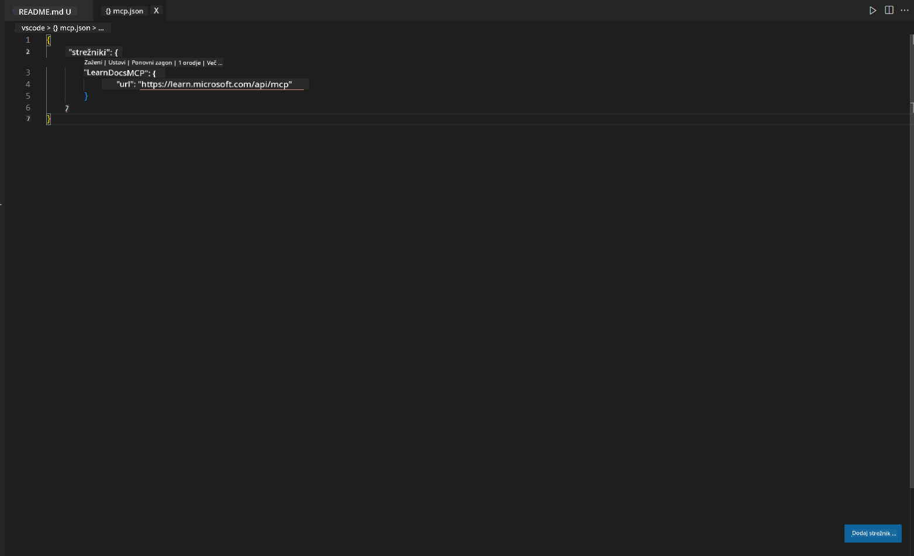
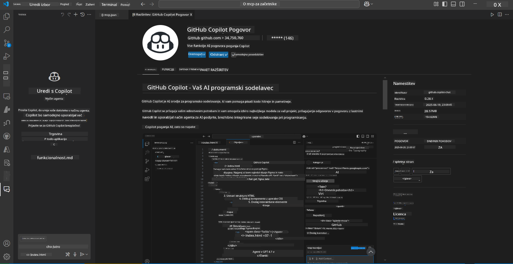
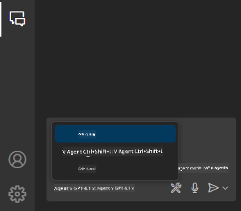
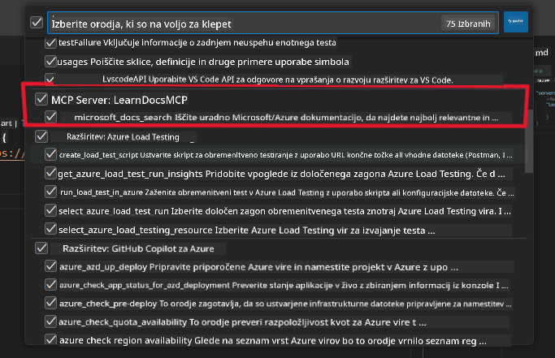
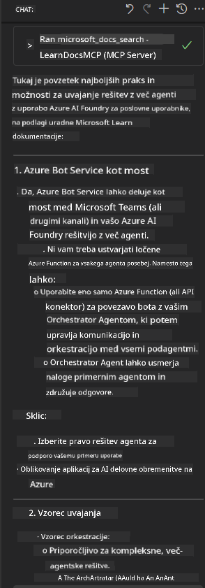

<!--
CO_OP_TRANSLATOR_METADATA:
{
  "original_hash": "db532b1ec386c9ce38c791653dc3c881",
  "translation_date": "2025-07-14T06:56:59+00:00",
  "source_file": "09-CaseStudy/docs-mcp/solution/scenario3/README.md",
  "language_code": "sl"
}
-->
# Scenarij 3: Dokumentacija v urejevalniku z MCP strežnikom v VS Code

## Pregled

V tem scenariju se boste naučili, kako neposredno v okolje Visual Studio Code vključiti Microsoft Learn Docs z uporabo MCP strežnika. Namesto da bi nenehno preklapljali med zavihki brskalnika za iskanje dokumentacije, lahko uradno dokumentacijo dostopate, iščete in navajate kar znotraj urejevalnika. Ta pristop poenostavi vaš delovni proces, ohranja osredotočenost in omogoča nemoteno integracijo z orodji, kot je GitHub Copilot.

- Iskanje in branje dokumentacije znotraj VS Code brez zapuščanja razvojnega okolja.
- Navajanje dokumentacije in vstavljanje povezav neposredno v vaše README ali datoteke tečajev.
- Uporaba GitHub Copilota in MCP skupaj za tekoč, z AI podprt delovni proces dokumentacije.

## Cilji učenja

Do konca tega poglavja boste razumeli, kako nastaviti in uporabljati MCP strežnik znotraj VS Code za izboljšanje dokumentacije in razvojnega procesa. Naučili se boste:

- Konfigurirati delovno okolje za uporabo MCP strežnika pri iskanju dokumentacije.
- Iskati in vstavljati dokumentacijo neposredno iz VS Code.
- Združiti moč GitHub Copilota in MCP za bolj produktiven, z AI podprt delovni proces.

Te veščine vam bodo pomagale ohraniti osredotočenost, izboljšati kakovost dokumentacije in povečati produktivnost kot razvijalec ali tehnični pisec.

## Rešitev

Za dostop do dokumentacije neposredno v urejevalniku boste sledili nizu korakov, ki integrirajo MCP strežnik z VS Code in GitHub Copilotom. Ta rešitev je idealna za avtorje tečajev, pisce dokumentacije in razvijalce, ki želijo ohraniti osredotočenost v urejevalniku med delom z dokumentacijo in Copilotom.

- Hitro dodajte referenčne povezave v README med pisanjem tečaja ali projektne dokumentacije.
- Uporabite Copilot za generiranje kode in MCP za takojšnje iskanje ter navajanje ustrezne dokumentacije.
- Ostanite osredotočeni v urejevalniku in povečajte produktivnost.

### Korak za korakom

Za začetek sledite tem korakom. Za vsak korak lahko dodate posnetek zaslona iz mape z viri, da vizualno prikažete postopek.

1. **Dodajte MCP konfiguracijo:**
   V korenski mapi projekta ustvarite datoteko `.vscode/mcp.json` in dodajte naslednjo konfiguracijo:
   ```json
   {
     "servers": {
       "LearnDocsMCP": {
         "url": "https://learn.microsoft.com/api/mcp"
       }
     }
   }
   ```
   Ta konfiguracija pove VS Code, kako se povezati z [`Microsoft Learn Docs MCP strežnikom`](https://github.com/MicrosoftDocs/mcp).
   
   
    
2. **Odprite panel GitHub Copilot Chat:**
   Če še nimate nameščene razširitve GitHub Copilot, pojdite v pogled Extensions v VS Code in jo namestite. Lahko jo prenesete neposredno iz [Visual Studio Code Marketplace](https://marketplace.visualstudio.com/items?itemName=GitHub.copilot-chat). Nato odprite panel Copilot Chat iz stranske vrstice.

   

3. **Omogočite agent mode in preverite orodja:**
   V panelu Copilot Chat omogočite agent mode.

   

   Po omogočitvi agent mode preverite, ali je MCP strežnik naveden med razpoložljivimi orodji. To zagotavlja, da lahko Copilot agent dostopa do strežnika dokumentacije in pridobiva relevantne informacije.
   
   
4. **Začnite nov pogovor in spodbudite agenta:**
   Odprite nov pogovor v panelu Copilot Chat. Zdaj lahko agenta vprašate za dokumentacijske informacije. Agent bo uporabil MCP strežnik za pridobivanje in prikaz ustrezne Microsoft Learn dokumentacije neposredno v vašem urejevalniku.

   - *"Poskušam napisati študijski načrt za temo X. Študiral jo bom 8 tednov, za vsak teden predlagaj vsebino, ki bi jo moral obravnavati."*

   

5. **Živo poizvedovanje:**

   > Vzemimo primer žive poizvedbe iz razdelka [#get-help](https://discord.gg/D6cRhjHWSC) na Azure AI Foundry Discordu ([ogled izvirnega sporočila](https://discord.com/channels/1113626258182504448/1385498306720829572)):
   
   *"Iščem odgovore, kako implementirati rešitev z več agenti, kjer so AI agenti razviti na Azure AI Foundry. Vidim, da ni neposredne metode za implementacijo, kot so kanali Copilot Studio. Katere so različne možnosti za implementacijo, da lahko uporabniki v podjetju sodelujejo in opravijo delo?
Obstaja veliko člankov/blogov, ki pravijo, da lahko uporabimo Azure Bot service kot most med MS Teams in Azure AI Foundry agenti. Ali bo to delovalo, če nastavim Azure bota, ki se poveže z Orchestrator agentom na Azure AI Foundry preko Azure funkcije za orkestracijo, ali moram ustvariti Azure funkcijo za vsakega AI agenta v rešitvi z več agenti, da opravim orkestracijo v Bot frameworku? Vsak drug predlog je dobrodošel."*

   

   Agent bo odgovoril z ustreznimi povezavami do dokumentacije in povzetki, ki jih lahko nato neposredno vstavite v svoje markdown datoteke ali uporabite kot reference v kodi.
   
### Primeri poizvedb

Tukaj je nekaj primerov poizvedb, ki jih lahko preizkusite. Te poizvedbe bodo pokazale, kako MCP strežnik in Copilot skupaj omogočata takojšnjo, kontekstualno dokumentacijo in reference brez zapuščanja VS Code:

- "Pokaži mi, kako uporabljati sprožilce Azure Functions."
- "Vstavi povezavo do uradne dokumentacije za Azure Key Vault."
- "Kakšne so najboljše prakse za varovanje Azure virov?"
- "Najdi hitri začetek za Azure AI storitve."

Te poizvedbe bodo pokazale, kako MCP strežnik in Copilot skupaj omogočata takojšnjo, kontekstualno dokumentacijo in reference brez zapuščanja VS Code.

---

**Omejitev odgovornosti**:  
Ta dokument je bil preveden z uporabo storitve za avtomatski prevod AI [Co-op Translator](https://github.com/Azure/co-op-translator). Čeprav si prizadevamo za natančnost, vas opozarjamo, da lahko avtomatizirani prevodi vsebujejo napake ali netočnosti. Izvirni dokument v njegovem izvirnem jeziku velja za avtoritativni vir. Za pomembne informacije priporočamo strokovni človeški prevod. Za morebitna nesporazume ali napačne interpretacije, ki izhajajo iz uporabe tega prevoda, ne odgovarjamo.