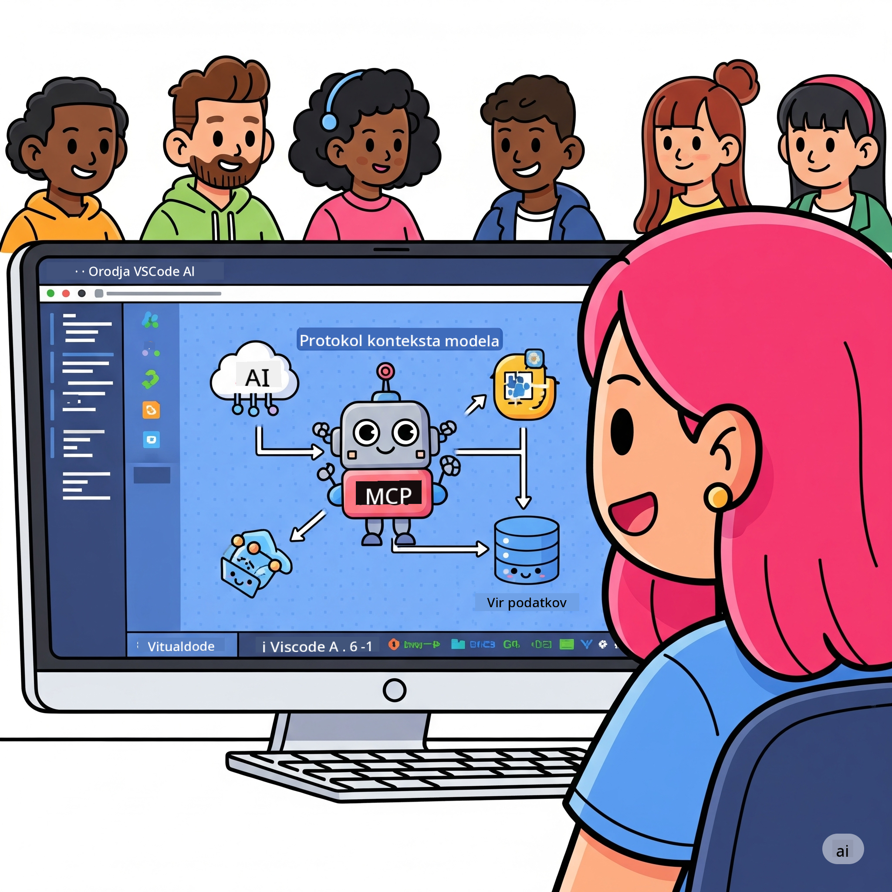
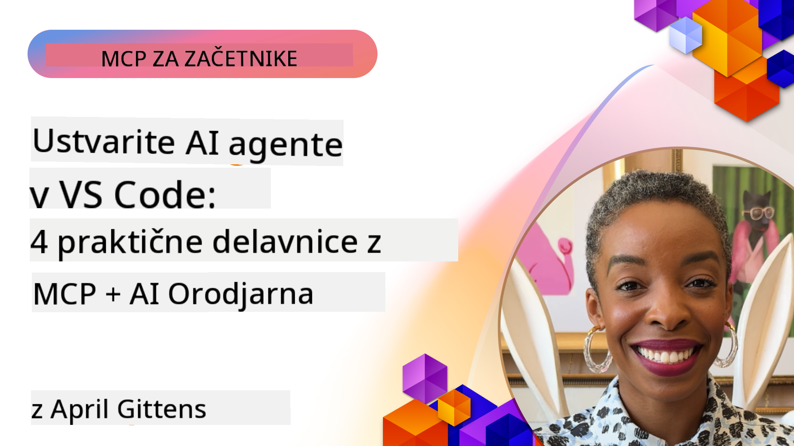

<!--
CO_OP_TRANSLATOR_METADATA:
{
  "original_hash": "1b000fd6e1b04c047578bfc5d07d54eb",
  "translation_date": "2025-08-19T18:26:12+00:00",
  "source_file": "10-StreamliningAIWorkflowsBuildingAnMCPServerWithAIToolkit/README.md",
  "language_code": "sl"
}
-->
# Poenostavitev AI delovnih tokov: Izdelava MCP strežnika z AI Toolkit

## 🎯 Pregled

_(Kliknite zgornjo sliko za ogled videa te lekcije)_

Dobrodošli na delavnici **Model Context Protocol (MCP)**! Ta celovita praktična delavnica združuje dve napredni tehnologiji za revolucijo v razvoju AI aplikacij:

- **🔗 Model Context Protocol (MCP)**: Odprti standard za brezhibno integracijo AI orodij
- **🛠️ AI Toolkit za Visual Studio Code (AITK)**: Microsoftov zmogljiv razširitveni modul za razvoj AI

### 🎓 Kaj se boste naučili

Do konca te delavnice boste obvladali umetnost gradnje inteligentnih aplikacij, ki povezujejo AI modele z orodji in storitvami iz resničnega sveta. Od avtomatiziranega testiranja do prilagojenih API integracij boste pridobili praktične veščine za reševanje zapletenih poslovnih izzivov.

## 🏗️ Tehnološki sklad

### 🔌 Model Context Protocol (MCP)

MCP je **"USB-C za AI"** - univerzalni standard, ki povezuje AI modele z zunanjimi orodji in viri podatkov.

**✨ Ključne značilnosti:**

- 🔄 **Standardizirana integracija**: Univerzalni vmesnik za povezovanje AI orodij
- 🏛️ **Prilagodljiva arhitektura**: Lokalni in oddaljeni strežniki prek stdio/SSE transporta
- 🧰 **Bogat ekosistem**: Orodja, pozivi in viri v enem protokolu
- 🔒 **Pripravljeno za podjetja**: Vgrajena varnost in zanesljivost

**🎯 Zakaj je MCP pomemben:**
Tako kot je USB-C odpravil zmedo s kabli, MCP odpravlja zapletenost AI integracij. En protokol, neskončne možnosti.

### 🤖 AI Toolkit za Visual Studio Code (AITK)

Microsoftov vodilni razširitveni modul za razvoj AI, ki VS Code spremeni v AI superorodje.

**🚀 Osnovne zmogljivosti:**

- 📦 **Katalog modelov**: Dostop do modelov iz Azure AI, GitHub, Hugging Face, Ollama
- ⚡ **Lokalna inferenca**: Optimizirano izvajanje ONNX na CPU/GPU/NPU
- 🏗️ **Graditelj agentov**: Vizualni razvoj AI agentov z integracijo MCP
- 🎭 **Večmodalnost**: Podpora za besedilo, vizijo in strukturirane izhode

**💡 Prednosti razvoja:**

- Namestitev modelov brez konfiguracije
- Vizualno oblikovanje pozivov
- Testno okolje v realnem času
- Brezhibna integracija MCP strežnika

## 📚 Učno potovanje

### [🚀 Modul 1: Osnove AI Toolkita](./lab1/README.md)

**Trajanje**: 15 minut

- 🛠️ Namestitev in konfiguracija AI Toolkita za VS Code
- 🗂️ Raziskovanje kataloga modelov (100+ modelov iz GitHub, ONNX, OpenAI, Anthropic, Google)
- 🎮 Obvladovanje interaktivnega testnega okolja za testiranje modelov v realnem času
- 🤖 Izdelava prvega AI agenta z Graditeljem agentov
- 📊 Vrednotenje zmogljivosti modelov z vgrajenimi metrikami (F1, relevantnost, podobnost, koherenca)
- ⚡ Učenje zmogljivosti za obdelavo v serijah in podporo večmodalnosti

**🎯 Rezultat učenja**: Ustvarite funkcionalnega AI agenta z obsežnim razumevanjem zmogljivosti AITK

### [🌐 Modul 2: MCP z osnovami AI Toolkita](./lab2/README.md)

**Trajanje**: 20 minut

- 🧠 Obvladovanje arhitekture in konceptov Model Context Protocol (MCP)
- 🌐 Raziskovanje Microsoftovega ekosistema MCP strežnikov
- 🤖 Izdelava agenta za avtomatizacijo brskalnika z uporabo Playwright MCP strežnika
- 🔧 Integracija MCP strežnikov z Graditeljem agentov AI Toolkita
- 📊 Konfiguracija in testiranje MCP orodij znotraj vaših agentov
- 🚀 Izvoz in uvajanje agentov, ki uporabljajo MCP, za produkcijsko uporabo

**🎯 Rezultat učenja**: Uvedite AI agenta, okrepljenega z zunanjimi orodji prek MCP

### [🔧 Modul 3: Napreden razvoj MCP z AI Toolkitom](./lab3/README.md)

**Trajanje**: 20 minut

- 💻 Ustvarjanje prilagojenih MCP strežnikov z AI Toolkitom
- 🐍 Konfiguracija in uporaba najnovejšega MCP Python SDK (v1.9.3)
- 🔍 Nastavitev in uporaba MCP Inspectorja za odpravljanje napak
- 🛠️ Izdelava vremenskega MCP strežnika z uporabo profesionalnih delovnih tokov za odpravljanje napak
- 🧪 Odpravljanje napak MCP strežnikov v okoljih Graditelja agentov in Inspectorja

**🎯 Rezultat učenja**: Razvijte in odpravljajte napake na prilagojenih MCP strežnikih z modernimi orodji

### [🐙 Modul 4: Praktični razvoj MCP - Prilagojen strežnik za kloniranje GitHub](./lab4/README.md)

**Trajanje**: 30 minut

- 🏗️ Izdelava realnega GitHub Clone MCP strežnika za razvojne delovne tokove
- 🔄 Implementacija pametnega kloniranja repozitorijev z validacijo in obravnavo napak
- 📁 Ustvarjanje inteligentnega upravljanja imenikov in integracije z VS Code
- 🤖 Uporaba GitHub Copilot Agent Mode z lastnimi MCP orodji
- 🛡️ Uporaba zanesljivosti, pripravljene za produkcijo, in združljivosti med platformami

**🎯 Rezultat učenja**: Uvedite produkcijsko pripravljen MCP strežnik, ki poenostavi razvojne delovne tokove

## 💡 Praktične aplikacije in vpliv

### 🏢 Uporaba v podjetjih

#### 🔄 Avtomatizacija DevOps

Preoblikujte svoj razvojni delovni tok z inteligentno avtomatizacijo:

- **Pametno upravljanje repozitorijev**: AI-podprto pregledovanje kode in odločitve o združevanju
- **Inteligentni CI/CD**: Avtomatizirana optimizacija cevovodov na podlagi sprememb kode
- **Razvrščanje težav**: Samodejna klasifikacija in dodelitev napak

#### 🧪 Revolucija zagotavljanja kakovosti

Izboljšajte testiranje z avtomatizacijo, podprto z AI:

- **Pametno generiranje testov**: Samodejno ustvarjanje obsežnih testnih nizov
- **Vizualno regresijsko testiranje**: AI-podprto zaznavanje sprememb v uporabniškem vmesniku
- **Spremljanje zmogljivosti**: Proaktivno prepoznavanje in reševanje težav

#### 📊 Inteligenca podatkovnih tokov

Zgradite pametnejše delovne tokove za obdelavo podatkov:

- **Prilagodljivi ETL procesi**: Samooptimizirajoče se transformacije podatkov
- **Zaznavanje anomalij**: Spremljanje kakovosti podatkov v realnem času
- **Pametno usmerjanje**: Inteligentno upravljanje podatkovnih tokov

#### 🎧 Izboljšanje uporabniške izkušnje

Ustvarite izjemne interakcije s strankami:

- **Podpora, prilagojena kontekstu**: AI agenti z dostopom do zgodovine strank
- **Proaktivno reševanje težav**: Prediktivna podpora strankam
- **Večkanalna integracija**: Enotna AI izkušnja na različnih platformah

## 🛠️ Predpogoji in nastavitev

### 💻 Sistemske zahteve

| Komponenta | Zahteva | Opombe |
|------------|---------|--------|
| **Operacijski sistem** | Windows 10+, macOS 10.15+, Linux | Katerikoli sodoben OS |
| **Visual Studio Code** | Najnovejša stabilna različica | Zahtevano za AITK |
| **Node.js** | v18.0+ in npm | Za razvoj MCP strežnikov |
| **Python** | 3.10+ | Opcijsko za Python MCP strežnike |
| **Pomnilnik** | Najmanj 8 GB RAM | Priporočeno 16 GB za lokalne modele |

### 🔧 Razvojno okolje

#### Priporočene razširitve za VS Code

- **AI Toolkit** (ms-windows-ai-studio.windows-ai-studio)
- **Python** (ms-python.python)
- **Python Debugger** (ms-python.debugpy)
- **GitHub Copilot** (GitHub.copilot) - Opcijsko, vendar koristno

#### Opcijska orodja

- **uv**: Sodobni upravitelj Python paketov
- **MCP Inspector**: Vizualno orodje za odpravljanje napak MCP strežnikov
- **Playwright**: Za primere spletne avtomatizacije

## 🎖️ Rezultati učenja in pot do certifikacije

### 🏆 Seznam obvladanih veščin

Z zaključkom te delavnice boste obvladali:

#### 🎯 Ključne kompetence

- [ ] **Obvladovanje MCP protokola**: Globoko razumevanje arhitekture in vzorcev implementacije
- [ ] **AITK strokovnost**: Ekspertna uporaba AI Toolkita za hiter razvoj
- [ ] **Razvoj prilagojenih strežnikov**: Gradnja, uvajanje in vzdrževanje produkcijskih MCP strežnikov
- [ ] **Odličnost v integraciji orodij**: Brezhibno povezovanje AI z obstoječimi delovnimi tokovi
- [ ] **Uporaba za reševanje problemov**: Uporaba pridobljenih veščin za resnične poslovne izzive

#### 🔧 Tehnične veščine

- [ ] Nastavitev in konfiguracija AI Toolkita v VS Code
- [ ] Oblikovanje in implementacija prilagojenih MCP strežnikov
- [ ] Integracija GitHub modelov z MCP arhitekturo
- [ ] Gradnja avtomatiziranih testnih delovnih tokov z Playwright
- [ ] Uvajanje AI agentov za produkcijsko uporabo
- [ ] Odpravljanje napak in optimizacija zmogljivosti MCP strežnikov

#### 🚀 Napredne zmogljivosti

- [ ] Arhitektura AI integracij na ravni podjetja
- [ ] Implementacija najboljših varnostnih praks za AI aplikacije
- [ ] Oblikovanje razširljivih arhitektur MCP strežnikov
- [ ] Ustvarjanje prilagojenih orodij za specifične domene
- [ ] Mentorstvo pri razvoju AI aplikacij

## 📖 Dodatni viri

- [MCP Specifikacija](https://modelcontextprotocol.io/docs)
- [AI Toolkit GitHub repozitorij](https://github.com/microsoft/vscode-ai-toolkit)
- [Zbirka vzorčnih MCP strežnikov](https://github.com/modelcontextprotocol/servers)
- [Vodnik za najboljše prakse](https://modelcontextprotocol.io/docs/best-practices)

---

**🚀 Pripravljeni na revolucijo v razvoju AI?**

Zgradimo prihodnost inteligentnih aplikacij skupaj z MCP in AI Toolkit!

**Omejitev odgovornosti**:  
Ta dokument je bil preveden z uporabo storitve AI za prevajanje [Co-op Translator](https://github.com/Azure/co-op-translator). Čeprav si prizadevamo za natančnost, vas prosimo, da upoštevate, da lahko avtomatizirani prevodi vsebujejo napake ali netočnosti. Izvirni dokument v njegovem izvirnem jeziku je treba obravnavati kot avtoritativni vir. Za ključne informacije priporočamo profesionalni človeški prevod. Ne prevzemamo odgovornosti za morebitna nesporazumevanja ali napačne razlage, ki bi nastale zaradi uporabe tega prevoda.