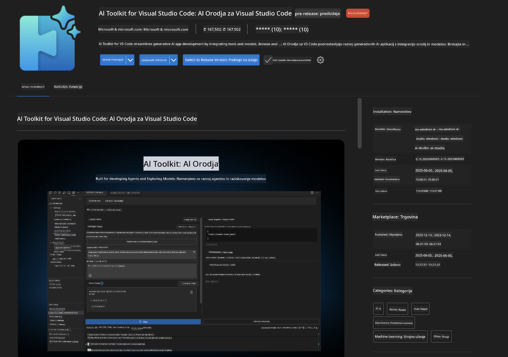
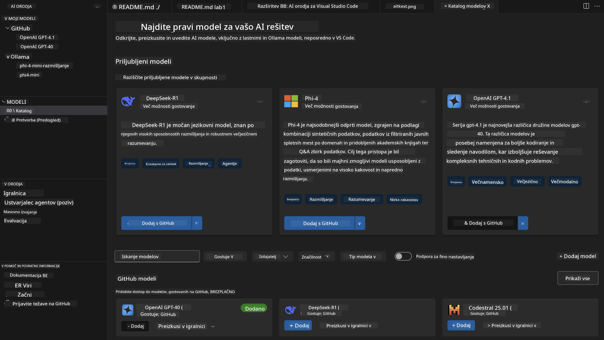
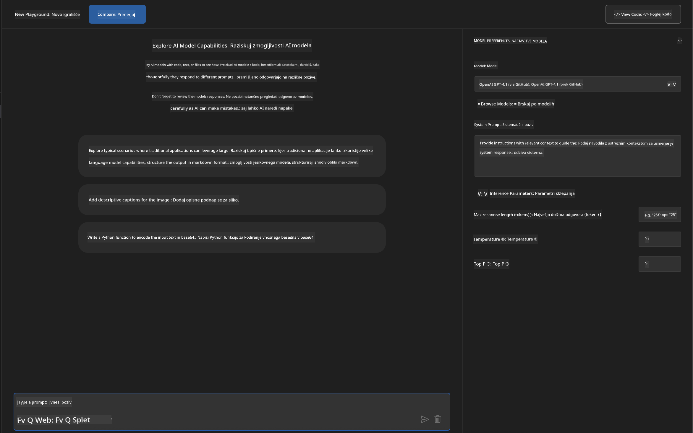
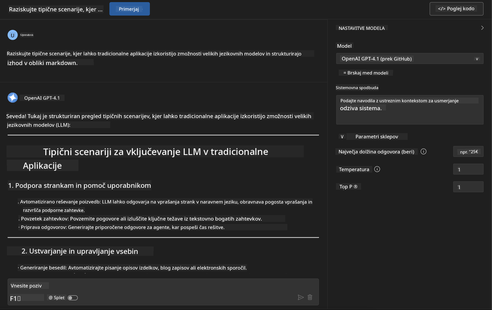
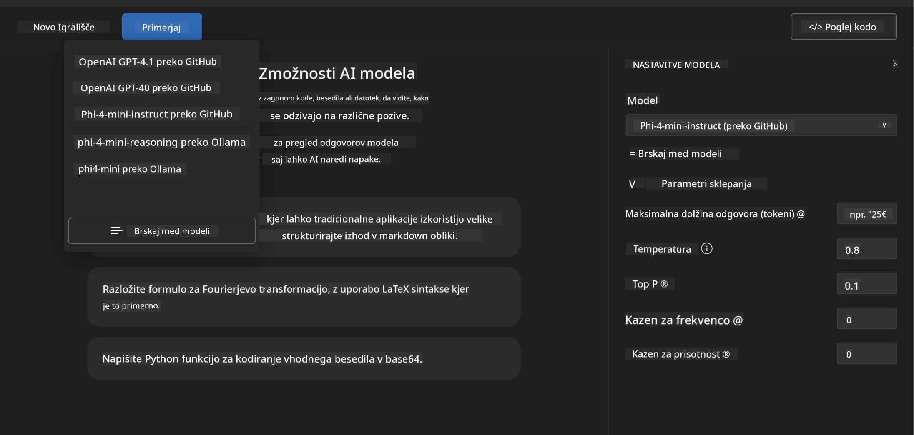
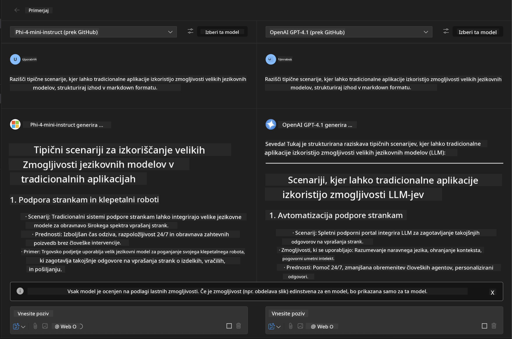
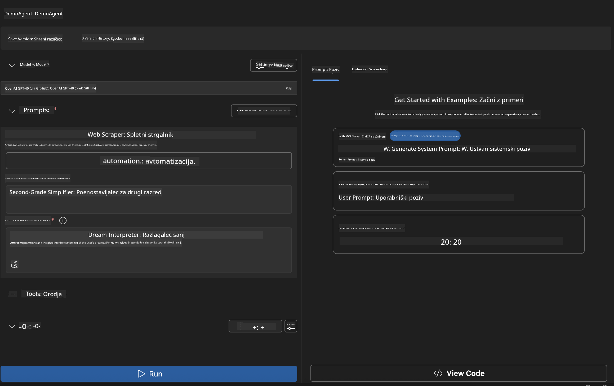
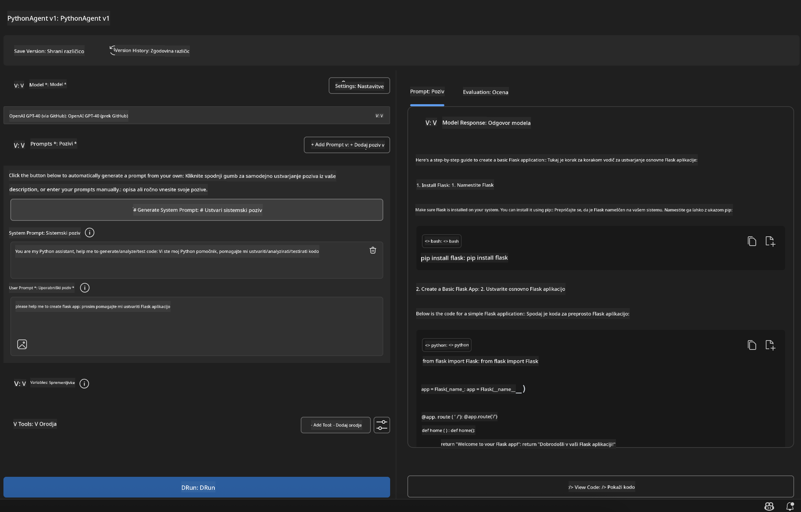

<!--
CO_OP_TRANSLATOR_METADATA:
{
  "original_hash": "2aa9dbc165e104764fa57e8a0d3f1c73",
  "translation_date": "2025-07-14T07:36:25+00:00",
  "source_file": "10-StreamliningAIWorkflowsBuildingAnMCPServerWithAIToolkit/lab1/README.md",
  "language_code": "sl"
}
-->
# 🚀 Modul 1: Osnove AI Toolkit

[]()
[]()
[]()

## 📋 Cilji učenja

Ob koncu tega modula boste znali:
- ✅ Namestiti in konfigurirati AI Toolkit za Visual Studio Code
- ✅ Krmariti po Katalogu modelov in razumeti različne vire modelov
- ✅ Uporabiti Playground za testiranje in eksperimentiranje z modeli
- ✅ Ustvariti prilagojene AI agente z Agent Builderjem
- ✅ Primerjati zmogljivost modelov različnih ponudnikov
- ✅ Uporabiti najboljše prakse za oblikovanje pozivov (prompt engineering)

## 🧠 Uvod v AI Toolkit (AITK)

**AI Toolkit za Visual Studio Code** je Microsoftova vodilna razširitev, ki VS Code spremeni v celovito razvojno okolje za AI. Povezuje raziskave na področju AI z uporabo v praksi in omogoča dostop do generativne AI razvijalcem vseh stopenj znanja.

### 🌟 Ključne zmogljivosti

| Funkcija | Opis | Primer uporabe |
|---------|-------------|----------|
| **🗂️ Katalog modelov** | Dostop do več kot 100 modelov z GitHub, ONNX, OpenAI, Anthropic, Google | Odkritje in izbira modelov |
| **🔌 Podpora BYOM** | Integracija lastnih modelov (lokalno/oddaljeno) | Namestitev prilagojenih modelov |
| **🎮 Interaktivni Playground** | Testiranje modelov v realnem času s klepetalnim vmesnikom | Hitro prototipiranje in testiranje |
| **📎 Podpora več modalitet** | Obdelava besedila, slik in priponk | Kompleksne AI aplikacije |
| **⚡ Serijsko procesiranje** | Hkratno izvajanje več pozivov | Učinkoviti testni poteki |
| **📊 Ocena modelov** | Vgrajene metrike (F1, relevantnost, podobnost, koherenca) | Ocena zmogljivosti |

### 🎯 Zakaj je AI Toolkit pomemben

- **🚀 Pospešen razvoj**: Od ideje do prototipa v nekaj minutah
- **🔄 Enoten potek dela**: En vmesnik za več AI ponudnikov
- **🧪 Enostavno eksperimentiranje**: Primerjajte modele brez zapletene nastavitve
- **📈 Pripravljen za produkcijo**: Gladek prehod od prototipa do uvedbe

## 🛠️ Zahteve in namestitev

### 📦 Namestitev razširitve AI Toolkit

**Korak 1: Odprite tržnico razširitev**
1. Zaženite Visual Studio Code
2. Odprite pogled Razširitve (`Ctrl+Shift+X` ali `Cmd+Shift+X`)
3. Poiščite "AI Toolkit"

**Korak 2: Izberite svojo različico**
- **🟢 Release**: Priporočeno za produkcijsko uporabo
- **🔶 Pre-release**: Zgodnji dostop do najnovejših funkcij

**Korak 3: Namestite in aktivirajte**



### ✅ Kontrolni seznam preverjanja
- [ ] Ikona AI Toolkit se prikaže v stranski vrstici VS Code
- [ ] Razširitev je omogočena in aktivirana
- [ ] V izhodnem panelu ni napak pri namestitvi

## 🧪 Praktična vaja 1: Raziščite modele na GitHubu

**🎯 Cilj**: Obvladati Katalog modelov in preizkusiti svoj prvi AI model

### 📊 Korak 1: Krmarjenje po Katalogu modelov

Katalog modelov je vaš vhod v AI ekosistem. Združuje modele iz različnih virov, kar omogoča enostavno odkrivanje in primerjavo.

**🔍 Navodila za krmarjenje:**

Kliknite na **MODELS - Catalog** v stranski vrstici AI Toolkit



**💡 Nasvet**: Poiščite modele s specifičnimi zmogljivostmi, ki ustrezajo vašim potrebam (npr. generiranje kode, ustvarjalno pisanje, analiza).

**⚠️ Opomba**: Modeli, gostovani na GitHubu (GitHub Models), so brezplačni za uporabo, vendar imajo omejitve glede števila zahtevkov in tokenov. Če želite dostopati do modelov, ki niso na GitHubu (npr. modeli, gostovani preko Azure AI ali drugih končnih točk), boste morali vnesti ustrezen API ključ ali avtentikacijo.

### 🚀 Korak 2: Dodajte in konfigurirajte svoj prvi model

**Strategija izbire modela:**
- **GPT-4.1**: Najboljši za kompleksno razmišljanje in analizo
- **Phi-4-mini**: Lahek in hiter za preproste naloge

**🔧 Postopek konfiguracije:**
1. Izberite **OpenAI GPT-4.1** iz kataloga
2. Kliknite **Add to My Models** - model se registrira za uporabo
3. Izberite **Try in Playground** za zagon testnega okolja
4. Počakajte na inicializacijo modela (prvič lahko traja nekaj trenutkov)



**⚙️ Razumevanje parametrov modela:**
- **Temperature**: Nadzoruje ustvarjalnost (0 = determinističen, 1 = ustvarjalen)
- **Max Tokens**: Največja dolžina odgovora
- **Top-p**: Nucleus sampling za raznolikost odgovorov

### 🎯 Korak 3: Obvladajte vmesnik Playground

Playground je vaše laboratorij za AI eksperimentiranje. Tako lahko izkoristite njegov potencial:

**🎨 Najboljše prakse za oblikovanje pozivov:**
1. **Bodite natančni**: Jasna in podrobna navodila prinesejo boljše rezultate
2. **Podajte kontekst**: Vključite relevantne informacije v ozadju
3. **Uporabite primere**: Pokažite modelu, kaj želite, s primeri
4. **Iterirajte**: Izboljšujte pozive na podlagi prvih rezultatov

**🧪 Testni scenariji:**
```markdown
# Example 1: Code Generation
"Write a Python function that calculates the factorial of a number using recursion. Include error handling and docstrings."

# Example 2: Creative Writing
"Write a professional email to a client explaining a project delay, maintaining a positive tone while being transparent about challenges."

# Example 3: Data Analysis
"Analyze this sales data and provide insights: [paste your data]. Focus on trends, anomalies, and actionable recommendations."
```



### 🏆 Izziv: Primerjava zmogljivosti modelov

**🎯 Cilj**: Primerjajte različne modele z enakimi pozivi, da spoznate njihove prednosti

**📋 Navodila:**
1. Dodajte **Phi-4-mini** v svoje delovno okolje
2. Uporabite isti poziv za GPT-4.1 in Phi-4-mini



3. Primerjajte kakovost, hitrost in natančnost odgovorov
4. Zabeležite ugotovitve v razdelek z rezultati



**💡 Ključne ugotovitve:**
- Kdaj uporabiti LLM proti SLM
- Razmerje med stroški in zmogljivostjo
- Specializirane zmogljivosti različnih modelov

## 🤖 Praktična vaja 2: Ustvarjanje prilagojenih agentov z Agent Builderjem

**🎯 Cilj**: Ustvariti specializirane AI agente za določene naloge in poteke dela

### 🏗️ Korak 1: Spoznajte Agent Builder

Agent Builder je srce AI Toolkit-a. Omogoča ustvarjanje namensko zgrajenih AI pomočnikov, ki združujejo moč velikih jezikovnih modelov s prilagojenimi navodili, specifičnimi parametri in specializiranim znanjem.

**🧠 Komponente arhitekture agenta:**
- **Osnovni model**: Temeljni LLM (GPT-4, Groks, Phi itd.)
- **Sistemski poziv**: Določa osebnost in vedenje agenta
- **Parametri**: Nastavitve za optimalno delovanje
- **Integracija orodij**: Povezava z zunanjimi API-ji in MCP storitvami
- **Pomnilnik**: Kontekst pogovora in trajnost seje



### ⚙️ Korak 2: Podrobna konfiguracija agenta

**🎨 Ustvarjanje učinkovitih sistemskih pozivov:**
```markdown
# Template Structure:
## Role Definition
You are a [specific role] with expertise in [domain].

## Capabilities
- List specific abilities
- Define scope of knowledge
- Clarify limitations

## Behavior Guidelines
- Response style (formal, casual, technical)
- Output format preferences
- Error handling approach

## Examples
Provide 2-3 examples of ideal interactions
```

*Seveda lahko uporabite tudi Generate System Prompt, da vam AI pomaga ustvariti in optimizirati pozive*

**🔧 Optimizacija parametrov:**
| Parameter | Priporočeno območje | Primer uporabe |
|-----------|--------------------|----------------|
| **Temperature** | 0.1-0.3 | Tehnični/faktični odgovori |
| **Temperature** | 0.7-0.9 | Ustvarjalne/idejne naloge |
| **Max Tokens** | 500-1000 | Jedrnati odgovori |
| **Max Tokens** | 2000-4000 | Podrobna pojasnila |

### 🐍 Korak 3: Praktična vaja - Python programerski agent

**🎯 Naloga**: Ustvarite specializiranega pomočnika za Python programiranje

**📋 Koraki konfiguracije:**

1. **Izbira modela**: Izberite **Claude 3.5 Sonnet** (odličen za kodo)

2. **Oblikovanje sistemskega poziva**:
```markdown
# Python Programming Expert Agent

## Role
You are a senior Python developer with 10+ years of experience. You excel at writing clean, efficient, and well-documented Python code.

## Capabilities
- Write production-ready Python code
- Debug complex issues
- Explain code concepts clearly
- Suggest best practices and optimizations
- Provide complete working examples

## Response Format
- Always include docstrings
- Add inline comments for complex logic
- Suggest testing approaches
- Mention relevant libraries when applicable

## Code Quality Standards
- Follow PEP 8 style guidelines
- Use type hints where appropriate
- Handle exceptions gracefully
- Write readable, maintainable code
```

3. **Nastavitev parametrov**:
   - Temperature: 0.2 (za dosledno in zanesljivo kodo)
   - Max Tokens: 2000 (podrobna pojasnila)
   - Top-p: 0.9 (uravnotežena ustvarjalnost)



### 🧪 Korak 4: Testiranje vašega Python agenta

**Testni scenariji:**
1. **Osnovna funkcija**: "Ustvari funkcijo za iskanje praštevil"
2. **Kompleksen algoritem**: "Implementiraj binarno iskalno drevo z metodami za vstavljanje, brisanje in iskanje"
3. **Praktična naloga**: "Naredi spletnega pajka, ki obvladuje omejitve zahtevkov in ponovitve"
4. **Odpravljanje napak**: "Popravi to kodo [prilepi napako]"

**🏆 Merila uspeha:**
- ✅ Koda teče brez napak
- ✅ Vključena ustrezna dokumentacija
- ✅ Sledi najboljšim praksam za Python
- ✅ Ponuja jasna pojasnila
- ✅ Predlaga izboljšave

## 🎓 Zaključek modula 1 in nadaljnji koraki

### 📊 Preverjanje znanja

Preizkusite svoje razumevanje:
- [ ] Ali znate razložiti razliko med modeli v katalogu?
- [ ] Ste uspešno ustvarili in preizkusili prilagojenega agenta?
- [ ] Ali razumete, kako optimizirati parametre za različne primere uporabe?
- [ ] Ali znate oblikovati učinkovite sistemske pozive?

### 📚 Dodatni viri

- **Dokumentacija AI Toolkit**: [Official Microsoft Docs](https://github.com/microsoft/vscode-ai-toolkit)
- **Vodnik za oblikovanje pozivov**: [Best Practices](https://platform.openai.com/docs/guides/prompt-engineering)
- **Modeli v AI Toolkit**: [Models in Development](https://github.com/microsoft/vscode-ai-toolkit/blob/main/doc/models.md)

**🎉 Čestitke!** Obvladali ste osnove AI Toolkit in ste pripravljeni na razvoj naprednejših AI aplikacij!

### 🔜 Nadaljujte z naslednjim modulom

Pripravljeni na naprednejše zmogljivosti? Nadaljujte z **[Modul 2: MCP z osnovami AI Toolkit](../lab2/README.md)**, kjer se boste naučili:
- Povezovati svoje agente z zunanjimi orodji preko Model Context Protocol (MCP)
- Graditi agente za avtomatizacijo brskalnika z Playwright
- Integrirati MCP strežnike z vašimi AI Toolkit agenti
- Okrepiti svoje agente z zunanjimi podatki in zmogljivostmi

**Omejitev odgovornosti**:  
Ta dokument je bil preveden z uporabo storitve za avtomatski prevod AI [Co-op Translator](https://github.com/Azure/co-op-translator). Čeprav si prizadevamo za natančnost, vas opozarjamo, da lahko avtomatizirani prevodi vsebujejo napake ali netočnosti. Izvirni dokument v njegovem izvirnem jeziku velja za avtoritativni vir. Za ključne informacije priporočamo strokovni človeški prevod. Za morebitna nesporazume ali napačne interpretacije, ki izhajajo iz uporabe tega prevoda, ne odgovarjamo.