<!--
CO_OP_TRANSLATOR_METADATA:
{
  "original_hash": "a22b7dd11cd7690f99f9195877cafdc3",
  "translation_date": "2025-07-14T08:03:39+00:00",
  "source_file": "10-StreamliningAIWorkflowsBuildingAnMCPServerWithAIToolkit/lab2/README.md",
  "language_code": "sl"
}
-->
# 🌐 Modul 2: Osnove MCP z AI Toolkit

[]()
[]()
[]()

## 📋 Cilji učenja

Ob koncu tega modula boste znali:
- ✅ Razumeti arhitekturo in prednosti Model Context Protocol (MCP)
- ✅ Raziščite Microsoftov MCP strežniški ekosistem
- ✅ Integrirati MCP strežnike z AI Toolkit Agent Builderjem
- ✅ Zgraditi funkcionalnega agenta za avtomatizacijo brskalnika z uporabo Playwright MCP
- ✅ Konfigurirati in testirati MCP orodja znotraj vaših agentov
- ✅ Izvoziti in namestiti agente, ki temeljijo na MCP, za produkcijsko uporabo

## 🎯 Nadgradnja na Modul 1

V Modulu 1 smo osvojili osnove AI Toolkita in ustvarili našega prvega Python agenta. Zdaj bomo vaše agente **nadgradili** z povezovanjem na zunanja orodja in storitve preko revolucionarnega **Model Context Protocol (MCP)**.

Predstavljajte si to kot nadgradnjo iz osnovnega kalkulatorja v poln računalnik – vaši AI agenti bodo pridobili sposobnosti:
- 🌐 Brskanja in interakcije z spletnimi stranmi
- 📁 Dostopa in upravljanja datotek
- 🔧 Integracije s poslovnimi sistemi
- 📊 Obdelave podatkov v realnem času iz API-jev

## 🧠 Razumevanje Model Context Protocol (MCP)

### 🔍 Kaj je MCP?

Model Context Protocol (MCP) je **"USB-C za AI aplikacije"** – revolucionarni odprti standard, ki povezuje velike jezikovne modele (LLM) z zunanjimi orodji, podatkovnimi viri in storitvami. Tako kot je USB-C odpravil zmedo s kabli z enim univerzalnim priključkom, MCP poenostavlja integracijo AI z enim standardiziranim protokolom.

### 🎯 Problem, ki ga MCP rešuje

**Pred MCP:**
- 🔧 Prilagojene integracije za vsako orodje posebej
- 🔄 Zaklepanje pri ponudniku z lastniškimi rešitvami  
- 🔒 Varnostne ranljivosti zaradi ad-hoc povezav
- ⏱️ Mesece razvoja za osnovne integracije

**Z MCP:**
- ⚡ Plug-and-play integracija orodij
- 🔄 Neodvisna arhitektura od ponudnikov
- 🛡️ Vgrajene varnostne prakse
- 🚀 Dodajanje novih funkcionalnosti v nekaj minutah

### 🏗️ Podrobna arhitektura MCP

MCP sledi **arhitekturi klient-strežnik**, ki ustvarja varen in razširljiv ekosistem:

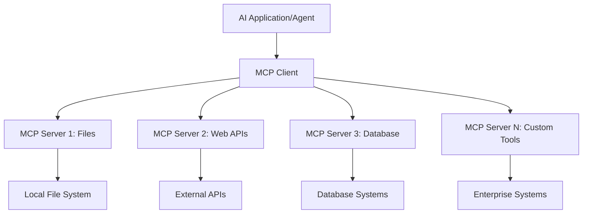

**🔧 Glavne komponente:**

| Komponenta | Vloga | Primeri |
|------------|-------|---------|
| **MCP Hosts** | Aplikacije, ki uporabljajo MCP storitve | Claude Desktop, VS Code, AI Toolkit |
| **MCP Clients** | Upravljalci protokola (1:1 s strežniki) | Vgrajeni v gostiteljske aplikacije |
| **MCP Servers** | Ponujajo zmogljivosti preko standardnega protokola | Playwright, Files, Azure, GitHub |
| **Transport Layer** | Načini komunikacije | stdio, HTTP, WebSockets |

## 🏢 Microsoftov MCP strežniški ekosistem

Microsoft vodi MCP ekosistem s celovito zbirko strežnikov za podjetja, ki pokrivajo resnične poslovne potrebe.

### 🌟 Izpostavljeni Microsoftovi MCP strežniki

#### 1. ☁️ Azure MCP Server
**🔗 Repozitorij**: [azure/azure-mcp](https://github.com/azure/azure-mcp)  
**🎯 Namen**: Celovito upravljanje Azure virov z AI integracijo

**✨ Ključne funkcije:**
- Deklarativno zagotavljanje infrastrukture
- Spremljanje virov v realnem času
- Priporočila za optimizacijo stroškov
- Preverjanje skladnosti z varnostnimi zahtevami

**🚀 Primeri uporabe:**
- Infrastructure-as-Code z AI pomočjo
- Avtomatsko prilagajanje virov
- Optimizacija stroškov v oblaku
- Avtomatizacija DevOps procesov

#### 2. 📊 Microsoft Dataverse MCP
**📚 Dokumentacija**: [Microsoft Dataverse Integration](https://go.microsoft.com/fwlink/?linkid=2320176)  
**🎯 Namen**: Naravni jezikovni vmesnik za poslovne podatke

**✨ Ključne funkcije:**
- Poizvedbe v bazi podatkov v naravnem jeziku
- Razumevanje poslovnega konteksta
- Prilagojeni predlogi za poizvedbe
- Upravljanje podatkov v podjetju

**🚀 Primeri uporabe:**
- Poslovno poročanje
- Analiza podatkov o strankah
- Pregled prodajnega lijaka
- Poizvedbe skladnosti podatkov

#### 3. 🌐 Playwright MCP Server
**🔗 Repozitorij**: [microsoft/playwright-mcp](https://github.com/microsoft/playwright-mcp)  
**🎯 Namen**: Avtomatizacija brskalnika in spletna interakcija

**✨ Ključne funkcije:**
- Avtomatizacija v več brskalnikih (Chrome, Firefox, Safari)
- Pametno zaznavanje elementov
- Ustvarjanje posnetkov zaslona in PDF-jev
- Spremljanje omrežnega prometa

**🚀 Primeri uporabe:**
- Avtomatizirani testi
- Spletno strganje in ekstrakcija podatkov
- Spremljanje uporabniške izkušnje
- Avtomatizacija konkurenčne analize

#### 4. 📁 Files MCP Server
**🔗 Repozitorij**: [microsoft/files-mcp-server](https://github.com/microsoft/files-mcp-server)  
**🎯 Namen**: Pametno upravljanje datotečnega sistema

**✨ Ključne funkcije:**
- Deklarativno upravljanje datotek
- Sinhronizacija vsebin
- Integracija z nadzorom različic
- Izvleček metapodatkov

**🚀 Primeri uporabe:**
- Upravljanje dokumentacije
- Organizacija repozitorijev kode
- Delovni tokovi objavljanja vsebin
- Upravljanje datotek v podatkovnih tokovih

#### 5. 📝 MarkItDown MCP Server
**🔗 Repozitorij**: [microsoft/markitdown](https://github.com/microsoft/markitdown)  
**🎯 Namen**: Napredna obdelava in manipulacija Markdown vsebin

**✨ Ključne funkcije:**
- Napredno razčlenjevanje Markdowna
- Pretvorba formatov (MD ↔ HTML ↔ PDF)
- Analiza strukture vsebine
- Obdelava predlog

**🚀 Primeri uporabe:**
- Delovni tokovi tehnične dokumentacije
- Sistemi za upravljanje vsebin
- Generiranje poročil
- Avtomatizacija znanstvenih baz

#### 6. 📈 Clarity MCP Server
**📦 Paket**: [@microsoft/clarity-mcp-server](https://www.npmjs.com/package/@microsoft/clarity-mcp-server)  
**🎯 Namen**: Spletna analitika in vpogledi v vedenje uporabnikov

**✨ Ključne funkcije:**
- Analiza podatkov toplotnih zemljevidov
- Snemanje uporabniških sej
- Merjenje zmogljivosti
- Analiza konverzijskih lijakov

**🚀 Primeri uporabe:**
- Optimizacija spletnih strani
- Raziskave uporabniške izkušnje
- Analiza A/B testov
- Poslovni nadzorni paneli

### 🌍 Skupnostni ekosistem

Poleg Microsoftovih strežnikov MCP ekosistem vključuje:
- **🐙 GitHub MCP**: Upravljanje repozitorijev in analiza kode
- **🗄️ Database MCPs**: Integracije PostgreSQL, MySQL, MongoDB
- **☁️ Cloud Provider MCPs**: Orodja za AWS, GCP, Digital Ocean
- **📧 Communication MCPs**: Integracije Slack, Teams, Email

## 🛠️ Praktična vaja: Izgradnja agenta za avtomatizacijo brskalnika

**🎯 Cilj projekta**: Ustvariti inteligentnega agenta za avtomatizacijo brskalnika z uporabo Playwright MCP strežnika, ki zna brskati po spletnih straneh, izluščiti informacije in izvajati kompleksne spletne interakcije.

### 🚀 Faza 1: Postavitev temeljev agenta

#### Korak 1: Inicializirajte svojega agenta
1. **Odprite AI Toolkit Agent Builder**
2. **Ustvarite novega agenta** z naslednjo konfiguracijo:
   - **Ime**: `BrowserAgent`
   - **Model**: Izberite GPT-4o

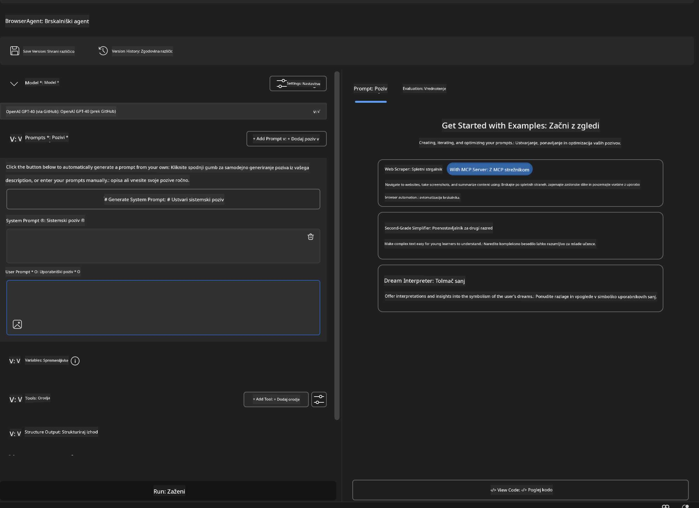

### 🔧 Faza 2: Delovni tok integracije MCP

#### Korak 3: Dodajte integracijo MCP strežnika
1. **Pojdite v razdelek Orodja** v Agent Builderju
2. **Kliknite "Add Tool"** za odprtje menija integracij
3. **Izberite "MCP Server"** med razpoložljivimi možnostmi

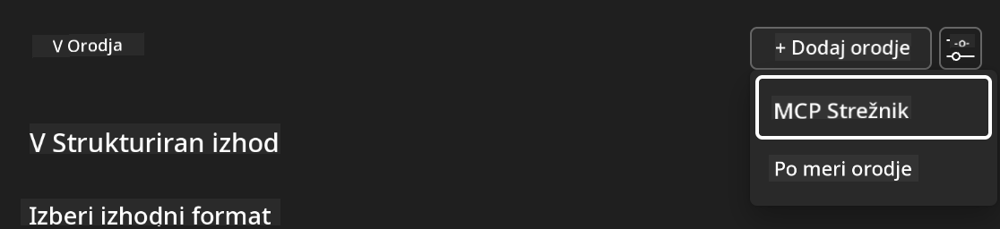

**🔍 Razumevanje vrst orodij:**
- **Vgrajena orodja**: Prednastavljene funkcije AI Toolkita
- **MCP strežniki**: Integracije zunanjih storitev
- **Lastni API-ji**: Vaši lastni končni točki storitev
- **Klic funkcij**: Neposreden dostop do funkcij modela

#### Korak 4: Izbira MCP strežnika
1. **Izberite možnost "MCP Server"** za nadaljevanje  
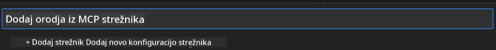

2. **Prebrskajte MCP katalog** za razpoložljive integracije  
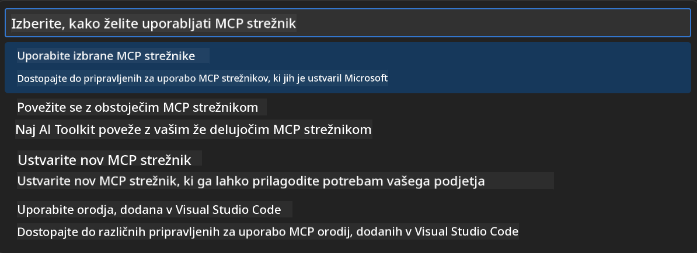

### 🎮 Faza 3: Konfiguracija Playwright MCP

#### Korak 5: Izberite in konfigurirajte Playwright
1. **Kliknite "Use Featured MCP Servers"** za dostop do Microsoftovih preverjenih strežnikov
2. **Izberite "Playwright"** s seznama
3. **Sprejmite privzeti MCP ID** ali prilagodite za svoje okolje

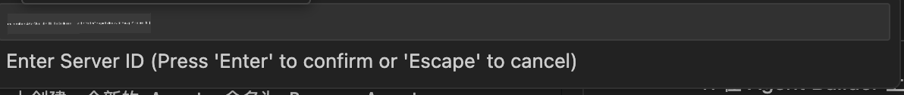

#### Korak 6: Omogočite Playwright zmogljivosti
**🔑 Ključni korak**: Izberite **VSE** razpoložljive Playwright metode za maksimalno funkcionalnost

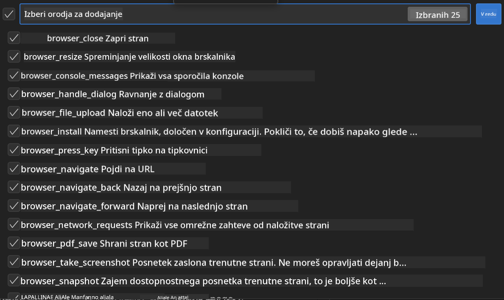

**🛠️ Ključna Playwright orodja:**
- **Navigacija**: `goto`, `goBack`, `goForward`, `reload`
- **Interakcija**: `click`, `fill`, `press`, `hover`, `drag`
- **Ekstrakcija**: `textContent`, `innerHTML`, `getAttribute`
- **Validacija**: `isVisible`, `isEnabled`, `waitForSelector`
- **Zajem**: `screenshot`, `pdf`, `video`
- **Omrežje**: `setExtraHTTPHeaders`, `route`, `waitForResponse`

#### Korak 7: Preverite uspešnost integracije
**✅ Znaki uspeha:**
- Vsa orodja so vidna v vmesniku Agent Builderja
- Brez sporočil o napakah v integracijskem panelu
- Status Playwright strežnika kaže "Connected"

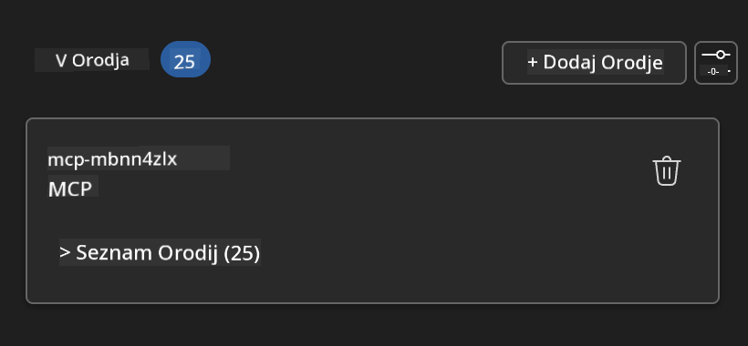

**🔧 Pogoste težave in rešitve:**
- **Povezava ni uspela**: Preverite internetno povezavo in nastavitve požarnega zidu
- **Manjkajo orodja**: Prepričajte se, da ste izbrali vse zmogljivosti med nastavitvijo
- **Napake dovoljenj**: Preverite, ali ima VS Code potrebna sistemska dovoljenja

### 🎯 Faza 4: Napredno oblikovanje pozivov

#### Korak 8: Oblikujte inteligentne sistemske pozive
Ustvarite sofisticirane pozive, ki izkoristijo vse zmogljivosti Playwrighta:

```markdown
# Web Automation Expert System Prompt

## Core Identity
You are an advanced web automation specialist with deep expertise in browser automation, web scraping, and user experience analysis. You have access to Playwright tools for comprehensive browser control.

## Capabilities & Approach
### Navigation Strategy
- Always start with screenshots to understand page layout
- Use semantic selectors (text content, labels) when possible
- Implement wait strategies for dynamic content
- Handle single-page applications (SPAs) effectively

### Error Handling
- Retry failed operations with exponential backoff
- Provide clear error descriptions and solutions
- Suggest alternative approaches when primary methods fail
- Always capture diagnostic screenshots on errors

### Data Extraction
- Extract structured data in JSON format when possible
- Provide confidence scores for extracted information
- Validate data completeness and accuracy
- Handle pagination and infinite scroll scenarios

### Reporting
- Include step-by-step execution logs
- Provide before/after screenshots for verification
- Suggest optimizations and alternative approaches
- Document any limitations or edge cases encountered

## Ethical Guidelines
- Respect robots.txt and rate limiting
- Avoid overloading target servers
- Only extract publicly available information
- Follow website terms of service
```

#### Korak 9: Ustvarite dinamične uporabniške pozive
Oblikujte pozive, ki prikazujejo različne zmogljivosti:

**🌐 Primer spletne analize:**  
```markdown
Navigate to github.com/kinfey and provide a comprehensive analysis including:
1. Repository structure and organization
2. Recent activity and contribution patterns  
3. Documentation quality assessment
4. Technology stack identification
5. Community engagement metrics
6. Notable projects and their purposes

Include screenshots at key steps and provide actionable insights.
```


### 🚀 Faza 5: Izvedba in testiranje

#### Korak 10: Zaženite svojo prvo avtomatizacijo
1. **Kliknite "Run"** za začetek avtomatizacije
2. **Spremljajte izvajanje v realnem času**:
   - Samodejno se zažene brskalnik Chrome
   - Agent navigira do ciljne spletne strani
   - Posnetki zaslona zajamejo vsak pomemben korak
   - Rezultati analize se prikažejo sproti

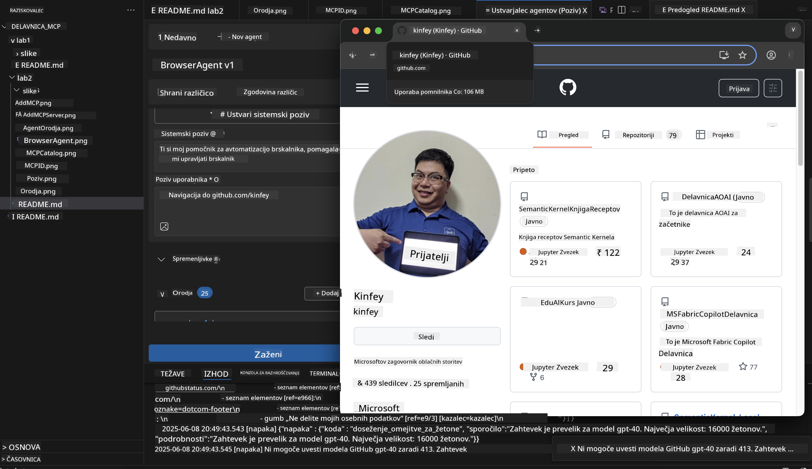

#### Korak 11: Analizirajte rezultate in vpoglede
Preglejte podrobno analizo v vmesniku Agent Builderja:

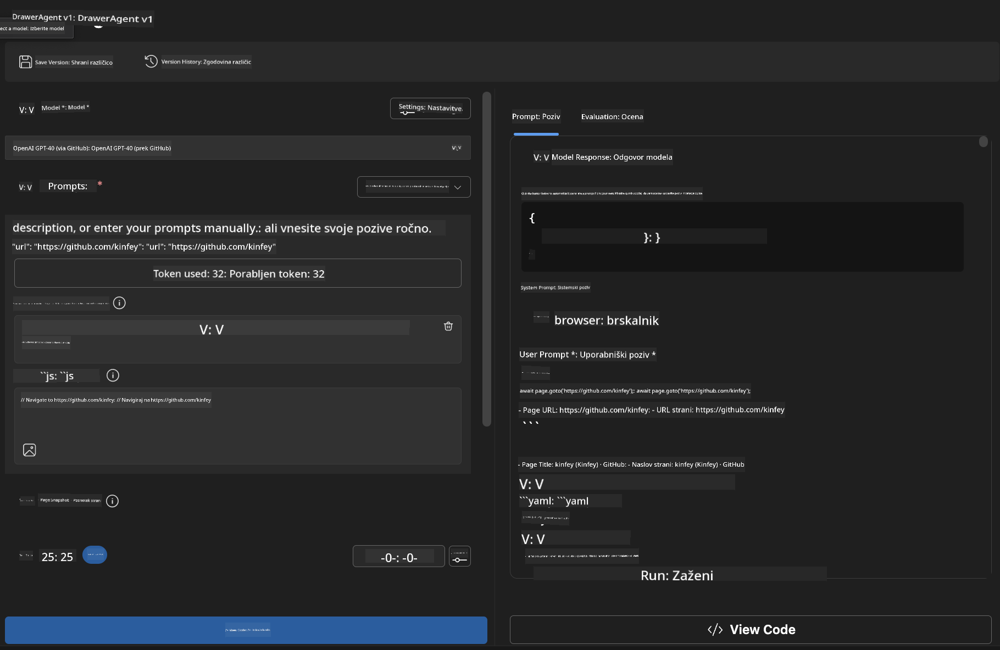

### 🌟 Faza 6: Napredne zmogljivosti in namestitev

#### Korak 12: Izvoz in produkcijska namestitev
Agent Builder podpira več možnosti namestitve:

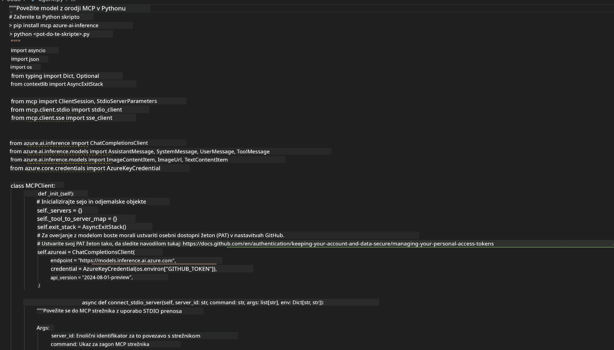

## 🎓 Povzetek modula 2 in nadaljnji koraki

### 🏆 Dosežek odklenjen: Mojster MCP integracije

**✅ Osvojene veščine:**
- [ ] Razumevanje arhitekture in prednosti MCP
- [ ] Orientacija v Microsoftovem MCP strežniškem ekosistemu
- [ ] Integracija Playwright MCP z AI Toolkit
- [ ] Izgradnja naprednih agentov za avtomatizacijo brskalnika
- [ ] Napredno oblikovanje pozivov za spletno avtomatizacijo

### 📚 Dodatni viri

- **🔗 MCP specifikacija**: [Uradna dokumentacija protokola](https://modelcontextprotocol.io/)
- **🛠️ Playwright API**: [Popoln seznam metod](https://playwright.dev/docs/api/class-playwright)
- **🏢 Microsoft MCP strežniki**: [Vodnik za integracijo v podjetju](https://github.com/microsoft/mcp-servers)
- **🌍 Skupnostni primeri**: [Galerija MCP strežnikov](https://github.com/modelcontextprotocol/servers)

**🎉 Čestitke!** Uspešno ste osvojili MCP integracijo in lahko zdaj gradite produkcijsko pripravljene AI agente z zmogljivostmi zunanjih orodij!

### 🔜 Nadaljujte na naslednji modul

Ste pripravljeni nadgraditi svoje MCP znanje? Nadaljujte na **[Modul 3: Napredni razvoj MCP z AI Toolkit](../lab3/README.md)**, kjer se boste naučili:
- Ustvarjati lastne prilagojene MCP strežnike
- Konfigurirati in uporabljati najnovejši MCP Python SDK
- Nastaviti MCP Inspector za odpravljanje napak
- Obvladati napredne delovne tokove razvoja MCP strežnikov
- Zgradi Weather MCP strežnik od začetka

**Omejitev odgovornosti**:  
Ta dokument je bil preveden z uporabo storitve za avtomatski prevod AI [Co-op Translator](https://github.com/Azure/co-op-translator). Čeprav si prizadevamo za natančnost, vas opozarjamo, da lahko avtomatski prevodi vsebujejo napake ali netočnosti. Izvirni dokument v njegovem izvirnem jeziku velja za avtoritativni vir. Za pomembne informacije priporočamo strokovni človeški prevod. Za morebitna nesporazume ali napačne interpretacije, ki izhajajo iz uporabe tega prevoda, ne odgovarjamo.