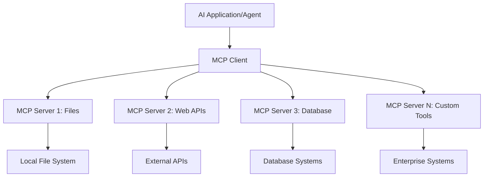

<!--
CO_OP_TRANSLATOR_METADATA:
{
  "original_hash": "a22b7dd11cd7690f99f9195877cafdc3",
  "translation_date": "2025-06-10T06:01:01+00:00",
  "source_file": "10-StreamliningAIWorkflowsBuildingAnMCPServerWithAIToolkit/lab2/README.md",
  "language_code": "sl"
}
-->
# 🌐 Module 2: MCP with AI Toolkit Fundamentals

[]()
[]()
[]()

## 📋 Learning Objectives

By the end of this module, you'll be able to:
- ✅ Grasp the architecture and benefits of Model Context Protocol (MCP)
- ✅ Explore Microsoft’s MCP server ecosystem
- ✅ Connect MCP servers with AI Toolkit Agent Builder
- ✅ Build a working browser automation agent using Playwright MCP
- ✅ Configure and test MCP tools inside your agents
- ✅ Export and deploy MCP-powered agents for production

## 🎯 Building on Module 1

In Module 1, we covered AI Toolkit basics and built our first Python Agent. Now we’ll **boost** your agents by linking them to external tools and services via the groundbreaking **Model Context Protocol (MCP)**.

Think of it as upgrading from a simple calculator to a full computer — your AI agents will now be able to:
- 🌐 Browse and interact with websites
- 📁 Access and manage files
- 🔧 Integrate with enterprise systems
- 📊 Process real-time API data

## 🧠 Understanding Model Context Protocol (MCP)

### 🔍 What is MCP?

Model Context Protocol (MCP) is the **"USB-C for AI applications"** — an innovative open standard that connects Large Language Models (LLMs) to external tools, data sources, and services. Just like USB-C unified cables into one connector, MCP simplifies AI integration with a single standardized protocol.

### 🎯 The Problem MCP Solves

**Before MCP:**
- 🔧 Custom integrations for each tool
- 🔄 Vendor lock-in with proprietary solutions  
- 🔒 Security risks from ad-hoc connections
- ⏱️ Months of development for simple integrations

**With MCP:**
- ⚡ Plug-and-play tool integration
- 🔄 Vendor-neutral architecture
- 🛡️ Built-in security best practices
- 🚀 Minutes to add new features

### 🏗️ MCP Architecture Deep Dive

MCP uses a **client-server architecture** that creates a secure, scalable ecosystem:



**🔧 Core Components:**

| Component      | Role                                | Examples                          |
|----------------|-----------------------------------|----------------------------------|
| **MCP Hosts**  | Applications consuming MCP services | Claude Desktop, VS Code, AI Toolkit |
| **MCP Clients**| Protocol handlers (1:1 with servers) | Built into host applications       |
| **MCP Servers**| Provide capabilities via standard protocol | Playwright, Files, Azure, GitHub    |
| **Transport Layer** | Communication methods            | stdio, HTTP, WebSockets             |


## 🏢 Microsoft's MCP Server Ecosystem

Microsoft leads the MCP ecosystem with a robust set of enterprise-grade servers addressing real business needs.

### 🌟 Featured Microsoft MCP Servers

#### 1. ☁️ Azure MCP Server
**🔗 Repository**: [azure/azure-mcp](https://github.com/azure/azure-mcp)  
**🎯 Purpose**: Comprehensive Azure resource management with AI integration

**✨ Key Features:**
- Declarative infrastructure provisioning
- Real-time resource monitoring
- Cost optimization recommendations
- Security compliance checks

**🚀 Use Cases:**
- Infrastructure-as-Code with AI support
- Automated resource scaling
- Cloud cost optimization
- DevOps workflow automation

#### 2. 📊 Microsoft Dataverse MCP
**📚 Documentation**: [Microsoft Dataverse Integration](https://go.microsoft.com/fwlink/?linkid=2320176)  
**🎯 Purpose**: Natural language interface for business data

**✨ Key Features:**
- Natural language database queries
- Business context understanding
- Custom prompt templates
- Enterprise data governance

**🚀 Use Cases:**
- Business intelligence reporting
- Customer data analysis
- Sales pipeline insights
- Compliance data queries

#### 3. 🌐 Playwright MCP Server
**🔗 Repository**: [microsoft/playwright-mcp](https://github.com/microsoft/playwright-mcp)  
**🎯 Purpose**: Browser automation and web interaction

**✨ Key Features:**
- Cross-browser automation (Chrome, Firefox, Safari)
- Smart element detection
- Screenshot and PDF generation
- Network traffic monitoring

**🚀 Use Cases:**
- Automated testing workflows
- Web scraping and data extraction
- UI/UX monitoring
- Competitive analysis automation

#### 4. 📁 Files MCP Server
**🔗 Repository**: [microsoft/files-mcp-server](https://github.com/microsoft/files-mcp-server)  
**🎯 Purpose**: Intelligent file system operations

**✨ Key Features:**
- Declarative file management
- Content synchronization
- Version control integration
- Metadata extraction

**🚀 Use Cases:**
- Documentation management
- Code repository organization
- Content publishing workflows
- Data pipeline file handling

#### 5. 📝 MarkItDown MCP Server
**🔗 Repository**: [microsoft/markitdown](https://github.com/microsoft/markitdown)  
**🎯 Purpose**: Advanced Markdown processing and manipulation

**✨ Key Features:**
- Rich Markdown parsing
- Format conversion (MD ↔ HTML ↔ PDF)
- Content structure analysis
- Template processing

**🚀 Use Cases:**
- Technical documentation workflows
- Content management systems
- Report generation
- Knowledge base automation

#### 6. 📈 Clarity MCP Server
**📦 Package**: [@microsoft/clarity-mcp-server](https://www.npmjs.com/package/@microsoft/clarity-mcp-server)  
**🎯 Purpose**: Web analytics and user behavior insights

**✨ Key Features:**
- Heatmap data analysis
- User session recordings
- Performance metrics
- Conversion funnel analysis

**🚀 Use Cases:**
- Website optimization
- User experience research
- A/B testing analysis
- Business intelligence dashboards

### 🌍 Community Ecosystem

Besides Microsoft’s servers, the MCP ecosystem includes:
- **🐙 GitHub MCP**: Repository management and code analysis
- **🗄️ Database MCPs**: PostgreSQL, MySQL, MongoDB integrations
- **☁️ Cloud Provider MCPs**: AWS, GCP, Digital Ocean tools
- **📧 Communication MCPs**: Slack, Teams, Email integrations

## 🛠️ Hands-On Lab: Building a Browser Automation Agent

**🎯 Project Goal**: Build an intelligent browser automation agent using Playwright MCP server that can navigate websites, extract data, and perform complex web interactions.

### 🚀 Phase 1: Agent Foundation Setup

#### Step 1: Initialize Your Agent
1. **Open AI Toolkit Agent Builder**  
2. **Create New Agent** with this configuration:  
   - **Name**: `BrowserAgent`
   - **Model**: Choose GPT-4o 


### 🔧 Phase 2: MCP Integration Workflow

#### Step 3: Add MCP Server Integration
1. **Navigate to Tools Section** in Agent Builder
2. **Click "Add Tool"** to open the integration menu
3. **Select "MCP Server"** from available options


**🔍 Understanding Tool Types:**
- **Built-in Tools**: Pre-configured AI Toolkit functions
- **MCP Servers**: External service integrations
- **Custom APIs**: Your own service endpoints
- **Function Calling**: Direct model function access

#### Step 4: MCP Server Selection
1. **Choose "MCP Server"** option to proceed


2. **Browse MCP Catalog** to explore available integrations


### 🎮 Phase 3: Playwright MCP Configuration

#### Step 5: Select and Configure Playwright
1. **Click "Use Featured MCP Servers"** to access Microsoft's verified servers
2. **Select "Playwright"** from the featured list
3. **Accept Default MCP ID** or customize for your environment


#### Step 6: Enable Playwright Capabilities
**🔑 Critical Step**: Select **ALL** available Playwright methods for maximum functionality


**🛠️ Essential Playwright Tools:**
- **Navigation**: `goto`, `goBack`, `goForward`, `reload`
- **Interaction**: `click`, `fill`, `press`, `hover`, `drag`
- **Extraction**: `textContent`, `innerHTML`, `getAttribute`
- **Validation**: `isVisible`, `isEnabled`, `waitForSelector`
- **Capture**: `screenshot`, `pdf`, `video`
- **Network**: `setExtraHTTPHeaders`, `route`, `waitForResponse`

#### Step 7: Verify Integration Success
**✅ Success Indicators:**
- All tools show up in Agent Builder interface
- No errors in the integration panel
- Playwright server status reads "Connected"


**🔧 Troubleshooting Common Issues:**
- **Connection Failed**: Check your internet and firewall settings
- **Missing Tools**: Confirm all capabilities were selected during setup
- **Permission Errors**: Make sure VS Code has required system permissions

### 🎯 Phase 4: Advanced Prompt Engineering

#### Step 8: Design Intelligent System Prompts
Create advanced prompts that fully leverage Playwright’s capabilities:

```markdown
# Web Automation Expert System Prompt

## Core Identity
You are an advanced web automation specialist with deep expertise in browser automation, web scraping, and user experience analysis. You have access to Playwright tools for comprehensive browser control.

## Capabilities & Approach
### Navigation Strategy
- Always start with screenshots to understand page layout
- Use semantic selectors (text content, labels) when possible
- Implement wait strategies for dynamic content
- Handle single-page applications (SPAs) effectively

### Error Handling
- Retry failed operations with exponential backoff
- Provide clear error descriptions and solutions
- Suggest alternative approaches when primary methods fail
- Always capture diagnostic screenshots on errors

### Data Extraction
- Extract structured data in JSON format when possible
- Provide confidence scores for extracted information
- Validate data completeness and accuracy
- Handle pagination and infinite scroll scenarios

### Reporting
- Include step-by-step execution logs
- Provide before/after screenshots for verification
- Suggest optimizations and alternative approaches
- Document any limitations or edge cases encountered

## Ethical Guidelines
- Respect robots.txt and rate limiting
- Avoid overloading target servers
- Only extract publicly available information
- Follow website terms of service
```

#### Step 9: Create Dynamic User Prompts
Build prompts that showcase different features:

**🌐 Web Analysis Example:**  
```markdown
Navigate to github.com/kinfey and provide a comprehensive analysis including:
1. Repository structure and organization
2. Recent activity and contribution patterns  
3. Documentation quality assessment
4. Technology stack identification
5. Community engagement metrics
6. Notable projects and their purposes

Include screenshots at key steps and provide actionable insights.
```


### 🚀 Phase 5: Execution and Testing

#### Step 10: Execute Your First Automation
1. **Click "Run"** to start the automation  
2. **Watch Real-time Execution**:  
   - Chrome browser opens automatically  
   - Agent navigates to target site  
   - Screenshots capture key steps  
   - Analysis results stream live


#### Step 11: Analyze Results and Insights
Review detailed analysis in Agent Builder’s interface:


### 🌟 Phase 6: Advanced Capabilities and Deployment

#### Step 12: Export and Production Deployment
Agent Builder offers multiple deployment options:


## 🎓 Module 2 Summary & Next Steps

### 🏆 Achievement Unlocked: MCP Integration Master

**✅ Skills Mastered:**
- [ ] Understanding MCP architecture and benefits
- [ ] Navigating Microsoft’s MCP server ecosystem
- [ ] Integrating Playwright MCP with AI Toolkit
- [ ] Building advanced browser automation agents
- [ ] Advanced prompt engineering for web automation

### 📚 Additional Resources

- **🔗 MCP Specification**: [Official Protocol Documentation](https://modelcontextprotocol.io/)
- **🛠️ Playwright API**: [Complete Method Reference](https://playwright.dev/docs/api/class-playwright)
- **🏢 Microsoft MCP Servers**: [Enterprise Integration Guide](https://github.com/microsoft/mcp-servers)
- **🌍 Community Examples**: [MCP Server Gallery](https://github.com/modelcontextprotocol/servers)

**🎉 Congratulations!** You’ve successfully mastered MCP integration and can now build production-ready AI agents with external tool capabilities!

### 🔜 Continue to Next Module

Ready to level up your MCP skills? Move on to **[Module 3: Advanced MCP Development with AI Toolkit](../lab3/README.md)** where you’ll learn to:
- Build your own custom MCP servers
- Configure and use the latest MCP Python SDK
- Set up MCP Inspector for debugging
- Master advanced MCP server development workflows
- Create a Weather MCP Server from scratch

**Izjava o omejitvi odgovornosti**:  
Ta dokument je bil preveden z uporabo AI prevajalske storitve [Co-op Translator](https://github.com/Azure/co-op-translator). Čeprav si prizadevamo za natančnost, vas opozarjamo, da avtomatizirani prevodi lahko vsebujejo napake ali netočnosti. Izvirni dokument v njegovem izvirnem jeziku velja za avtoritativni vir. Za pomembne informacije priporočamo strokovni človeški prevod. Nismo odgovorni za morebitna nesporazume ali napačne interpretacije, ki izhajajo iz uporabe tega prevoda.