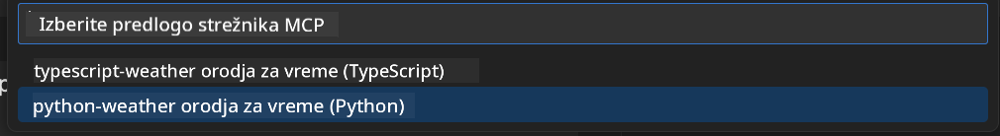
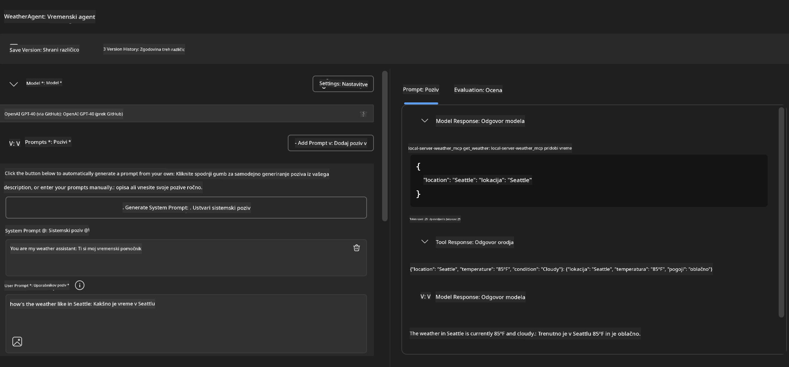
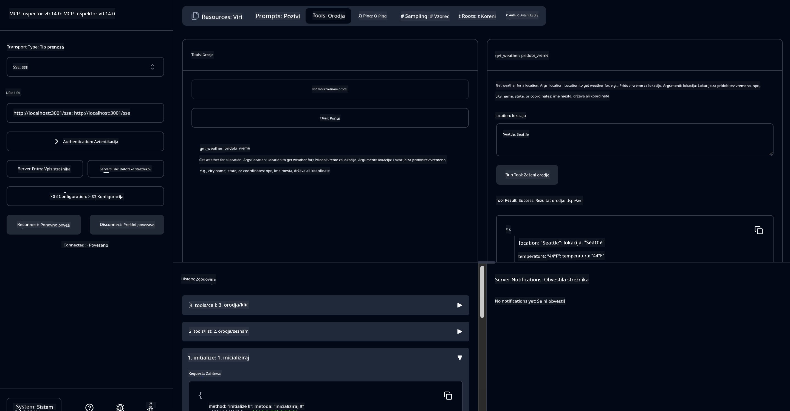

<!--
CO_OP_TRANSLATOR_METADATA:
{
  "original_hash": "dd8da3f75addcef453fe11f02a270217",
  "translation_date": "2025-06-10T06:20:40+00:00",
  "source_file": "10-StreamliningAIWorkflowsBuildingAnMCPServerWithAIToolkit/lab3/README.md",
  "language_code": "sl"
}
-->
# 🔧 Module 3: Napredni razvoj MCP z AI Toolkit


## 🎯 Cilji učenja

Na koncu te delavnice boste znali:

- ✅ Ustvariti prilagojene MCP strežnike z uporabo AI Toolkit
- ✅ Nastaviti in uporabljati najnovejši MCP Python SDK (v1.9.3)
- ✅ Namestiti in uporabljati MCP Inspector za odpravljanje napak
- ✅ Odpravljati napake MCP strežnikov v okoljih Agent Builder in Inspector
- ✅ Razumeti napredne postopke razvoja MCP strežnikov

## 📋 Predpogoji

- Dokončana delavnica 2 (MCP osnove)
- VS Code z nameščenim AI Toolkit razširitvijo
- Python 3.10+ okolje
- Node.js in npm za nastavitev Inspectorja

## 🏗️ Kaj boste ustvarili

V tej delavnici boste izdelali **Weather MCP Server**, ki prikazuje:
- Prilagojeno implementacijo MCP strežnika
- Integracijo z AI Toolkit Agent Builderjem
- Profesionalne postopke odpravljanja napak
- Sodobne vzorce uporabe MCP SDK

---

## 🔧 Pregled glavnih komponent

### 🐍 MCP Python SDK  
Model Context Protocol Python SDK predstavlja osnovo za izdelavo prilagojenih MCP strežnikov. Uporabili boste različico 1.9.3 z izboljšanimi možnostmi odpravljanja napak.

### 🔍 MCP Inspector  
Močno orodje za odpravljanje napak, ki omogoča:  
- Spremljanje strežnika v realnem času  
- Vizualizacijo izvajanja orodij  
- Pregled omrežnih zahtevkov in odgovorov  
- Interaktivno testno okolje

---

## 📖 Korak za korakom implementacija

### Korak 1: Ustvarite WeatherAgent v Agent Builderju

1. **Zaženite Agent Builder** v VS Code preko AI Toolkit razširitve  
2. **Ustvarite novega agenta** z naslednjo konfiguracijo:  
   - Ime agenta: `WeatherAgent`


### Korak 2: Inicializirajte MCP strežniški projekt

1. **Pojdite na Tools** → **Add Tool** v Agent Builderju  
2. **Izberite "MCP Server"** iz ponujenih možnosti  
3. **Izberite "Create A new MCP Server"**  
4. **Izberite predlogo `python-weather`**  
5. **Poimenujte strežnik:** `weather_mcp`



### Korak 3: Odprite in preglejte projekt

1. **Odprite ustvarjeni projekt** v VS Code  
2. **Preglejte strukturo projekta:**  
   ```
   weather_mcp/
   ├── src/
   │   ├── __init__.py
   │   └── server.py
   ├── inspector/
   │   ├── package.json
   │   └── package-lock.json
   ├── .vscode/
   │   ├── launch.json
   │   └── tasks.json
   ├── pyproject.toml
   └── README.md
   ```

### Korak 4: Nadgradnja na najnovejši MCP SDK

> **🔍 Zakaj nadgraditi?** Želimo uporabiti najnovejši MCP SDK (v1.9.3) in Inspector (0.14.0) za izboljšane funkcije in boljše odpravljanje napak.

#### 4a. Posodobite Python odvisnosti

**Uredite `pyproject.toml`:** update [./code/weather_mcp/pyproject.toml](../../../../10-StreamliningAIWorkflowsBuildingAnMCPServerWithAIToolkit/lab3/code/weather_mcp/pyproject.toml)


#### 4b. Update Inspector Configuration

**Edit `inspector/package.json`:** update [./code/weather_mcp/inspector/package.json](../../../../10-StreamliningAIWorkflowsBuildingAnMCPServerWithAIToolkit/lab3/code/weather_mcp/inspector/package.json)

#### 4c. Update Inspector Dependencies

**Edit `inspector/package-lock.json`:** update [./code/weather_mcp/inspector/package-lock.json](../../../../10-StreamliningAIWorkflowsBuildingAnMCPServerWithAIToolkit/lab3/code/weather_mcp/inspector/package-lock.json)

> **📝 Note:** This file contains extensive dependency definitions. Below is the essential structure - the full content ensures proper dependency resolution.


> **⚡ Full Package Lock:** The complete package-lock.json contains ~3000 lines of dependency definitions. The above shows the key structure - use the provided file for complete dependency resolution.

### Step 5: Configure VS Code Debugging

*Note: Please copy the file in the specified path to replace the corresponding local file*

#### 5a. Update Launch Configuration

**Edit `.vscode/launch.json`:**

```json
{
  "version": "0.2.0",
  "configurations": [
    {
      "name": "Attach to Local MCP",
      "type": "debugpy",
      "request": "attach",
      "connect": {
        "host": "localhost",
        "port": 5678
      },
      "presentation": {
        "hidden": true
      },
      "internalConsoleOptions": "neverOpen",
      "postDebugTask": "Terminate All Tasks"
    },
    {
      "name": "Launch Inspector (Edge)",
      "type": "msedge",
      "request": "launch",
      "url": "http://localhost:6274?timeout=60000&serverUrl=http://localhost:3001/sse#tools",
      "cascadeTerminateToConfigurations": [
        "Attach to Local MCP"
      ],
      "presentation": {
        "hidden": true
      },
      "internalConsoleOptions": "neverOpen"
    },
    {
      "name": "Launch Inspector (Chrome)",
      "type": "chrome",
      "request": "launch",
      "url": "http://localhost:6274?timeout=60000&serverUrl=http://localhost:3001/sse#tools",
      "cascadeTerminateToConfigurations": [
        "Attach to Local MCP"
      ],
      "presentation": {
        "hidden": true
      },
      "internalConsoleOptions": "neverOpen"
    }
  ],
  "compounds": [
    {
      "name": "Debug in Agent Builder",
      "configurations": [
        "Attach to Local MCP"
      ],
      "preLaunchTask": "Open Agent Builder",
    },
    {
      "name": "Debug in Inspector (Edge)",
      "configurations": [
        "Launch Inspector (Edge)",
        "Attach to Local MCP"
      ],
      "preLaunchTask": "Start MCP Inspector",
      "stopAll": true
    },
    {
      "name": "Debug in Inspector (Chrome)",
      "configurations": [
        "Launch Inspector (Chrome)",
        "Attach to Local MCP"
      ],
      "preLaunchTask": "Start MCP Inspector",
      "stopAll": true
    }
  ]
}
```

**Uredite `.vscode/tasks.json`:**

```
{
  "version": "2.0.0",
  "tasks": [
    {
      "label": "Start MCP Server",
      "type": "shell",
      "command": "python -m debugpy --listen 127.0.0.1:5678 src/__init__.py sse",
      "isBackground": true,
      "options": {
        "cwd": "${workspaceFolder}",
        "env": {
          "PORT": "3001"
        }
      },
      "problemMatcher": {
        "pattern": [
          {
            "regexp": "^.*$",
            "file": 0,
            "location": 1,
            "message": 2
          }
        ],
        "background": {
          "activeOnStart": true,
          "beginsPattern": ".*",
          "endsPattern": "Application startup complete|running"
        }
      }
    },
    {
      "label": "Start MCP Inspector",
      "type": "shell",
      "command": "npm run dev:inspector",
      "isBackground": true,
      "options": {
        "cwd": "${workspaceFolder}/inspector",
        "env": {
          "CLIENT_PORT": "6274",
          "SERVER_PORT": "6277",
        }
      },
      "problemMatcher": {
        "pattern": [
          {
            "regexp": "^.*$",
            "file": 0,
            "location": 1,
            "message": 2
          }
        ],
        "background": {
          "activeOnStart": true,
          "beginsPattern": "Starting MCP inspector",
          "endsPattern": "Proxy server listening on port"
        }
      },
      "dependsOn": [
        "Start MCP Server"
      ]
    },
    {
      "label": "Open Agent Builder",
      "type": "shell",
      "command": "echo ${input:openAgentBuilder}",
      "presentation": {
        "reveal": "never"
      },
      "dependsOn": [
        "Start MCP Server"
      ],
    },
    {
      "label": "Terminate All Tasks",
      "command": "echo ${input:terminate}",
      "type": "shell",
      "problemMatcher": []
    }
  ],
  "inputs": [
    {
      "id": "openAgentBuilder",
      "type": "command",
      "command": "ai-mlstudio.agentBuilder",
      "args": {
        "initialMCPs": [ "local-server-weather_mcp" ],
        "triggeredFrom": "vsc-tasks"
      }
    },
    {
      "id": "terminate",
      "type": "command",
      "command": "workbench.action.tasks.terminate",
      "args": "terminateAll"
    }
  ]
}
```

---

## 🚀 Zagon in testiranje vašega MCP strežnika

### Korak 6: Namestitev odvisnosti

Po spremembah konfiguracije zaženite naslednje ukaze:

**Namestite Python odvisnosti:**  
```bash
uv sync
```

**Namestite Inspector odvisnosti:**  
```bash
cd inspector
npm install
```

### Korak 7: Odpravljanje napak z Agent Builderjem

1. **Pritisnite F5** ali uporabite konfiguracijo **"Debug in Agent Builder"**  
2. **Izberite združeno konfiguracijo** v debug panelu  
3. **Počakajte, da se strežnik zažene** in odpre Agent Builder  
4. **Preizkusite svoj Weather MCP Server** z naravnimi jezikovnimi poizvedbami

Vnesite poziv, kot je ta

SYSTEM_PROMPT

```
You are my weather assistant
```

USER_PROMPT

```
How's the weather like in Seattle
```



### Korak 8: Odpravljanje napak z MCP Inspectorjem

1. **Uporabite konfiguracijo "Debug in Inspector"** (Edge ali Chrome)  
2. **Odprite vmesnik Inspectorja** na `http://localhost:6274`  
3. **Raziskujte interaktivno testno okolje:**  
   - Preglejte razpoložljiva orodja  
   - Preizkusite izvajanje orodij  
   - Spremljajte omrežne zahtevke  
   - Odpravljajte napake v odzivih strežnika



---

## 🎯 Ključni rezultati učenja

Z zaključkom te delavnice ste:

- [x] **Ustvarili prilagojen MCP strežnik** z uporabo AI Toolkit predlog  
- [x] **Nadgradili na najnovejši MCP SDK** (v1.9.3) za izboljšano funkcionalnost  
- [x] **Nastavili profesionalne postopke odpravljanja napak** za Agent Builder in Inspector  
- [x] **Namestili MCP Inspector** za interaktivno testiranje strežnika  
- [x] **Obvladali VS Code konfiguracije za odpravljanje napak** pri razvoju MCP

## 🔧 Raziskane napredne funkcije

| Funkcija | Opis | Primer uporabe |
|---------|-------------|----------|
| **MCP Python SDK v1.9.3** | Najnovejša implementacija protokola | Sodobni razvoj strežnikov |
| **MCP Inspector 0.14.0** | Interaktivno orodje za odpravljanje napak | Testiranje strežnika v realnem času |
| **VS Code Debugging** | Integrirano razvojno okolje | Profesionalni razvojni proces |
| **Agent Builder Integration** | Neposredna povezava z AI Toolkit | Celovito testiranje agentov |

## 📚 Dodatni viri

- [MCP Python SDK Documentation](https://modelcontextprotocol.io/docs/sdk/python)  
- [AI Toolkit Extension Guide](https://code.visualstudio.com/docs/ai/ai-toolkit)  
- [VS Code Debugging Documentation](https://code.visualstudio.com/docs/editor/debugging)  
- [Model Context Protocol Specification](https://modelcontextprotocol.io/docs/concepts/architecture)

---

**🎉 Čestitamo!** Uspešno ste zaključili delavnico 3 in zdaj lahko ustvarjate, odpravljate napake ter nameščate prilagojene MCP strežnike z uporabo profesionalnih razvojnih postopkov.

### 🔜 Nadaljujte na naslednji modul

Pripravljeni uporabiti svoje MCP znanje v realnem razvojnem procesu? Nadaljujte na **[Module 4: Practical MCP Development - Custom GitHub Clone Server](../lab4/README.md)**, kjer boste:  
- Izdelali produkcijsko pripravljen MCP strežnik za avtomatizacijo GitHub repozitorijskih opravil  
- Implementirali funkcionalnost kloniranja GitHub repozitorijev preko MCP  
- Integrirali prilagojene MCP strežnike z VS Code in GitHub Copilot Agent Mode  
- Testirali in nameščali prilagojene MCP strežnike v produkcijska okolja  
- Naučili se praktičnih avtomatizacijskih postopkov za razvijalce

**Omejitev odgovornosti**:  
Ta dokument je bil preveden z uporabo AI prevajalske storitve [Co-op Translator](https://github.com/Azure/co-op-translator). Čeprav si prizadevamo za natančnost, vas prosimo, da upoštevate, da avtomatizirani prevodi lahko vsebujejo napake ali netočnosti. Izvirni dokument v njegovem izvirnem jeziku velja za avtoritativni vir. Za ključne informacije priporočamo strokovni človeški prevod. Za morebitna nesporazume ali napačne interpretacije, ki izhajajo iz uporabe tega prevoda, ne odgovarjamo.