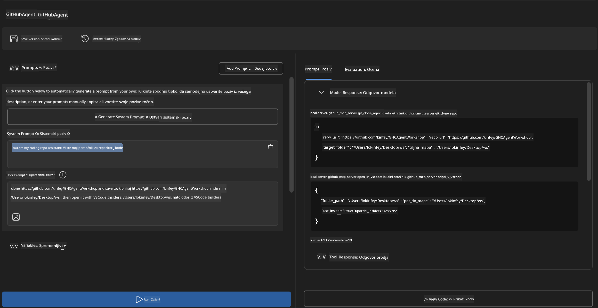
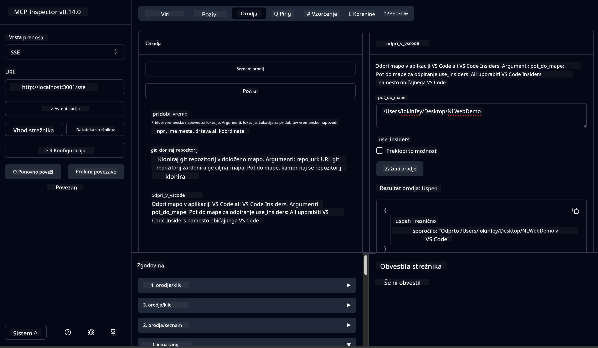

<!--
CO_OP_TRANSLATOR_METADATA:
{
  "original_hash": "f83bc722dc758efffd68667d6a1db470",
  "translation_date": "2025-07-14T08:48:49+00:00",
  "source_file": "10-StreamliningAIWorkflowsBuildingAnMCPServerWithAIToolkit/lab4/README.md",
  "language_code": "sl"
}
-->
# 🐙 Modul 4: Praktični razvoj MCP - Prilagojen strežnik za kloniranje GitHub repozitorijev


> **⚡ Hiter začetek:** Zgradi produkcijsko pripravljen MCP strežnik, ki avtomatizira kloniranje GitHub repozitorijev in integracijo z VS Code v samo 30 minutah!

## 🎯 Cilji učenja

Ob koncu te delavnice boste znali:

- ✅ Ustvariti prilagojen MCP strežnik za resnične razvojne procese
- ✅ Implementirati funkcionalnost kloniranja GitHub repozitorijev preko MCP
- ✅ Povezati prilagojene MCP strežnike z VS Code in Agent Builderjem
- ✅ Uporabljati GitHub Copilot Agent Mode s prilagojenimi MCP orodji
- ✅ Testirati in uvajati prilagojene MCP strežnike v produkcijska okolja

## 📋 Predpogoji

- Dokončanje laboratorijev 1-3 (osnove MCP in napredni razvoj)
- Naročnina na GitHub Copilot ([brezplačna registracija na voljo](https://github.com/github-copilot/signup))
- VS Code z razširitvami AI Toolkit in GitHub Copilot
- Namestitev in konfiguracija Git CLI

## 🏗️ Pregled projekta

### **Izziv iz resničnega sveta**
Kot razvijalci pogosto uporabljamo GitHub za kloniranje repozitorijev in njihovo odpiranje v VS Code ali VS Code Insiders. Ta ročni postopek vključuje:
1. Odprtje terminala/ukazne vrstice
2. Premik v želeno mapo
3. Zagon ukaza `git clone`
4. Odprtje VS Code v klonirani mapi

**Naša MCP rešitev to poenostavi v eno samo pametno ukazno vrstico!**

### **Kaj boste zgradili**
**GitHub Clone MCP Server** (`git_mcp_server`), ki ponuja:

| Funkcija | Opis | Korist |
|---------|-------------|---------|
| 🔄 **Pametno kloniranje repozitorijev** | Klonira GitHub repozitorije z validacijo | Avtomatsko preverjanje napak |
| 📁 **Pametno upravljanje map** | Preveri in varno ustvari mape | Preprečuje prepisovanje |
| 🚀 **Večplatformska integracija z VS Code** | Odpre projekte v VS Code/Insiders | Gladek prehod v delovni proces |
| 🛡️ **Zanesljivo upravljanje napak** | Obvladuje težave z omrežjem, dovoljenji in potmi | Zanesljivost za produkcijsko uporabo |

---

## 📖 Korak za korakom izvedba

### Korak 1: Ustvarite GitHub agenta v Agent Builderju

1. **Zaženite Agent Builder** preko razširitve AI Toolkit
2. **Ustvarite novega agenta** z naslednjo konfiguracijo:
   ```
   Agent Name: GitHubAgent
   ```

3. **Inicializirajte prilagojen MCP strežnik:**
   - Pojdite na **Orodja** → **Dodaj orodje** → **MCP Server**
   - Izberite **"Create A new MCP Server"**
   - Izberite **Python predlogo** za največjo prilagodljivost
   - **Ime strežnika:** `git_mcp_server`

### Korak 2: Konfigurirajte GitHub Copilot Agent Mode

1. **Odprite GitHub Copilot** v VS Code (Ctrl/Cmd + Shift + P → "GitHub Copilot: Open")
2. **Izberite Agent Model** v vmesniku Copilot
3. **Izberite model Claude 3.7** za izboljšane sposobnosti razumevanja
4. **Omogočite MCP integracijo** za dostop do orodij

> **💡 Nasvet:** Claude 3.7 bolje razume razvojne procese in vzorce upravljanja napak.

### Korak 3: Implementirajte osnovno funkcionalnost MCP strežnika

**Uporabite naslednji podroben poziv z GitHub Copilot Agent Mode:**

```
Create two MCP tools with the following comprehensive requirements:

🔧 TOOL A: clone_repository
Requirements:
- Clone any GitHub repository to a specified local folder
- Return the absolute path of the successfully cloned project
- Implement comprehensive validation:
  ✓ Check if target directory already exists (return error if exists)
  ✓ Validate GitHub URL format (https://github.com/user/repo)
  ✓ Verify git command availability (prompt installation if missing)
  ✓ Handle network connectivity issues
  ✓ Provide clear error messages for all failure scenarios

🚀 TOOL B: open_in_vscode
Requirements:
- Open specified folder in VS Code or VS Code Insiders
- Cross-platform compatibility (Windows/Linux/macOS)
- Use direct application launch (not terminal commands)
- Auto-detect available VS Code installations
- Handle cases where VS Code is not installed
- Provide user-friendly error messages

Additional Requirements:
- Follow MCP 1.9.3 best practices
- Include proper type hints and documentation
- Implement logging for debugging purposes
- Add input validation for all parameters
- Include comprehensive error handling
```

### Korak 4: Testirajte svoj MCP strežnik

#### 4a. Testiranje v Agent Builderju

1. **Zaženite debug konfiguracijo** v Agent Builderju
2. **Konfigurirajte svojega agenta s tem sistemskim pozivom:**

```
SYSTEM_PROMPT:
You are my intelligent coding repository assistant. You help developers efficiently clone GitHub repositories and set up their development environment. Always provide clear feedback about operations and handle errors gracefully.
```

3. **Testirajte z realističnimi uporabniškimi scenariji:**

```
USER_PROMPT EXAMPLES:

Scenario : Basic Clone and Open
"Clone {Your GitHub Repo link such as https://github.com/kinfey/GHCAgentWorkshop
 } and save to {The global path you specify}, then open it with VS Code Insiders"
```



**Pričakovani rezultati:**
- ✅ Uspešno kloniranje z potrdilom poti
- ✅ Samodejni zagon VS Code
- ✅ Jasna sporočila o napakah za neveljavne primere
- ✅ Pravilno obvladovanje robnih primerov

#### 4b. Testiranje v MCP Inspectorju



---

**🎉 Čestitke!** Uspešno ste ustvarili praktičen, produkcijsko pripravljen MCP strežnik, ki rešuje resnične izzive razvojnih procesov. Vaš prilagojeni GitHub klon strežnik dokazuje moč MCP za avtomatizacijo in izboljšanje produktivnosti razvijalcev.

### 🏆 Dosežki:
- ✅ **MCP razvijalec** - Ustvaril prilagojen MCP strežnik
- ✅ **Avtomatizator delovnih tokov** - Poenostavil razvojne procese  
- ✅ **Strokovnjak za integracije** - Povezal več razvojnih orodij
- ✅ **Pripravljen za produkcijo** - Zgradil rešitve za uvajanje

---

## 🎓 Zaključek delavnice: Vaša pot z Model Context Protocol

**Spoštovani udeleženec delavnice,**

Čestitke za uspešno dokončanje vseh štirih modulov delavnice Model Context Protocol! Prehodili ste dolgo pot od razumevanja osnov AI Toolkit do gradnje produkcijsko pripravljenih MCP strežnikov, ki rešujejo resnične razvojne izzive.

### 🚀 Povzetek vaše poti učenja:

**[Modul 1](../lab1/README.md)**: Začeli ste z raziskovanjem osnov AI Toolkit, testiranjem modelov in ustvarjanjem prvega AI agenta.

**[Modul 2](../lab2/README.md)**: Spoznali ste arhitekturo MCP, integrirali Playwright MCP in zgradili prvega agenta za avtomatizacijo brskalnika.

**[Modul 3](../lab3/README.md)**: Napredovali ste v razvoju prilagojenih MCP strežnikov z Weather MCP strežnikom in obvladali orodja za odpravljanje napak.

**[Modul 4](../lab4/README.md)**: Vse naučeno ste uporabili za izdelavo praktičnega orodja za avtomatizacijo delovnega toka z GitHub repozitoriji.

### 🌟 Kaj ste osvojili:

- ✅ **Ekosistem AI Toolkit**: modeli, agenti in vzorci integracije
- ✅ **Arhitektura MCP**: klient-strežnik, transportni protokoli in varnost
- ✅ **Razvojna orodja**: od Playground do Inspectorja in produkcijskega uvajanja
- ✅ **Prilagojen razvoj**: gradnja, testiranje in uvajanje lastnih MCP strežnikov
- ✅ **Praktične uporabe**: reševanje resničnih izzivov delovnih tokov z AI

### 🔮 Vaši naslednji koraki:

1. **Zgradite svoj MCP strežnik**: uporabite pridobljena znanja za avtomatizacijo svojih edinstvenih delovnih tokov
2. **Pridružite se MCP skupnosti**: delite svoje rešitve in se učite od drugih
3. **Raziskujte napredne integracije**: povežite MCP strežnike z enterprise sistemi
4. **Prispevajte k odprtokodnim projektom**: pomagajte izboljšati MCP orodja in dokumentacijo

Zapomnite si, ta delavnica je šele začetek. Ekosistem Model Context Protocol hitro napreduje, vi pa ste zdaj opremljeni, da ste v ospredju razvoja AI-podprtih orodij.

**Hvala za vašo udeležbo in predanost učenju!**

Upamo, da vam je delavnica vzbudila ideje, ki bodo spremenile način, kako gradite in uporabljate AI orodja v svoji razvojni poti.

**Srečno kodiranje!**

---

**Omejitev odgovornosti**:  
Ta dokument je bil preveden z uporabo AI prevajalske storitve [Co-op Translator](https://github.com/Azure/co-op-translator). Čeprav si prizadevamo za natančnost, vas opozarjamo, da avtomatizirani prevodi lahko vsebujejo napake ali netočnosti. Izvirni dokument v njegovem izvirnem jeziku velja za avtoritativni vir. Za ključne informacije priporočamo strokovni človeški prevod. Za morebitna nesporazume ali napačne interpretacije, ki izhajajo iz uporabe tega prevoda, ne odgovarjamo.