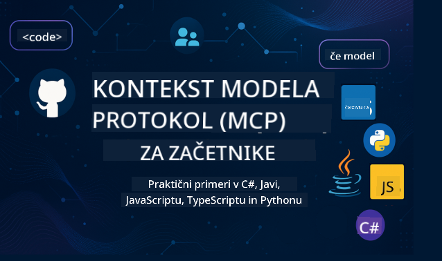

<!--
CO_OP_TRANSLATOR_METADATA:
{
  "original_hash": "2a21391378c12ecfef50f866329dfde0",
  "translation_date": "2025-05-17T05:36:41+00:00",
  "source_file": "README.md",
  "language_code": "sl"
}
-->

Sledite tem korakom, da začnete uporabljati te vire:
1. **Razvejajte repozitorij**: Kliknite 
2. **Klonirajte repozitorij**: `git clone https://github.com/microsoft/mcp-for-beginners.git`
3. [**Pridružite se Microsoft Azure AI Foundry Discordu in spoznajte strokovnjake ter kolege razvijalce**](https://discord.com/invite/ByRwuEEgH4)

### 🌐 Podpora za več jezikov

#### Podprto preko GitHub Action (Avtomatizirano in vedno posodobljeno)
[Francoščina](../fr/README.md) | [Španščina](../es/README.md) | [Nemščina](../de/README.md) | [Ruščina](../ru/README.md) | [Arabščina](../ar/README.md) | [Perzijščina (Farsi)](../fa/README.md) | [Urdu](../ur/README.md) | [Kitajščina (poenostavljena)](../zh/README.md) | [Kitajščina (tradicionalna, Macao)](../mo/README.md) | [Kitajščina (tradicionalna, Hong Kong)](../hk/README.md) | [Kitajščina (tradicionalna, Tajvan)](../tw/README.md) | [Japonščina](../ja/README.md) | [Korejščina](../ko/README.md) | [Hindijščina](../hi/README.md) | [Bengalščina](../bn/README.md) | [Maratščina](../mr/README.md) | [Nepalščina](../ne/README.md) | [Pandžabščina (Gurmukhi)](../pa/README.md) | [Portugalščina (Portugalska)](../pt/README.md) | [Portugalščina (Brazilija)](../br/README.md) | [Italijanščina](../it/README.md) | [Poljščina](../pl/README.md) | [Turščina](../tr/README.md) | [Grščina](../el/README.md) | [Tajščina](../th/README.md) | [Švedščina](../sv/README.md) | [Danščina](../da/README.md) | [Norveščina](../no/README.md) | [Finščina](../fi/README.md) | [Nizozemščina](../nl/README.md) | [Hebrejščina](../he/README.md) | [Vietnamščina](../vi/README.md) | [Indonezijščina](../id/README.md) | [Malajščina](../ms/README.md) | [Tagalog (Filipinsko)](../tl/README.md) | [Svahili](../sw/README.md) | [Madžarščina](../hu/README.md) | [Češčina](../cs/README.md) | [Slovaščina](../sk/README.md) | [Romunščina](../ro/README.md) | [Bolgarščina](../bg/README.md) | [Srbščina (cirilica)](../sr/README.md) | [Hrvaščina](../hr/README.md) | [Slovenščina](./README.md)
# 🚀 Vodnik za začetnike: Kurikulum Model Context Protocol (MCP)

## **Učite se MCP s praktičnimi primeri kode v C#, Java, JavaScript, Python in TypeScript**

## 🧠 Pregled kurikuluma Model Context Protocol

**Model Context Protocol (MCP)** je napreden okvir, zasnovan za standardizacijo interakcij med modeli umetne inteligence in odjemalskimi aplikacijami. Ta odprtokodni kurikulum ponuja strukturirano učno pot, ki vključuje praktične primere kodiranja in resnične primere uporabe, v priljubljenih programskih jezikih, kot so C#, Java, JavaScript, TypeScript in Python.

Ne glede na to, ali ste razvijalec AI, sistemski arhitekt ali programski inženir, je ta vodnik vaš celovit vir za obvladovanje osnov MCP in strategij implementacije.

## 🔗 Uradni viri MCP

- 📘 [MCP Dokumentacija](https://modelcontextprotocol.io/) – Podrobne vadnice in uporabniški vodiči  
- 📜 [MCP Specifikacija](https://spec.modelcontextprotocol.io/) – Arhitektura protokola in tehnične reference  
- 🧑‍💻 [MCP GitHub Repozitorij](https://github.com/modelcontextprotocol) – Odprtokodni SDK-ji, orodja in vzorci kode  

## 🧭 Celotna struktura kurikuluma MCP

### 📌 [Uvod v MCP](./00-Introduction/README.md)

- Kaj je Model Context Protocol?
- Zakaj je standardizacija pomembna v AI procesih
- Praktični primeri uporabe in koristi MCP

### 🧩 [Razloženi osnovni koncepti](./01-CoreConcepts/README.md)

- Razumevanje arhitekture odjemalec-strežnik v MCP
- Ključne komponente protokola: zahteve, odgovori in sheme
- Vzorci sporočanja in izmenjave podatkov v MCP

### 🔐 [Varnost v MCP](./02-Security/readme.md)

- Identifikacija varnostnih groženj v sistemih na osnovi MCP
- Tehnike in najboljše prakse za varno izvajanje

### 🚀 [Začetek dela z MCP](./03-GettingStarted/README.md)

- Nastavitev in konfiguracija okolja
- Ustvarjanje osnovnih MCP strežnikov in odjemalcev
- Integracija MCP v obstoječe aplikacije

#### 🧮 Vzorčni projekti MCP kalkulatorja:

  
<strong>Raziščite implementacije kode po jezikih</strong>

  - [Primer MCP strežnika v C#](./03-GettingStarted/samples/csharp/README.md)
  - [Java MCP Kalkulator](./03-GettingStarted/samples/java/calculator/README.md)
  - [JavaScript MCP Demo](./03-GettingStarted/samples/javascript/README.md)
  - [Python MCP Strežnik](../../03-GettingStarted/samples/python/mcp_calculator_server.py)
  - [Primer MCP v TypeScript](./03-GettingStarted/samples/typescript/README.md)

### 🛠️ [Praktična implementacija](./04-PracticalImplementation/README.md)

- Uporaba SDK-jev v različnih jezikih
- Odpravljanje napak, testiranje in validacija
- Oblikovanje ponovno uporabnih predlog in delovnih tokov

#### 💡 Napredni projekti MCP kalkulatorja:

  
<strong>Raziščite napredne vzorce</strong>

  - [Napredni vzorec v C#](./04-PracticalImplementation/samples/csharp/README.md)
  - [Java Primer aplikacije v kontejnerju](./04-PracticalImplementation/samples/java/containerapp/README.md)
  - [JavaScript Napredni vzorec](./04-PracticalImplementation/samples/javascript/README.md)
  - [Python Kompleksna implementacija](../../04-PracticalImplementation/samples/python/mcp_sample.py)
  - [TypeScript Vzorec kontejnerja](./04-PracticalImplementation/samples/typescript/README.md)

### 🎓 [Napredne teme v MCP](./05-AdvancedTopics/README.md)

- Večmodalni AI delovni tokovi in razširljivost
- Strategije za varno skaliranje
- MCP v podjetniških ekosistemih

### 🌍 [Prispevki skupnosti](./06-CommunityContributions/README.md)

- Kako prispevati kodo in dokumentacijo
- Sodelovanje preko GitHub-a
- Izboljšave in povratne informacije, ki jih vodi skupnost

### 📈 [Vpogledi iz zgodnje uporabe](./07-CaseStudies/README.md)

- Resnična izvajanja in kaj je delovalo
- Gradnja in uvajanje rešitev na osnovi MCP
- Trendi in prihodnja načrtovanja

### 📏 [Najboljše prakse za MCP](./08-BestPractices/README.md)

- Izboljšanje zmogljivosti in optimizacija
- Oblikovanje sistemov MCP, odpornih na napake
- Strategije testiranja in odpornosti

### 📊 [Študije primerov MCP](./09-CaseStudy/Readme.md)

- Poglobljene analize arhitektur rešitev MCP
- Načrti za uvajanje in nasveti za integracijo
- Anotirani diagrami in pregled projektov

## 🎯 Predpogoji za učenje MCP

Da bi kar najbolje izkoristili ta kurikulum, bi morali imeti:

- Osnovno znanje C#, Java ali Python
- Razumevanje modela odjemalec-strežnik in API-jev
- (Neobvezno) Poznavanje konceptov strojnega učenja

## 🛠️ Kako učinkovito uporabljati ta kurikulum

Vsaka lekcija v tem vodniku vključuje:

1. Jasne razlage konceptov MCP  
2. Žive primere kode v več jezikih  
3. Vaje za izdelavo resničnih aplikacij MCP  
4. Dodatne vire za napredne učence  

## 📜 Informacije o licenci

Ta vsebina je licencirana pod **MIT Licenco**. Za pogoje in določila si oglejte [LICENSE](../../LICENSE).

## 🤝 Smernice za prispevanje

Ta projekt sprejema prispevke in predloge. Večina prispevkov zahteva, da se strinjate s
Contributor License Agreement (CLA), ki potrjuje, da imate pravico, da nam dejansko podelite
pravice za uporabo vašega prispevka. Za podrobnosti obiščite <https://cla.opensource.microsoft.com>.

Ko pošljete pull request, bo CLA bot samodejno ugotovil, ali morate predložiti
CLA in ustrezno okrasiti PR (npr. preverjanje stanja, komentar). Sledite navodilom
bota. To boste morali storiti le enkrat za vse repozitorije, ki uporabljajo naš CLA.

Ta projekt je sprejel [Microsoft Open Source Code of Conduct](https://opensource.microsoft.com/codeofconduct/).
Za več informacij si oglejte [Code of Conduct FAQ](https://opensource.microsoft.com/codeofconduct/faq/) ali
kontaktirajte [opencode@microsoft.com](mailto:opencode@microsoft.com) za dodatna vprašanja ali komentarje.

## ™️ Obvestilo o blagovnih znamkah

Ta projekt lahko vsebuje blagovne znamke ali logotipe za projekte, izdelke ali storitve. Dovoljena uporaba Microsoftovih
blagovnih znamk ali logotipov je predmet in mora slediti
[Microsoftove smernice za blagovne znamke in blagovno znamko](https://www.microsoft.com/legal/intellectualproperty/trademarks/usage/general).
Uporaba Microsoftovih blagovnih znamk ali logotipov v spremenjenih različicah tega projekta ne sme povzročiti zmede ali nakazovati sponzorstva Microsofta.
Vsaka uporaba blagovnih znamk ali logotipov tretjih oseb je predmet politik teh tretjih oseb.

**Zavrnitev odgovornosti**: 
Ta dokument je bil preveden z uporabo storitve AI prevajanja [Co-op Translator](https://github.com/Azure/co-op-translator). Čeprav si prizadevamo za natančnost, vas prosimo, da se zavedate, da lahko avtomatizirani prevodi vsebujejo napake ali netočnosti. Izvirni dokument v njegovem maternem jeziku je treba obravnavati kot avtoritativni vir. Za kritične informacije je priporočljivo profesionalno človeško prevajanje. Ne odgovarjamo za kakršna koli napačna razumevanja ali napačne razlage, ki izhajajo iz uporabe tega prevoda.