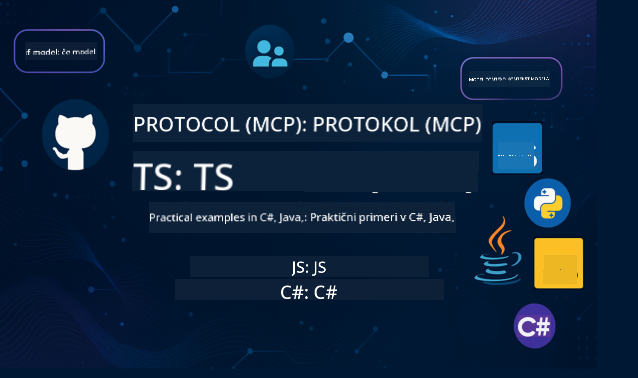

<!--
CO_OP_TRANSLATOR_METADATA:
{
  "original_hash": "866c8877136cb03e1efb9ad633a2f0a6",
  "translation_date": "2025-08-26T18:24:23+00:00",
  "source_file": "README.md",
  "language_code": "sl"
}
-->
 

Sledite tem korakom, da začnete uporabljati te vire:
1. **Forkajte repozitorij**: Kliknite 
2. **Klonirajte repozitorij**:   `git clone https://github.com/microsoft/mcp-for-beginners.git`
3. [**Pridružite se Azure AI Foundry Discordu in spoznajte strokovnjake ter druge razvijalce**](https://discord.com/invite/ByRwuEEgH4)

### 🌐 Večjezična podpora

#### Podprto prek GitHub Action (Avtomatizirano in vedno posodobljeno)

 [Arabic](../ar/README.md) | [Bengali](../bn/README.md) | [Bulgarian](../bg/README.md) | [Burmese (Myanmar)](../my/README.md) | [Chinese (Simplified)](../zh/README.md) | [Chinese (Traditional, Hong Kong)](../hk/README.md) | [Chinese (Traditional, Macau)](../mo/README.md) | [Chinese (Traditional, Taiwan)](../tw/README.md) | [Croatian](../hr/README.md) | [Czech](../cs/README.md) | [Danish](../da/README.md) | [Dutch](../nl/README.md) | [Finnish](../fi/README.md) | [French](../fr/README.md) | [German](../de/README.md) | [Greek](../el/README.md) | [Hebrew](../he/README.md) | [Hindi](../hi/README.md) | [Hungarian](../hu/README.md) | [Indonesian](../id/README.md) | [Italian](../it/README.md) | [Japanese](../ja/README.md) | [Korean](../ko/README.md) | [Malay](../ms/README.md) | [Marathi](../mr/README.md) | [Nepali](../ne/README.md) | [Norwegian](../no/README.md) | [Persian (Farsi)](../fa/README.md) | [Polish](../pl/README.md) | [Portuguese (Brazil)](../br/README.md) | [Portuguese (Portugal)](../pt/README.md) | [Punjabi (Gurmukhi)](../pa/README.md) | [Romanian](../ro/README.md) | [Russian](../ru/README.md) | [Serbian (Cyrillic)](../sr/README.md) | [Slovak](../sk/README.md) | [Slovenian](./README.md) | [Spanish](../es/README.md) | [Swahili](../sw/README.md) | [Swedish](../sv/README.md) | [Tagalog (Filipino)](../tl/README.md) | [Thai](../th/README.md) | [Turkish](../tr/README.md) | [Ukrainian](../uk/README.md) | [Urdu](../ur/README.md) | [Vietnamese](../vi/README.md)

# 🚀 Učni načrt za Model Context Protocol (MCP) za začetnike

## **Naučite se MCP z praktičnimi primeri kode v C#, Java, JavaScript, Rust, Python in TypeScript**

## 🧠 Pregled učnega načrta za Model Context Protocol

**Model Context Protocol (MCP)** je napreden okvir, zasnovan za standardizacijo interakcij med AI modeli in odjemalskimi aplikacijami. Ta odprtokodni učni načrt ponuja strukturirano pot učenja, ki vključuje praktične primere kodiranja in primere uporabe iz resničnega sveta v priljubljenih programskih jezikih, kot so C#, Java, JavaScript, TypeScript in Python.

Ne glede na to, ali ste AI razvijalec, sistemski arhitekt ali programski inženir, je ta vodnik vaš celovit vir za obvladovanje osnov MCP in strategij implementacije.

## 🔗 Uradni viri za MCP

- 📘 [MCP Dokumentacija](https://modelcontextprotocol.io/) – Podrobni vodiči in uporabniški priročniki  
- 📜 [MCP Specifikacija](https://modelcontextprotocol.io/docs/) – Arhitektura protokola in tehnične reference  
- 📜 [Izvirna MCP Specifikacija](https://spec.modelcontextprotocol.io/) – Tehnične reference za starejše različice (morda vsebujejo dodatne podrobnosti)  
- 🧑‍💻 [MCP GitHub Repozitorij](https://github.com/modelcontextprotocol) – Odprtokodni SDK-ji, orodja in primeri kode
- 🌐 [MCP Skupnost](https://github.com/orgs/modelcontextprotocol/discussions) – Pridružite se razpravam in prispevajte k skupnosti

## 🧭 Pregled učnega načrta MCP

### 📚 Popolna struktura učnega načrta

| Modul | Tema | Opis | Povezava |
|-------|------|-------|----------|
| **Modul 1-3: Osnove** | | | |
| 00 | Uvod v MCP | Pregled Model Context Protocol in njegovega pomena v AI procesih | [Preberi več](./00-Introduction/README.md) |
| 01 | Razlaga osnovnih konceptov | Podroben pregled osnovnih konceptov MCP | [Preberi več](./01-CoreConcepts/README.md) |
| 02 | Varnost v MCP | Grožnje varnosti in najboljše prakse | [Preberi več](./02-Security/README.md) |
| 03 | Začetek z MCP | Nastavitev okolja, osnovni strežniki/odjemalci, integracija | [Preberi več](./03-GettingStarted/README.md) |
| **Modul 3: Izdelava prvega strežnika in odjemalca** | | | |
| 3.1 | Prvi strežnik | Ustvarite svoj prvi MCP strežnik | [Vodič](./03-GettingStarted/01-first-server/README.md) |
| 3.2 | Prvi odjemalec | Razvijte osnovni MCP odjemalec | [Vodič](./03-GettingStarted/02-client/README.md) |
| 3.3 | Odjemalec z LLM | Integrirajte velike jezikovne modele | [Vodič](./03-GettingStarted/03-llm-client/README.md) |
| 3.4 | Integracija z VS Code | Uporabite MCP strežnike v VS Code | [Vodič](./03-GettingStarted/04-vscode/README.md) |
| 3.5 | stdio strežnik | Ustvarite strežnike z uporabo stdio transporta | [Vodič](./03-GettingStarted/05-stdio-server/README.md) |
| 3.6 | HTTP pretakanje | Implementirajte HTTP pretakanje v MCP | [Vodič](./03-GettingStarted/06-http-streaming/README.md) |
| 3.7 | AI Orodjarna | Uporabite AI Orodjarno z MCP | [Vodič](./03-GettingStarted/07-aitk/README.md) |
| 3.8 | Testiranje | Testirajte svojo implementacijo MCP strežnika | [Vodič](./03-GettingStarted/08-testing/README.md) |
| 3.9 | Uvajanje | Uvedite MCP strežnike v produkcijo | [Vodič](./03-GettingStarted/09-deployment/README.md) |
| **Modul 4-5: Praktično in napredno** | | | |
| 04 | Praktična implementacija | SDK-ji, razhroščevanje, testiranje, ponovno uporabne predloge za pozive | [Preberi več](./04-PracticalImplementation/README.md) |
| 05 | Napredne teme v MCP | Multimodalni AI, skaliranje, uporaba v podjetjih | [Preberi več](./05-AdvancedTopics/README.md) |
| 5.1 | Integracija z Azure | MCP integracija z Azure | [Vodič](./05-AdvancedTopics/mcp-integration/README.md) |
| 5.2 | Multimodalnost | Delo z več modalnostmi | [Vodič](./05-AdvancedTopics/mcp-multi-modality/README.md) |
| 5.3 | OAuth2 Demo | Implementirajte OAuth2 avtentikacijo | [Vodič](./05-AdvancedTopics/mcp-oauth2-demo/README.md) |
| 5.4 | Root konteksti | Razumevanje in implementacija root kontekstov | [Vodič](./05-AdvancedTopics/mcp-root-contexts/README.md) |
| 5.5 | Usmerjanje | Strategije usmerjanja v MCP | [Vodič](./05-AdvancedTopics/mcp-routing/README.md) |
| 5.6 | Vzorčenje | Tehnike vzorčenja v MCP | [Vodič](./05-AdvancedTopics/mcp-sampling/README.md) |
| 5.7 | Skaliranje | Skaliranje MCP implementacij | [Vodič](./05-AdvancedTopics/mcp-scaling/README.md) |
| 5.8 | Varnost | Napredni varnostni vidiki | [Vodič](./05-AdvancedTopics/mcp-security/README.md) |
| 5.9 | Spletno iskanje | Implementirajte funkcionalnosti spletnega iskanja | [Vodič](./05-AdvancedTopics/web-search-mcp/README.md) |
| 5.10 | Pretakanje v realnem času | Zgradite funkcionalnost pretakanja v realnem času | [Vodič](./05-AdvancedTopics/mcp-realtimestreaming/README.md) |
| 5.11 | Iskanje v realnem času | Implementirajte iskanje v realnem času | [Vodič](./05-AdvancedTopics/mcp-realtimesearch/README.md) |
| 5.12 | Entra ID Avtentikacija | Avtentikacija z Microsoft Entra ID | [Vodič](./05-AdvancedTopics/mcp-security-entra/README.md) |
| 5.13 | Integracija z Foundry | Integracija z Azure AI Foundry | [Vodič](./05-AdvancedTopics/mcp-foundry-agent-integration/README.md) |
| 5.14 | Inženiring konteksta | Tehnike za učinkovito upravljanje konteksta | [Vodič](./05-AdvancedTopics/mcp-contextengineering/README.md) |
| **Modul 6-10: Skupnost in najboljše prakse** | | | |
| 06 | Prispevki skupnosti | Kako prispevati k MCP ekosistemu | [Vodič](./06-CommunityContributions/README.md) |
| 07 | Uvidi iz zgodnje uporabe | Zgodbe o implementaciji iz resničnega sveta | [Vodič](./07-LessonsFromEarlyAdoption/README.md) |
| 08 | Najboljše prakse za MCP | Zmogljivost, odpornost na napake, odpornost | [Vodič](./08-BestPractices/README.md) |
| 09 | Primeri uporabe MCP | Praktični primeri implementacije | [Vodič](./09-CaseStudy/README.md) |
| 10 | Delavnica | Izdelava MCP strežnika z AI Orodjarno | [Laboratorij](./10-StreamliningAIWorkflowsBuildingAnMCPServerWithAIToolkit/README.md) |

### 💻 Vzorčni projekti kode

#### Osnovni primeri MCP kalkulatorja

| Jezik | Opis | Povezava |
|-------|------|----------|
| C# | Primer MCP strežnika | [Poglej kodo](./03-GettingStarted/samples/csharp/README.md) |
| Java | MCP Kalkulator | [Poglej kodo](./03-GettingStarted/samples/java/calculator/README.md) |
| JavaScript | MCP Demo | [Poglej kodo](./03-GettingStarted/samples/javascript/README.md) |
| Python | MCP Strežnik | [Poglej kodo](../../03-GettingStarted/samples/python/mcp_calculator_server.py) |
| TypeScript | MCP Primer | [Poglej kodo](./03-GettingStarted/samples/typescript/README.md) |
| Rust | MCP Primer | [Poglej kodo](./03-GettingStarted/samples/rust/README.md) |

#### Napredne implementacije MCP

| Jezik | Opis | Povezava |
|-------|------|----------|
| C# | Napreden primer | [View Code](./04-PracticalImplementation/samples/csharp/README.md) |
| Java s Spring | Primer aplikacije v vsebniku | [View Code](./04-PracticalImplementation/samples/java/containerapp/README.md) |
| JavaScript | Napreden primer | [View Code](./04-PracticalImplementation/samples/javascript/README.md) |
| Python | Kompleksna implementacija | [View Code](../../04-PracticalImplementation/samples/python/READMEmd) |
| TypeScript | Primer aplikacije v vsebniku | [View Code](./04-PracticalImplementation/samples/typescript/README.md) |

## 🎯 Predpogoji za učenje MCP

Da boste kar najbolje izkoristili to gradivo, bi morali imeti:

- Osnovno znanje programiranja v vsaj enem od naslednjih jezikov: C#, Java, JavaScript, Python ali TypeScript  
- Razumevanje modela odjemalec-strežnik in API-jev  
- Poznavanje konceptov REST in HTTP  
- (Neobvezno) Osnove konceptov umetne inteligence/strojnega učenja  

- Pridružitev našim skupnostnim razpravam za podporo  

## 📚 Vodnik za učenje in viri

Ta repozitorij vključuje več virov, ki vam bodo pomagali pri učenju in učinkovitem raziskovanju:

### Vodnik za učenje

Na voljo je obsežen [Vodnik za učenje](./study_guide.md), ki vam bo pomagal učinkovito raziskovati ta repozitorij. Vodnik vključuje:

- Vizualni zemljevid učnega načrta z vsemi obravnavanimi temami  
- Podroben pregled vsakega dela repozitorija  
- Navodila za uporabo vzorčnih projektov  
- Priporočene učne poti za različne ravni znanja  
- Dodatne vire za dopolnitev vašega učnega procesa  

### Dnevnik sprememb

Vzdržujemo podroben [Dnevnik sprememb](./changelog.md), ki beleži vse pomembne posodobitve učnega gradiva, vključno z:

- Dodajanjem nove vsebine  
- Strukturnimi spremembami  
- Izboljšavami funkcionalnosti  
- Posodobitvami dokumentacije  

## 🛠️ Kako učinkovito uporabljati to gradivo

Vsaka lekcija v tem vodniku vključuje:

1. Jasne razlage konceptov MCP  
2. Žive primere kode v več programskih jezikih  
3. Vaje za izdelavo pravih MCP aplikacij  
4. Dodatne vire za napredne učence  

## Dogodki 

### [MCP Dev Days julij 2025](https://developer.microsoft.com/en-us/reactor/series/S-1563/)
#### [➡️Oglejte si na zahtevo - MCP Dev Days](https://developer.microsoft.com/en-us/reactor/series/S-1563/)
Pripravite se na dva dneva poglobljenih tehničnih vpogledov, povezovanja s skupnostjo in praktičnega učenja na dogodku MCP Dev Days, virtualnem dogodku, posvečenem Model Context Protocol (MCP) — nastajajočemu standardu, ki povezuje modele umetne inteligence in orodja, na katera se zanašajo.  
Dogodek si lahko ogledate z registracijo na naši strani: https://aka.ms/mcpdevdays.  

#### [1. dan: Produktivnost MCP, razvojna orodja in skupnost:](https://developer.microsoft.com/en-us/reactor/series/S-1563/)

Osredotočen je na opolnomočenje razvijalcev za uporabo MCP v njihovem delovnem toku in praznovanje izjemne skupnosti MCP. Pridružili se nam bodo člani skupnosti in partnerji, kot so Arcade, Block, Okta in Neon, da pokažejo, kako sodelujejo z Microsoftom pri oblikovanju odprtega, razširljivega ekosistema MCP.  
Resnični primeri uporabe v orodjih, kot so VS Code, Visual Studio, GitHub Copilot in priljubljena orodja skupnosti  
Praktični, kontekstno usmerjeni delovni tokovi za razvijalce  
Seje, ki jih vodi skupnost, in vpogledi  
Ne glede na to, ali šele začenjate z MCP ali ga že uporabljate, bo 1. dan postavil temelje z navdihom in uporabnimi nasveti.  

#### [2. dan: Zgradite MCP strežnike z zaupanjem](https://developer.microsoft.com/en-us/reactor/series/S-1563/)

Namenjen je graditeljem MCP. Poglobljeno bomo raziskali strategije implementacije in najboljše prakse za ustvarjanje MCP strežnikov ter integracijo MCP v vaše delovne tokove umetne inteligence.  

#### Teme vključujejo:

- Gradnja MCP strežnikov in njihova integracija v izkušnje z agenti  
- Razvoj, ki temelji na pozivih  
- Najboljše prakse za varnost  
- Uporaba gradnikov, kot so Functions, ACA in API Management  
- Poravnava registra in orodja (1P + 3P)  

Če ste razvijalec, graditelj orodij ali strateg za AI produkte, je ta dan poln vpogledov, ki jih potrebujete za gradnjo skalabilnih, varnih in prihodnosti prilagojenih MCP rešitev.  

### MCP Boot Camp avgust 2025
Naučite se v intenzivnih video sejah, kako ustvariti MCP strežnike, jih integrirati z VS Code in jih profesionalno namestiti na Azure, na podlagi vsebine iz učnega načrta MCP za začetnike. Pridobite praktične veščine v tehnologiji, ki jo že uporabljajo velike korporacije.  

#### [➡️Oglejte si na zahtevo MCP Bootcamp | Angleščina](https://developer.microsoft.com/en-us/reactor/series/s-1568/)  
#### [➡️Oglejte si na zahtevo MCP Bootcamp | Brazilščina](https://developer.microsoft.com/en-us/reactor/series/S-1566/)  
#### [➡️Oglejte si na zahtevo MCP Bootcamp | Španščina](https://developer.microsoft.com/en-us/reactor/series/S-1567/)  

## 🌟 Zahvala skupnosti

Hvala Microsoftovemu cenjenemu strokovnjaku [Shivam Goyal](https://www.linkedin.com/in/shivam2003/) za prispevanje pomembnih vzorcev kode.  

## 📜 Informacije o licenci

Ta vsebina je licencirana pod **MIT licenco**. Za pogoje in določila glejte [LICENSE](../../LICENSE).  

## 🤝 Smernice za prispevanje

Ta projekt pozdravlja prispevke in predloge. Večina prispevkov zahteva, da se strinjate s
Contributor License Agreement (CLA), ki potrjuje, da imate pravico in dejansko podeljujete pravice za uporabo vašega prispevka. Za podrobnosti obiščite  
<https://cla.opensource.microsoft.com>.  

Ko oddate pull request, bo CLA bot samodejno določil, ali morate zagotoviti CLA, in ustrezno označil PR (npr. statusni pregled, komentar). Preprosto sledite navodilom, ki jih zagotovi bot. To boste morali storiti le enkrat za vse repozitorije, ki uporabljajo naš CLA.  

Ta projekt je sprejel [Microsoftov Kodeks ravnanja za odprtokodno programsko opremo](https://opensource.microsoft.com/codeofconduct/).  
Za več informacij si oglejte [Pogosta vprašanja o kodeksu ravnanja](https://opensource.microsoft.com/codeofconduct/faq/) ali se obrnite na [opencode@microsoft.com](mailto:opencode@microsoft.com) z dodatnimi vprašanji ali komentarji.  

## 📂 Struktura repozitorija

Repozitorij je organiziran na naslednji način:

- **Osnovni učni načrt (00-10)**: Glavna vsebina, organizirana v deset zaporednih modulov  
- **images/**: Diagrami in ilustracije, uporabljeni v učnem načrtu  
- **translations/**: Večjezična podpora z avtomatiziranimi prevodi  
- **translated_images/**: Lokalizirane različice diagramov in ilustracij  
- **study_guide.md**: Obsežen vodnik za raziskovanje repozitorija  
- **changelog.md**: Zapis vseh pomembnih sprememb učnega gradiva  
- **mcp.json**: Konfiguracijska datoteka za specifikacijo MCP  
- **CODE_OF_CONDUCT.md, LICENSE, SECURITY.md, SUPPORT.md**: Dokumenti za upravljanje projekta  

## 🎒 Drugi tečaji
Naša ekipa ustvarja tudi druge tečaje! Oglejte si:

- [AI Agents For Beginners](https://github.com/microsoft/ai-agents-for-beginners?WT.mc_id=academic-105485-koreyst)  
- [Generative AI for Beginners using .NET](https://github.com/microsoft/Generative-AI-for-beginners-dotnet?WT.mc_id=academic-105485-koreyst)  
- [Generative AI for Beginners using JavaScript](https://github.com/microsoft/generative-ai-with-javascript?WT.mc_id=academic-105485-koreyst)  
- [Generative AI for Beginners](https://github.com/microsoft/generative-ai-for-beginners?WT.mc_id=academic-105485-koreyst)  
- [Generative AI for Beginners using Java](https://github.com/microsoft/generative-ai-for-beginners-java?WT.mc_id=academic-105485-koreyst)  
- [ML for Beginners](https://aka.ms/ml-beginners?WT.mc_id=academic-105485-koreyst)  
- [Data Science for Beginners](https://aka.ms/datascience-beginners?WT.mc_id=academic-105485-koreyst)  
- [AI for Beginners](https://aka.ms/ai-beginners?WT.mc_id=academic-105485-koreyst)  
- [Cybersecurity for Beginners](https://github.com/microsoft/Security-101?WT.mc_id=academic-96948-sayoung)  
- [Web Dev for Beginners](https://aka.ms/webdev-beginners?WT.mc_id=academic-105485-koreyst)  
- [IoT for Beginners](https://aka.ms/iot-beginners?WT.mc_id=academic-105485-koreyst)  
- [XR Development for Beginners](https://github.com/microsoft/xr-development-for-beginners?WT.mc_id=academic-105485-koreyst)  
- [Mastering GitHub Copilot for AI Paired Programming](https://aka.ms/GitHubCopilotAI?WT.mc_id=academic-105485-koreyst)  
- [Mastering GitHub Copilot for C#/.NET Developers](https://github.com/microsoft/mastering-github-copilot-for-dotnet-csharp-developers?WT.mc_id=academic-105485-koreyst)  
- [Choose Your Own Copilot Adventure](https://github.com/microsoft/CopilotAdventures?WT.mc_id=academic-105485-koreyst)  

## ™️ Obvestilo o blagovnih znamkah

Ta projekt lahko vsebuje blagovne znamke ali logotipe za projekte, izdelke ali storitve. Pooblaščena uporaba Microsoftovih
blagovnih znamk ali logotipov mora biti skladna z in mora upoštevati
[Microsoftove smernice za blagovne znamke in blagovne znake](https://www.microsoft.com/legal/intellectualproperty/trademarks/usage/general).  
Uporaba Microsoftovih blagovnih znamk ali logotipov v spremenjenih različicah tega projekta ne sme povzročiti zmede ali nakazovati sponzorstva Microsofta.  
Vsaka uporaba blagovnih znamk ali logotipov tretjih oseb mora biti skladna s politikami teh tretjih oseb.  

---

**Omejitev odgovornosti**:  
Ta dokument je bil preveden z uporabo storitve za prevajanje z umetno inteligenco [Co-op Translator](https://github.com/Azure/co-op-translator). Čeprav si prizadevamo za natančnost, vas prosimo, da upoštevate, da lahko avtomatizirani prevodi vsebujejo napake ali netočnosti. Izvirni dokument v njegovem maternem jeziku je treba obravnavati kot avtoritativni vir. Za ključne informacije priporočamo profesionalni človeški prevod. Ne prevzemamo odgovornosti za morebitna napačna razumevanja ali napačne interpretacije, ki bi nastale zaradi uporabe tega prevoda.