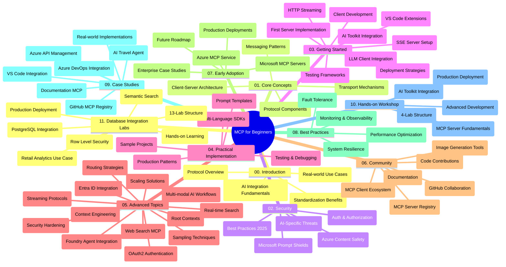

<!--
CO_OP_TRANSLATOR_METADATA:
{
  "original_hash": "aa1ce97bc694b08faf3018bab6d275b9",
  "translation_date": "2025-09-30T22:44:33+00:00",
  "source_file": "study_guide.md",
  "language_code": "sl"
}
-->
# Protokol konteksta modela (MCP) za začetnike - Vodnik za študij

Ta vodnik za študij ponuja pregled strukture in vsebine repozitorija za učni načrt "Protokol konteksta modela (MCP) za začetnike". Uporabite ta vodnik za učinkovito navigacijo po repozitoriju in kar najboljše izkoristite razpoložljive vire.

## Pregled repozitorija

Protokol konteksta modela (MCP) je standardiziran okvir za interakcije med modeli umetne inteligence in odjemalskimi aplikacijami. MCP je bil sprva ustvarjen pri Anthropic, zdaj pa ga vzdržuje širša skupnost MCP prek uradne organizacije na GitHubu. Ta repozitorij ponuja celovit učni načrt s praktičnimi primeri kode v C#, Java, JavaScript, Python in TypeScript, namenjen razvijalcem AI, sistemskim arhitektom in programskim inženirjem.

## Vizualni zemljevid učnega načrta

## Struktura repozitorija

Repozitorij je organiziran v enajst glavnih razdelkov, od katerih se vsak osredotoča na različne vidike MCP:

1. **Uvod (00-Introduction/)**
   - Pregled protokola konteksta modela
   - Zakaj je standardizacija pomembna v AI procesih
   - Praktični primeri uporabe in koristi

2. **Osnovni koncepti (01-CoreConcepts/)**
   - Arhitektura odjemalec-strežnik
   - Ključne komponente protokola
   - Vzorci sporočanja v MCP

3. **Varnost (02-Security/)**
   - Grožnje varnosti v sistemih, ki temeljijo na MCP
   - Najboljše prakse za varne implementacije
   - Strategije za avtentikacijo in avtorizacijo
   - **Celovita dokumentacija o varnosti**:
     - Najboljše prakse za varnost MCP 2025
     - Vodnik za implementacijo varnosti vsebin Azure
     - Nadzor in tehnike varnosti MCP
     - Hitri referenčni priročnik za najboljše prakse MCP
   - **Ključne teme varnosti**:
     - Napadi z vbrizgavanjem pozivov in zastrupitev orodij
     - Ugrabitev sej in težave z zmedenim namestnikom
     - Ranljivosti pri prenosu žetonov
     - Prekomerne pravice in nadzor dostopa
     - Varnost dobavne verige za AI komponente
     - Integracija Microsoft Prompt Shields

4. **Začetek (03-GettingStarted/)**
   - Nastavitev okolja in konfiguracija
   - Ustvarjanje osnovnih MCP strežnikov in odjemalcev
   - Integracija z obstoječimi aplikacijami
   - Vključuje razdelke za:
     - Prvo implementacijo strežnika
     - Razvoj odjemalca
     - Integracijo odjemalca LLM
     - Integracijo z VS Code
     - Strežnik za dogodke, poslane s strežnika (SSE)
     - HTTP pretakanje
     - Integracijo AI orodij
     - Strategije testiranja
     - Smernice za uvajanje

5. **Praktična implementacija (04-PracticalImplementation/)**
   - Uporaba SDK-jev v različnih programskih jezikih
   - Tehnike za odpravljanje napak, testiranje in validacijo
   - Oblikovanje ponovno uporabnih predlog pozivov in delovnih tokov
   - Vzorčni projekti s primeri implementacije

6. **Napredne teme (05-AdvancedTopics/)**
   - Tehnike inženiringa konteksta
   - Integracija agentov Foundry
   - Multimodalni AI delovni tokovi
   - Demosi avtentikacije OAuth2
   - Zmožnosti iskanja v realnem času
   - Pretakanje v realnem času
   - Implementacija korenskih kontekstov
   - Strategije usmerjanja
   - Tehnike vzorčenja
   - Pristopi k skaliranju
   - Varnostni vidiki
   - Integracija varnosti Entra ID
   - Integracija spletnega iskanja

7. **Prispevki skupnosti (06-CommunityContributions/)**
   - Kako prispevati kodo in dokumentacijo
   - Sodelovanje prek GitHuba
   - Izboljšave in povratne informacije, ki jih vodi skupnost
   - Uporaba različnih MCP odjemalcev (Claude Desktop, Cline, VSCode)
   - Delo z priljubljenimi MCP strežniki, vključno z generiranjem slik

8. **Lekcije iz zgodnje uporabe (07-LessonsfromEarlyAdoption/)**
   - Implementacije v resničnem svetu in zgodbe o uspehu
   - Gradnja in uvajanje rešitev, ki temeljijo na MCP
   - Trendi in prihodnja načrtovanja
   - **Vodnik za Microsoft MCP strežnike**: Celovit vodnik za 10 produkcijsko pripravljenih Microsoft MCP strežnikov, vključno z:
     - Microsoft Learn Docs MCP strežnik
     - Azure MCP strežnik (15+ specializiranih konektorjev)
     - GitHub MCP strežnik
     - Azure DevOps MCP strežnik
     - MarkItDown MCP strežnik
     - SQL Server MCP strežnik
     - Playwright MCP strežnik
     - Dev Box MCP strežnik
     - Azure AI Foundry MCP strežnik
     - Microsoft 365 Agents Toolkit MCP strežnik

9. **Najboljše prakse (08-BestPractices/)**
   - Izboljšanje zmogljivosti in optimizacija
   - Oblikovanje sistemov MCP, odpornih na napake
   - Strategije testiranja in odpornosti

10. **Študije primerov (09-CaseStudy/)**
    - **Sedem celovitih študij primerov**, ki prikazujejo vsestranskost MCP v različnih scenarijih:
    - **Azure AI potovalni agenti**: Orkestracija več agentov z Azure OpenAI in AI Search
    - **Integracija Azure DevOps**: Avtomatizacija delovnih procesov z YouTube posodobitvami podatkov
    - **Pridobivanje dokumentacije v realnem času**: Python konzolni odjemalec s pretakanjem HTTP
    - **Interaktivni generator študijskega načrta**: Chainlit spletna aplikacija s pogovorno AI
    - **Dokumentacija v urejevalniku**: Integracija VS Code z delovnimi tokovi GitHub Copilot
    - **Upravljanje API-jev Azure**: Integracija podjetniških API-jev z ustvarjanjem MCP strežnika
    - **GitHub MCP Register**: Razvoj ekosistema in platforma za agentno integracijo
    - Primeri implementacije, ki zajemajo integracijo podjetij, produktivnost razvijalcev in razvoj ekosistema

11. **Praktična delavnica (10-StreamliningAIWorkflowsBuildingAnMCPServerWithAIToolkit/)**
    - Celovita praktična delavnica, ki združuje MCP z AI Toolkit
    - Gradnja inteligentnih aplikacij, ki povezujejo AI modele z orodji iz resničnega sveta
    - Praktični moduli, ki pokrivajo osnove, razvoj prilagojenega strežnika in strategije uvajanja v produkcijo
    - **Struktura laboratorija**:
      - Laboratorij 1: Osnove MCP strežnika
      - Laboratorij 2: Napreden razvoj MCP strežnika
      - Laboratorij 3: Integracija AI Toolkit
      - Laboratorij 4: Uvajanje v produkcijo in skaliranje
    - Učenje na podlagi laboratorijev s korak-po-korak navodili

12. **Laboratoriji za integracijo MCP strežnika z bazo podatkov (11-MCPServerHandsOnLabs/)**
    - **Celovita 13-laboratorijska učna pot** za gradnjo produkcijsko pripravljenih MCP strežnikov z integracijo PostgreSQL
    - **Implementacija analitike maloprodaje v resničnem svetu** z uporabo primera Zava Retail
    - **Vzorce na ravni podjetja**, vključno z varnostjo na ravni vrstic (RLS), semantičnim iskanjem in dostopom do podatkov za več najemnikov
    - **Celotna struktura laboratorija**:
      - **Laboratoriji 00-03: Osnove** - Uvod, Arhitektura, Varnost, Nastavitev okolja
      - **Laboratoriji 04-06: Gradnja MCP strežnika** - Oblikovanje baze podatkov, Implementacija MCP strežnika, Razvoj orodij
      - **Laboratoriji 07-09: Napredne funkcije** - Semantično iskanje, Testiranje in odpravljanje napak, Integracija VS Code
      - **Laboratoriji 10-12: Produkcija in najboljše prakse** - Uvajanje, Spremljanje, Optimizacija
    - **Pokrite tehnologije**: FastMCP okvir, PostgreSQL, Azure OpenAI, Azure Container Apps, Application Insights
    - **Rezultati učenja**: Produkcijsko pripravljeni MCP strežniki, vzorci integracije baze podatkov, analitika, ki jo poganja AI, varnost na ravni podjetja

## Dodatni viri

Repozitorij vključuje podporne vire:

- **Mapa slik**: Vsebuje diagrame in ilustracije, uporabljene v učnem načrtu
- **Prevodi**: Podpora za več jezikov z avtomatiziranimi prevodi dokumentacije
- **Uradni viri MCP**:
  - [Dokumentacija MCP](https://modelcontextprotocol.io/)
  - [Specifikacija MCP](https://spec.modelcontextprotocol.io/)
  - [GitHub repozitorij MCP](https://github.com/modelcontextprotocol)

## Kako uporabljati ta repozitorij

1. **Sekvenčno učenje**: Sledite poglavjem po vrsti (00 do 11) za strukturirano učno izkušnjo.
2. **Osredotočenost na jezik**: Če vas zanima določen programski jezik, raziščite mape z vzorci za implementacije v vašem izbranem jeziku.
3. **Praktična implementacija**: Začnite z razdelkom "Začetek", da nastavite svoje okolje in ustvarite svoj prvi MCP strežnik in odjemalec.
4. **Napredno raziskovanje**: Ko se seznanite z osnovami, se poglobite v napredne teme za širjenje znanja.
5. **Sodelovanje skupnosti**: Pridružite se skupnosti MCP prek razprav na GitHubu in kanalov Discord za povezovanje s strokovnjaki in drugimi razvijalci.

## MCP odjemalci in orodja

Učni načrt pokriva različne MCP odjemalce in orodja:

1. **Uradni odjemalci**:
   - Visual Studio Code 
   - MCP v Visual Studio Code
   - Claude Desktop
   - Claude v VSCode 
   - Claude API

2. **Odjemalci skupnosti**:
   - Cline (na osnovi terminala)
   - Cursor (urejevalnik kode)
   - ChatMCP
   - Windsurf

3. **Orodja za upravljanje MCP**:
   - MCP CLI
   - MCP Manager
   - MCP Linker
   - MCP Router

## Priljubljeni MCP strežniki

Repozitorij predstavlja različne MCP strežnike, vključno z:

1. **Uradni Microsoft MCP strežniki**:
   - Microsoft Learn Docs MCP strežnik
   - Azure MCP strežnik (15+ specializiranih konektorjev)
   - GitHub MCP strežnik
   - Azure DevOps MCP strežnik
   - MarkItDown MCP strežnik
   - SQL Server MCP strežnik
   - Playwright MCP strežnik
   - Dev Box MCP strežnik
   - Azure AI Foundry MCP strežnik
   - Microsoft 365 Agents Toolkit MCP strežnik

2. **Uradni referenčni strežniki**:
   - Datotečni sistem
   - Fetch
   - Pomnilnik
   - Sekvenčno razmišljanje

3. **Generiranje slik**:
   - Azure OpenAI DALL-E 3
   - Stable Diffusion WebUI
   - Replicate

4. **Razvojna orodja**:
   - Git MCP
   - Nadzor terminala
   - Pomočnik za kodo

5. **Specializirani strežniki**:
   - Salesforce
   - Microsoft Teams
   - Jira & Confluence

## Prispevanje

Ta repozitorij pozdravlja prispevke skupnosti. Oglejte si razdelek Prispevki skupnosti za smernice o tem, kako učinkovito prispevati k ekosistemu MCP.

## Dnevnik sprememb

| Datum | Spremembe |
|------|---------||
| 29. september 2025 | - Dodan razdelek 11-MCPServerHandsOnLabs s celovito 13-laboratorijsko učno potjo za integracijo baze podatkov - Posodobljen vizualni zemljevid učnega načrta, da vključuje laboratorije za integracijo baze podatkov - Izboljšana struktura repozitorija, da odraža enajst glavnih razdelkov - Dodan podroben opis integracije PostgreSQL, primera uporabe analitike maloprodaje in vzorcev na ravni podjetja - Posodobljene smernice za navigacijo, da vključujejo razdelke 00-11 |
| 26. september 2025 | - Dodana študija primera GitHub MCP Register v razdelek 09-CaseStudy - Posodobljene študije primerov, da odražajo sedem celovitih študij primerov - Izboljšani opisi študij primerov s specifičnimi podrobnostmi implementacije - Posodobljen vizualni zemljevid učnega načrta, da vključuje GitHub MCP Register - Revidirana struktura vodnika za študij, da odraža osredotočenost na razvoj ekosistema |
| 18. julij 2025 | - Posodobljena struktura repozitorija, da vključuje vodnik za Microsoft MCP strežnike - Dodan celovit seznam 10 produkcijsko pripravljenih Microsoft MCP strežnikov - Izboljšan razdelek Priljubljeni MCP strežniki z uradnimi Microsoft MCP strežniki - Posodobljen razdelek Študije primerov z dejanskimi primeri datotek - Dodane podrobnosti o strukturi laboratorija za praktično delavnico |
| 16. julij 2025 | - Posodobljena struktura repozitorija, da odraža trenutno vsebino - Dodan razdelek MCP odjemalci in orodja - Dodan razdelek Priljubljeni MCP strežniki - Posodobljen vizualni zemljevid učnega načrta z vsemi trenutnimi temami - Izboljšan razdelek Napredne teme z vsemi specializiranimi področji - Posodobljene študije primerov, da odražajo dejanske primere - Pojasnjen izvor MCP kot ustvarjen pri Anthropic |
| 11. junij 2025 | - Prva ustvaritev vodnika za študij - Dodan vizualni zemljevid učnega načrta - Orisana struktura repozitorija - Vključeni vzorčni projekti in dodatni viri |

---

*Ta vodnik za študij je bil posodobljen 29. septembra 2025 in ponuja pregled repozitorija na ta datum. Vsebina repozitorija se lahko po tem datumu posodobi.*

---

**Omejitev odgovornosti**:  
Ta dokument je bil preveden z uporabo storitve AI za prevajanje [Co-op Translator](https://github.com/Azure/co-op-translator). Čeprav si prizadevamo za natančnost, vas prosimo, da upoštevate, da lahko avtomatizirani prevodi vsebujejo napake ali netočnosti. Izvirni dokument v njegovem maternem jeziku je treba obravnavati kot avtoritativni vir. Za ključne informacije priporočamo profesionalni človeški prevod. Ne prevzemamo odgovornosti za morebitna nesporazumevanja ali napačne razlage, ki izhajajo iz uporabe tega prevoda.