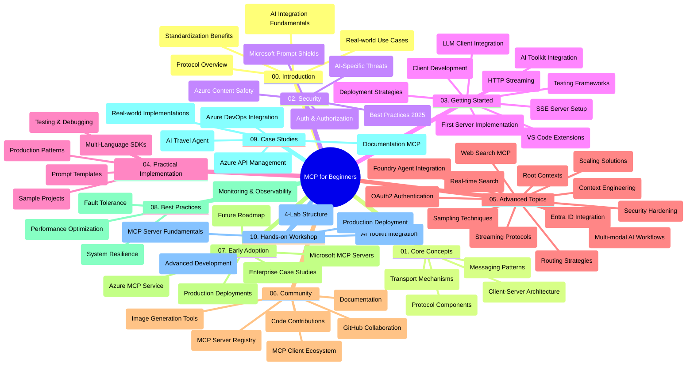

<!--
CO_OP_TRANSLATOR_METADATA:
{
  "original_hash": "e2c6ed897fa98fa08e0146101776c7ff",
  "translation_date": "2025-07-18T10:31:59+00:00",
  "source_file": "study_guide.md",
  "language_code": "sl"
}
-->
# Protokol modelnega konteksta (MCP) za začetnike – študijski vodič

Ta študijski vodič ponuja pregled strukture in vsebine repozitorija za učni načrt "Protokol modelnega konteksta (MCP) za začetnike". Uporabite ta vodič za učinkovito navigacijo po repozitoriju in kar najbolj izkoristite razpoložljive vire.

## Pregled repozitorija

Model Context Protocol (MCP) je standardiziran okvir za interakcije med AI modeli in odjemalskimi aplikacijami. Sprva ga je ustvaril Anthropic, zdaj pa ga vzdržuje širša skupnost MCP prek uradne organizacije na GitHubu. Ta repozitorij ponuja celovit učni načrt s praktičnimi primeri kode v C#, Javi, JavaScriptu, Pythonu in TypeScriptu, namenjen razvijalcem AI, sistemskim arhitektom in programskim inženirjem.

## Vizualna karta učnega načrta

## Struktura repozitorija

Repozitorij je organiziran v deset glavnih sklopov, ki se osredotočajo na različne vidike MCP:

1. **Uvod (00-Introduction/)**
   - Pregled protokola modelnega konteksta
   - Zakaj je standardizacija pomembna v AI procesih
   - Praktični primeri uporabe in koristi

2. **Osnovni pojmi (01-CoreConcepts/)**
   - Arhitektura odjemalec-strežnik
   - Ključne sestavine protokola
   - Vzorce sporočanja v MCP

3. **Varnost (02-Security/)**
   - Varnostne grožnje v sistemih, ki temeljijo na MCP
   - Najboljše prakse za varno implementacijo
   - Strategije avtentikacije in avtorizacije
   - **Celovita varnostna dokumentacija**:
     - MCP Security Best Practices 2025
     - Azure Content Safety Implementation Guide
     - MCP Security Controls and Techniques
     - MCP Best Practices Quick Reference
   - **Ključne varnostne teme**:
     - Napadi z vbrizgavanjem pozivov in zastrupitvijo orodij
     - Prevzem sej in težave z zmedenim pooblaščencem
     - Ranljivosti pri prenašanju žetonov
     - Prekomerne pravice in nadzor dostopa
     - Varnost dobavne verige za AI komponente
     - Integracija Microsoft Prompt Shields

4. **Začetek dela (03-GettingStarted/)**
   - Nastavitev in konfiguracija okolja
   - Ustvarjanje osnovnih MCP strežnikov in odjemalcev
   - Integracija z obstoječimi aplikacijami
   - Vključuje razdelke za:
     - Prvo implementacijo strežnika
     - Razvoj odjemalca
     - Integracijo LLM odjemalca
     - Integracijo v VS Code
     - Strežnik Server-Sent Events (SSE)
     - HTTP pretakanje
     - Integracijo AI Toolkit
     - Strategije testiranja
     - Smernice za nameščanje

5. **Praktična implementacija (04-PracticalImplementation/)**
   - Uporaba SDK-jev v različnih programskih jezikih
   - Tehnike odpravljanja napak, testiranja in validacije
   - Oblikovanje ponovno uporabnih predlog pozivov in delovnih tokov
   - Vzorčni projekti z implementacijskimi primeri

6. **Napredne teme (05-AdvancedTopics/)**
   - Tehnike inženiringa konteksta
   - Integracija Foundry agenta
   - Večmodalni AI delovni tokovi
   - Demonstracije avtentikacije OAuth2
   - Iskanje v realnem času
   - Pretakanje v realnem času
   - Implementacija korenskih kontekstov
   - Strategije usmerjanja
   - Tehnike vzorčenja
   - Pristopi k skaliranju
   - Varnostni vidiki
   - Integracija varnosti Entra ID
   - Integracija spletnega iskanja

7. **Prispevki skupnosti (06-CommunityContributions/)**
   - Kako prispevati k kodi in dokumentaciji
   - Sodelovanje prek GitHuba
   - Izboljšave in povratne informacije, ki jih vodi skupnost
   - Uporaba različnih MCP odjemalcev (Claude Desktop, Cline, VSCode)
   - Delo s priljubljenimi MCP strežniki, vključno z generiranjem slik

8. **Lekcije iz zgodnje uporabe (07-LessonsfromEarlyAdoption/)**
   - Resnični primeri implementacij in uspešne zgodbe
   - Gradnja in uvajanje rešitev na osnovi MCP
   - Trend in prihodnja razvojna pot
   - **Vodnik po Microsoft MCP strežnikih**: Celovit vodič za 10 produkcijsko pripravljenih Microsoft MCP strežnikov, vključno z:
     - Microsoft Learn Docs MCP Server
     - Azure MCP Server (več kot 15 specializiranih konektorjev)
     - GitHub MCP Server
     - Azure DevOps MCP Server
     - MarkItDown MCP Server
     - SQL Server MCP Server
     - Playwright MCP Server
     - Dev Box MCP Server
     - Azure AI Foundry MCP Server
     - Microsoft 365 Agents Toolkit MCP Server

9. **Najboljše prakse (08-BestPractices/)**
   - Nastavitev in optimizacija zmogljivosti
   - Oblikovanje MCP sistemov, odpornih na napake
   - Strategije testiranja in odpornosti

10. **Študije primerov (09-CaseStudy/)**
    - Primer integracije Azure API Management
    - Primer implementacije potovalnega agenta
    - Integracija Azure DevOps z YouTube posodobitvami
    - Primeri implementacije MCP dokumentacije
    - Implementacijski primeri z obsežno dokumentacijo

11. **Praktična delavnica (10-StreamliningAIWorkflowsBuildingAnMCPServerWithAIToolkit/)**
    - Celovita praktična delavnica, ki združuje MCP z AI Toolkit
    - Gradnja inteligentnih aplikacij, ki povezujejo AI modele z orodji iz resničnega sveta
    - Praktični moduli, ki pokrivajo osnove, razvoj prilagojenih strežnikov in strategije uvajanja v produkcijo
    - **Struktura laboratorija**:
      - Laboratorij 1: Osnove MCP strežnika
      - Laboratorij 2: Napredni razvoj MCP strežnika
      - Laboratorij 3: Integracija AI Toolkit
      - Laboratorij 4: Uvajanje v produkcijo in skaliranje
    - Pristop učenja na osnovi laboratorijev s podrobnimi navodili po korakih

## Dodatni viri

Repozitorij vključuje podporne vire:

- **Mapa slik**: Vsebuje diagrame in ilustracije, uporabljene v učnem načrtu
- **Prevodi**: Podpora več jezikom z avtomatiziranimi prevodi dokumentacije
- **Uradni MCP viri**:
  - [MCP Documentation](https://modelcontextprotocol.io/)
  - [MCP Specification](https://spec.modelcontextprotocol.io/)
  - [MCP GitHub Repository](https://github.com/modelcontextprotocol)

## Kako uporabljati ta repozitorij

1. **Učenje po vrsti**: Sledite poglavjem po zaporedju (od 00 do 10) za strukturirano učenje.
2. **Osredotočenost na jezik**: Če vas zanima določen programski jezik, preglejte mape s primeri za implementacije v želenem jeziku.
3. **Praktična implementacija**: Začnite z razdelkom "Začetek dela" za nastavitev okolja in ustvarjanje prvega MCP strežnika in odjemalca.
4. **Napredno raziskovanje**: Ko obvladate osnove, se poglobite v napredne teme za širitev znanja.
5. **Vključevanje v skupnost**: Pridružite se skupnosti MCP prek GitHub razprav in Discord kanalov, da se povežete s strokovnjaki in drugimi razvijalci.

## MCP odjemalci in orodja

Učni načrt pokriva različne MCP odjemalce in orodja:

1. **Uradni odjemalci**:
   - Visual Studio Code
   - MCP v Visual Studio Code
   - Claude Desktop
   - Claude v VSCode
   - Claude API

2. **Skupnostni odjemalci**:
   - Cline (terminalski)
   - Cursor (urejevalnik kode)
   - ChatMCP
   - Windsurf

3. **Orodja za upravljanje MCP**:
   - MCP CLI
   - MCP Manager
   - MCP Linker
   - MCP Router

## Priljubljeni MCP strežniki

Repozitorij predstavlja različne MCP strežnike, med drugim:

1. **Uradni Microsoft MCP strežniki**:
   - Microsoft Learn Docs MCP Server
   - Azure MCP Server (več kot 15 specializiranih konektorjev)
   - GitHub MCP Server
   - Azure DevOps MCP Server
   - MarkItDown MCP Server
   - SQL Server MCP Server
   - Playwright MCP Server
   - Dev Box MCP Server
   - Azure AI Foundry MCP Server
   - Microsoft 365 Agents Toolkit MCP Server

2. **Uradni referenčni strežniki**:
   - Filesystem
   - Fetch
   - Memory
   - Sequential Thinking

3. **Generiranje slik**:
   - Azure OpenAI DALL-E 3
   - Stable Diffusion WebUI
   - Replicate

4. **Razvojna orodja**:
   - Git MCP
   - Terminal Control
   - Code Assistant

5. **Specializirani strežniki**:
   - Salesforce
   - Microsoft Teams
   - Jira & Confluence

## Prispevanje

Ta repozitorij sprejema prispevke skupnosti. Za navodila o učinkovitem prispevanju v MCP ekosistem si oglejte razdelek Prispevki skupnosti.

## Zgodovina sprememb

| Datum | Spremembe |
|-------|-----------|
| 18. julij 2025 | - Posodobljena struktura repozitorija z vključitvijo Microsoft MCP Servers Guide - Dodan celovit seznam 10 produkcijsko pripravljenih Microsoft MCP strežnikov - Izboljšan razdelek Priljubljeni MCP strežniki z uradnimi Microsoft MCP strežniki - Posodobljen razdelek Študije primerov z dejanskimi primeri datotek - Dodani podrobnosti o strukturi laboratorija za praktično delavnico |
| 16. julij 2025 | - Posodobljena struktura repozitorija za odsev trenutne vsebine - Dodan razdelek MCP odjemalci in orodja - Dodan razdelek Priljubljeni MCP strežniki - Posodobljena vizualna karta učnega načrta z vsemi trenutnimi temami - Izboljšan razdelek Napredne teme z vsemi specializiranimi področji - Posodobljene Študije primerov z dejanskimi primeri - Pojasnjen izvor MCP kot delo Anthropic |
| 11. junij 2025 | - Prvotna izdelava študijskega vodiča - Dodana vizualna karta učnega načrta - Opisana struktura repozitorija - Vključeni vzorčni projekti in dodatni viri |

---

*Ta študijski vodič je bil posodobljen 18. julija 2025 in ponuja pregled repozitorija do tega datuma. Vsebina repozitorija se lahko po tem datumu posodablja.*

**Omejitev odgovornosti**:  
Ta dokument je bil preveden z uporabo AI prevajalske storitve [Co-op Translator](https://github.com/Azure/co-op-translator). Čeprav si prizadevamo za natančnost, vas opozarjamo, da avtomatizirani prevodi lahko vsebujejo napake ali netočnosti. Izvirni dokument v njegovem izvirnem jeziku velja za avtoritativni vir. Za ključne informacije priporočamo strokovni človeški prevod. Nismo odgovorni za morebitna nesporazume ali napačne interpretacije, ki izhajajo iz uporabe tega prevoda.