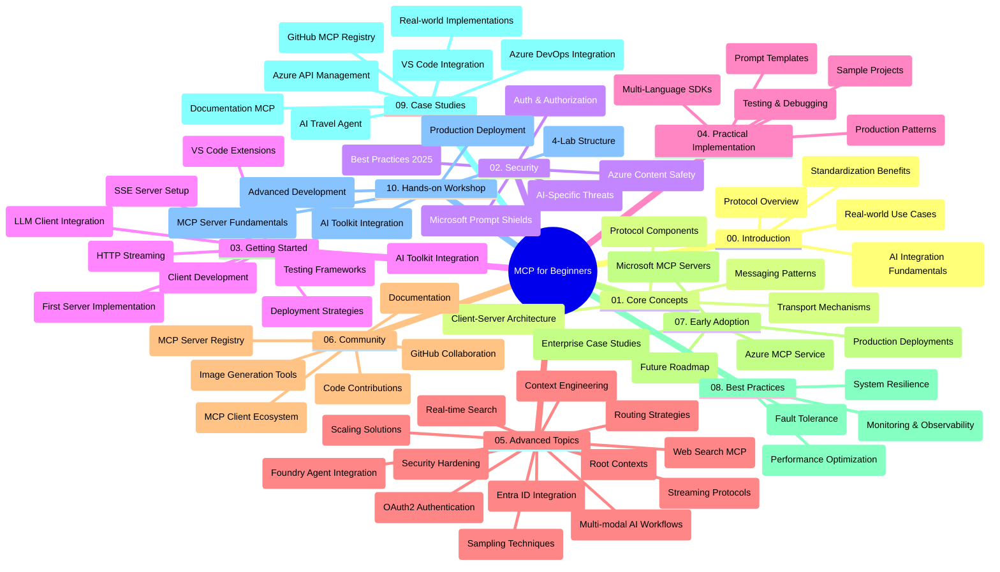

<!--
CO_OP_TRANSLATOR_METADATA:
{
  "original_hash": "719117a0a5f34ade7b5dfb61ee06fb13",
  "translation_date": "2025-09-26T19:17:03+00:00",
  "source_file": "study_guide.md",
  "language_code": "sl"
}
-->
# Protokol konteksta modela (MCP) za začetnike - Vodnik za študij

Ta vodnik za študij ponuja pregled strukture in vsebine repozitorija za učni načrt "Protokol konteksta modela (MCP) za začetnike". Uporabite ta vodnik za učinkovito navigacijo po repozitoriju in kar najboljši izkoristek razpoložljivih virov.

## Pregled repozitorija

Protokol konteksta modela (MCP) je standardiziran okvir za interakcije med modeli umetne inteligence in odjemalskimi aplikacijami. MCP je bil prvotno ustvarjen pri Anthropic, zdaj pa ga vzdržuje širša skupnost MCP prek uradne organizacije na GitHubu. Ta repozitorij ponuja celovit učni načrt s praktičnimi primeri kode v C#, Java, JavaScript, Python in TypeScript, namenjen razvijalcem umetne inteligence, sistemskim arhitektom in programskim inženirjem.

## Vizualni zemljevid učnega načrta

## Struktura repozitorija

Repozitorij je organiziran v deset glavnih razdelkov, od katerih se vsak osredotoča na različne vidike MCP:

1. **Uvod (00-Introduction/)**
   - Pregled protokola konteksta modela
   - Zakaj je standardizacija pomembna v procesih umetne inteligence
   - Praktični primeri uporabe in koristi

2. **Osnovni koncepti (01-CoreConcepts/)**
   - Arhitektura odjemalec-strežnik
   - Ključne komponente protokola
   - Vzorci sporočanja v MCP

3. **Varnost (02-Security/)**
   - Varnostne grožnje v sistemih, ki temeljijo na MCP
   - Najboljše prakse za varne implementacije
   - Strategije za preverjanje pristnosti in avtorizacijo
   - **Celovita dokumentacija o varnosti**:
     - Najboljše prakse za varnost MCP 2025
     - Vodnik za implementacijo varnosti vsebin Azure
     - Nadzor in tehnike varnosti MCP
     - Hitri referenčni priročnik za najboljše prakse MCP
   - **Ključne teme varnosti**:
     - Napadi z vbrizgavanjem pozivov in zastrupitev orodij
     - Ugrabitev sej in težave z zmedenim namestnikom
     - Ranljivosti pri prenosu žetonov
     - Prekomerne pravice in nadzor dostopa
     - Varnost dobavne verige za komponente umetne inteligence
     - Integracija Microsoft Prompt Shields

4. **Začetek (03-GettingStarted/)**
   - Nastavitev okolja in konfiguracija
   - Ustvarjanje osnovnih strežnikov in odjemalcev MCP
   - Integracija z obstoječimi aplikacijami
   - Vključuje razdelke za:
     - Prvo implementacijo strežnika
     - Razvoj odjemalca
     - Integracijo odjemalca LLM
     - Integracijo z VS Code
     - Strežnik za dogodke, poslane s strežnika (SSE)
     - HTTP pretakanje
     - Integracijo AI Toolkit
     - Strategije testiranja
     - Smernice za uvajanje

5. **Praktična implementacija (04-PracticalImplementation/)**
   - Uporaba SDK-jev v različnih programskih jezikih
   - Tehnike odpravljanja napak, testiranja in validacije
   - Oblikovanje ponovno uporabnih predlog pozivov in delovnih tokov
   - Vzorčni projekti s primeri implementacije

6. **Napredne teme (05-AdvancedTopics/)**
   - Tehnike inženiringa konteksta
   - Integracija agentov Foundry
   - Večmodalni delovni tokovi umetne inteligence
   - Demosi za preverjanje pristnosti OAuth2
   - Zmožnosti iskanja v realnem času
   - Pretakanje v realnem času
   - Implementacija osnovnih kontekstov
   - Strategije usmerjanja
   - Tehnike vzorčenja
   - Pristopi k skaliranju
   - Varnostni vidiki
   - Integracija varnosti Entra ID
   - Integracija spletnega iskanja

7. **Prispevki skupnosti (06-CommunityContributions/)**
   - Kako prispevati kodo in dokumentacijo
   - Sodelovanje prek GitHuba
   - Izboljšave in povratne informacije, ki jih vodi skupnost
   - Uporaba različnih odjemalcev MCP (Claude Desktop, Cline, VSCode)
   - Delo z priljubljenimi strežniki MCP, vključno z generiranjem slik

8. **Lekcije iz zgodnje uporabe (07-LessonsfromEarlyAdoption/)**
   - Implementacije v resničnem svetu in zgodbe o uspehu
   - Gradnja in uvajanje rešitev, ki temeljijo na MCP
   - Trendi in prihodnja načrtovanja
   - **Vodnik za strežnike MCP Microsoft**: Celovit vodnik za 10 strežnikov MCP Microsoft, pripravljenih za produkcijo, vključno z:
     - Strežnik MCP Microsoft Learn Docs
     - Strežnik MCP Azure (15+ specializiranih konektorjev)
     - Strežnik MCP GitHub
     - Strežnik MCP Azure DevOps
     - Strežnik MCP MarkItDown
     - Strežnik MCP SQL Server
     - Strežnik MCP Playwright
     - Strežnik MCP Dev Box
     - Strežnik MCP Azure AI Foundry
     - Strežnik MCP Microsoft 365 Agents Toolkit

9. **Najboljše prakse (08-BestPractices/)**
   - Izboljšanje zmogljivosti in optimizacija
   - Oblikovanje sistemov MCP, odpornih na napake
   - Strategije testiranja in odpornosti

10. **Študije primerov (09-CaseStudy/)**
    - **Sedem celovitih študij primerov**, ki prikazujejo vsestranskost MCP v različnih scenarijih:
    - **Azure AI Travel Agents**: Orkestracija več agentov z Azure OpenAI in AI Search
    - **Integracija Azure DevOps**: Avtomatizacija delovnih procesov z YouTube posodobitvami podatkov
    - **Pridobivanje dokumentacije v realnem času**: Python konzolni odjemalec s pretakanjem HTTP
    - **Interaktivni generator študijskega načrta**: Chainlit spletna aplikacija s pogovorno umetno inteligenco
    - **Dokumentacija v urejevalniku**: Integracija VS Code z delovnimi tokovi GitHub Copilot
    - **Upravljanje API-jev Azure**: Integracija podjetniških API-jev z ustvarjanjem strežnika MCP
    - **Register MCP GitHub**: Razvoj ekosistema in platforma za agentno integracijo
    - Primeri implementacije, ki zajemajo integracijo v podjetjih, produktivnost razvijalcev in razvoj ekosistema

11. **Praktična delavnica (10-StreamliningAIWorkflowsBuildingAnMCPServerWithAIToolkit/)**
    - Celovita praktična delavnica, ki združuje MCP z AI Toolkit
    - Gradnja inteligentnih aplikacij, ki povezujejo modele umetne inteligence z orodji iz resničnega sveta
    - Praktični moduli, ki pokrivajo osnove, razvoj prilagojenega strežnika in strategije uvajanja v produkcijo
    - **Struktura laboratorija**:
      - Laboratorij 1: Osnove strežnika MCP
      - Laboratorij 2: Napreden razvoj strežnika MCP
      - Laboratorij 3: Integracija AI Toolkit
      - Laboratorij 4: Uvajanje v produkcijo in skaliranje
    - Učenje na podlagi laboratorijskih vaj s korak-po-korak navodili

## Dodatni viri

Repozitorij vključuje podporne vire:

- **Mapa slik**: Vsebuje diagrame in ilustracije, uporabljene v učnem načrtu
- **Prevodi**: Podpora za več jezikov z avtomatiziranimi prevodi dokumentacije
- **Uradni viri MCP**:
  - [Dokumentacija MCP](https://modelcontextprotocol.io/)
  - [Specifikacija MCP](https://spec.modelcontextprotocol.io/)
  - [GitHub repozitorij MCP](https://github.com/modelcontextprotocol)

## Kako uporabljati ta repozitorij

1. **Zaporedno učenje**: Sledite poglavjem po vrsti (00 do 10) za strukturirano učno izkušnjo.
2. **Osredotočenost na jezik**: Če vas zanima določen programski jezik, raziščite mape z vzorci za implementacije v vašem izbranem jeziku.
3. **Praktična implementacija**: Začnite z razdelkom "Začetek", da nastavite svoje okolje in ustvarite svoj prvi strežnik in odjemalec MCP.
4. **Napredno raziskovanje**: Ko se seznanite z osnovami, se poglobite v napredne teme za širjenje znanja.
5. **Sodelovanje skupnosti**: Pridružite se skupnosti MCP prek razprav na GitHubu in kanalov Discord za povezovanje s strokovnjaki in drugimi razvijalci.

## Odjemalci in orodja MCP

Učni načrt pokriva različne odjemalce in orodja MCP:

1. **Uradni odjemalci**:
   - Visual Studio Code 
   - MCP v Visual Studio Code
   - Claude Desktop
   - Claude v VSCode 
   - Claude API

2. **Odjemalci skupnosti**:
   - Cline (na osnovi terminala)
   - Cursor (urejevalnik kode)
   - ChatMCP
   - Windsurf

3. **Orodja za upravljanje MCP**:
   - MCP CLI
   - MCP Manager
   - MCP Linker
   - MCP Router

## Priljubljeni strežniki MCP

Repozitorij predstavlja različne strežnike MCP, vključno z:

1. **Uradni strežniki MCP Microsoft**:
   - Strežnik MCP Microsoft Learn Docs
   - Strežnik MCP Azure (15+ specializiranih konektorjev)
   - Strežnik MCP GitHub
   - Strežnik MCP Azure DevOps
   - Strežnik MCP MarkItDown
   - Strežnik MCP SQL Server
   - Strežnik MCP Playwright
   - Strežnik MCP Dev Box
   - Strežnik MCP Azure AI Foundry
   - Strežnik MCP Microsoft 365 Agents Toolkit

2. **Uradni referenčni strežniki**:
   - Datotečni sistem
   - Fetch
   - Pomnilnik
   - Sekvenčno razmišljanje

3. **Generiranje slik**:
   - Azure OpenAI DALL-E 3
   - Stable Diffusion WebUI
   - Replicate

4. **Razvojna orodja**:
   - Git MCP
   - Nadzor terminala
   - Pomočnik za kodo

5. **Specializirani strežniki**:
   - Salesforce
   - Microsoft Teams
   - Jira & Confluence

## Prispevanje

Ta repozitorij pozdravlja prispevke skupnosti. Oglejte si razdelek Prispevki skupnosti za smernice o tem, kako učinkovito prispevati k ekosistemu MCP.

## Dnevnik sprememb

| Datum | Spremembe |
|------|---------|
| 26. september 2025 | - Dodana študija primera Register MCP GitHub v razdelek 09-CaseStudy - Posodobljene študije primerov, da odražajo sedem celovitih študij primerov - Izboljšani opisi študij primerov s specifičnimi podrobnostmi implementacije - Posodobljen vizualni zemljevid učnega načrta, da vključuje Register MCP GitHub - Revidirana struktura vodnika za študij, da odraža osredotočenost na razvoj ekosistema |
| 18. julij 2025 | - Posodobljena struktura repozitorija, da vključuje Vodnik za strežnike MCP Microsoft - Dodan celovit seznam 10 strežnikov MCP Microsoft, pripravljenih za produkcijo - Izboljšan razdelek Priljubljeni strežniki MCP z uradnimi strežniki MCP Microsoft - Posodobljen razdelek Študije primerov z dejanskimi primeri datotek - Dodane podrobnosti o strukturi laboratorija za praktično delavnico |
| 16. julij 2025 | - Posodobljena struktura repozitorija, da odraža trenutno vsebino - Dodan razdelek Odjemalci in orodja MCP - Dodan razdelek Priljubljeni strežniki MCP - Posodobljen vizualni zemljevid učnega načrta z vsemi trenutnimi temami - Izboljšan razdelek Napredne teme z vsemi specializiranimi področji - Posodobljene študije primerov, da odražajo dejanske primere - Pojasnjen izvor MCP kot ustvarjen pri Anthropic |
| 11. junij 2025 | - Prvotna ustvaritev vodnika za študij - Dodan vizualni zemljevid učnega načrta - Oris strukture repozitorija - Vključeni vzorčni projekti in dodatni viri |

---

*Ta vodnik za študij je bil posodobljen 26. septembra 2025 in ponuja pregled repozitorija na ta datum. Vsebina repozitorija se lahko posodobi po tem datumu.*

---

