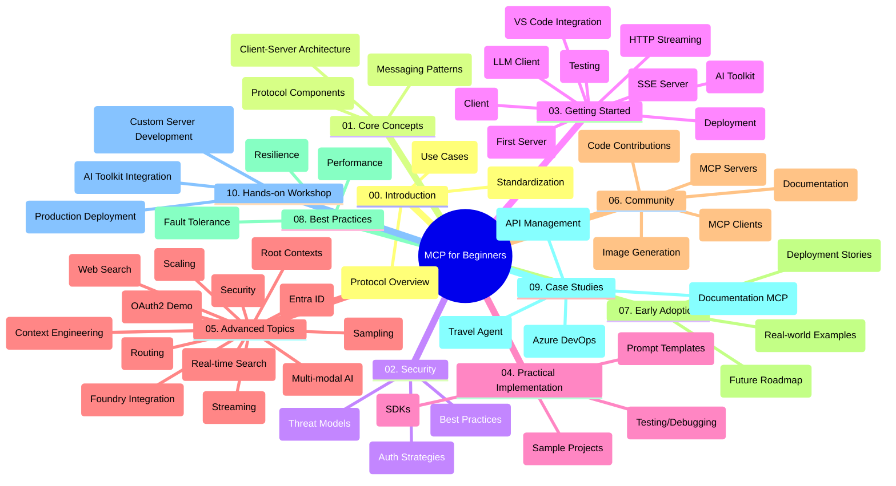

<!--
CO_OP_TRANSLATOR_METADATA:
{
  "original_hash": "5f321ea583cf087a94e47ee74c62b504",
  "translation_date": "2025-07-17T12:14:33+00:00",
  "source_file": "study_guide.md",
  "language_code": "sl"
}
-->
# Model Context Protocol (MCP) za začetnike - študijski vodič

Ta študijski vodič ponuja pregled strukture in vsebine repozitorija za učni načrt "Model Context Protocol (MCP) za začetnike". Uporabite ta vodič za učinkovito navigacijo po repozitoriju in kar najbolj izkoristite razpoložljive vire.

## Pregled repozitorija

Model Context Protocol (MCP) je standardiziran okvir za interakcije med AI modeli in odjemalskimi aplikacijami. Sprva ga je ustvaril Anthropic, zdaj pa ga vzdržuje širša MCP skupnost prek uradne GitHub organizacije. Ta repozitorij ponuja celovit učni načrt z praktičnimi primeri kode v C#, Javi, JavaScriptu, Pythonu in TypeScriptu, namenjen razvijalcem AI, sistemskim arhitektom in programskim inženirjem.

## Vizualna karta učnega načrta

## Struktura repozitorija

Repozitorij je organiziran v deset glavnih sklopov, ki se osredotočajo na različne vidike MCP:

1. **Uvod (00-Introduction/)**
   - Pregled Model Context Protocol
   - Zakaj je standardizacija pomembna v AI procesih
   - Praktični primeri uporabe in koristi

2. **Osnovni pojmi (01-CoreConcepts/)**
   - Arhitektura klient-strežnik
   - Ključne komponente protokola
   - Vzorce sporočanja v MCP

3. **Varnost (02-Security/)**
   - Varnostne grožnje v sistemih, ki temeljijo na MCP
   - Najboljše prakse za varno implementacijo
   - Strategije avtentikacije in avtorizacije

4. **Začetek dela (03-GettingStarted/)**
   - Nastavitev in konfiguracija okolja
   - Ustvarjanje osnovnih MCP strežnikov in odjemalcev
   - Integracija z obstoječimi aplikacijami
   - Vključuje razdelke za:
     - Prvo implementacijo strežnika
     - Razvoj odjemalca
     - Integracijo LLM odjemalca
     - Integracijo v VS Code
     - Strežnik Server-Sent Events (SSE)
     - HTTP pretakanje
     - Integracijo AI Toolkit
     - Strategije testiranja
     - Navodila za nameščanje

5. **Praktična implementacija (04-PracticalImplementation/)**
   - Uporaba SDK-jev v različnih programskih jezikih
   - Tehnike odpravljanja napak, testiranja in validacije
   - Oblikovanje ponovno uporabnih predlog in delovnih tokov
   - Vzorčni projekti z implementacijskimi primeri

6. **Napredne teme (05-AdvancedTopics/)**
   - Tehnike kontekstnega inženiringa
   - Integracija Foundry agenta
   - Večmodalni AI delovni tokovi
   - Demonstracije OAuth2 avtentikacije
   - Iskanje v realnem času
   - Pretakanje v realnem času
   - Implementacija root kontekstov
   - Strategije usmerjanja
   - Tehnike vzorčenja
   - Pristopi k skaliranju
   - Varnostni vidiki
   - Integracija varnosti Entra ID
   - Integracija spletnega iskanja

7. **Prispevki skupnosti (06-CommunityContributions/)**
   - Kako prispevati k kodi in dokumentaciji
   - Sodelovanje prek GitHub-a
   - Izboljšave in povratne informacije, ki jih vodi skupnost
   - Uporaba različnih MCP odjemalcev (Claude Desktop, Cline, VSCode)
   - Delo s priljubljenimi MCP strežniki, vključno z generiranjem slik

8. **Lekcije iz zgodnje uporabe (07-LessonsfromEarlyAdoption/)**
   - Resnični primeri implementacij in uspešne zgodbe
   - Gradnja in uvajanje rešitev na osnovi MCP
   - Trend in prihodnja razvojna pot

9. **Najboljše prakse (08-BestPractices/)**
   - Nastavitve za izboljšanje zmogljivosti in optimizacija
   - Oblikovanje odpornosti MCP sistemov
   - Strategije testiranja in odpornosti

10. **Študije primerov (09-CaseStudy/)**
    - Študija primera: integracija Azure API Management
    - Študija primera: implementacija potovalnega agenta
    - Študija primera: integracija Azure DevOps z YouTube
    - Primeri implementacij z obsežno dokumentacijo

11. **Praktična delavnica (10-StreamliningAIWorkflowsBuildingAnMCPServerWithAIToolkit/)**
    - Celovita praktična delavnica, ki združuje MCP z AI Toolkit
    - Gradnja inteligentnih aplikacij, ki povezujejo AI modele z orodji iz resničnega sveta
    - Praktični moduli, ki pokrivajo osnove, razvoj prilagojenih strežnikov in strategije uvajanja v produkcijo
    - Učenje na osnovi laboratorijskih vaj s podrobnimi navodili

## Dodatni viri

Repozitorij vključuje podporne vire:

- **Mapa slik**: vsebuje diagrame in ilustracije, uporabljene v učnem načrtu
- **Prevodi**: podpora več jezikom z avtomatiziranimi prevodi dokumentacije
- **Uradni MCP viri**:
  - [MCP Documentation](https://modelcontextprotocol.io/)
  - [MCP Specification](https://spec.modelcontextprotocol.io/)
  - [MCP GitHub Repository](https://github.com/modelcontextprotocol)

## Kako uporabljati ta repozitorij

1. **Učenje po vrsti**: sledite poglavjem po vrstnem redu (od 00 do 10) za strukturirano učenje.
2. **Osredotočenost na jezik**: če vas zanima določen programski jezik, preglejte mape s primeri za implementacije v izbranem jeziku.
3. **Praktična implementacija**: začnite z razdelkom "Začetek dela" za nastavitev okolja in ustvarjanje prvega MCP strežnika in odjemalca.
4. **Napredno raziskovanje**: ko obvladate osnove, se poglobite v napredne teme za širitev znanja.
5. **Sodelovanje v skupnosti**: pridružite se MCP skupnosti prek GitHub razprav in Discord kanalov za povezovanje z eksperti in razvijalci.

## MCP odjemalci in orodja

Učni načrt pokriva različne MCP odjemalce in orodja:

1. **Uradni odjemalci**:
   - Visual Studio Code
   - MCP v Visual Studio Code
   - Claude Desktop
   - Claude v VSCode
   - Claude API

2. **Skupnostni odjemalci**:
   - Cline (terminalski)
   - Cursor (urejevalnik kode)
   - ChatMCP
   - Windsurf

3. **Orodja za upravljanje MCP**:
   - MCP CLI
   - MCP Manager
   - MCP Linker
   - MCP Router

## Priljubljeni MCP strežniki

Repozitorij predstavlja različne MCP strežnike, med drugim:

1. **Uradni referenčni strežniki**:
   - Filesystem
   - Fetch
   - Memory
   - Sequential Thinking

2. **Generiranje slik**:
   - Azure OpenAI DALL-E 3
   - Stable Diffusion WebUI
   - Replicate

3. **Razvojna orodja**:
   - Git MCP
   - Terminal Control
   - Code Assistant

4. **Specializirani strežniki**:
   - Salesforce
   - Microsoft Teams
   - Jira & Confluence

## Prispevanje

Ta repozitorij sprejema prispevke skupnosti. Za navodila, kako učinkovito prispevati k MCP ekosistemu, si oglejte razdelek Prispevki skupnosti.

## Zgodovina sprememb

| Datum | Spremembe |
|-------|-----------|
| 16. julij 2025 | - Posodobljena struktura repozitorija, da odraža trenutno vsebino - Dodan razdelek MCP odjemalci in orodja - Dodan razdelek Priljubljeni MCP strežniki - Posodobljena vizualna karta učnega načrta z vsemi trenutnimi temami - Izboljšan razdelek Napredne teme z vsemi specializiranimi področji - Posodobljene študije primerov z dejanskimi primeri - Pojasnjen izvor MCP kot delo Anthropic |
| 11. junij 2025 | - Prvotna izdelava študijskega vodiča - Dodana vizualna karta učnega načrta - Opisana struktura repozitorija - Vključeni vzorčni projekti in dodatni viri |

---

*Ta študijski vodič je bil posodobljen 16. julija 2025 in ponuja pregled repozitorija do tega datuma. Vsebina repozitorija se lahko po tem datumu posodablja.*

**Omejitev odgovornosti**:  
Ta dokument je bil preveden z uporabo AI prevajalske storitve [Co-op Translator](https://github.com/Azure/co-op-translator). Čeprav si prizadevamo za natančnost, vas opozarjamo, da avtomatizirani prevodi lahko vsebujejo napake ali netočnosti. Izvirni dokument v njegovem izvirnem jeziku velja za avtoritativni vir. Za pomembne informacije priporočamo strokovni človeški prevod. Za morebitna nesporazume ali napačne interpretacije, ki izhajajo iz uporabe tega prevoda, ne odgovarjamo.