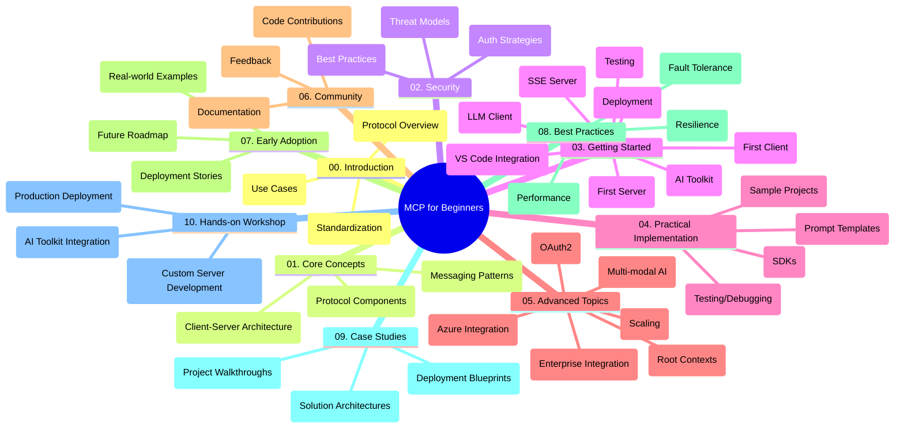

<!--
CO_OP_TRANSLATOR_METADATA:
{
  "original_hash": "a607d4febc94caee9a12b77795f7fc9a",
  "translation_date": "2025-06-11T16:52:17+00:00",
  "source_file": "study_guide.md",
  "language_code": "sl"
}
-->
# Model Context Protocol (MCP) za začetnike - učni vodnik

Ta učni vodnik ponuja pregled strukture in vsebine repozitorija za učni načrt "Model Context Protocol (MCP) za začetnike". Uporabite ta vodnik za učinkovito navigacijo po repozitoriju in kar najboljše izkoriščanje razpoložljivih virov.

## Pregled repozitorija

Model Context Protocol (MCP) je standardiziran okvir za interakcije med AI modeli in odjemalskimi aplikacijami. Ta repozitorij ponuja celovit učni načrt s praktičnimi primeri kode v C#, Java, JavaScript, Python in TypeScript, namenjen AI razvijalcem, sistemskim arhitektom in programski opremi inženirjem.

## Vizualna karta učnega načrta

## Struktura repozitorija

Repozitorij je organiziran v deset glavnih sklopov, ki se osredotočajo na različne vidike MCP:

1. **Uvod (00-Introduction/)**
   - Pregled Model Context Protocola
   - Zakaj je standardizacija pomembna v AI procesih
   - Praktični primeri uporabe in koristi

2. **Osnovni koncepti (01-CoreConcepts/)**
   - Arhitektura klient-strežnik
   - Ključne sestavine protokola
   - Vzorce sporočanja v MCP

3. **Varnost (02-Security/)**
   - Varnostne grožnje v sistemih, ki temeljijo na MCP
   - Najboljše prakse za varno implementacijo
   - Strategije za preverjanje pristnosti in avtorizacijo

4. **Začetek dela (03-GettingStarted/)**
   - Nastavitev okolja in konfiguracija
   - Ustvarjanje osnovnih MCP strežnikov in klientov
   - Integracija z obstoječimi aplikacijami
   - Podrazdelki za prvi strežnik, prvi klient, LLM klienta, VS Code integracijo, SSE strežnik, AI Toolkit, testiranje in uvajanje

5. **Praktična implementacija (04-PracticalImplementation/)**
   - Uporaba SDK-jev v različnih programskih jezikih
   - Odpravljanje napak, testiranje in validacija
   - Oblikovanje ponovno uporabnih predlog pozivov in delovnih tokov
   - Vzorčni projekti s primeri implementacije

6. **Napredne teme (05-AdvancedTopics/)**
   - Večmodalni AI delovni tokovi in razširljivost
   - Varnostno skaliranje
   - MCP v poslovnih ekosistemih
   - Specializirane teme, vključno z Azure integracijo, večmodalnostjo, OAuth2, root konteksti, usmerjanjem, vzorčenjem, skaliranjem, varnostjo, integracijo spletnega iskanja in pretakanjem.

7. **Prispevki skupnosti (06-CommunityContributions/)**
   - Kako prispevati k kodi in dokumentaciji
   - Sodelovanje preko GitHub-a
   - Izboljšave in povratne informacije, ki jih vodi skupnost

8. **Lekcije iz zgodnje uporabe (07-LessonsfromEarlyAdoption/)**
   - Resnični primeri implementacij in uspešne zgodbe
   - Gradnja in uvajanje rešitev, ki temeljijo na MCP
   - Trend in prihodnja pot

9. **Najboljše prakse (08-BestPractices/)**
   - Nastavitve za boljšo zmogljivost in optimizacijo
   - Oblikovanje MCP sistemov, odpornih na napake
   - Strategije testiranja in odpornosti

10. **Primeri študij (09-CaseStudy/)**
    - Poglobljeni pregledi arhitektur MCP rešitev
    - Načrti uvajanja in nasveti za integracijo
    - Oznake diagramov in vodniki po projektih

11. **Praktična delavnica (10-StreamliningAIWorkflowsBuildingAnMCPServerWithAIToolkit/)**
    - Celovita praktična delavnica, ki združuje MCP z Microsoftovim AI Toolkit za VS Code
    - Gradnja inteligentnih aplikacij, ki povezujejo AI modele z orodji iz resničnega sveta
    - Praktični moduli, ki zajemajo osnove, razvoj po meri strežnika in strategije uvajanja v produkcijo

## Vzorčni projekti

Repozitorij vključuje več vzorčnih projektov, ki prikazujejo implementacijo MCP v različnih programskih jezikih:

### Osnovni MCP kalkulator - primeri
- C# MCP strežnik - primer
- Java MCP kalkulator
- JavaScript MCP demo
- Python MCP strežnik
- TypeScript MCP primer

### Napredni MCP kalkulator - projekti
- Napredni C# primer
- Java aplikacija v kontejnerju
- JavaScript napredni primer
- Python kompleksna implementacija
- TypeScript kontejnerski primer

## Dodatni viri

Repozitorij vsebuje podporne vire:

- **Mapa slik**: vsebuje diagrame in ilustracije, uporabljene skozi učni načrt
- **Prevodi**: podpora za več jezikov z avtomatiziranimi prevodi dokumentacije
- **Uradni MCP viri**:
  - [MCP Dokumentacija](https://modelcontextprotocol.io/)
  - [MCP Specifikacija](https://spec.modelcontextprotocol.io/)
  - [MCP GitHub repozitorij](https://github.com/modelcontextprotocol)

## Kako uporabljati ta repozitorij

1. **Učenje po vrsti**: sledite poglavjem po vrstnem redu (od 00 do 10) za strukturirano učenje.
2. **Osredotočenost na jezik**: če vas zanima določen programski jezik, preglejte mape s primeri za implementacije v izbranem jeziku.
3. **Praktična implementacija**: začnite s poglavjem "Začetek dela" za nastavitev okolja in ustvarjanje prvega MCP strežnika in klienta.
4. **Napredna raziskovanja**: ko osvojite osnove, se poglobite v napredne teme za širitev znanja.
5. **Sodelovanje v skupnosti**: pridružite se [Azure AI Foundry Discord](https://discord.com/invite/ByRwuEEgH4) za povezovanje z eksperti in razvijalci.

## Prispevanje

Ta repozitorij sprejema prispevke skupnosti. Za navodila o prispevanju si oglejte razdelek Prispevki skupnosti.

---

*Ta učni vodnik je bil ustvarjen 11. junija 2025 in ponuja pregled repozitorija do tega datuma. Vsebina repozitorija je lahko od takrat posodobljena.*

**Opozorilo**:  
Ta dokument je bil preveden z uporabo AI prevajalske storitve [Co-op Translator](https://github.com/Azure/co-op-translator). Čeprav si prizadevamo za natančnost, upoštevajte, da lahko avtomatizirani prevodi vsebujejo napake ali netočnosti. Izvirni dokument v njegovem izvirnem jeziku velja za avtoritativni vir. Za pomembne informacije priporočamo strokovni človeški prevod. Nismo odgovorni za morebitna nesporazumevanja ali napačne interpretacije, ki izhajajo iz uporabe tega prevoda.