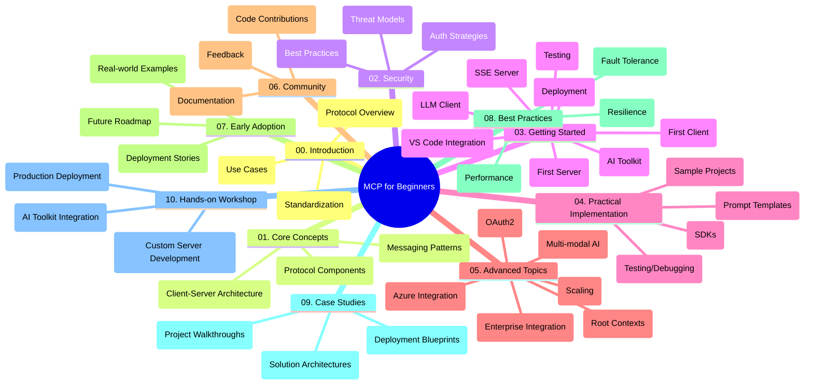

<!--
CO_OP_TRANSLATOR_METADATA:
{
  "original_hash": "a607d4febc94caee9a12b77795f7fc9a",
  "translation_date": "2025-07-13T15:19:20+00:00",
  "source_file": "study_guide.md",
  "language_code": "sl"
}
-->
# Model Context Protocol (MCP) za začetnike - študijski vodič

Ta študijski vodič ponuja pregled strukture in vsebine repozitorija za učni načrt "Model Context Protocol (MCP) za začetnike". Uporabite ga za učinkovito navigacijo po repozitoriju in kar najboljše izkoriščanje razpoložljivih virov.

## Pregled repozitorija

Model Context Protocol (MCP) je standardiziran okvir za interakcije med AI modeli in odjemalskimi aplikacijami. Ta repozitorij ponuja celovit učni načrt z praktičnimi primeri kode v C#, Javi, JavaScriptu, Pythonu in TypeScriptu, namenjen razvijalcem AI, sistemskim arhitektom in programskim inženirjem.

## Vizualna karta učnega načrta

## Struktura repozitorija

Repozitorij je razdeljen na deset glavnih sklopov, ki se osredotočajo na različne vidike MCP:

1. **Uvod (00-Introduction/)**
   - Pregled Model Context Protocol
   - Zakaj je standardizacija pomembna v AI procesih
   - Praktični primeri uporabe in koristi

2. **Osnovni pojmi (01-CoreConcepts/)**
   - Arhitektura klient-strežnik
   - Ključne komponente protokola
   - Vzorce sporočanja v MCP

3. **Varnost (02-Security/)**
   - Varnostne grožnje v sistemih, ki temeljijo na MCP
   - Najboljše prakse za varno implementacijo
   - Strategije avtentikacije in avtorizacije

4. **Začetek dela (03-GettingStarted/)**
   - Nastavitev okolja in konfiguracija
   - Ustvarjanje osnovnih MCP strežnikov in klientov
   - Integracija z obstoječimi aplikacijami
   - Podrazdelki za prvi strežnik, prvega klienta, LLM klienta, integracijo z VS Code, SSE strežnik, AI Toolkit, testiranje in uvajanje

5. **Praktična implementacija (04-PracticalImplementation/)**
   - Uporaba SDK-jev v različnih programskih jezikih
   - Tehnike odpravljanja napak, testiranja in validacije
   - Oblikovanje ponovno uporabnih predlog in delovnih tokov
   - Vzorčni projekti z implementacijskimi primeri

6. **Napredne teme (05-AdvancedTopics/)**
   - Večmodalni AI delovni tokovi in razširljivost
   - Strategije varnega skaliranja
   - MCP v podjetniških ekosistemih
   - Specializirane teme, vključno z integracijo Azure, večmodalnostjo, OAuth2, root konteksti, usmerjanjem, vzorčenjem, skaliranjem, varnostjo, integracijo spletnega iskanja in pretakanjem.

7. **Prispevki skupnosti (06-CommunityContributions/)**
   - Kako prispevati k kodi in dokumentaciji
   - Sodelovanje preko GitHub-a
   - Izboljšave in povratne informacije, ki jih vodi skupnost

8. **Lekcije iz zgodnje uporabe (07-LessonsfromEarlyAdoption/)**
   - Resnični primeri implementacij in uspešne zgodbe
   - Gradnja in uvajanje rešitev na osnovi MCP
   - Trend in prihodnja smer razvoja

9. **Najboljše prakse (08-BestPractices/)**
   - Nastavitve za izboljšanje zmogljivosti in optimizacija
   - Oblikovanje odpornosti MCP sistemov
   - Strategije testiranja in odpornosti

10. **Študije primerov (09-CaseStudy/)**
    - Podrobni vpogledi v arhitekture MCP rešitev
    - Načrti uvajanja in nasveti za integracijo
    - Oznake diagramov in predstavitve projektov

11. **Praktična delavnica (10-StreamliningAIWorkflowsBuildingAnMCPServerWithAIToolkit/)**
    - Celovita praktična delavnica, ki združuje MCP z Microsoftovim AI Toolkit za VS Code
    - Gradnja inteligentnih aplikacij, ki povezujejo AI modele z orodji iz resničnega sveta
    - Praktični moduli, ki pokrivajo osnove, razvoj po meri strežnika in strategije uvajanja v produkcijo

## Vzorčni projekti

Repozitorij vključuje več vzorčnih projektov, ki prikazujejo implementacijo MCP v različnih programskih jezikih:

### Osnovni vzorci MCP kalkulatorja
- Primer MCP strežnika v C#
- MCP kalkulator v Javi
- MCP demo v JavaScriptu
- MCP strežnik v Pythonu
- MCP primer v TypeScriptu

### Napredni projekti MCP kalkulatorja
- Napredni primer v C#
- Primer aplikacije v Javi z vsebnikom
- Napredni primer v JavaScriptu
- Kompleksna implementacija v Pythonu
- Vzorec z vsebnikom v TypeScriptu

## Dodatni viri

Repozitorij vsebuje podporne vire:

- **Mapa slik**: Vsebuje diagrame in ilustracije, uporabljene v učnem načrtu
- **Prevodi**: Podpora več jezikom z avtomatiziranimi prevodi dokumentacije
- **Uradni MCP viri**:
  - [MCP Dokumentacija](https://modelcontextprotocol.io/)
  - [MCP Specifikacija](https://spec.modelcontextprotocol.io/)
  - [MCP GitHub repozitorij](https://github.com/modelcontextprotocol)

## Kako uporabljati ta repozitorij

1. **Učenje po vrsti**: Sledite poglavjem po vrsti (od 00 do 10) za strukturirano učenje.
2. **Osredotočenost na jezik**: Če vas zanima določen programski jezik, preglejte mape z vzorci za implementacije v želenem jeziku.
3. **Praktična implementacija**: Začnite s poglavjem "Začetek dela" za nastavitev okolja in ustvarjanje prvega MCP strežnika in klienta.
4. **Napredno raziskovanje**: Ko obvladate osnove, se poglobite v napredne teme za širitev znanja.
5. **Vključevanje v skupnost**: Pridružite se [Azure AI Foundry Discord](https://discord.com/invite/ByRwuEEgH4) za povezovanje z eksperti in drugimi razvijalci.

## Prispevanje

Ta repozitorij sprejema prispevke skupnosti. Za navodila o prispevanju si oglejte razdelek Prispevki skupnosti.

---

*Ta študijski vodič je bil ustvarjen 11. junija 2025 in ponuja pregled repozitorija do tega datuma. Vsebina repozitorija je lahko bila od takrat posodobljena.*

**Omejitev odgovornosti**:  
Ta dokument je bil preveden z uporabo storitve za avtomatski prevod AI [Co-op Translator](https://github.com/Azure/co-op-translator). Čeprav si prizadevamo za natančnost, vas opozarjamo, da lahko avtomatski prevodi vsebujejo napake ali netočnosti. Izvirni dokument v njegovem izvirnem jeziku velja za avtoritativni vir. Za pomembne informacije priporočamo strokovni človeški prevod. Za morebitne nesporazume ali napačne interpretacije, ki izhajajo iz uporabe tega prevoda, ne odgovarjamo.