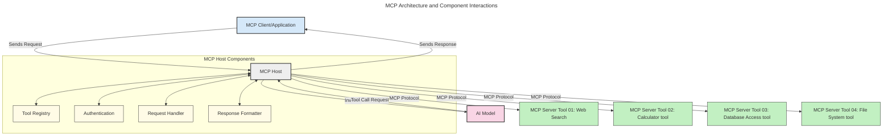
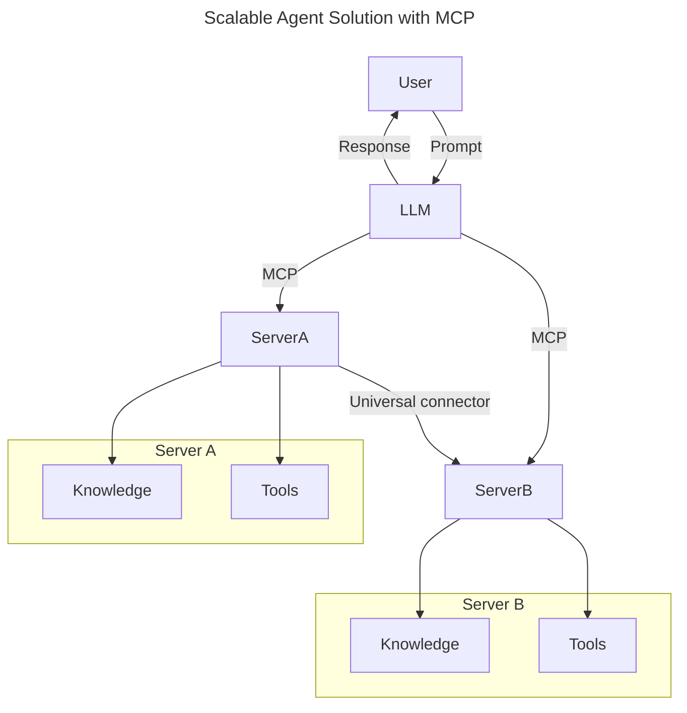
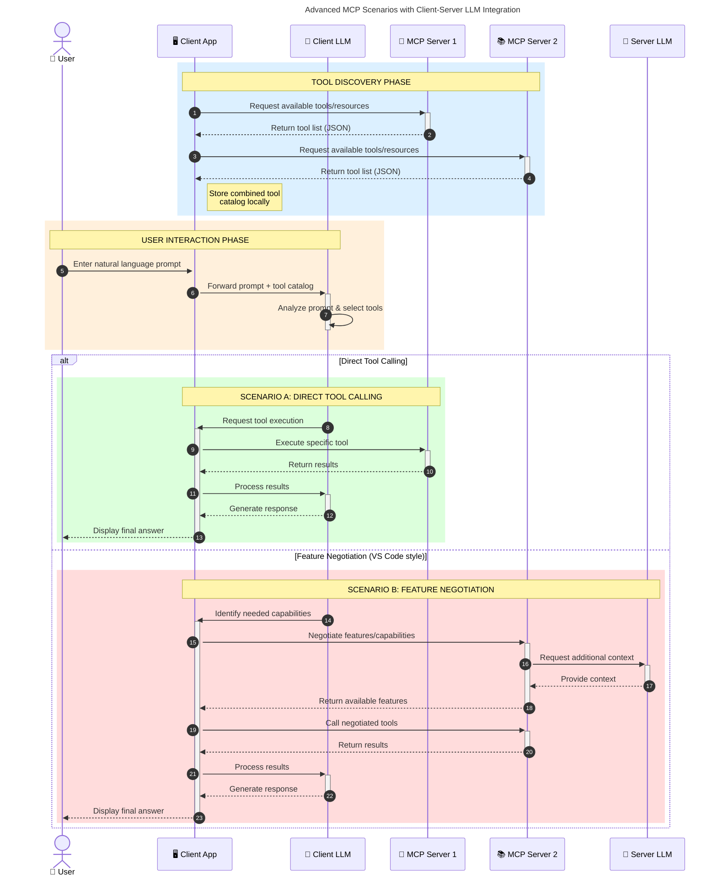

<!--
CO_OP_TRANSLATOR_METADATA:
{
  "original_hash": "0df1ee78a6dd8300f3a040ca5b411c2e",
<<<<<<< HEAD
  "translation_date": "2025-08-18T21:51:20+00:00",
=======
  "translation_date": "2025-08-18T17:11:24+00:00",
>>>>>>> origin/main
  "source_file": "00-Introduction/README.md",
  "language_code": "sr"
}
-->
# Увод у Протокол Контекста Модела (MCP): Зашто је важан за скалабилне AI апликације

_(Кликните на слику изнад да бисте погледали видео лекцију)_

<<<<<<< HEAD
Генеративне AI апликације представљају велики корак напред јер често омогућавају корисницима да комуницирају са апликацијом користећи природне језичке упите. Међутим, како се у такве апликације улаже све више времена и ресурса, важно је осигурати да можете лако интегрисати функционалности и ресурсе на начин који омогућава једноставно проширење, подршку за више модела и управљање различитим специфичностима модела. Укратко, изградња Ген AI апликација је једноставна на почетку, али како оне расту и постају сложеније, потребно је дефинисати архитектуру и ослонити се на стандард који ће осигурати доследност у изградњи апликација. Овде MCP ступа на сцену како би организовао ствари и пружио стандард.
=======
Генеративне AI апликације представљају велики корак напред јер често омогућавају корисницима да комуницирају са апликацијом користећи природне језичке упите. Међутим, како се у такве апликације улаже све више времена и ресурса, важно је осигурати да можете лако интегрисати функционалности и ресурсе на начин који омогућава лако проширење, подршку за више модела и управљање различитим специфичностима модела. Укратко, изградња Gen AI апликација је једноставна на почетку, али како оне расту и постају сложеније, потребно је дефинисати архитектуру и ослонити се на стандард који ће осигурати доследност у изградњи апликација. Овде MCP ступа на сцену како би организовао ствари и пружио стандард.
>>>>>>> origin/main

---

## **🔍 Шта је Протокол Контекста Модела (MCP)?**

**Протокол Контекста Модела (MCP)** је **отворен, стандардизован интерфејс** који омогућава великим језичким моделима (LLMs) да беспрекорно комуницирају са спољашњим алатима, API-јевима и изворима података. Он пружа доследну архитектуру за унапређење функционалности AI модела изван њихових података за обуку, омогућавајући паметније, скалабилније и одзивније AI системе.

---

## **🎯 Зашто је стандардизација у AI важна**

<<<<<<< HEAD
Како генеративне AI апликације постају све сложеније, неопходно је усвојити стандарде који осигуравају **скалабилност, проширивост, одрживост** и **избегавање зависности од једног добављача**. MCP одговара на ове потребе кроз:

- Уједињавање интеграција модела и алата  
- Смањење крхких, једнократних прилагођених решења  
- Омогућавање коегзистенције више модела различитих добављача у једном екосистему  
=======
Како генеративне AI апликације постају сложеније, неопходно је усвојити стандарде који осигуравају **скалабилност, проширивост, одрживост** и **избегавање зависности од једног добављача**. MCP одговара на ове потребе кроз:

- Уједињавање интеграција модела и алата
- Смањење крхких, једнократних прилагођених решења
- Омогућавање коегзистенције више модела различитих добављача у једном екосистему
>>>>>>> origin/main

**Напомена:** Иако MCP себе представља као отворени стандард, не постоје планови за његову стандардизацију кроз постојећа тела за стандардизацију као што су IEEE, IETF, W3C, ISO или било које друго тело.

---

## **📚 Циљеви учења**

До краја овог чланка, моћи ћете да:

<<<<<<< HEAD
- Дефинишете **Протокол Контекста Модела (MCP)** и његове случајеве употребе  
- Разумете како MCP стандардизује комуникацију између модела и алата  
- Идентификујете основне компоненте MCP архитектуре  
- Истражите стварне примене MCP-а у пословним и развојним контекстима  
=======
- Дефинишете **Протокол Контекста Модела (MCP)** и његове случајеве употребе
- Разумете како MCP стандардизује комуникацију између модела и алата
- Идентификујете основне компоненте MCP архитектуре
- Истражите стварне примене MCP-а у пословним и развојним контекстима
>>>>>>> origin/main

---

## **💡 Зашто је MCP револуционаран**

### **🔗 MCP решава фрагментацију у AI интеракцијама**

Пре MCP-а, интеграција модела са алатима захтевала је:

<<<<<<< HEAD
- Прилагођени код за сваки пар алат-модел  
- Нестандардизоване API-јеве за сваког добављача  
- Честе кварове због ажурирања  
- Лошу скалабилност са повећањем броја алата  

### **✅ Предности MCP стандардизације**

| **Предност**              | **Опис**                                                                |
|---------------------------|-------------------------------------------------------------------------|
| Интероперабилност         | LLM-ови раде беспрекорно са алатима различитих добављача               |
| Доследност                | Уједначено понашање на различитим платформама и алатима                |
| Поновна употреба          | Једном направљени алати могу се користити у различитим пројектима      |
| Убрзан развој             | Смањење времена развоја коришћењем стандардизованих интерфејса         |
=======
- Прилагођени код за сваки пар алат-модел
- Нестандардизоване API-јеве за сваког добављача
- Честе кварове због ажурирања
- Лошу скалабилност са повећањем броја алата

### **✅ Предности MCP стандардизације**

| **Предност**              | **Опис**                                                                        |
|---------------------------|---------------------------------------------------------------------------------|
| Интероперабилност         | LLM-ови раде беспрекорно са алатима различитих добављача                        |
| Доследност               | Уједначено понашање на различитим платформама и алатима                         |
| Поновна употреба          | Једном направљени алати могу се користити у различитим пројектима и системима   |
| Убрзан развој            | Смањење времена развоја коришћењем стандардизованих интерфејса                  |
>>>>>>> origin/main

---

## **🧱 Преглед високог нивоа MCP архитектуре**

MCP прати **клијент-сервер модел**, где:

<<<<<<< HEAD
- **MCP Хостови** покрећу AI моделе  
- **MCP Клијенти** иницирају захтеве  
- **MCP Сервери** пружају контекст, алате и могућности  
=======
- **MCP Host-ови** покрећу AI моделе
- **MCP Клијенти** иницирају захтеве
- **MCP Сервери** пружају контекст, алате и могућности
>>>>>>> origin/main

### **Кључне компоненте:**

- **Ресурси** – Статички или динамички подаци за моделе  
- **Упити** – Унапред дефинисани токови за вођену генерацију  
<<<<<<< HEAD
- **Алати** – Извршиве функције попут претраге, прорачуна  
=======
- **Алати** – Извршиве функције као што су претрага, прорачуни  
>>>>>>> origin/main
- **Семплинг** – Агентско понашање кроз рекурзивне интеракције  

---

## Како MCP сервери функционишу

MCP сервери раде на следећи начин:

<<<<<<< HEAD
- **Ток захтева**:  
    1. Захтев иницира крајњи корисник или софтвер који делује у његово име.  
    2. **MCP Клијент** шаље захтев **MCP Хосту**, који управља извршавањем AI модела.  
    3. **AI Модел** прима упит корисника и може затражити приступ спољашњим алатима или подацима путем једног или више позива алата.  
    4. **MCP Хост**, а не модел директно, комуницира са одговарајућим **MCP Сервером/Серверима** користећи стандардизован протокол.  
- **Функционалност MCP Хоста**:  
    - **Регистар алата**: Одржава каталог доступних алата и њихових могућности.  
    - **Аутентификација**: Проверава дозволе за приступ алатима.  
    - **Обрађивач захтева**: Обрађује долазне захтеве алата од модела.  
    - **Форматирање одговора**: Структурира излазе алата у формат који модел може разумети.  
- **Извршење MCP Серверa**:  
    - **MCP Хост** усмерава позиве алата ка једном или више **MCP Серверa**, од којих сваки излаже специјализоване функције (нпр. претрага, прорачуни, упити базе података).  
    - **MCP Сервери** извршавају своје операције и враћају резултате **MCP Хосту** у доследном формату.  
    - **MCP Хост** форматира и прослеђује ове резултате **AI Моделу**.  
- **Завршетак одговора**:  
    - **AI Модел** укључује излазе алата у коначни одговор.  
    - **MCP Хост** шаље овај одговор назад **MCP Клијенту**, који га испоручује крајњем кориснику или позивајућем софтверу.  
=======
- **Ток захтева**:
    1. Захтев иницира крајњи корисник или софтвер који делује у његово име.
    2. **MCP Клијент** шаље захтев **MCP Host-у**, који управља извршавањем AI модела.
    3. **AI Модел** прима упит корисника и може затражити приступ спољашњим алатима или подацима путем једног или више позива алата.
    4. **MCP Host**, а не модел директно, комуницира са одговарајућим **MCP Сервером/Серверима** користећи стандардизован протокол.
- **Функционалност MCP Host-а**:
    - **Регистар алата**: Одржава каталог доступних алата и њихових могућности.
    - **Аутентификација**: Проверава дозволе за приступ алатима.
    - **Обрађивач захтева**: Обрађује долазне захтеве алата од модела.
    - **Форматирање одговора**: Структурира излазе алата у формат који модел може разумети.
- **Извршење MCP Сервер-а**:
    - **MCP Host** усмерава позиве алата ка једном или више **MCP Серверима**, од којих сваки излаже специјализоване функције (нпр. претрага, прорачуни, упити у базу података).
    - **MCP Сервери** извршавају своје операције и враћају резултате **MCP Host-у** у доследном формату.
    - **MCP Host** форматира и прослеђује ове резултате **AI Моделу**.
- **Завршетак одговора**:
    - **AI Модел** укључује излазе алата у коначни одговор.
    - **MCP Host** шаље овај одговор назад **MCP Клијенту**, који га испоручује крајњем кориснику или позивајућем софтверу.
>>>>>>> origin/main

## 👨‍💻 Како изградити MCP сервер (са примерима)

<<<<<<< HEAD
MCP сервери омогућавају проширење могућности LLM-ова пружањем података и функционалности.  

Спремни да пробате? Ево SDK-ова специфичних за језике и/или стекове са примерима креирања једноставних MCP сервера у различитим језицима/стекима:

- **Python SDK**: https://github.com/modelcontextprotocol/python-sdk  

- **TypeScript SDK**: https://github.com/modelcontextprotocol/typescript-sdk  

- **Java SDK**: https://github.com/modelcontextprotocol/java-sdk  

- **C#/.NET SDK**: https://github.com/modelcontextprotocol/csharp-sdk  
=======
MCP сервери омогућавају проширење могућности LLM-ова пружањем података и функционалности.

Спремни да пробате? Ево SDK-ова специфичних за језике и/или стекове са примерима креирања једноставних MCP сервера у различитим језицима/стекима:

- **Python SDK**: https://github.com/modelcontextprotocol/python-sdk

- **TypeScript SDK**: https://github.com/modelcontextprotocol/typescript-sdk

- **Java SDK**: https://github.com/modelcontextprotocol/java-sdk

- **C#/.NET SDK**: https://github.com/modelcontextprotocol/csharp-sdk
>>>>>>> origin/main

---

## 🌍 Стварни примери употребе MCP-а

MCP омогућава широк спектар апликација проширивањем могућности AI-а:

<<<<<<< HEAD
| **Апликација**              | **Опис**                                                                |
|-----------------------------|-------------------------------------------------------------------------|
| Интеграција пословних података | Повезивање LLM-ова са базама података, CRM-овима или интерним алатима   |
| Агентски AI системи          | Омогућавање аутономних агената са приступом алатима и радним токовима одлучивања |
| Мултимодалне апликације      | Комбинација текста, слике и аудио алата у једној уједињеној AI апликацији |
| Интеграција података у реалном времену | Доношење актуелних података у AI интеракције за прецизније и ажурније излазе |
=======
| **Апликација**              | **Опис**                                                                        |
|-----------------------------|---------------------------------------------------------------------------------|
| Интеграција пословних података | Повезивање LLM-ова са базама података, CRM-овима или интерним алатима            |
| Агентски AI системи          | Омогућавање аутономних агената са приступом алатима и радним токовима одлучивања |
| Мултимодалне апликације      | Комбинација текста, слике и аудио алата у једној уједињеној AI апликацији       |
| Интеграција у реалном времену | Доношење актуелних података у AI интеракције за прецизније и ажурније излазе    |
>>>>>>> origin/main

### 🧠 MCP = Универзални стандард за AI интеракције

Протокол Контекста Модела (MCP) делује као универзални стандард за AI интеракције, слично као што је USB-C стандардизовао физичке конекције за уређаје. У свету AI-а, MCP пружа доследан интерфејс, омогућавајући моделима (клијентима) да се беспрекорно интегришу са спољашњим алатима и добављачима података (серверима). Ово елиминише потребу за разноликим, прилагођеним протоколима за сваки API или извор података.

<<<<<<< HEAD
=======
Под MCP-ом, MCP-компатибилан алат (познат као MCP сервер) прати уједињени стандард. Ови сервери могу навести алате или акције које нуде и извршавати те акције када их AI агент затражи. Платформе AI агената које подржавају MCP могу открити доступне алате са сервера и позивати их кроз овај стандардизовани протокол.

### 💡 Олакшава приступ знању

Поред понуде алата, MCP такође олакшава приступ знању. Омогућава апликацијама да пруже контекст великим језичким моделима (LLM-овима) повезујући их са различитим изворима података. На пример, MCP сервер може представљати репозиторијум докумената компаније, омогућавајући агентима да по потреби преузму релевантне информације. Други сервер може обрађивати специфичне акције као што су слање е-поште или ажурирање записа. Са становишта агента, ово су једноставно алати које може користити—неки алати враћају податке (контекст знања), док други извршавају акције. MCP ефикасно управља обема.

Агент који се повезује са MCP сервером аутоматски учи о доступним могућностима и подацима сервера кроз стандардизован формат. Ова стандардизација омогућава динамичку доступност алата. На пример, додавање новог MCP сервера у систем агента чини његове функције одмах употребљивим без потребе за даљом прилагодбом инструкција агента.

Ова поједностављена интеграција усклађена је са током приказаним у следећем дијаграму, где сервери пружају и алате и знање, осигуравајући беспрекорну сарадњу између система.

### 👉 Пример: Скалабилно решење за агенте

### 🔄 Напредни MCP сценарији са интеграцијом LLM-ова на страни клијента

Поред основне MCP архитектуре, постоје напредни сценарији где и клијент и сервер садрже LLM-ове, омогућавајући софистицираније интеракције. У следећем дијаграму, **Клијентска апликација** може бити IDE са бројним MCP алатима доступним за коришћење од стране LLM-а:

>>>>>>> origin/main
---

## 🔐 Практичне предности MCP-а

Ево практичних предности коришћења MCP-а:

<<<<<<< HEAD
- **Актуелност**: Модели могу приступити најновијим информацијама изван својих података за обуку  
- **Проширење могућности**: Модели могу користити специјализоване алате за задатке за које нису обучени  
- **Смањење халуцинација**: Спољашњи извори података пружају чињеничну основу  
- **Приватност**: Осетљиви подаци могу остати унутар сигурних окружења уместо да буду уграђени у упите  
=======
- **Ажурност**: Модели могу приступити актуелним информацијама изван својих података за обуку
- **Проширење могућности**: Модели могу користити специјализоване алате за задатке за које нису обучени
- **Смањење халуцинација**: Спољашњи извори података пружају чињеничну основу
- **Приватност**: Осетљиви подаци могу остати унутар сигурних окружења уместо да буду уграђени у упите
>>>>>>> origin/main

---

## 📌 Кључне напомене

Следе кључне напомене за коришћење MCP-а:

<<<<<<< HEAD
- **MCP** стандардизује начин на који AI модели комуницирају са алатима и подацима  
- Промовише **проширивост, доследност и интероперабилност**  
- MCP помаже у **смањењу времена развоја, побољшању поузданости и проширењу могућности модела**  
- Клијент-сервер архитектура омогућава **флексибилне, прошириве AI апликације**  
=======
- **MCP** стандардизује начин на који AI модели комуницирају са алатима и подацима
- Промовише **проширивост, доследност и интероперабилност**
- MCP помаже у **смањењу времена развоја, побољшању поузданости и проширењу могућности модела**
- Клијент-сервер архитектура омогућава **флексибилне, прошириве AI апликације**
>>>>>>> origin/main

---

## 🧠 Вежба

Размислите о AI апликацији коју желите да изградите.

<<<<<<< HEAD
- Који **спољашњи алати или подаци** би могли побољшати њене могућности?  
- Како би MCP могао учинити интеграцију **једноставнијом и поузданијом**?  
=======
- Који **спољашњи алати или подаци** би могли побољшати њене могућности?
- Како би MCP могао учинити интеграцију **једноставнијом и поузданијом**?
>>>>>>> origin/main

---

## Додатни ресурси

- [MCP GitHub Репозиторијум](https://github.com/modelcontextprotocol)

---

## Шта следи

<<<<<<< HEAD
Следеће: [Поглавље 1: Основни концепти](../01-CoreConcepts/README.md)  

**Одрицање од одговорности**:  
Овај документ је преведен коришћењем услуге за превођење помоћу вештачке интелигенције [Co-op Translator](https://github.com/Azure/co-op-translator). Иако настојимо да обезбедимо тачност, молимо вас да имате у виду да аутоматски преводи могу садржати грешке или нетачности. Оригинални документ на његовом изворном језику треба сматрати меродавним извором. За критичне информације препоручује се професионални превод од стране људи. Не преузимамо одговорност за било каква погрешна тумачења или неспоразуме који могу настати услед коришћења овог превода.
=======
Следеће: [Поглавље 1: Основни концепти](../01-CoreConcepts/README.md)

**Одрицање од одговорности**:  
Овај документ је преведен коришћењем услуге за превођење помоћу вештачке интелигенције [Co-op Translator](https://github.com/Azure/co-op-translator). Иако тежимо тачности, молимо вас да имате у виду да аутоматизовани преводи могу садржати грешке или нетачности. Оригинални документ на изворном језику треба сматрати ауторитативним извором. За критичне информације препоручује се професионални превод од стране људи. Не сносимо одговорност за било каква неспоразумевања или погрешна тумачења која могу произаћи из коришћења овог превода.
>>>>>>> origin/main
