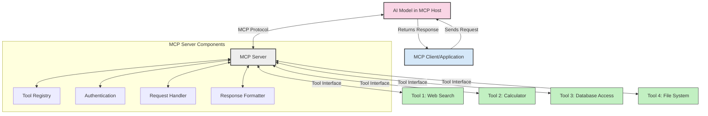
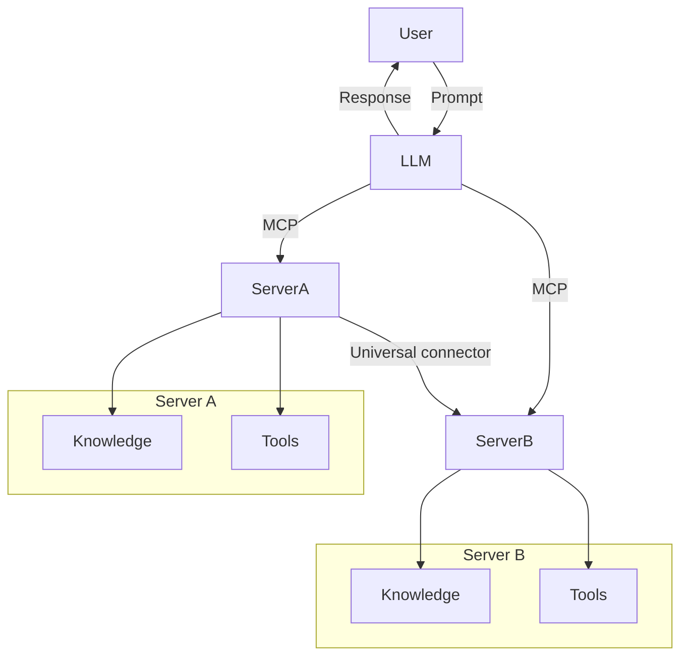

<!--
CO_OP_TRANSLATOR_METADATA:
{
  "original_hash": "1d88dee994dcbb3fa52c271d0c0817b5",
  "translation_date": "2025-05-20T22:36:49+00:00",
  "source_file": "00-Introduction/README.md",
  "language_code": "sr"
}
-->
# Uvod u Model Context Protocol (MCP): Zašto je važan za skalabilne AI aplikacije

Generativne AI aplikacije predstavljaju veliki korak napred jer često omogućavaju korisnicima da komuniciraju sa aplikacijom koristeći prirodni jezik. Međutim, kako se ulaže sve više vremena i resursa u takve aplikacije, važno je da lako integrišete funkcionalnosti i resurse na način koji omogućava jednostavno proširenje, da vaša aplikacija može da podrži više modela istovremeno i da se nosi sa različitim složenostima modela. Ukratko, izgradnja Gen AI aplikacija je laka na početku, ali kako rastu i postaju složenije, potrebno je definisati arhitekturu i verovatno se osloniti na standard koji garantuje da su aplikacije izgrađene na dosledan način. Tu na scenu stupa MCP da organizuje stvari i pruži standard.

---

## **🔍 Šta je Model Context Protocol (MCP)?**

**Model Context Protocol (MCP)** je **otvoren, standardizovan interfejs** koji omogućava Velikim Jezičkim Modelima (LLM) da se nesmetano povezuju sa eksternim alatima, API-jima i izvorima podataka. Pruža konzistentnu arhitekturu koja unapređuje funkcionalnost AI modela van njihovih trening podataka, omogućavajući pametnije, skalabilnije i responzivnije AI sisteme.

---

## **🎯 Zašto je standardizacija u AI važna**

Kako generativne AI aplikacije postaju složenije, neophodno je usvojiti standarde koji obezbeđuju **skalabilnost, proširivost** i **održivost**. MCP odgovara na ove potrebe kroz:

- Ujednačavanje integracija modela i alata  
- Smanjenje krhkih, jedinstvenih rešenja  
- Omogućavanje da više modela koegzistira u istom ekosistemu  

---

## **📚 Ciljevi učenja**

Na kraju ovog teksta moći ćete da:

- Definišete **Model Context Protocol (MCP)** i njegove primene  
- Razumete kako MCP standardizuje komunikaciju između modela i alata  
- Identifikujete ključne komponente MCP arhitekture  
- Istražite primere primene MCP u preduzećima i razvojnom okruženju  

---

## **💡 Zašto je Model Context Protocol (MCP) revolucionaran**

### **🔗 MCP rešava fragmentaciju u AI interakcijama**

Pre MCP-a, integracija modela sa alatima zahtevala je:

- Prilagođeni kod za svaki par alat-model  
- Nestandardne API-je za svakog dobavljača  
- Česte prekide zbog ažuriranja  
- Lošu skalabilnost sa rastom broja alata  

### **✅ Prednosti MCP standardizacije**

| **Prednost**             | **Opis**                                                                       |
|-------------------------|--------------------------------------------------------------------------------|
| Interoperabilnost        | LLM modeli rade nesmetano sa alatima različitih dobavljača                    |
| Doslednost              | Uniformno ponašanje na platformama i alatima                                  |
| Ponovna upotrebljivost  | Alati napravljeni jednom mogu se koristiti u različitim projektima i sistemima|
| Brži razvoj             | Skraćuje vreme razvoja korišćenjem standardizovanih, plug-and-play interfejsa|

---

## **🧱 Pregled MCP arhitekture na visokom nivou**

MCP se zasniva na **klijent-server modelu**, gde:

- **MCP Hosts** pokreću AI modele  
- **MCP Clients** iniciraju zahteve  
- **MCP Servers** pružaju kontekst, alate i mogućnosti  

### **Ključne komponente:**

- **Resources** – Statički ili dinamički podaci za modele  
- **Prompts** – Preddefinisani tokovi za vođenu generaciju  
- **Tools** – Izvršne funkcije poput pretrage, proračuna  
- **Sampling** – Agentno ponašanje kroz rekurzivne interakcije  

---

## Kako MCP serveri funkcionišu

MCP serveri rade na sledeći način:

- **Tok zahteva**:  
    1. MCP Klijent šalje zahtev AI modelu koji radi u MCP Hostu.  
    2. AI model prepoznaje kada mu trebaju eksterni alati ili podaci.  
    3. Model komunicira sa MCP Serverom koristeći standardizovani protokol.  

- **Funkcionalnosti MCP Servera**:  
    - Registar alata: održava katalog dostupnih alata i njihovih mogućnosti.  
    - Autentifikacija: proverava dozvole za pristup alatima.  
    - Obrada zahteva: procesuira dolazne zahteve alata od modela.  
    - Formatiranje odgovora: strukturira izlaze alata u format razumljiv modelu.  

- **Izvršenje alata**:  
    - Server prosleđuje zahteve odgovarajućim eksternim alatima  
    - Alati izvršavaju svoje specijalizovane funkcije (pretraga, proračun, upiti u bazu podataka itd.)  
    - Rezultati se vraćaju modelu u konzistentnom formatu.  

- **Završetak odgovora**:  
    - AI model integriše izlaze alata u svoj odgovor.  
    - Konačni odgovor se šalje nazad klijentskoj aplikaciji.  

## 👨‍💻 Kako napraviti MCP server (sa primerima)

MCP serveri vam omogućavaju da proširite mogućnosti LLM modela pružajući podatke i funkcionalnosti.

Spremni za probu? Evo primera za kreiranje jednostavnog MCP servera u različitim jezicima:

- **Python primer**: https://github.com/modelcontextprotocol/python-sdk

- **TypeScript primer**: https://github.com/modelcontextprotocol/typescript-sdk

- **Java primer**: https://github.com/modelcontextprotocol/java-sdk

- **C#/.NET primer**: https://github.com/modelcontextprotocol/csharp-sdk

## 🌍 Praktične primene MCP

MCP omogućava širok spektar aplikacija proširujući AI mogućnosti:

| **Primena**                | **Opis**                                                                       |
|----------------------------|--------------------------------------------------------------------------------|
| Integracija podataka u preduzećima | Povezivanje LLM modela sa bazama podataka, CRM sistemima ili internim alatima |
| Agentni AI sistemi          | Omogućavanje autonomnih agenata sa pristupom alatima i tokovima donošenja odluka |
| Multi-modalne aplikacije   | Kombinovanje tekstualnih, slikovnih i audio alata unutar jedinstvene AI aplikacije |
| Integracija podataka u realnom vremenu | Uvođenje aktuelnih podataka u AI interakcije za preciznije i aktuelne rezultate |

### 🧠 MCP = Univerzalni standard za AI interakcije

Model Context Protocol (MCP) funkcioniše kao univerzalni standard za AI interakcije, slično kao što je USB-C standardizovao fizičke konekcije uređaja. U svetu AI, MCP pruža dosledan interfejs koji omogućava modelima (klijentima) da se lako integrišu sa eksternim alatima i provajderima podataka (serverima). Ovo eliminiše potrebu za različitim, prilagođenim protokolima za svaki API ili izvor podataka.

U okviru MCP-a, alat kompatibilan sa MCP-om (nazvan MCP server) prati jedinstveni standard. Ti serveri mogu da navedu koje alate ili akcije nude i da ih izvrše kada ih AI agent zatraži. Platforme za AI agente koje podržavaju MCP mogu da otkriju dostupne alate sa servera i pozivaju ih putem ovog standardnog protokola.

### 💡 Omogućava pristup znanju

Pored pružanja alata, MCP olakšava pristup znanju. Omogućava aplikacijama da pruže kontekst velikim jezičkim modelima (LLM) povezivanjem sa različitim izvorima podataka. Na primer, MCP server može predstavljati repozitorijum dokumenata kompanije, omogućavajući agentima da po potrebi pribave relevantne informacije. Drugi server može upravljati specifičnim radnjama kao što su slanje mejlova ili ažuriranje zapisa. Sa stanovišta agenta, to su jednostavno alati koje može koristiti — neki alati vraćaju podatke (kontekst znanja), dok drugi izvršavaju radnje. MCP efikasno upravlja oboma.

Agent koji se povezuje na MCP server automatski uči o dostupnim mogućnostima i pristupačnim podacima servera kroz standardizovani format. Ova standardizacija omogućava dinamičku dostupnost alata. Na primer, dodavanjem novog MCP servera u sistem agenta njegove funkcije postaju odmah dostupne bez potrebe za dodatnim prilagođavanjem instrukcija agenta.

Ova pojednostavljena integracija prati tok prikazan na mermaid dijagramu, gde serveri pružaju i alate i znanje, osiguravajući besprekornu saradnju između sistema.

### 👉 Primer: Skalabilno rešenje za agente

## 🔐 Praktične prednosti MCP

Evo praktičnih prednosti korišćenja MCP:

- **Svežina**: modeli mogu pristupiti ažurnim informacijama izvan svojih trening podataka  
- **Proširenje mogućnosti**: modeli mogu koristiti specijalizovane alate za zadatke za koje nisu trenirani  
- **Smanjenje halucinacija**: eksterni izvori podataka pružaju činjeničnu osnovu  
- **Privatnost**: osetljivi podaci mogu ostati u sigurnim okruženjima umesto da budu ugrađeni u upite  

## 📌 Ključni zaključci

Evo ključnih zaključaka za korišćenje MCP:

- **MCP** standardizuje način na koji AI modeli komuniciraju sa alatima i podacima  
- Promoviše **proširivost, doslednost i interoperabilnost**  
- MCP pomaže **skraćenju vremena razvoja, poboljšanju pouzdanosti i proširenju mogućnosti modela**  
- Klijent-server arhitektura omogućava **fleksibilne, proširive AI aplikacije**  

## 🧠 Vežba

Razmislite o AI aplikaciji koju biste želeli da napravite.

- Koji **eksterni alati ili podaci** bi mogli unaprediti njene mogućnosti?  
- Kako bi MCP mogao učiniti integraciju **jednostavnijom i pouzdanijom**?  

## Dodatni resursi

- [MCP GitHub repozitorijum](https://github.com/modelcontextprotocol)

## Šta sledi

Sledeće: [Poglavlje 1: Osnovni pojmovi](/01-CoreConcepts/README.md)

**Одрицање од одговорности**:  
Овај документ је преведен помоћу AI преводилачке услуге [Co-op Translator](https://github.com/Azure/co-op-translator). Иако се трудимо да превод буде тачан, имајте у виду да аутоматизовани преводи могу садржати грешке или нетачности. Оригинални документ на његовом изворном језику треба сматрати ауторитетним извором. За критичне информације препоручује се професионални људски превод. Нисмо одговорни за било каква неспоразума или погрешна тумачења која произилазе из коришћења овог превода.