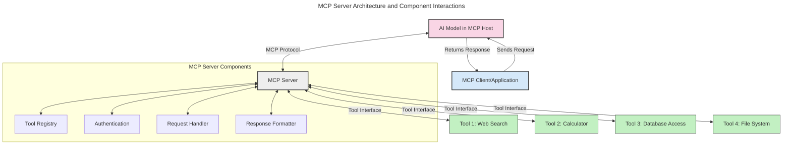
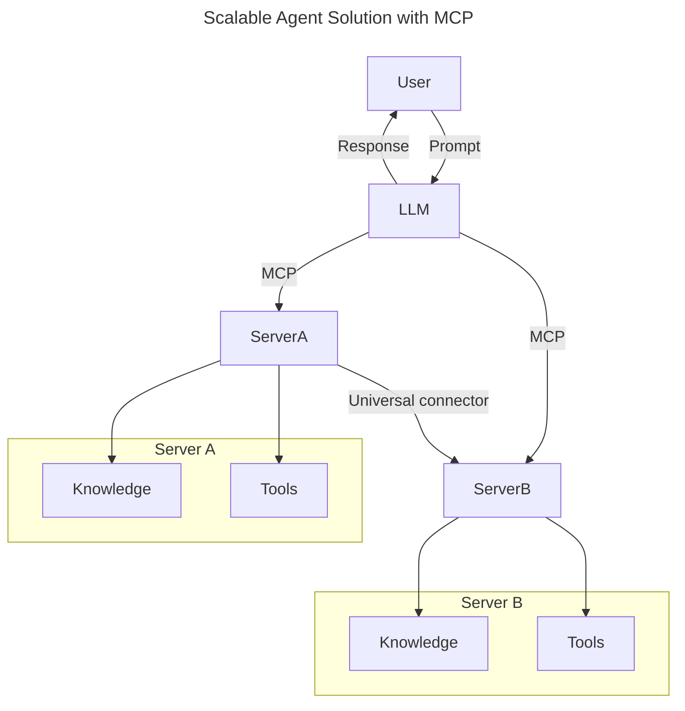
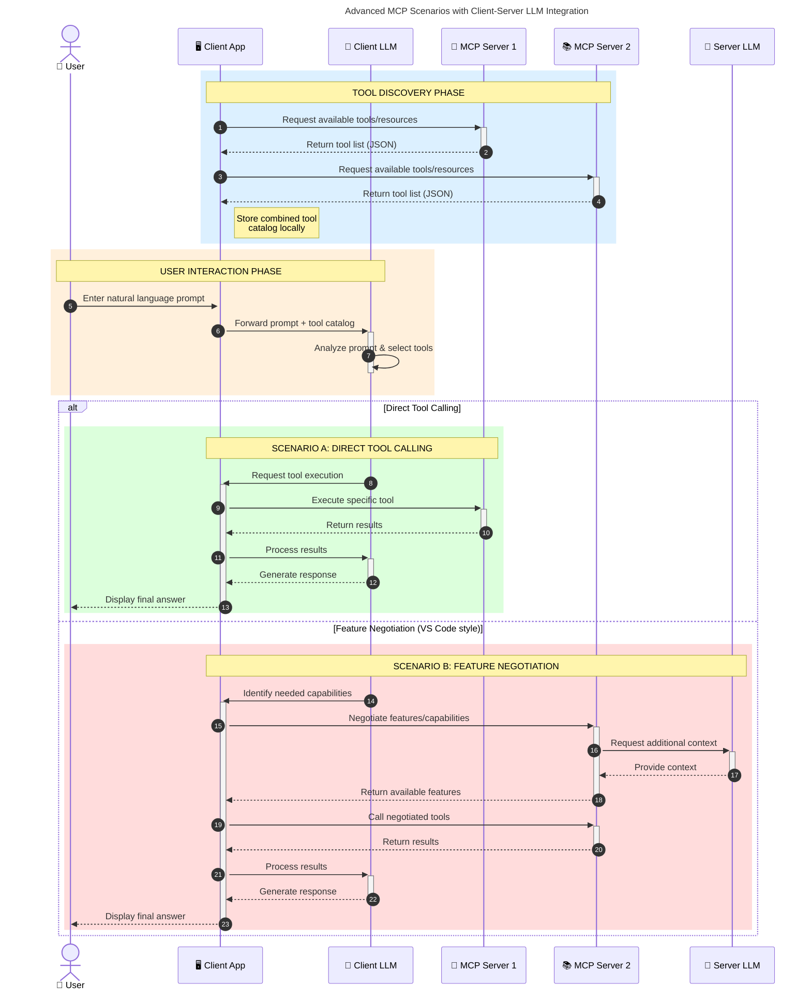

<!--
CO_OP_TRANSLATOR_METADATA:
{
  "original_hash": "1446979020432f512c883848d7eca144",
  "translation_date": "2025-05-29T21:54:57+00:00",
  "source_file": "00-Introduction/README.md",
  "language_code": "sr"
}
-->
# Uvod u Model Context Protocol (MCP): Zašto je važan za skalabilne AI aplikacije

Generativne AI aplikacije predstavljaju veliki napredak jer često omogućavaju korisniku da komunicira sa aplikacijom koristeći prirodne jezičke upite. Međutim, kako se u ove aplikacije ulaže više vremena i resursa, važno je osigurati da se funkcionalnosti i resursi lako integrišu na način koji omogućava proširivost, da aplikacija može podržati korišćenje više modela i da se može nositi sa različitim složenostima modela. Ukratko, pravljenje Gen AI aplikacija je lako na početku, ali kako rastu i postaju složenije, potrebno je definisati arhitekturu i verovatno se osloniti na standard koji garantuje da su aplikacije izgrađene na dosledan način. Tu nastupa MCP da organizuje stvari i pruži standard.

---

## **🔍 Šta je Model Context Protocol (MCP)?**

**Model Context Protocol (MCP)** je **otvoreni, standardizovani interfejs** koji omogućava velikim jezičkim modelima (LLM) da besprekorno komuniciraju sa spoljnim alatima, API-jima i izvorima podataka. On pruža konzistentnu arhitekturu koja proširuje funkcionalnost AI modela izvan njihovih podataka za obuku, omogućavajući pametnije, skalabilnije i responzivnije AI sisteme.

---

## **🎯 Zašto je standardizacija u AI važna**

Kako generativne AI aplikacije postaju složenije, ključno je usvojiti standarde koji garantuju **skalabilnost, proširivost** i **održivost**. MCP odgovara na ove potrebe kroz:

- Ujedinjenje integracija modela i alata  
- Smanjenje lomljivih, jedinstvenih rešenja  
- Omogućavanje da više modela koegzistira unutar jednog ekosistema  

---

## **📚 Ciljevi učenja**

Na kraju ovog članka moći ćete da:

- Definišete **Model Context Protocol (MCP)** i njegove primene  
- Razumete kako MCP standardizuje komunikaciju modela i alata  
- Prepoznate osnovne komponente MCP arhitekture  
- Istražite stvarne primene MCP-a u preduzećima i razvoju  

---

## **💡 Zašto je Model Context Protocol (MCP) revolucionaran**

### **🔗 MCP rešava fragmentaciju u AI interakcijama**

Pre MCP-a, integracija modela sa alatima zahtevala je:

- Prilagođeni kod za svaki par alat-model  
- Nestandardizovane API-je za svakog dobavljača  
- Česte prekide zbog ažuriranja  
- Lošu skalabilnost sa većim brojem alata  

### **✅ Prednosti standardizacije MCP-a**

| **Prednost**             | **Opis**                                                                       |
|-------------------------|--------------------------------------------------------------------------------|
| Interoperabilnost       | LLM modeli besprekorno rade sa alatima različitih dobavljača                 |
| Konzistentnost          | Jednako ponašanje na svim platformama i alatima                              |
| Ponovna upotrebljivost  | Alati napravljeni jednom mogu se koristiti u različitim projektima i sistemima |
| Ubrzani razvoj          | Smanjuje vreme razvoja korišćenjem standardizovanih, plug-and-play interfejsa |

---

## **🧱 Pregled visoko-nivo arhitekture MCP-a**

MCP koristi **klijent-server model**, gde:

- **MCP Hostovi** pokreću AI modele  
- **MCP Klijenti** iniciraju zahteve  
- **MCP Serveri** pružaju kontekst, alate i mogućnosti  

### **Ključne komponente:**

- **Resursi** – Statički ili dinamički podaci za modele  
- **Prompts** – Unapred definisani tokovi za vođenu generaciju  
- **Alati** – Izvršne funkcije poput pretrage, proračuna  
- **Sampling** – Agentno ponašanje kroz rekurzivne interakcije  

---

## Kako MCP serveri funkcionišu

MCP serveri rade na sledeći način:

- **Tok zahteva**:  
    1. MCP Klijent šalje zahtev AI modelu koji radi na MCP Hostu.  
    2. AI model prepoznaje kada su mu potrebni spoljašnji alati ili podaci.  
    3. Model komunicira sa MCP Serverom koristeći standardizovani protokol.  

- **Funkcionalnosti MCP Servera**:  
    - Registar alata: Održava katalog dostupnih alata i njihovih mogućnosti.  
    - Autentifikacija: Proverava dozvole za pristup alatima.  
    - Obrada zahteva: Rukuje dolaznim zahtevima za alatima od modela.  
    - Formatiranje odgovora: Struktuira izlaz alata u format koji model može razumeti.  

- **Izvršenje alata**:  
    - Server prosleđuje zahteve odgovarajućim spoljnim alatima  
    - Alati izvršavaju svoje specijalizovane funkcije (pretraga, proračun, upiti u bazu itd.)  
    - Rezultati se vraćaju modelu u doslednom formatu.  

- **Završetak odgovora**:  
    - AI model integriše rezultate alata u svoj odgovor.  
    - Konačni odgovor se šalje nazad klijentskoj aplikaciji.  

## 👨‍💻 Kako napraviti MCP server (sa primerima)

MCP serveri omogućavaju proširenje mogućnosti LLM-a pružanjem podataka i funkcionalnosti.

Spremni da probate? Evo primera kako napraviti jednostavan MCP server u različitim jezicima:

- **Python primer**: https://github.com/modelcontextprotocol/python-sdk  
- **TypeScript primer**: https://github.com/modelcontextprotocol/typescript-sdk  
- **Java primer**: https://github.com/modelcontextprotocol/java-sdk  
- **C#/.NET primer**: https://github.com/modelcontextprotocol/csharp-sdk  

## 🌍 Stvarni primeri upotrebe MCP-a

MCP omogućava širok spektar primena proširujući AI mogućnosti:

| **Primena**                  | **Opis**                                                                                   |
|-----------------------------|--------------------------------------------------------------------------------------------|
| Integracija podataka u preduzećima | Povezivanje LLM-ova sa bazama podataka, CRM-ovima ili internim alatima               |
| Agentni AI sistemi           | Omogućavanje autonomnih agenata sa pristupom alatima i tokovima donošenja odluka           |
| Multi-modalne aplikacije    | Kombinovanje tekstualnih, slikovnih i audio alata unutar jedne objedinjene AI aplikacije  |
| Integracija podataka u realnom vremenu | Unošenje živih podataka u AI interakcije za preciznije i aktuelnije rezultate     |

### 🧠 MCP = Univerzalni standard za AI interakcije

Model Context Protocol (MCP) deluje kao univerzalni standard za AI interakcije, slično kao što je USB-C standardizovao fizičke konekcije za uređaje. U svetu AI, MCP pruža dosledan interfejs koji omogućava modelima (klijentima) da se lako integrišu sa spoljnim alatima i provajderima podataka (serverima). Ovo eliminiše potrebu za različitim, prilagođenim protokolima za svaki API ili izvor podataka.

U okviru MCP-a, alat kompatibilan sa MCP-om (poznat kao MCP server) prati jedinstveni standard. Ovi serveri mogu da navedu koje alate ili akcije nude i izvršavaju te akcije na zahtev AI agenta. Platforme za AI agente koje podržavaju MCP mogu da otkriju dostupne alate na serverima i pozivaju ih kroz ovaj standardni protokol.

### 💡 Olakšava pristup znanju

Pored pružanja alata, MCP olakšava i pristup znanju. Omogućava aplikacijama da pruže kontekst velikim jezičkim modelima (LLM) povezujući ih sa različitim izvorima podataka. Na primer, MCP server može predstavljati arhivu dokumenata kompanije, dozvoljavajući agentima da na zahtev preuzimaju relevantne informacije. Drugi server može upravljati specifičnim akcijama poput slanja mejlova ili ažuriranja zapisa. Iz ugla agenta, to su jednostavno alati koje može koristiti — neki alati vraćaju podatke (kontekst znanja), dok drugi izvršavaju akcije. MCP efikasno upravlja obema vrstama.

Agent koji se povezuje na MCP server automatski uči o dostupnim mogućnostima i pristupačnim podacima servera kroz standardizovani format. Ova standardizacija omogućava dinamičku dostupnost alata. Na primer, dodavanjem novog MCP servera u sistem agenta, njegove funkcije postaju odmah dostupne bez dodatnih prilagođavanja u instrukcijama agenta.

Ova pojednostavljena integracija prati tok prikazan u mermaid dijagramu, gde serveri obezbeđuju i alate i znanje, osiguravajući besprekornu saradnju između sistema.

### 👉 Primer: Skalabilno rešenje za agente

### 🔄 Napredni MCP scenariji sa integracijom LLM-a na strani klijenta

Pored osnovne MCP arhitekture, postoje napredni scenariji u kojima i klijent i server sadrže LLM-ove, omogućavajući složenije interakcije:

## 🔐 Praktične koristi MCP-a

Evo praktičnih koristi korišćenja MCP-a:

- **Ažurnost**: Modeli mogu pristupiti najnovijim informacijama izvan svojih podataka za obuku  
- **Proširenje mogućnosti**: Modeli mogu koristiti specijalizovane alate za zadatke za koje nisu trenirani  
- **Smanjenje halucinacija**: Spoljašnji izvori podataka pružaju činjeničnu osnovu  
- **Privatnost**: Osetljivi podaci mogu ostati u sigurnim okruženjima umesto da budu ugrađeni u upite  

## 📌 Ključni zaključci

Evo ključnih zaključaka o korišćenju MCP-a:

- **MCP** standardizuje način na koji AI modeli komuniciraju sa alatima i podacima  
- Promoviše **proširivost, konzistentnost i interoperabilnost**  
- MCP pomaže da se **smanji vreme razvoja, poveća pouzdanost i prošire mogućnosti modela**  
- Klijent-server arhitektura **omogućava fleksibilne, proširive AI aplikacije**  

## 🧠 Vežba

Razmislite o AI aplikaciji koju želite da napravite.

- Koji **spoljni alati ili podaci** bi mogli unaprediti njene mogućnosti?  
- Kako bi MCP mogao učiniti integraciju **jednostavnijom i pouzdanijom**?  

## Dodatni resursi

- [MCP GitHub repozitorijum](https://github.com/modelcontextprotocol)

## Šta sledi

Sledeće: [Poglavlje 1: Osnovni koncepti](/01-CoreConcepts/README.md)

**Одрицање од одговорности**:  
Овај документ је преведен коришћењем АИ преводилачке услуге [Co-op Translator](https://github.com/Azure/co-op-translator). Иако се трудимо да превод буде тачан, молимо вас да имате у виду да аутоматски преводи могу садржати грешке или нетачности. Изворни документ на његовом оригиналном језику треба сматрати коначним и ауторитетним извором. За критичне информације препоручује се професионални превод од стране стручних људи. Нисмо одговорни за било каква неспоразума или погрешне интерпретације које могу настати коришћењем овог превода.