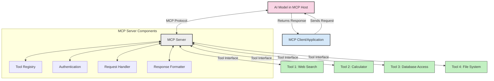
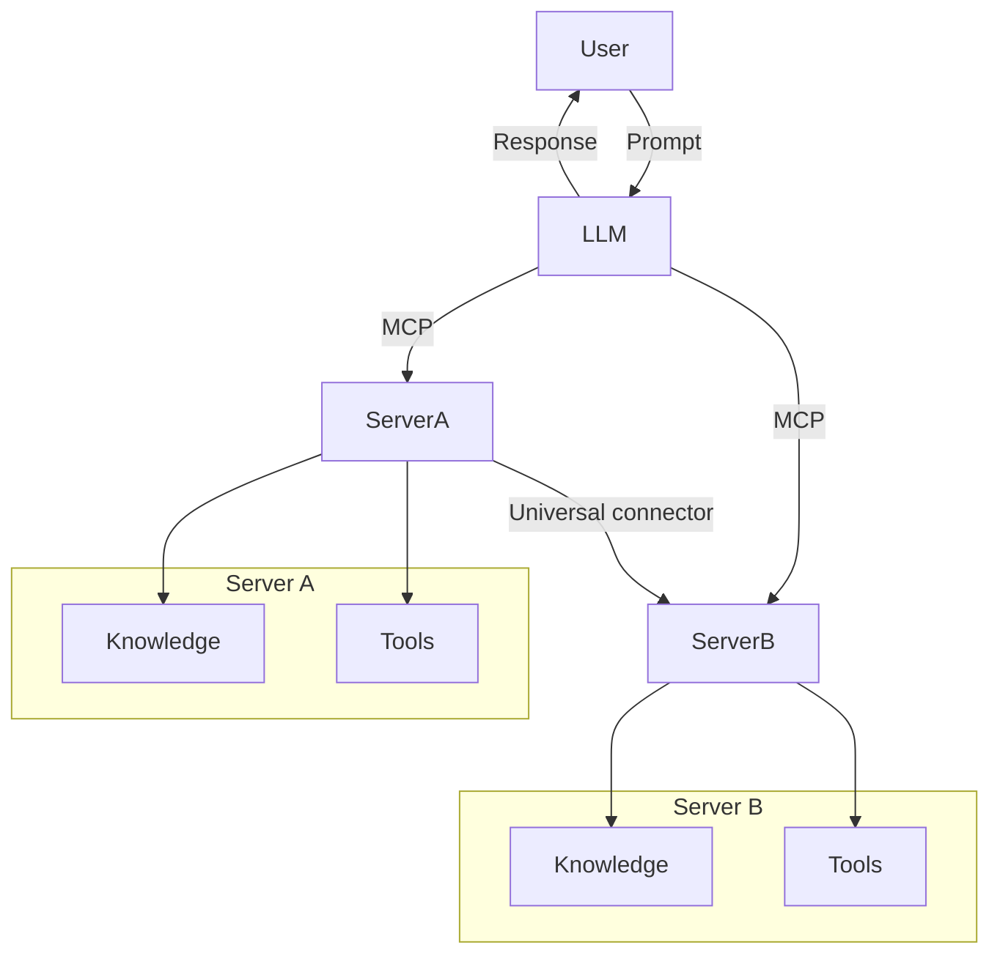
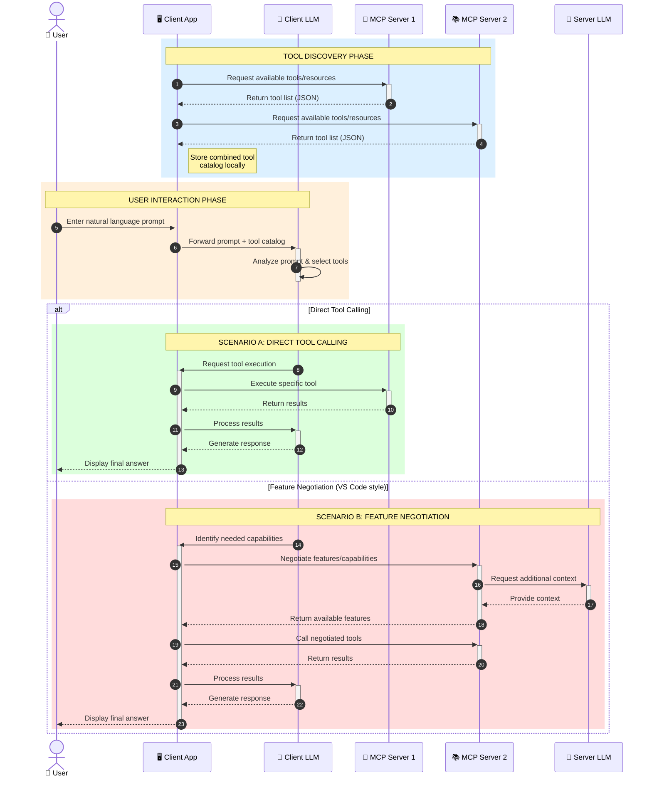

<!--
CO_OP_TRANSLATOR_METADATA:
{
  "original_hash": "25a94c681cf43612ff394d8cf78a74de",
  "translation_date": "2025-05-27T16:13:42+00:00",
  "source_file": "00-Introduction/README.md",
  "language_code": "sr"
}
-->
# Uvod u Model Context Protocol (MCP): Zašto je važan za skalabilne AI aplikacije

Generativne AI aplikacije predstavljaju veliki korak napred jer često omogućavaju korisnicima da komuniciraju sa aplikacijom koristeći prirodni jezik. Međutim, kako se ulaže više vremena i resursa u takve aplikacije, želite da budete sigurni da možete lako integrisati funkcionalnosti i resurse na način koji je jednostavan za proširenje, da vaša aplikacija može da podrži korišćenje više modela i da se nosi sa različitim specifičnostima modela. Ukratko, pravljenje Gen AI aplikacija je lako na početku, ali kako rastu i postaju složenije, potrebno je početi definisati arhitekturu i verovatno se osloniti na standard koji će osigurati da su vaše aplikacije dosledno izgrađene. Tu na scenu stupa MCP da organizuje stvari i pruži standard.

---

## **🔍 Šta je Model Context Protocol (MCP)?**

**Model Context Protocol (MCP)** je **otvoreni, standardizovani interfejs** koji omogućava velikim jezičkim modelima (LLM) da besprekorno komuniciraju sa spoljnim alatima, API-jima i izvorima podataka. Pruža konzistentnu arhitekturu za unapređenje funkcionalnosti AI modela izvan njihovih podataka za obuku, omogućavajući pametnije, skalabilnije i responzivnije AI sisteme.

---

## **🎯 Zašto je standardizacija u AI važna**

Kako generativne AI aplikacije postaju složenije, neophodno je usvojiti standarde koji obezbeđuju **skalabilnost, proširivost** i **održivost**. MCP odgovara na ove potrebe tako što:

- Ujedinjuje integracije modela i alata
- Smanjuje krhka, jednokratna prilagođena rešenja
- Dozvoljava da više modela koegzistira u istom ekosistemu

---

## **📚 Ciljevi učenja**

Na kraju ovog članka, moći ćete da:

- Definišete **Model Context Protocol (MCP)** i njegove primene
- Razumete kako MCP standardizuje komunikaciju modela sa alatima
- Identifikujete osnovne komponente MCP arhitekture
- Istražite stvarne primere primene MCP u preduzećima i razvoju

---

## **💡 Zašto je Model Context Protocol (MCP) revolucionaran**

### **🔗 MCP rešava fragmentaciju u AI interakcijama**

Pre MCP-a, integracija modela sa alatima je zahtevala:

- Prilagođeni kod za svaki par alat-model
- Nestandardne API-je za svakog prodavca
- Česte prekide zbog ažuriranja
- Lošu skalabilnost sa većim brojem alata

### **✅ Prednosti standardizacije MCP-a**

| **Prednost**             | **Opis**                                                                       |
|--------------------------|--------------------------------------------------------------------------------|
| Interoperabilnost        | LLM modeli rade besprekorno sa alatima različitih proizvođača                 |
| Konzistentnost           | Jednako ponašanje na različitim platformama i alatima                         |
| Ponovna upotrebljivost   | Alati napravljeni jednom mogu se koristiti u različitim projektima i sistemima |
| Brži razvoj              | Smanjuje vreme razvoja korišćenjem standardizovanih, plug-and-play interfejsa |

---

## **🧱 Pregled MCP arhitekture na visokom nivou**

MCP koristi **klijent-server model**, gde:

- **MCP Hosts** pokreću AI modele
- **MCP Clients** šalju zahteve
- **MCP Servers** pružaju kontekst, alate i funkcionalnosti

### **Ključne komponente:**

- **Resursi** – Statički ili dinamički podaci za modele  
- **Prompts** – Preddefinisani tokovi za vođenu generaciju  
- **Alati** – Izvršne funkcije poput pretrage, kalkulacija  
- **Sampling** – Agentno ponašanje kroz rekurzivne interakcije

---

## Kako MCP serveri funkcionišu

MCP serveri rade na sledeći način:

- **Tok zahteva**:  
    1. MCP Client šalje zahtev AI modelu koji radi u MCP Host-u.  
    2. AI model prepoznaje kada mu trebaju spoljni alati ili podaci.  
    3. Model komunicira sa MCP Serverom koristeći standardizovani protokol.

- **Funkcionalnosti MCP Servera**:  
    - Registar alata: Održava katalog dostupnih alata i njihovih mogućnosti.  
    - Autentifikacija: Proverava dozvole za pristup alatima.  
    - Obrada zahteva: Rukuje dolaznim zahtevima za alate od modela.  
    - Formatiranje odgovora: Strukturira izlaze alata u format koji model može da razume.

- **Izvršenje alata**:  
    - Server prosleđuje zahteve odgovarajućim spoljnim alatima  
    - Alati izvršavaju svoje specijalizovane funkcije (pretraga, kalkulacije, upiti baza podataka itd.)  
    - Rezultati se vraćaju modelu u konzistentnom formatu.

- **Završetak odgovora**:  
    - AI model integriše izlaze alata u svoj odgovor.  
    - Konačni odgovor se šalje nazad klijentskoj aplikaciji.

## 👨‍💻 Kako napraviti MCP server (sa primerima)

MCP serveri vam omogućavaju da proširite mogućnosti LLM modela pružajući podatke i funkcionalnosti.

Spremni da probate? Evo primera kako napraviti jednostavan MCP server u različitim jezicima:

- **Python primer**: https://github.com/modelcontextprotocol/python-sdk

- **TypeScript primer**: https://github.com/modelcontextprotocol/typescript-sdk

- **Java primer**: https://github.com/modelcontextprotocol/java-sdk

- **C#/.NET primer**: https://github.com/modelcontextprotocol/csharp-sdk

## 🌍 Praktične primene MCP-a

MCP omogućava širok spektar aplikacija proširujući AI mogućnosti:

| **Primena**                | **Opis**                                                                       |
|----------------------------|--------------------------------------------------------------------------------|
| Integracija podataka u preduzećima | Povezivanje LLM modela sa bazama podataka, CRM sistemima ili internim alatima |
| Agentni AI sistemi          | Omogućavanje autonomnih agenata sa pristupom alatima i tokovima donošenja odluka |
| Multimodalne aplikacije    | Kombinovanje tekstualnih, slikovnih i audio alata unutar jedne AI aplikacije   |
| Integracija podataka u realnom vremenu | Unos uživo podataka u AI interakcije za preciznije i aktuelnije rezultate     |

### 🧠 MCP = Univerzalni standard za AI interakcije

Model Context Protocol (MCP) deluje kao univerzalni standard za AI interakcije, slično kao što je USB-C standardizovao fizičke konekcije uređaja. U svetu AI, MCP pruža konzistentan interfejs koji omogućava modelima (klijentima) da se besprekorno integrišu sa spoljnim alatima i dobavljačima podataka (serverima). Ovo eliminiše potrebu za različitim, prilagođenim protokolima za svaki API ili izvor podataka.

Pod MCP-om, MCP-kompatibilni alat (poznat kao MCP server) prati jedinstveni standard. Ovi serveri mogu da navedu koje alate ili akcije nude i izvršavaju te akcije kada ih AI agent zatraži. Platforme AI agenata koje podržavaju MCP mogu da otkriju dostupne alate sa servera i pozivaju ih kroz ovaj standardni protokol.

### 💡 Olakšava pristup znanju

Pored pružanja alata, MCP olakšava pristup znanju. Omogućava aplikacijama da pruže kontekst velikim jezičkim modelima (LLM) povezivanjem sa različitim izvorima podataka. Na primer, MCP server može predstavljati repozitorijum dokumenata kompanije, dozvoljavajući agentima da po potrebi pribave relevantne informacije. Drugi server može rukovati specifičnim akcijama poput slanja mejlova ili ažuriranja zapisa. Sa stanovišta agenta, to su jednostavno alati koje može koristiti — neki alati vraćaju podatke (kontekst znanja), dok drugi izvršavaju radnje. MCP efikasno upravlja oba slučaja.

Agent koji se povezuje na MCP server automatski uči o dostupnim funkcionalnostima i pristupačnim podacima servera kroz standardizovani format. Ova standardizacija omogućava dinamičku dostupnost alata. Na primer, dodavanjem novog MCP servera u sistem agenta, njegove funkcije postaju odmah dostupne bez potrebe za dodatnim prilagođavanjem instrukcija agenta.

Ova pojednostavljena integracija je u skladu sa tokom prikazanim na mermeid dijagramu, gde serveri pružaju i alate i znanje, obezbeđujući besprekornu saradnju između sistema.

### 👉 Primer: Skalabilno rešenje za agente

### 🔄 Napredni MCP scenariji sa integracijom LLM na klijentskoj strani

Pored osnovne MCP arhitekture, postoje napredni scenariji gde i klijent i server sadrže LLM modele, omogućavajući sofisticiranije interakcije:

## 🔐 Praktične koristi MCP-a

Evo praktičnih koristi korišćenja MCP-a:

- **Svežina podataka**: Modeli mogu pristupiti najnovijim informacijama izvan svojih podataka za obuku  
- **Proširenje mogućnosti**: Modeli mogu koristiti specijalizovane alate za zadatke za koje nisu trenirani  
- **Smanjenje halucinacija**: Spoljni izvori podataka obezbeđuju činjeničnu osnovu  
- **Privatnost**: Osetljivi podaci mogu ostati u sigurnim okruženjima umesto da budu ugrađeni u promptove

## 📌 Ključni zaključci

Evo ključnih zaključaka za korišćenje MCP-a:

- **MCP** standardizuje način na koji AI modeli komuniciraju sa alatima i podacima  
- Promoviše **proširivost, konzistentnost i interoperabilnost**  
- MCP pomaže **skraćenju vremena razvoja, poboljšanju pouzdanosti i proširenju mogućnosti modela**  
- Klijent-server arhitektura omogućava **fleksibilne, proširive AI aplikacije**

## 🧠 Vežba

Razmislite o AI aplikaciji koju biste želeli da napravite.

- Koji **spoljni alati ili podaci** bi mogli unaprediti njene mogućnosti?  
- Kako bi MCP mogao učiniti integraciju **jednostavnijom i pouzdanijom?**

## Dodatni resursi

- [MCP GitHub repozitorijum](https://github.com/modelcontextprotocol)

## Šta sledi

Sledeće: [Poglavlje 1: Osnovni koncepti](/01-CoreConcepts/README.md)

**Одрицање од одговорности**:  
Овај документ је преведен помоћу AI преводилачке услуге [Co-op Translator](https://github.com/Azure/co-op-translator). Иако тежимо прецизности, молимо имајте у виду да аутоматизовани преводи могу садржати грешке или нетачности. Изворни документ на његовом оригиналном језику треба сматрати ауторитетним извором. За критичне информације препоручује се професионални превод од стране људског преводиоца. Нисмо одговорни за било каква неспоразума или погрешна тумачења настала коришћењем овог превода.