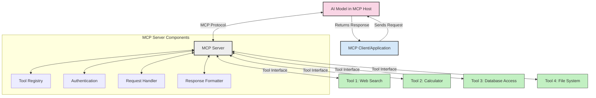
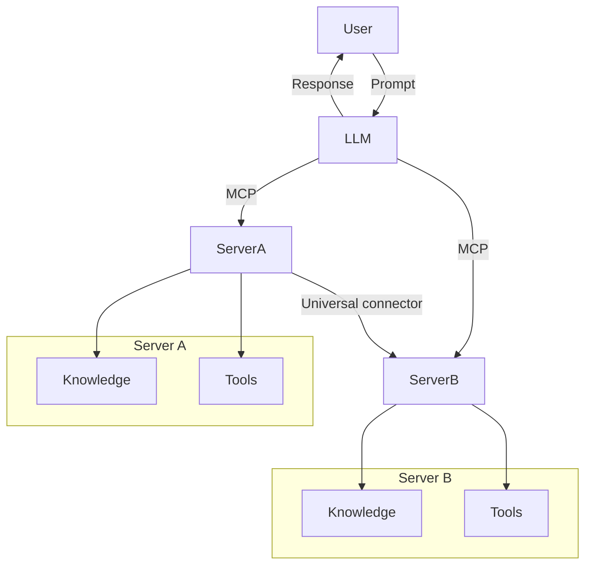

<!--
CO_OP_TRANSLATOR_METADATA:
{
  "original_hash": "02301140adbd807ecf0f17720fa307bc",
  "translation_date": "2025-05-17T06:10:30+00:00",
  "source_file": "00-Introduction/README.md",
  "language_code": "sr"
}
-->
# Uvod u Model Context Protocol (MCP): Zašto je važan za skalabilne AI aplikacije

Generativne AI aplikacije su veliki korak napred jer često omogućavaju korisniku da komunicira sa aplikacijom koristeći prirodne jezičke upite. Međutim, kako se više vremena i resursa ulaže u takve aplikacije, želite da osigurate da možete lako integrisati funkcionalnosti i resurse na način koji je lak za proširenje, da vaša aplikacija može podržavati više od jednog modela koji se koristi i njegove složenosti. Ukratko, izgradnja Gen AI aplikacija je lako započeti, ali kako raste i postaje složenija, morate početi definisati arhitekturu i verovatno će vam trebati standard da osigurate da su vaše aplikacije izgrađene na konzistentan način. Ovde MCP dolazi da organizuje stvari, da pruži standard.

---

## **🔍 Šta je Model Context Protocol (MCP)?**

**Model Context Protocol (MCP)** je **otvoren, standardizovan interfejs** koji omogućava Velikim Jezičkim Modelima (LLMs) da bez problema interaguju sa eksternim alatima, API-jima i izvorima podataka. On obezbeđuje konzistentnu arhitekturu za poboljšanje funkcionalnosti AI modela izvan njihovih podataka za obuku, omogućavajući pametnije, skalabilne i responzivnije AI sisteme.

---

## **🎯 Zašto je standardizacija u AI važna**

Kako generativne AI aplikacije postaju sve složenije, bitno je usvojiti standarde koji osiguravaju **skalabilnost, proširivost** i **održivost**. MCP se bavi ovim potrebama kroz:

- Ujedinjavanje integracija model-alat
- Smanjenje krhkih, jednokratnih prilagođenih rešenja
- Omogućavanje koegzistencije više modela unutar jednog ekosistema

---

## **📚 Ciljevi učenja**

Na kraju ovog članka, bićete u stanju da:

- Definišete **Model Context Protocol (MCP)** i njegove slučajeve upotrebe
- Razumete kako MCP standardizuje komunikaciju modela i alata
- Identifikujete osnovne komponente MCP arhitekture
- Istražite primene MCP u stvarnom svetu u kontekstima preduzeća i razvoja

---

## **💡 Zašto je Model Context Protocol (MCP) revolucionaran**

### **🔗 MCP rešava fragmentaciju u AI interakcijama**

Pre MCP, integracija modela sa alatima zahtevala je:

- Prilagođeni kod za svaki par alat-model
- Nestandardne API-je za svakog dobavljača
- Česte prekide zbog ažuriranja
- Lošu skalabilnost sa više alata

### **✅ Prednosti MCP standardizacije**

| **Prednost**              | **Opis**                                                                      |
|---------------------------|-------------------------------------------------------------------------------|
| Interoperabilnost         | LLMs rade bez problema sa alatima različitih dobavljača                       |
| Konzistentnost            | Uniformno ponašanje preko platformi i alata                                   |
| Ponovna upotrebljivost    | Alati izgrađeni jednom mogu se koristiti u različitim projektima i sistemima  |
| Ubrzani razvoj            | Smanjuje vreme razvoja koristeći standardizovane, plug-and-play interfejse    |

---

## **🧱 Pregled MCP arhitekture na visokom nivou**

MCP prati **model klijent-server**, gde:

- **MCP Hostovi** pokreću AI modele
- **MCP Klijenti** pokreću zahteve
- **MCP Serveri** obezbeđuju kontekst, alate i sposobnosti

### **Ključne komponente:**

- **Resursi** – Statički ili dinamički podaci za modele  
- **Prompts** – Preddefinisani tokovi za vođeno generisanje  
- **Alati** – Izvršne funkcije kao što su pretraga, proračuni  
- **Sampling** – Agentičko ponašanje putem rekurzivnih interakcija

---

## Kako MCP serveri rade

MCP serveri rade na sledeći način:

- **Tok zahteva**: 
    1. MCP Klijent šalje zahtev AI Modelu koji radi na MCP Hostu.
    2. AI Model identifikuje kada mu trebaju eksterni alati ili podaci.
    3. Model komunicira sa MCP Serverom koristeći standardizovani protokol.

- **Funkcionalnost MCP Servera**:
    - Registar alata: Održava katalog dostupnih alata i njihovih sposobnosti.
    - Autentifikacija: Verifikuje dozvole za pristup alatima.
    - Obrada zahteva: Procesira dolazeće zahteve za alatima od modela.
    - Formatiranje odgovora: Struktuira izlaze alata u format koji model može razumeti.

- **Izvršenje alata**: 
    - Server preusmerava zahteve odgovarajućim eksternim alatima
    - Alati izvršavaju svoje specijalizovane funkcije (pretraga, proračuni, upiti baze podataka, itd.)
    - Rezultati se vraćaju modelu u konzistentnom formatu.

- **Završetak odgovora**: 
    - AI model uključuje izlaze alata u svoj odgovor.
    - Konačni odgovor se šalje nazad klijentskoj aplikaciji.

## 👨‍💻 Kako izgraditi MCP server (sa primerima)

MCP serveri vam omogućavaju da proširite sposobnosti LLM-a pružanjem podataka i funkcionalnosti. 

Spremni da probate? Evo primera kreiranja jednostavnog MCP servera u različitim jezicima:

- **Primer u Python-u**: https://github.com/modelcontextprotocol/python-sdk

- **Primer u TypeScript-u**: https://github.com/modelcontextprotocol/typescript-sdk

- **Primer u Java-u**: https://github.com/modelcontextprotocol/java-sdk

- **Primer u C#/.NET-u**: https://github.com/modelcontextprotocol/csharp-sdk

## 🌍 Primene MCP u stvarnom svetu

MCP omogućava širok spektar aplikacija proširujući AI sposobnosti:

| **Primena**                | **Opis**                                                                      |
|----------------------------|-------------------------------------------------------------------------------|
| Integracija podataka u preduzeću | Povezivanje LLM-ova sa bazama podataka, CRM-ovima ili internim alatima        |
| Agentički AI sistemi       | Omogućavanje autonomnih agenata sa pristupom alatima i tokovima odlučivanja    |
| Multimodalne aplikacije    | Kombinovanje tekstualnih, slikovnih i audio alata unutar jedinstvene AI aplikacije |
| Integracija podataka u realnom vremenu | Dovođenje živih podataka u AI interakcije za preciznije, aktuelne izlaze |

### 🧠 MCP = Univerzalni standard za AI interakcije

Model Context Protocol (MCP) deluje kao univerzalni standard za AI interakcije, slično kao što je USB-C standardizovao fizičke konekcije za uređaje. U svetu AI, MCP pruža konzistentan interfejs, omogućavajući modelima (klijentima) da se besprekorno integrišu sa eksternim alatima i dobavljačima podataka (serverima). Ovo eliminiše potrebu za raznovrsnim, prilagođenim protokolima za svaki API ili izvor podataka.

Pod MCP, MCP-kompatibilan alat (nazvan MCP server) prati jedinstveni standard. Ovi serveri mogu navesti alate ili akcije koje nude i izvršiti te akcije kada ih AI agent zatraži. Platforme AI agenata koje podržavaju MCP su sposobne da otkriju dostupne alate sa servera i pozovu ih kroz ovaj standardni protokol.

### 💡 Omogućava pristup znanju

Pored ponude alata, MCP takođe omogućava pristup znanju. On omogućava aplikacijama da obezbede kontekst velikim jezičkim modelima (LLMs) povezujući ih sa različitim izvorima podataka. Na primer, MCP server može predstavljati skladište dokumenata kompanije, omogućavajući agentima da na zahtev dobiju relevantne informacije. Drugi server može upravljati specifičnim akcijama kao što su slanje emailova ili ažuriranje zapisa. Iz perspektive agenta, ovo su jednostavno alati koje može koristiti—neki alati vraćaju podatke (kontekst znanja), dok drugi izvršavaju akcije. MCP efikasno upravlja obema.

Agent koji se povezuje na MCP server automatski uči dostupne sposobnosti servera i dostupne podatke kroz standardni format. Ova standardizacija omogućava dinamičku dostupnost alata. Na primer, dodavanje novog MCP servera u sistem agenta čini njegove funkcije odmah upotrebljivim bez potrebe za daljim prilagođavanjem instrukcija agenta.

Ova pojednostavljena integracija se usklađuje sa tokom prikazanim u mermaid dijagramu, gde serveri obezbeđuju i alate i znanje, osiguravajući besprekornu saradnju preko sistema.

### 👉 Primer: Skalabilno rešenje za agenta

## 🔐 Praktične prednosti MCP

Evo nekih praktičnih prednosti korišćenja MCP:

- **Svežina**: Modeli mogu pristupiti ažuriranim informacijama izvan svojih podataka za obuku
- **Proširenje sposobnosti**: Modeli mogu koristiti specijalizovane alate za zadatke za koje nisu obučeni
- **Smanjene halucinacije**: Eksterni izvori podataka obezbeđuju faktualnu osnovu
- **Privatnost**: Osetljivi podaci mogu ostati unutar sigurnih okruženja umesto da budu ugrađeni u upite

## 📌 Ključne tačke

Slede ključne tačke za korišćenje MCP:

- **MCP** standardizuje način na koji AI modeli interaguju sa alatima i podacima
- Promoviše **proširivost, konzistentnost i interoperabilnost**
- MCP pomaže **smanjenju vremena razvoja, poboljšanju pouzdanosti i proširenju sposobnosti modela**
- Arhitektura klijent-server omogućava **fleksibilne, proširive AI aplikacije**

## 🧠 Vežba

Razmislite o AI aplikaciji koju ste zainteresovani da izgradite.

- Koji **eksterni alati ili podaci** bi mogli poboljšati njene sposobnosti?
- Kako bi MCP mogao učiniti integraciju **jednostavnijom i pouzdanijom?**

## Dodatni resursi

- [MCP GitHub repozitorijum](https://github.com/modelcontextprotocol)

## Šta je sledeće

Sledeće: [Poglavlje 1: Osnovni koncepti](/01-CoreConcepts/README.md)

**Ограничење одговорности**:
Овај документ је преведен користећи AI услугу превођења [Co-op Translator](https://github.com/Azure/co-op-translator). Иако се трудимо да обезбедимо тачност, молимо вас да будете свесни да аутоматизовани преводи могу садржати грешке или нетачности. Оригинални документ на његовом матерњем језику треба сматрати ауторитативним извором. За критичне информације, препоручује се професионални превод од стране људи. Не преузимамо одговорност за било каква погрешна тумачења или неразумевања која произилазе из коришћења овог превода.