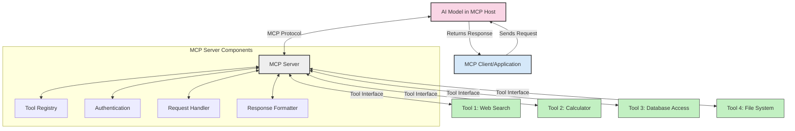
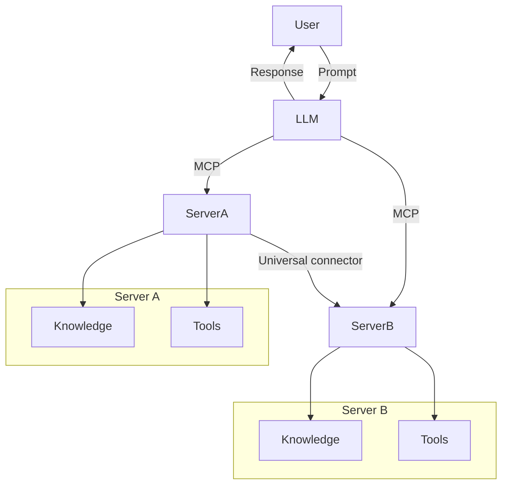

<!--
CO_OP_TRANSLATOR_METADATA:
{
  "original_hash": "cf84f987e1b771d2201408e110dfd2db",
  "translation_date": "2025-05-20T18:15:51+00:00",
  "source_file": "00-Introduction/README.md",
  "language_code": "sr"
}
-->
# Uvod u Model Context Protocol (MCP): Zašto je važan za skalabilne AI aplikacije

Generativne AI aplikacije predstavljaju veliki napredak jer često omogućavaju korisnicima da komuniciraju sa aplikacijom koristeći prirodni jezik. Međutim, kako se ulaže više vremena i resursa u ovakve aplikacije, važno je da možete lako integrisati funkcionalnosti i resurse na način koji omogućava jednostavno proširenje, podršku za više modela i njihovu složenost. Ukratko, izrada Gen AI aplikacija je laka na početku, ali kako rastu i postaju složenije, potrebno je definisati arhitekturu i verovatno se osloniti na standard koji će osigurati doslednu izgradnju aplikacija. Tu na scenu stupa MCP da organizuje stvari i pruži standard.

---

## **🔍 Šta je Model Context Protocol (MCP)?**

**Model Context Protocol (MCP)** je **otvoreni, standardizovani interfejs** koji omogućava velikim jezičkim modelima (LLM) da nesmetano komuniciraju sa eksternim alatima, API-jima i izvorima podataka. Pruža doslednu arhitekturu za unapređenje funkcionalnosti AI modela izvan njihovih podataka za obuku, omogućavajući pametnije, skalabilnije i responzivnije AI sisteme.

---

## **🎯 Zašto je standardizacija u AI važna**

Kako generativne AI aplikacije postaju složenije, ključno je usvojiti standarde koji obezbeđuju **skalabilnost, proširivost** i **održivost**. MCP odgovara na ove potrebe kroz:

- Ujedinjenje integracija modela i alata  
- Smanjenje lomljivih, jednokratnih rešenja  
- Omogućavanje koegzistencije više modela u jednom ekosistemu  

---

## **📚 Ciljevi učenja**

Do kraja ovog članka moći ćete da:

- Definišete **Model Context Protocol (MCP)** i njegove primene  
- Razumete kako MCP standardizuje komunikaciju između modela i alata  
- Prepoznate ključne komponente MCP arhitekture  
- Istražite primere primene MCP u poslovnom i razvojnom okruženju  

---

## **💡 Zašto je Model Context Protocol (MCP) revolucionaran**

### **🔗 MCP rešava fragmentaciju u AI interakcijama**

Pre MCP-a, integracija modela sa alatima je zahtevala:

- Prilagođeni kod za svaki par alat-model  
- Nestandardizovane API-je za svakog dobavljača  
- Česte prekide zbog ažuriranja  
- Lošu skalabilnost sa rastom broja alata  

### **✅ Prednosti MCP standardizacije**

| **Prednost**             | **Opis**                                                                    |
|-------------------------|-----------------------------------------------------------------------------|
| Interoperabilnost       | LLM modeli rade nesmetano sa alatima različitih dobavljača                  |
| Doslednost              | Jednako ponašanje na različitim platformama i alatima                       |
| Ponovna upotrebljivost  | Alati napravljeni jednom mogu se koristiti u različitim projektima i sistemima |
| Brži razvoj             | Smanjuje vreme razvoja korišćenjem standardizovanih, plug-and-play interfejsa |

---

## **🧱 Pregled MCP arhitekture na visokom nivou**

MCP koristi **klijent-server model**, gde:

- **MCP Hosts** pokreću AI modele  
- **MCP Clients** iniciraju zahteve  
- **MCP Servers** pružaju kontekst, alate i mogućnosti  

### **Ključne komponente:**

- **Resources** – Statički ili dinamički podaci za modele  
- **Prompts** – Preddefinisani tokovi rada za vođenu generaciju  
- **Tools** – Izvršne funkcije poput pretrage, kalkulacija  
- **Sampling** – Agentno ponašanje kroz rekurzivne interakcije  

---

## Kako MCP serveri rade

MCP serveri funkcionišu na sledeći način:

- **Tok zahteva**:  
    1. MCP Klijent šalje zahtev AI modelu koji radi na MCP Host-u.  
    2. AI model prepoznaje kada su mu potrebni eksterni alati ili podaci.  
    3. Model komunicira sa MCP Serverom koristeći standardizovani protokol.

- **Funkcionalnosti MCP Servera**:  
    - Registar alata: Održava katalog dostupnih alata i njihovih mogućnosti.  
    - Autentifikacija: Proverava dozvole za pristup alatima.  
    - Obrada zahteva: Rukuje dolaznim zahtevima za alate od modela.  
    - Formatiranje odgovora: Strukturira izlaze alata u format razumljiv modelu.

- **Izvršenje alata**:  
    - Server prosleđuje zahteve odgovarajućim eksternim alatima  
    - Alati izvršavaju specijalizovane funkcije (pretraga, kalkulacije, upiti baze podataka itd.)  
    - Rezultati se vraćaju modelu u doslednom formatu.

- **Završetak odgovora**:  
    - AI model integriše izlaze alata u svoj odgovor.  
    - Konačni odgovor se šalje nazad klijentskoj aplikaciji.

## 👨‍💻 Kako napraviti MCP server (sa primerima)

MCP serveri omogućavaju proširenje mogućnosti LLM modela pružajući podatke i funkcionalnosti.

Spremni da probate? Evo primera kako napraviti jednostavan MCP server u različitim jezicima:

- **Python primer**: https://github.com/modelcontextprotocol/python-sdk

- **TypeScript primer**: https://github.com/modelcontextprotocol/typescript-sdk

- **Java primer**: https://github.com/modelcontextprotocol/java-sdk

- **C#/.NET primer**: https://github.com/modelcontextprotocol/csharp-sdk

## 🌍 Praktične primene MCP

MCP omogućava širok spektar aplikacija proširujući AI mogućnosti:

| **Primena**                 | **Opis**                                                                 |
|-----------------------------|--------------------------------------------------------------------------|
| Integracija podataka u preduzeću | Povezivanje LLM sa bazama podataka, CRM-ovima ili internim alatima      |
| Agentni AI sistemi           | Omogućavanje autonomnih agenata sa pristupom alatima i tokovima odlučivanja |
| Multimodalne aplikacije      | Kombinovanje teksta, slike i zvuka u jedinstvenoj AI aplikaciji          |
| Integracija podataka u realnom vremenu | Uvođenje ažurnih podataka u AI interakcije za preciznije i aktuelnije rezultate |

### 🧠 MCP = Univerzalni standard za AI interakcije

Model Context Protocol (MCP) funkcioniše kao univerzalni standard za AI interakcije, slično kao što je USB-C standardizovao fizičke konekcije za uređaje. U svetu AI, MCP pruža dosledan interfejs koji omogućava modelima (klijentima) da se besprekorno integrišu sa eksternim alatima i provajderima podataka (serverima). Time se eliminiše potreba za raznovrsnim, prilagođenim protokolima za svaki API ili izvor podataka.

U okviru MCP-a, alat kompatibilan sa MCP-om (poznat kao MCP server) prati jedinstveni standard. Ovi serveri mogu da navedu alate ili akcije koje nude i izvršavaju te akcije kada ih AI agent zatraži. Platforme AI agenata koje podržavaju MCP mogu da otkriju dostupne alate na serverima i pozivaju ih putem ovog standardnog protokola.

### 💡 Omogućava pristup znanju

Pored pružanja alata, MCP olakšava pristup znanju. Omogućava aplikacijama da pruže kontekst velikim jezičkim modelima (LLM) povezivanjem sa različitim izvorima podataka. Na primer, MCP server može predstavljati repozitorijum dokumenata kompanije, omogućavajući agentima da po potrebi pribave relevantne informacije. Drugi server može rukovati specifičnim radnjama kao što su slanje mejlova ili ažuriranje zapisa. Sa stanovišta agenta, to su jednostavno alati koje može koristiti – neki alati vraćaju podatke (kontekst znanja), dok drugi izvršavaju radnje. MCP efikasno upravlja oba.

Agent koji se povezuje na MCP server automatski uči o dostupnim mogućnostima i pristupačnim podacima servera kroz standardizovani format. Ova standardizacija omogućava dinamičnu dostupnost alata. Na primer, dodavanjem novog MCP servera u sistem agenta njegove funkcije postaju odmah dostupne bez potrebe za dodatnim prilagođavanjem uputstava za agenta.

Ova pojednostavljena integracija je u skladu sa tokom prikazanim na mermaid dijagramu, gde serveri pružaju i alate i znanje, obezbeđujući besprekornu saradnju između sistema.

### 👉 Primer: Skalabilno rešenje za agente

## 🔐 Praktične prednosti MCP

Evo praktičnih prednosti korišćenja MCP:

- **Ažurnost**: Modeli mogu pristupiti najnovijim informacijama izvan svojih podataka za obuku  
- **Proširenje mogućnosti**: Modeli mogu koristiti specijalizovane alate za zadatke za koje nisu trenirani  
- **Smanjenje halucinacija**: Eksterni izvori podataka pružaju činjeničnu osnovu  
- **Privatnost**: Osetljivi podaci mogu ostati u sigurnim okruženjima umesto da budu ugrađeni u promptove  

## 📌 Ključni zaključci

Evo ključnih zaključaka za korišćenje MCP:

- **MCP** standardizuje način na koji AI modeli komuniciraju sa alatima i podacima  
- Podstiče **proširivost, doslednost i interoperabilnost**  
- MCP pomaže da se **skrate vreme razvoja, poboljša pouzdanost i prošire mogućnosti modela**  
- Klijent-server arhitektura omogućava **fleksibilne, proširive AI aplikacije**  

## 🧠 Vežba

Razmislite o AI aplikaciji koju biste želeli da napravite.

- Koji **eksterni alati ili podaci** bi mogli da unaprede njene mogućnosti?  
- Kako bi MCP mogao da učini integraciju **jednostavnijom i pouzdanijom**?  

## Dodatni resursi

- [MCP GitHub repozitorijum](https://github.com/modelcontextprotocol)

## Šta sledi

Sledeće: [Poglavlje 1: Osnovni koncepti](/01-CoreConcepts/README.md)

**Odricanje od odgovornosti**:  
Ovaj dokument je preveden korišćenjem AI prevodilačke usluge [Co-op Translator](https://github.com/Azure/co-op-translator). Iako težimo tačnosti, imajte na umu da automatski prevodi mogu sadržavati greške ili netačnosti. Originalni dokument na izvornom jeziku treba smatrati autoritativnim izvorom. Za kritične informacije preporučuje se profesionalni ljudski prevod. Ne snosimo odgovornost za bilo kakve nesporazume ili pogrešna tumačenja proizašla iz korišćenja ovog prevoda.