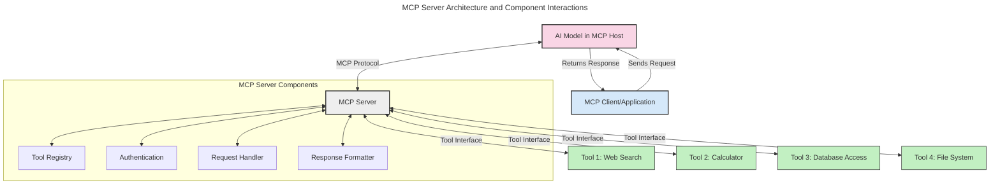
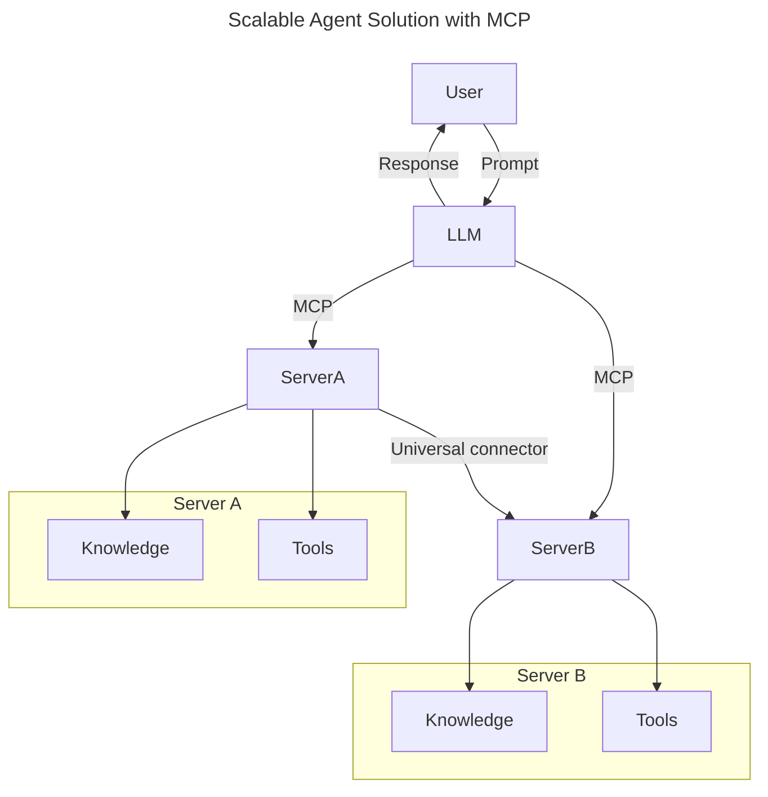
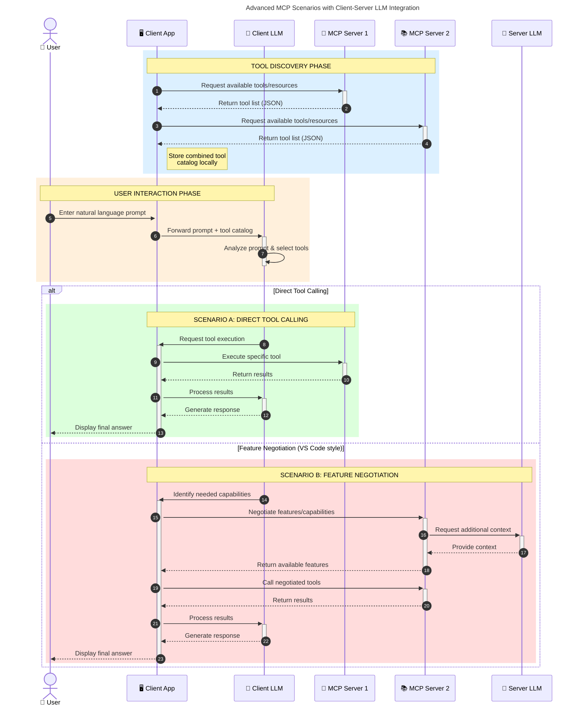

<!--
CO_OP_TRANSLATOR_METADATA:
{
  "original_hash": "105c2ddbb77bc38f7e9df009e1b06e45",
  "translation_date": "2025-07-13T15:39:37+00:00",
  "source_file": "00-Introduction/README.md",
  "language_code": "sr"
}
-->
# Увод у Model Context Protocol (MCP): Зашто је важан за скалабилне AI апликације

Генеративне AI апликације представљају велики корак напред јер често омогућавају кориснику да комуницира са апликацијом користећи природне језичке упите. Међутим, како се у такве апликације улаже све више времена и ресурса, важно је обезбедити лаку интеграцију функционалности и ресурса на начин који омогућава једноставно проширење, подршку за више модела и управљање различитим сложеностима модела. Укратко, прављење генеративних AI апликација је лако на почетку, али како расту и постају сложеније, потребно је дефинисати архитектуру и вероватно се ослонити на стандард који ће осигурати доследност у изградњи апликација. Ту на сцену ступа MCP који организује ствари и пружа стандард.

---

## **🔍 Шта је Model Context Protocol (MCP)?**

**Model Context Protocol (MCP)** је **отворени, стандардизовани интерфејс** који омогућава великим језичким моделима (LLM) да беспрекорно комуницирају са спољним алатима, API-јима и изворима података. Он пружа доследну архитектуру која побољшава функционалност AI модела изван њихових података за обуку, омогућавајући паметније, скалабилније и одзивније AI системе.

---

## **🎯 Зашто је стандардизација у AI важна**

Како генеративне AI апликације постају сложеније, неопходно је усвојити стандарде који обезбеђују **скалабилност, проширивост** и **одрживост**. MCP одговара на ове потребе тако што:

- Уједињује интеграције модела и алата
- Смањује крхке, једнократне прилагођене решења
- Омогућава да више модела коегзистира у једном екосистему

---

## **📚 Циљеви учења**

На крају овог текста моћи ћете да:

- Дефинишете **Model Context Protocol (MCP)** и његове примене
- Разумете како MCP стандардизује комуникацију између модела и алата
- Идентификујете кључне компоненте MCP архитектуре
- Истражите примере примене MCP у предузећима и развојним окружењима

---

## **💡 Зашто је Model Context Protocol (MCP) револуционарни**

### **🔗 MCP решава фрагментацију у AI интеракцијама**

Пре MCP-а, интеграција модела са алатима захтевала је:

- Прилагођени код за сваки пар алат-модел
- Нестандардне API-је за сваког добављача
- Честа прекида услед ажурирања
- Лошу скалабилност са повећањем броја алата

### **✅ Предности MCP стандардизације**

| **Предност**             | **Опис**                                                                       |
|--------------------------|--------------------------------------------------------------------------------|
| Интероперабилност         | LLM модели раде беспрекорно са алатима различитих добављача                   |
| Доследност               | Једнако понашање на свим платформама и алатима                                |
| Поновна употреба         | Алате изграђене једном могу се користити у више пројеката и система           |
| Убрзани развој           | Скраћује време развоја коришћењем стандардизованих, plug-and-play интерфејса |

---

## **🧱 Преглед MCP архитектуре на високом нивоу**

MCP прати **клијент-сервер модел**, где:

- **MCP Hosts** покрећу AI моделе
- **MCP Clients** иницирају захтеве
- **MCP Servers** обезбеђују контекст, алате и могућности

### **Кључне компоненте:**

- **Ресурси** – Статички или динамички подаци за моделе  
- **Промптови** – Унапред дефинисани токови за вођену генерацију  
- **Алате** – Извршне функције као што су претрага, прорачуни  
- **Семплинг** – Агенцијално понашање кроз рекурзивне интеракције

---

## Како MCP сервери раде

MCP сервери функционишу на следећи начин:

- **Ток захтева**: 
    1. MCP Клијент шаље захтев AI моделу који ради у MCP Host-у.
    2. AI модел препознаје када му требају спољни алати или подаци.
    3. Модел комуницира са MCP сервером користећи стандардизовани протокол.

- **Функционалност MCP сервера**:
    - Регистар алата: Одржава каталог доступних алата и њихових могућности.
    - Аутентификација: Верификује дозволе за приступ алатима.
    - Обрада захтева: Обрађује долазне захтеве за алате од модела.
    - Форматирање одговора: Структурира излаз алата у формату који модел може да разуме.

- **Извршење алата**: 
    - Сервер усмерава захтеве ка одговарајућим спољним алатима
    - Алате извршавају своје специјализоване функције (претрага, прорачуни, упити базе података итд.)
    - Резултати се враћају моделу у доследном формату.

- **Завршетак одговора**: 
    - AI модел укључује излаз алата у свој одговор.
    - Коначни одговор се шаље назад клијент апликацији.

## 👨‍💻 Како направити MCP сервер (са примерима)

MCP сервери вам омогућавају да проширите могућности LLM модела пружајући податке и функционалност.

Спремни да пробате? Ево примера како направити једноставан MCP сервер у различитим језицима:

- **Python пример**: https://github.com/modelcontextprotocol/python-sdk

- **TypeScript пример**: https://github.com/modelcontextprotocol/typescript-sdk

- **Java пример**: https://github.com/modelcontextprotocol/java-sdk

- **C#/.NET пример**: https://github.com/modelcontextprotocol/csharp-sdk

## 🌍 Примери примене MCP у стварном свету

MCP омогућава широк спектар апликација проширујући AI могућности:

| **Примена**                 | **Опис**                                                                       |
|-----------------------------|--------------------------------------------------------------------------------|
| Интеграција података у предузећима | Повезивање LLM модела са базама података, CRM системима или интерним алатима  |
| Агенцијални AI системи       | Омогућава аутономним агентима приступ алатима и токове доношења одлука         |
| Мултимодалне апликације      | Комбинује текст, слике и аудио алате у једној уједињеној AI апликацији          |
| Интеграција података у реалном времену | Уноси живе податке у AI интеракције за прецизније и актуелније резултате      |

### 🧠 MCP = Универзални стандард за AI интеракције

Model Context Protocol (MCP) делује као универзални стандард за AI интеракције, слично као што је USB-C стандардизовао физичке везе за уређаје. У свету AI, MCP пружа доследан интерфејс који омогућава моделима (клијентима) да се беспрекорно интегришу са спољним алатима и добављачима података (серверима). Ово елиминише потребу за разноликим, прилагођеним протоколима за сваки API или извор података.

Под MCP-ом, MCP-компатибилан алат (познат као MCP сервер) прати уједињени стандард. Ови сервери могу да наведу које алате или акције нуде и извршавају те акције када их AI агент затражи. Платформе AI агената које подржавају MCP могу да открију доступне алате са сервера и позову их преко овог стандардног протокола.

### 💡 Олакшава приступ знању

Поред пружања алата, MCP олакшава и приступ знању. Омогућава апликацијама да обезбеде контекст великим језичким моделима (LLM) повезујући их са разним изворима података. На пример, MCP сервер може представљати репозиторијум докумената компаније, омогућавајући агентима да по потреби преузму релевантне информације. Други сервер може обављати специфичне радње као што су слање имејлова или ажурирање записа. Са становишта агента, ово су једноставно алати које може користити — неки алати враћају податке (контекст знања), док други извршавају радње. MCP ефикасно управља обема врстама.

Агент који се повезује на MCP сервер аутоматски учи о доступним могућностима и приступачним подацима сервера кроз стандардизовани формат. Ова стандардизација омогућава динамичку доступност алата. На пример, додавањем новог MCP сервера у систем агента, његове функције постају одмах доступне без потребе за додатним прилагођавањем упутстава агента.

Ова поједностављена интеграција одговара току приказаном у мермејд дијаграму, где сервери пружају и алате и знање, обезбеђујући беспрекорну сарадњу између система.

### 👉 Пример: Скалабилно агентско решење

### 🔄 Напредни MCP сценарији са интеграцијом LLM на клијентској страни

Поред основне MCP архитектуре, постоје напредни сценарији у којима и клијент и сервер садрже LLM моделе, омогућавајући сложеније интеракције:

## 🔐 Практичне предности MCP

Ево практичних предности коришћења MCP:

- **Актуелност**: Модели могу приступити најновијим информацијама изван својих података за обуку
- **Проширење могућности**: Модели могу користити специјализоване алате за задатке за које нису обучени
- **Смањење халуцинација**: Спољни извори података пружају чињеничну основу
- **Приватност**: Осетљиви подаци могу остати у безбедним окружењима уместо да буду уграђени у промптове

## 📌 Кључне поуке

Кључне поуке за коришћење MCP су:

- **MCP** стандардизује начин на који AI модели комуницирају са алатима и подацима
- Подстиче **проширивост, доследност и интероперабилност**
- MCP помаже да се **скрати време развоја, побољша поузданост и прошире могућности модела**
- Клијент-сервер архитектура омогућава **флексибилне, прошириве AI апликације**

## 🧠 Вежба

Размислите о AI апликацији коју желите да направите.

- Који **спољни алати или подаци** би могли побољшати њене могућности?
- Како би MCP могао учинити интеграцију **једноставнијом и поузданијом?**

## Додатни ресурси

- [MCP GitHub репозиторијум](https://github.com/modelcontextprotocol)

## Шта следи

Следеће: [Поглавље 1: Основни појмови](../01-CoreConcepts/README.md)

**Одрицање од одговорности**:  
Овај документ је преведен коришћењем AI услуге за превођење [Co-op Translator](https://github.com/Azure/co-op-translator). Иако се трудимо да превод буде тачан, молимо вас да имате у виду да аутоматски преводи могу садржати грешке или нетачности. Оригинални документ на његовом изворном језику треба сматрати ауторитетним извором. За критичне информације препоручује се професионални људски превод. Нисмо одговорни за било каква неспоразума или погрешна тумачења која произилазе из коришћења овог превода.