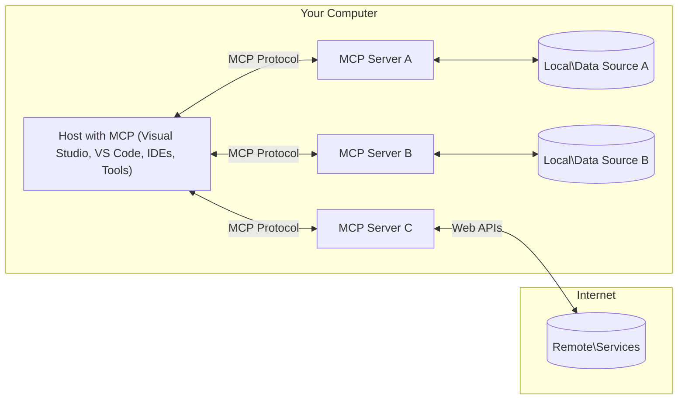

<!--
CO_OP_TRANSLATOR_METADATA:
{
  "original_hash": "0a6a7bcb289c024a91289e0444cb370b",
<<<<<<< HEAD
  "translation_date": "2025-08-18T21:29:00+00:00",
=======
  "translation_date": "2025-08-18T16:46:30+00:00",
>>>>>>> origin/main
  "source_file": "01-CoreConcepts/README.md",
  "language_code": "sr"
}
-->
# Основни концепти MCP: Савладавање Протокола Контекста Модела за интеграцију вештачке интелигенције

[](https://youtu.be/earDzWGtE84)

_(Кликните на слику изнад да бисте погледали видео лекцију)_

<<<<<<< HEAD
[Model Context Protocol (MCP)](https://gi- **Експлицитна корисничка сагласност**: Сваки приступ подацима и операције захтевају јасно одобрење корисника пре извршења. Корисници морају јасно разумети који ће подаци бити приступани и које ће радње бити извршене, уз детаљну контролу над дозволама и овлашћењима.

- **Заштита приватности података**: Кориснички подаци се откривају само уз експлицитну сагласност и морају бити заштићени снажним контролама приступа током целог животног циклуса интеракције. Имплементације морају спречити неовлашћен пренос података и одржавати строге границе приватности.

- **Безбедност извршавања алата**: Свака употреба алата захтева експлицитну сагласност корисника уз јасно разумевање функционалности алата, параметара и потенцијалног утицаја. Снажне безбедносне границе морају спречити ненамерно, небезбедно или злонамерно извршавање алата.

- **Безбедност транспортног слоја**: Сви комуникациони канали треба да користе одговарајуће механизме за шифровање и аутентификацију. Удаљене везе треба да имплементирају сигурне транспортне протоколе и правилно управљање акредитивима.

#### Упутства за имплементацију:

- **Управљање дозволама**: Имплементирајте систем дозвола са детаљном контролом који омогућава корисницима да управљају приступом серверима, алатима и ресурсима
- **Аутентификација и овлашћење**: Користите сигурне методе аутентификације (OAuth, API кључеви) уз правилно управљање токенима и њиховим истеком  
- **Валидација уноса**: Проверавајте све параметре и уносе података према дефинисаним шемама како бисте спречили нападе убризгавањем
- **Логовање за ревизију**: Одржавајте свеобухватне записе свих операција ради праћења безбедности и усаглашености

## Преглед

Ова лекција истражује основну архитектуру и компоненте које чине екосистем Протокола Контекста Модела (MCP). Научићете о архитектури клијент-сервер, кључним компонентама и механизмима комуникације који покрећу MCP интеракције.

## Кључни циљеви учења

До краја ове лекције, моћи ћете:

- Разумети MCP архитектуру клијент-сервер.
- Идентификовати улоге и одговорности домаћина, клијената и сервера.
- Анализирати основне карактеристике које MCP чине флексибилним слојем интеграције.
- Научити како информације протичу унутар MCP екосистема.
- Стекнути практична знања кроз примере кода у .NET, Java, Python и JavaScript.

## MCP Архитектура: Детаљнији поглед

Екосистем MCP је изграђен на моделу клијент-сервер. Овај модуларни приступ омогућава AI апликацијама да ефикасно комуницирају са алатима, базама података, API-јима и контекстуалним ресурсима. Хајде да разложимо ову архитектуру на њене основне компоненте.

У основи, MCP прати архитектуру клијент-сервер где апликација домаћин може да се повеже са више сервера:
=======
[Model Context Protocol (MCP)](https://gi- **Експлицитна сагласност корисника**: Сваки приступ подацима и операције захтевају експлицитно одобрење корисника пре извршења. Корисници морају јасно разумети који ће подаци бити приступачни и које ће радње бити извршене, уз детаљну контролу над дозволама и ауторизацијама.

- **Заштита приватности података**: Кориснички подаци се излажу само уз експлицитну сагласност и морају бити заштићени снажним контролама приступа током целог животног циклуса интеракције. Имплементације морају спречити неовлашћен пренос података и одржавати строге границе приватности.

- **Безбедност извршавања алата**: Свака активација алата захтева експлицитну сагласност корисника уз јасно разумевање функционалности алата, параметара и потенцијалног утицаја. Снажне безбедносне границе морају спречити ненамерно, небезбедно или злонамерно извршавање алата.

- **Сигурност транспортног слоја**: Сви комуникациони канали треба да користе одговарајуће механизме за шифровање и аутентификацију. Удаљене везе треба да имплементирају сигурне транспортне протоколе и правилно управљање акредитивима.

#### Смернице за имплементацију:

- **Управљање дозволама**: Имплементирајте систем дозвола са детаљном контролом који омогућава корисницима да одреде којим серверима, алатима и ресурсима се може приступити  
- **Аутентификација и ауторизација**: Користите сигурне методе аутентификације (OAuth, API кључеви) са правилним управљањем токенима и њиховим истеком  
- **Валидација уноса**: Проверавајте све параметре и уносе података у складу са дефинисаним шемама како бисте спречили нападе убацивањем  
- **Евидентирање активности**: Одржавајте свеобухватне записе свих операција ради праћења безбедности и усклађености  

[Model Context Protocol (MCP)](https://modelcontextprotocol.io/specification/2025-06-18/) је моћан, стандардизован оквир који оптимизује комуникацију између великих језичких модела (LLMs) и спољашњих алата, апликација и извора података. Овај водич ће вас провести кроз основне концепте MCP-а, осигуравајући да разумете његову клијент-сервер архитектуру, кључне компоненте, механизме комуникације и најбоље праксе имплементације.

## Преглед

Ова лекција истражује основну архитектуру и компоненте које чине MCP екосистем. Научићете о клијент-сервер архитектури, кључним компонентама и механизмима комуникације који покрећу MCP интеракције.

## Кључни циљеви учења

До краја ове лекције, моћи ћете да:

- Разумете MCP клијент-сервер архитектуру.  
- Идентификујете улоге и одговорности домаћина, клијената и сервера.  
- Анализирате основне карактеристике које чине MCP флексибилним слојем за интеграцију.  
- Научите како информације теку унутар MCP екосистема.  
- Стекнете практична знања кроз примере кода у .NET, Java, Python и JavaScript.  

## MCP архитектура: Детаљнији преглед

MCP екосистем је изграђен на клијент-сервер моделу. Ова модуларна структура омогућава AI апликацијама да ефикасно комуницирају са алатима, базама података, API-јевима и контекстуалним ресурсима. Хајде да разложимо ову архитектуру на њене основне компоненте.

У својој суштини, MCP прати клијент-сервер архитектуру где хост апликација може да се повеже са више сервера:
>>>>>>> origin/main



<<<<<<< HEAD
- **MCP Домаћини**: Програми као што су VSCode, Claude Desktop, IDE-ови или AI алати који желе да приступе подацима преко MCP
- **MCP Клијенти**: Протокол клијенти који одржавају 1:1 везе са серверима
- **MCP Сервери**: Лагани програми који излажу специфичне могућности кроз стандардизован MCP
- **Локални извори података**: Фајлови, базе података и услуге вашег рачунара којима MCP сервери могу безбедно приступити
- **Удаљене услуге**: Спољни системи доступни преко интернета којима MCP сервери могу приступити преко API-ја.

Протокол MCP је еволутивни стандард који користи верзионисање засновано на датуму (YYYY-MM-DD формат). Тренутна верзија протокола је **2025-06-18**. Можете видети најновија ажурирања [спецификације протокола](https://modelcontextprotocol.io/specification/2025-06-18/)

### 1. Домаћини

У Протоколу Контекста Модела (MCP), **Домаћини** су AI апликације које служе као примарни интерфејс кроз који корисници комуницирају са протоколом. Домаћини координирају и управљају везама са више MCP сервера креирањем посебних MCP клијената за сваку серверску везу. Примери домаћина укључују:

- **AI Апликације**: Claude Desktop, Visual Studio Code, Claude Code
- **Развојна окружења**: IDE-ови и уређивачи кода са MCP интеграцијом  
- **Прилагођене апликације**: AI агенти и алати направљени за одређене сврхе

**Домаћини** су апликације које координирају интеракције AI модела. Они:

- **Организују AI моделе**: Извршавају или комуницирају са LLM-овима ради генерисања одговора и координације AI токова рада
- **Управљају клијентским везама**: Креирају и одржавају једног MCP клијента по MCP серверској вези
- **Контролишу кориснички интерфејс**: Управљају током разговора, интеракцијама са корисником и презентацијом одговора  
- **Спроводе безбедност**: Контролишу дозволе, безбедносна ограничења и аутентификацију
- **Управљају корисничком сагласношћу**: Организују одобрење корисника за дељење података и извршавање алата

### 2. Клијенти

**Клијенти** су суштинске компоненте које одржавају посебне један-на-један везе између домаћина и MCP сервера. Сваки MCP клијент је инстанциран од стране домаћина да се повеже са одређеним MCP сервером, обезбеђујући организоване и безбедне комуникационе канале. Више клијената омогућава домаћинима да се истовремено повежу са више сервера.

**Клијенти** су конектор компоненте унутар апликације домаћина. Они:

- **Комуникација протокола**: Шаљу JSON-RPC 2.0 захтеве серверима са упутствима и инструкцијама
- **Преговарање могућности**: Преговарају о подржаним функцијама и верзијама протокола са серверима током иницијализације
- **Извршавање алата**: Управљају захтевима за извршавање алата од модела и обрађују одговоре
- **Ажурирања у реалном времену**: Обрађују обавештења и ажурирања у реалном времену од сервера
- **Обрада одговора**: Обрађују и форматирају одговоре сервера за приказ корисницима

### 3. Сервери

**Сервери** су програми који пружају контекст, алате и могућности MCP клијентима. Они могу бити извршени локално (на истом рачунару као домаћин) или удаљено (на спољним платформама), и одговорни су за обраду захтева клијената и пружање структурираних одговора. Сервери излажу специфичну функционалност кроз стандардизован MCP.

**Сервери** су услуге које пружају контекст и могућности. Они:

- **Регистрација функција**: Региструју и излажу доступне примитиве (ресурсе, упите, алате) клијентима
- **Обрада захтева**: Примају и извршавају позиве алата, захтеве за ресурсима и упите од клијената
- **Пружање контекста**: Пружају контекстуалне информације и податке ради побољшања одговора модела
- **Управљање стањем**: Одржавају стање сесије и обрађују интеракције са стањем када је потребно
- **Обавештења у реалном времену**: Шаљу обавештења о променама могућности и ажурирањима повезаним клијентима

Сервери могу бити развијени од стране било кога ради проширења могућности модела са специјализованом функционалношћу, и подржавају и локалне и удаљене сценарије имплементације.

### 4. Примитиви сервера

Сервери у Протоколу Контекста Модела (MCP) пружају три основна **примитива** која дефинишу фундаменталне грађевинске блокове за богате интеракције између клијената, домаћина и језичких модела. Ови примитиви одређују типове контекстуалних информација и радњи доступних кроз протокол.

MCP сервери могу излагати било коју комбинацију следећих три основна примитива:

#### Ресурси

**Ресурси** су извори података који пружају контекстуалне информације AI апликацијама. Они представљају статички или динамички садржај који може побољшати разумевање и доношење одлука модела:

- **Контекстуални подаци**: Структуриране информације и контекст за AI модел
- **Базе знања**: Репозиторијуми докумената, чланци, приручници и истраживачки радови
- **Локални извори података**: Фајлови, базе података и информације локалног система  
- **Спољни подаци**: API одговори, веб услуге и подаци удаљених система
- **Динамички садржај**: Подаци у реалном времену који се ажурирају на основу спољних услова

Ресурси се идентификују URI-јима и подржавају откривање кроз `resources/list` и преузимање кроз `resources/read` методе:
=======
- **MCP домаћини**: Програми као што су VSCode, Claude Desktop, IDE-ови или AI алати који желе да приступе подацима преко MCP-а  
- **MCP клијенти**: Протокол клијенти који одржавају 1:1 везе са серверима  
- **MCP сервери**: Лагани програми који излажу специфичне могућности кроз стандардизован MCP протокол  
- **Локални извори података**: Фајлови, базе података и услуге на вашем рачунару којима MCP сервери могу безбедно приступити  
- **Удаљене услуге**: Спољашњи системи доступни преко интернета којима MCP сервери могу приступити преко API-ја.  

MCP протокол је еволутивни стандард који користи верзионисање засновано на датуму (формат YYYY-MM-DD). Тренутна верзија протокола је **2025-06-18**. Најновије ажуриране спецификације можете видети [овде](https://modelcontextprotocol.io/specification/2025-06-18/).

### 1. Домаћини

У Model Context Protocol (MCP), **домаћини** су AI апликације које служе као примарни интерфејс преко којег корисници комуницирају са протоколом. Домаћини координишу и управљају везама са више MCP сервера креирањем посебних MCP клијената за сваку серверску везу. Примери домаћина укључују:

- **AI апликације**: Claude Desktop, Visual Studio Code, Claude Code  
- **Развојна окружења**: IDE-ови и уређивачи кода са MCP интеграцијом  
- **Прилагођене апликације**: Специјализовани AI агенти и алати  

**Домаћини** су апликације које координишу интеракције са AI моделима. Они:

- **Организују AI моделе**: Извршавају или комуницирају са LLM-овима ради генерисања одговора и координације AI токова рада  
- **Управљају клијентским везама**: Креирају и одржавају MCP клијенте за сваку MCP серверску везу  
- **Контролишу кориснички интерфејс**: Управљају током разговора, интеракцијама са корисником и презентацијом одговора  
- **Спроводе безбедност**: Контролишу дозволе, безбедносна ограничења и аутентификацију  
- **Управљају сагласношћу корисника**: Обезбеђују одобрење корисника за дељење података и извршавање алата  

### 2. Клијенти

**Клијенти** су суштинске компоненте које одржавају посебне један-на-један везе између домаћина и MCP сервера. Сваки MCP клијент је инстанциран од стране домаћина ради повезивања са одређеним MCP сервером, осигуравајући организоване и безбедне комуникационе канале. Више клијената омогућава домаћинима да се истовремено повежу са више сервера.

**Клијенти** су конекторске компоненте унутар домаћинске апликације. Они:

- **Комуникација протокола**: Шаљу JSON-RPC 2.0 захтеве серверима са упутствима и промптовима  
- **Преговарање о могућностима**: Преговарају о подржаним функцијама и верзијама протокола са серверима током иницијализације  
- **Извршавање алата**: Управљају захтевима за извршавање алата од модела и обрађују одговоре  
- **Ажурирања у реалном времену**: Обрађују обавештења и ажурирања у реалном времену од сервера  
- **Обрада одговора**: Обрађују и форматирају одговоре сервера за приказ корисницима  

### 3. Сервери

**Сервери** су програми који пружају контекст, алате и могућности MCP клијентима. Они могу бити извршени локално (на истом рачунару као домаћин) или удаљено (на спољашњим платформама) и одговорни су за обраду захтева клијената и пружање структуираних одговора. Сервери излажу специфичну функционалност кроз стандардизован Model Context Protocol.

**Сервери** су услуге које пружају контекст и могућности. Они:

- **Регистрација функција**: Региструју и излажу доступне примитиве (ресурсе, промптове, алате) клијентима  
- **Обрада захтева**: Примају и извршавају позиве алата, захтеве за ресурсима и промптовима од клијената  
- **Пружање контекста**: Пружају контекстуалне информације и податке ради побољшања одговора модела  
- **Управљање стањем**: Одржавају стање сесије и обрађују интеракције са стањем када је потребно  
- **Обавештења у реалном времену**: Шаљу обавештења о променама могућности и ажурирањима повезаним клијентима  

Сервери могу бити развијени од стране било кога ради проширења могућности модела са специјализованом функционалношћу и подржавају како локалне тако и удаљене сценарије распоређивања.  

### 4. Примитиве сервера

Сервери у Model Context Protocol (MCP) пружају три основне **примитиве** које дефинишу основне грађевинске блокове за богате интеракције између клијената, домаћина и језичких модела. Ове примитиве одређују врсте контекстуалних информација и радњи доступних кроз протокол.

MCP сервери могу излагати било коју комбинацију следеће три основне примитиве:

#### Ресурси

**Ресурси** су извори података који пружају контекстуалне информације AI апликацијама. Они представљају статички или динамички садржај који може побољшати разумевање модела и доношење одлука:

- **Контекстуални подаци**: Структурисане информације и контекст за AI модел  
- **Базе знања**: Репозиторијуми докумената, чланци, приручници и истраживачки радови  
- **Локални извори података**: Фајлови, базе података и информације локалног система  
- **Спољашњи подаци**: Одговори API-ја, веб услуге и подаци удаљених система  
- **Динамички садржај**: Подаци у реалном времену који се ажурирају на основу спољашњих услова  

Ресурси се идентификују URI-јевима и подржавају откривање кроз методе `resources/list` и преузимање кроз `resources/read`:
>>>>>>> origin/main

```text
file://documents/project-spec.md
database://production/users/schema
api://weather/current
```

<<<<<<< HEAD
#### Упити

**Упити** су поновљиви шаблони који помажу у структурирању интеракција са језичким моделима. Они пружају стандардизоване обрасце интеракције и шаблоне токова рада:

- **Интеракције засноване на шаблонима**: Унапред структуриране поруке и почетници разговора
- **Шаблони токова рада**: Стандардизовани низови за уобичајене задатке и интеракције
- **Примери Few-shot**: Шаблони засновани на примерима за инструкције модела
- **Системски упити**: Основни упити који дефинишу понашање и контекст модела
- **Динамички шаблони**: Параметризовани упити који се прилагођавају специфичним контекстима

Упити подржавају замену променљивих и могу се открити преко `prompts/list` и преузети са `prompts/get`:
=======
#### Промптови

**Промптови** су поново употребљиви шаблони који помажу у структуирању интеракција са језичким моделима. Они пружају стандардизоване обрасце интеракције и шаблоне токова рада:

- **Интеракције засноване на шаблонима**: Унапред структуиране поруке и почетни промптови за разговор  
- **Шаблони токова рада**: Стандардизовани низови за уобичајене задатке и интеракције  
- **Примери Few-shot**: Шаблони засновани на примерима за инструкције моделу  
- **Системски промптови**: Основни промптови који дефинишу понашање модела и контекст  
- **Динамички шаблони**: Параметризовани промптови који се прилагођавају специфичним контекстима  

Промптови подржавају замену променљивих и могу се открити преко `prompts/list` и преузети помоћу `prompts/get`:
>>>>>>> origin/main

```markdown
Generate a {{task_type}} for {{product}} targeting {{audience}} with the following requirements: {{requirements}}
```

<<<<<<< HEAD
#### Алатке

**Алатке** су извршиве функције које AI модели могу позвати ради извршења специфичних радњи. Оне представљају "глаголе" MCP екосистема, омогућавајући моделима да комуницирају са спољним системима:

- **Извршиве функције**: Дискретне операције које модели могу позвати са специфичним параметрима
- **Интеграција спољних система**: API позиви, упити база података, операције са фајловима, прорачуни
- **Јединствени идентитет**: Сваки алат има јединствено име, опис и шему параметара
- **Структурирани I/O**: Алатке прихватају валидиране параметре и враћају структуриране, типизиране одговоре
- **Могућности радњи**: Омогућавају моделима да извршавају радње у стварном свету и преузимају живе податке

Алатке су дефинисане JSON шемом за валидацију параметара и откривају се преко `tools/list` и извршавају преко `tools/call`:
=======
#### Алати

**Алати** су извршиве функције које AI модели могу позвати ради извршавања специфичних радњи. Они представљају "глаголе" MCP екосистема, омогућавајући моделима да комуницирају са спољашњим системима:

- **Извршиве функције**: Дискретне операције које модели могу позвати са специфичним параметрима  
- **Интеграција спољашњих система**: API позиви, упити база података, операције са фајловима, прорачуни  
- **Јединствени идентитет**: Сваки алат има јединствено име, опис и шему параметара  
- **Структурисани улаз/излаз**: Алати прихватају валидиране параметре и враћају структурисане, типизиране одговоре  
- **Могућности радњи**: Омогућавају моделима да извршавају радње у стварном свету и добијају актуелне податке  

Алати су дефинисани JSON шемом за валидацију параметара и откривају се преко `tools/list`, а извршавају преко `tools/call`:
>>>>>>> origin/main

```typescript
server.tool(
  "search_products", 
  {
    query: z.string().describe("Search query for products"),
    category: z.string().optional().describe("Product category filter"),
    max_results: z.number().default(10).describe("Maximum results to return")
  }, 
  async (params) => {
    // Execute search and return structured results
    return await productService.search(params);
  }
);
```

<<<<<<< HEAD
## Примитиви клијента

У Протоколу Контекста Модела (MCP), **клијенти** могу излагати примитиве који омогућавају серверима да захтевају додатне могућности од апликације домаћина. Ови примитиви на страни клијента омогућавају богатије, интерактивније имплементације сервера који могу приступити могућностима AI модела и интеракцијама са корисником.

### Узорковање

**Узорковање** омогућава серверима да захтевају комплетирање језичког модела од AI апликације клијента. Овај примитив омогућава серверима да приступе могућностима LLM-а без уграђивања сопствених зависности модела:

- **Приступ независан од модела**: Сервери могу захтевати комплетирање без укључивања LLM SDK-ова или управљања приступом моделу
- **Аутономни AI сервери**: Омогућава серверима да самостално генеришу садржај користећи AI модел клијента
- **Рекурзивне интеракције LLM-а**: Подржава сложене сценарије где серверима треба AI помоћ за обраду
- **Генерисање динамичког садржаја**: Омогућава серверима да креирају контекстуалне одговоре користећи модел домаћина

Узорковање се иницира преко `sampling/complete` методе, где сервери шаљу захтеве за комплетирање клијентима.
=======
## Примитиве клијената

У Model Context Protocol (MCP), **клијенти** могу излагати примитиве које омогућавају серверима да захтевају додатне могућности од домаћинске апликације. Ове примитиве на страни клијента омогућавају богатије, интерактивније имплементације сервера које могу приступити могућностима AI модела и интеракцијама са корисником.

### Узорковање

**Узорковање** омогућава серверима да захтевају комплетирање језичког модела од AI апликације клијента. Ова примитива омогућава серверима приступ LLM могућностима без уграђивања сопствених зависности модела:

- **Приступ независан од модела**: Сервери могу захтевати комплетирања без укључивања LLM SDK-ова или управљања приступом моделу  
- **AI иницијатива сервера**: Омогућава серверима да аутономно генеришу садржај користећи AI модел клијента  
- **Рекурзивне LLM интеракције**: Подржава сложене сценарије где серверима треба AI помоћ за обраду  
- **Генерисање динамичког садржаја**: Омогућава серверима да креирају контекстуалне одговоре користећи модел домаћина  

Узорковање се иницира преко методе `sampling/complete`, где сервери шаљу захтеве за комплетирање клијентима.
>>>>>>> origin/main

### Елицитација  

**Елицитација** омогућава серверима да захтевају додатне информације или потврду од корисника преко интерфејса клијента:

<<<<<<< HEAD
- **Захтеви за унос корисника**: Сервери могу тражити додатне информације када су потребне за извршење алата
- **Дијалози за потврду**: Захтевају одобрење корисника за осетљиве или значајне операције
- **Интерактивни токови рада**: Омогућавају серверима да креирају корак-по-корак интеракције са корисником
- **Динамично прикупљање параметара**: Прикупљају недостајуће или опционалне параметре током извршења алата

Захтеви за елицитацију се праве користећи `elicitation/request` методу за прикупљање уноса корисника преко интерфејса клијента.

### Логовање

**Логовање** омогућава серверима да шаљу структуриране поруке логова клијентима ради дебагова
- **Управљање животним циклусом**: Обухвата иницијализацију везе, преговарање о могућностима и завршетак сесије између клијената и сервера  
- **Примитиви сервера**: Омогућава серверима да пруже основну функционалност кроз алате, ресурсе и шаблоне  
- **Примитиви клијента**: Омогућава серверима да захтевају узорковање од LLM-ова, прикупљају унос корисника и шаљу поруке дневника  
- **Обавештења у реалном времену**: Подржава асинхрона обавештења за динамичка ажурирања без потребе за учесталим проверама  
=======
- **Захтеви за унос корисника**: Сервери могу тражити додатне информације када су потребне за извршавање алата  
- **Дијалози за потврду**: Захтевају одобрење корисника за осетљиве или
- **Управљање животним циклусом**: Обрађује иницијализацију везе, преговарање о могућностима и завршетак сесије између клијената и сервера  
- **Примитиви сервера**: Омогућава серверима да пружају основну функционалност кроз алате, ресурсе и шаблоне  
- **Примитиви клијента**: Омогућава серверима да захтевају узорковање од LLM-ова, прикупљају унос корисника и шаљу поруке дневника  
- **Обавештења у реалном времену**: Подржава асинхрона обавештења за динамичка ажурирања без потребе за честим проверама  
>>>>>>> origin/main

#### Кључне карактеристике:

- **Преговарање о верзији протокола**: Користи верзионисање засновано на датуму (ГГГГ-ММ-ДД) ради осигурања компатибилности  
- **Откривање могућности**: Клијенти и сервери размењују информације о подржаним функцијама током иницијализације  
<<<<<<< HEAD
- **Сесије са стањем**: Одржава стање везе кроз више интеракција ради континуитета контекста  

### Транспортни слој

**Транспортни слој** управља комуникационим каналима, форматирањем порука и аутентификацијом између MCP учесника:
=======
- **Сесије са стањем**: Одржава стање везе током више интеракција ради континуитета контекста  

### Транспортни слој

**Транспортни слој** управља комуникационим каналима, обликовањем порука и аутентификацијом између MCP учесника:
>>>>>>> origin/main

#### Подржани транспортни механизми:

1. **STDIO транспорт**:  
   - Користи стандардне улазно/излазне токове за директну комуникацију процеса  
<<<<<<< HEAD
   - Оптималан за локалне процесе на истом рачунару без мрежног оптерећења  
   - Често се користи за локалне MCP серверске имплементације  
=======
   - Оптималан за локалне процесе на истој машини без мрежног оптерећења  
   - Често се користи за локалне имплементације MCP сервера  
>>>>>>> origin/main

2. **Стримујући HTTP транспорт**:  
   - Користи HTTP POST за поруке од клијента ка серверу  
   - Опционо Server-Sent Events (SSE) за стримовање од сервера ка клијенту  
   - Омогућава комуникацију са удаљеним серверима преко мрежа  
<<<<<<< HEAD
   - Подржава стандардну HTTP аутентификацију (токени, API кључеви, прилагођени заглавља)  
=======
   - Подржава стандардну HTTP аутентификацију (токени за приступ, API кључеви, прилагођени хедери)  
>>>>>>> origin/main
   - MCP препоручује OAuth за сигурну аутентификацију засновану на токенима  

#### Апстракција транспорта:

<<<<<<< HEAD
Транспортни слој апстрахује детаље комуникације од слоја података, омогућавајући исти JSON-RPC 2.0 формат порука кроз све транспортне механизме. Ова апстракција омогућава апликацијама да лако прелазе између локалних и удаљених сервера.

### Безбедносни аспекти

MCP имплементације морају поштовати неколико критичних безбедносних принципа како би осигурале сигурне, поуздане и безбедне интеракције кроз све операције протокола:

- **Сагласност и контрола корисника**: Корисници морају дати изричиту сагласност пре приступа подацима или извршења операција. Треба да имају јасну контролу над тим који подаци се деле и које акције су овлашћене, уз подршку интуитивних интерфејса за преглед и одобравање активности.

- **Приватност података**: Кориснички подаци треба да буду изложени само уз изричиту сагласност и морају бити заштићени одговарајућим контролама приступа. MCP имплементације морају спречити неовлашћен пренос података и осигурати да се приватност одржава током свих интеракција.

- **Безбедност алата**: Пре позивања било ког алата, потребна је изричита сагласност корисника. Корисници треба да имају јасно разумевање функционалности сваког алата, а морају се спровести робусне безбедносне границе како би се спречило ненамерно или небезбедно извршење алата.

Пратећи ове безбедносне принципе, MCP осигурава да се поверење корисника, приватност и безбедност одржавају кроз све интеракције протокола, уз омогућавање моћних интеграција са AI.

## Примери кода: Кључне компоненте

Испод су примери кода на неколико популарних програмских језика који илуструју како имплементирати кључне MCP серверске компоненте и алате.

### .NET пример: Креирање једноставног MCP сервера са алатима

Ово је практичан .NET пример кода који демонстрира како имплементирати једноставан MCP сервер са прилагођеним алатима. Пример показује како дефинисати и регистровати алате, обрађивати захтеве и повезати сервер користећи Model Context Protocol.
=======
Транспортни слој апстрахује детаље комуникације од слоја података, омогућавајући исти формат порука JSON-RPC 2.0 за све транспортне механизме. Ова апстракција омогућава апликацијама да лако прелазе између локалних и удаљених сервера.

### Безбедносни аспекти

MCP имплементације морају поштовати неколико кључних безбедносних принципа како би осигурале сигурне, поуздане и безбедне интеракције у свим операцијама протокола:

- **Пристанак и контрола корисника**: Корисници морају дати изричит пристанак пре приступа подацима или извршавања операција. Требало би да имају јасну контролу над тим који подаци се деле и које акције су одобрене, уз подршку интуитивних интерфејса за преглед и одобравање активности.  

- **Приватност података**: Кориснички подаци могу бити изложени само уз изричит пристанак и морају бити заштићени одговарајућим контролама приступа. MCP имплементације морају спречити неовлашћен пренос података и осигурати да се приватност одржава током свих интеракција.  

- **Безбедност алата**: Пре позивања било ког алата, потребан је изричит пристанак корисника. Корисници треба да имају јасно разумевање функција сваког алата, а морају се спроводити робусне безбедносне границе како би се спречило ненамерно или небезбедно извршавање алата.  

Придржавањем ових безбедносних принципа, MCP осигурава да се поверење корисника, приватност и безбедност одржавају у свим интеракцијама протокола, истовремено омогућавајући моћне интеграције са вештачком интелигенцијом.

## Примери кода: Кључне компоненте

Испод су примери кода на неколико популарних програмских језика који илуструју како имплементирати кључне компоненте и алате MCP сервера.

### Пример за .NET: Креирање једноставног MCP сервера са алатима

Ово је практичан пример кода за .NET који демонстрира како имплементирати једноставан MCP сервер са прилагођеним алатима. Пример приказује како дефинисати и регистровати алате, обрађивати захтеве и повезати сервер користећи Model Context Protocol.
>>>>>>> origin/main

```csharp
using System;
using System.Threading.Tasks;
using ModelContextProtocol.Server;
using ModelContextProtocol.Server.Transport;
using ModelContextProtocol.Server.Tools;

public class WeatherServer
{
    public static async Task Main(string[] args)
    {
        // Create an MCP server
        var server = new McpServer(
            name: "Weather MCP Server",
            version: "1.0.0"
        );
        
        // Register our custom weather tool
        server.AddTool<string, WeatherData>("weatherTool", 
            description: "Gets current weather for a location",
            execute: async (location) => {
                // Call weather API (simplified)
                var weatherData = await GetWeatherDataAsync(location);
                return weatherData;
            });
        
        // Connect the server using stdio transport
        var transport = new StdioServerTransport();
        await server.ConnectAsync(transport);
        
        Console.WriteLine("Weather MCP Server started");
        
        // Keep the server running until process is terminated
        await Task.Delay(-1);
    }
    
    private static async Task<WeatherData> GetWeatherDataAsync(string location)
    {
        // This would normally call a weather API
        // Simplified for demonstration
        await Task.Delay(100); // Simulate API call
        return new WeatherData { 
            Temperature = 72.5,
            Conditions = "Sunny",
            Location = location
        };
    }
}

public class WeatherData
{
    public double Temperature { get; set; }
    public string Conditions { get; set; }
    public string Location { get; set; }
}
```

<<<<<<< HEAD
### Java пример: Компоненте MCP сервера

Овај пример демонстрира исти MCP сервер и регистрацију алата као горњи .NET пример, али имплементиран у Java.
=======
### Пример за Јаву: Компоненте MCP сервера

Овај пример демонстрира исти MCP сервер и регистрацију алата као горњи пример за .NET, али имплементиран у Јави.
>>>>>>> origin/main

```java
import io.modelcontextprotocol.server.McpServer;
import io.modelcontextprotocol.server.McpToolDefinition;
import io.modelcontextprotocol.server.transport.StdioServerTransport;
import io.modelcontextprotocol.server.tool.ToolExecutionContext;
import io.modelcontextprotocol.server.tool.ToolResponse;

public class WeatherMcpServer {
    public static void main(String[] args) throws Exception {
        // Create an MCP server
        McpServer server = McpServer.builder()
            .name("Weather MCP Server")
            .version("1.0.0")
            .build();
            
        // Register a weather tool
        server.registerTool(McpToolDefinition.builder("weatherTool")
            .description("Gets current weather for a location")
            .parameter("location", String.class)
            .execute((ToolExecutionContext ctx) -> {
                String location = ctx.getParameter("location", String.class);
                
                // Get weather data (simplified)
                WeatherData data = getWeatherData(location);
                
                // Return formatted response
                return ToolResponse.content(
                    String.format("Temperature: %.1f°F, Conditions: %s, Location: %s", 
                    data.getTemperature(), 
                    data.getConditions(), 
                    data.getLocation())
                );
            })
            .build());
        
        // Connect the server using stdio transport
        try (StdioServerTransport transport = new StdioServerTransport()) {
            server.connect(transport);
            System.out.println("Weather MCP Server started");
            // Keep server running until process is terminated
            Thread.currentThread().join();
        }
    }
    
    private static WeatherData getWeatherData(String location) {
        // Implementation would call a weather API
        // Simplified for example purposes
        return new WeatherData(72.5, "Sunny", location);
    }
}

class WeatherData {
    private double temperature;
    private String conditions;
    private String location;
    
    public WeatherData(double temperature, String conditions, String location) {
        this.temperature = temperature;
        this.conditions = conditions;
        this.location = location;
    }
    
    public double getTemperature() {
        return temperature;
    }
    
    public String getConditions() {
        return conditions;
    }
    
    public String getLocation() {
        return location;
    }
}
```

<<<<<<< HEAD
### Python пример: Изградња MCP сервера

У овом примеру показујемо како изградити MCP сервер у Python-у. Такође су приказана два различита начина за креирање алата.
=======
### Пример за Пајтон: Изградња MCP сервера

У овом примеру приказујемо како изградити MCP сервер у Пајтону. Такође су приказана два различита начина за креирање алата.
>>>>>>> origin/main

```python
#!/usr/bin/env python3
import asyncio
from mcp.server.fastmcp import FastMCP
from mcp.server.transports.stdio import serve_stdio

# Create a FastMCP server
mcp = FastMCP(
    name="Weather MCP Server",
    version="1.0.0"
)

@mcp.tool()
def get_weather(location: str) -> dict:
    """Gets current weather for a location."""
    # This would normally call a weather API
    # Simplified for demonstration
    return {
        "temperature": 72.5,
        "conditions": "Sunny",
        "location": location
    }

# Alternative approach using a class
class WeatherTools:
    @mcp.tool()
    def forecast(self, location: str, days: int = 1) -> dict:
        """Gets weather forecast for a location for the specified number of days."""
        # This would normally call a weather API forecast endpoint
        # Simplified for demonstration
        return {
            "location": location,
            "forecast": [
                {"day": i+1, "temperature": 70 + i, "conditions": "Partly Cloudy"}
                for i in range(days)
            ]
        }

# Instantiate the class to register its tools
weather_tools = WeatherTools()

# Start the server using stdio transport
if __name__ == "__main__":
    asyncio.run(serve_stdio(mcp))
```

<<<<<<< HEAD
### JavaScript пример: Креирање MCP сервера

Овај пример показује креирање MCP сервера у JavaScript-у и како регистровати два алата повезана са временским условима.
=======
### Пример за ЈаваСкрипт: Креирање MCP сервера

Овај пример приказује креирање MCP сервера у ЈаваСкрипту и како регистровати два алата повезана са временским условима.
>>>>>>> origin/main

```javascript
// Using the official Model Context Protocol SDK
import { McpServer } from "@modelcontextprotocol/sdk/server/mcp.js";
import { StdioServerTransport } from "@modelcontextprotocol/sdk/server/stdio.js";
import { z } from "zod"; // For parameter validation

// Create an MCP server
const server = new McpServer({
  name: "Weather MCP Server",
  version: "1.0.0"
});

// Define a weather tool
server.tool(
  "weatherTool",
  {
    location: z.string().describe("The location to get weather for")
  },
  async ({ location }) => {
    // This would normally call a weather API
    // Simplified for demonstration
    const weatherData = await getWeatherData(location);
    
    return {
      content: [
        { 
          type: "text", 
          text: `Temperature: ${weatherData.temperature}°F, Conditions: ${weatherData.conditions}, Location: ${weatherData.location}` 
        }
      ]
    };
  }
);

// Define a forecast tool
server.tool(
  "forecastTool",
  {
    location: z.string(),
    days: z.number().default(3).describe("Number of days for forecast")
  },
  async ({ location, days }) => {
    // This would normally call a weather API
    // Simplified for demonstration
    const forecast = await getForecastData(location, days);
    
    return {
      content: [
        { 
          type: "text", 
          text: `${days}-day forecast for ${location}: ${JSON.stringify(forecast)}` 
        }
      ]
    };
  }
);

// Helper functions
async function getWeatherData(location) {
  // Simulate API call
  return {
    temperature: 72.5,
    conditions: "Sunny",
    location: location
  };
}

async function getForecastData(location, days) {
  // Simulate API call
  return Array.from({ length: days }, (_, i) => ({
    day: i + 1,
    temperature: 70 + Math.floor(Math.random() * 10),
    conditions: i % 2 === 0 ? "Sunny" : "Partly Cloudy"
  }));
}

// Connect the server using stdio transport
const transport = new StdioServerTransport();
server.connect(transport).catch(console.error);

console.log("Weather MCP Server started");
```

<<<<<<< HEAD
Овај JavaScript пример демонстрира како креирати MCP клијента који се повезује са сервером, шаље упит и обрађује одговор, укључујући све позиве алата који су направљени.

## Безбедност и овлашћење

MCP укључује неколико уграђених концепата и механизама за управљање безбедношћу и овлашћењем кроз протокол:

1. **Контрола дозвола за алате**:  
   Клијенти могу одредити који алати су дозвољени моделу током сесије. Ово осигурава да су доступни само изричито овлашћени алати, смањујући ризик од ненамерних или небезбедних операција. Дозволе се могу динамички конфигурисати на основу корисничких преференција, организационих политика или контекста интеракције.

2. **Аутентификација**:  
   Сервери могу захтевати аутентификацију пре него што одобре приступ алатима, ресурсима или осетљивим операцијама. Ово може укључивати API кључеве, OAuth токене или друге шеме аутентификације. Правилна аутентификација осигурава да само поуздани клијенти и корисници могу позивати серверске могућности.

3. **Валидација**:  
   Валидација параметара се спроводи за све позиве алата. Сваки алат дефинише очекиване типове, формате и ограничења за своје параметре, а сервер валидира долазне захтеве у складу с тим. Ово спречава да неисправан или злонамеран унос стигне до имплементације алата и помаже у одржавању интегритета операција.

4. **Ограничење брзине**:  
   Да би се спречила злоупотреба и осигурала праведна употреба серверских ресурса, MCP сервери могу имплементирати ограничење брзине за позиве алата и приступ ресурсима. Ограничења брзине могу се применити по кориснику, по сесији или глобално, и помажу у заштити од напада ускраћивања услуге или прекомерне потрошње ресурса.

Комбинујући ове механизме, MCP пружа сигурну основу за интеграцију језичких модела са спољним алатима и изворима података, уз давање корисницима и програмерима детаљне контроле над приступом и употребом.

## Поруке протокола и ток комуникације

MCP комуникација користи структуриране **JSON-RPC 2.0** поруке за олакшавање јасних и поузданих интеракција између домаћина, клијената и сервера. Протокол дефинише специфичне обрасце порука за различите типове операција:
=======
Овај ЈаваСкрипт пример демонстрира како креирати MCP клијента који се повезује са сервером, шаље упит и обрађује одговор, укључујући све позиве алата који су извршени.

## Безбедност и ауторизација

MCP укључује неколико уграђених концепата и механизама за управљање безбедношћу и ауторизацијом током целог протокола:

1. **Контрола дозвола за алате**:  
   Клијенти могу одредити који алати су дозвољени моделу током сесије. Ово осигурава да су доступни само изричито одобрени алати, смањујући ризик од ненамерних или небезбедних операција. Дозволе се могу динамички конфигурисати на основу корисничких преференција, организационих политика или контекста интеракције.  

2. **Аутентификација**:  
   Сервери могу захтевати аутентификацију пре него што одобре приступ алатима, ресурсима или осетљивим операцијама. Ово може укључивати API кључеве, OAuth токене или друге шеме аутентификације. Правилна аутентификација осигурава да само поуздани клијенти и корисници могу позивати могућности сервера.  

3. **Валидација**:  
   Валидација параметара се спроводи за све позиве алата. Сваки алат дефинише очекиване типове, формате и ограничења за своје параметре, а сервер валидацију захтева обавља у складу с тим. Ово спречава да неисправан или злонамеран унос дође до имплементације алата и помаже у одржавању интегритета операција.  

4. **Ограничење брзине**:  
   Да би се спречила злоупотреба и осигурало правично коришћење серверских ресурса, MCP сервери могу имплементирати ограничење брзине за позиве алата и приступ ресурсима. Ограничења брзине могу се примењивати по кориснику, по сесији или глобално, и помажу у заштити од напада ускраћивања услуге или прекомерне потрошње ресурса.  

Комбинујући ове механизме, MCP пружа сигурну основу за интеграцију језичких модела са спољним алатима и изворима података, истовремено дајући корисницима и програмерима прецизну контролу над приступом и коришћењем.

## Поруке протокола и ток комуникације

MCP комуникација користи структуиране **JSON-RPC 2.0** поруке за олакшавање јасних и поузданих интеракција између хостова, клијената и сервера. Протокол дефинише специфичне обрасце порука за различите типове операција:
>>>>>>> origin/main

### Основни типови порука:

#### **Поруке иницијализације**
- **`initialize` Захтев**: Успоставља везу и преговара о верзији протокола и могућностима  
- **`initialize` Одговор**: Потврђује подржане функције и информације о серверу  
- **`notifications/initialized`**: Сигнализира да је иницијализација завршена и да је сесија спремна  

#### **Поруке откривања**
- **`tools/list` Захтев**: Открива доступне алате са сервера  
<<<<<<< HEAD
- **`resources/list` Захтев**: Наводи доступне ресурсе (изворе података)  
=======
- **`resources/list` Захтев**: Листира доступне ресурсе (изворе података)  
>>>>>>> origin/main
- **`prompts/list` Захтев**: Преузима доступне шаблоне упита  

#### **Поруке извршења**  
- **`tools/call` Захтев**: Извршава одређени алат са датим параметрима  
- **`resources/read` Захтев**: Преузима садржај из одређеног ресурса  
- **`prompts/get` Захтев**: Преузима шаблон упита са опционим параметрима  

#### **Поруке са стране клијента**
- **`sampling/complete` Захтев**: Сервер захтева завршетак LLM-а од клијента  
- **`elicitation/request`**: Сервер захтева унос корисника преко интерфејса клијента  
<<<<<<< HEAD
- **Поруке дневника**: Сервер шаље структуриране поруке дневника клијенту  
=======
- **Поруке дневника**: Сервер шаље структуиране поруке дневника клијенту  
>>>>>>> origin/main

#### **Поруке обавештења**
- **`notifications/tools/list_changed`**: Сервер обавештава клијента о променама алата  
- **`notifications/resources/list_changed`**: Сервер обавештава клијента о променама ресурса  
- **`notifications/prompts/list_changed`**: Сервер обавештава клијента о променама шаблона  

### Структура порука:

<<<<<<< HEAD
Све MCP поруке следе JSON-RPC 2.0 формат са:  
=======
Све MCP поруке прате JSON-RPC 2.0 формат са:  
>>>>>>> origin/main
- **Захтевима**: Укључују `id`, `method` и опционе `params`  
- **Одговорима**: Укључују `id` и или `result` или `error`  
- **Обавештењима**: Укључују `method` и опционе `params` (без `id` или очекиваног одговора)  

<<<<<<< HEAD
Ова структурирана комуникација осигурава поуздане, пратеће и прошириве интеракције које подржавају напредне сценарије као што су ажурирања у реалном времену, ланци алата и робусно руковање грешкама.

## Кључни закључци

- **Архитектура**: MCP користи архитектуру клијент-сервер где домаћини управљају више клијентских веза са серверима  
- **Учесници**: Екосистем укључује домаћине (AI апликације), клијенте (конектори протокола) и сервере (пружаоце могућности)  
- **Транспортни механизми**: Комуникација подржава STDIO (локално) и Streamable HTTP са опционим SSE (удаљено)  
- **Основни примитиви**: Сервери излажу алате (извршиве функције), ресурсе (изворе података) и шаблоне (упите)  
- **Примитиви клијента**: Сервери могу захтевати узорковање (LLM завршетке), прикупљање (унос корисника) и дневнике од клијената  
- **Основа протокола**: Заснован на JSON-RPC 2.0 са верзионисањем заснованим на датуму (тренутно: 2025-06-18)  
- **Могућности у реалном времену**: Подржава обавештења за динамичка ажурирања и синхронизацију у реалном времену  
- **Безбедност на првом месту**: Изричита сагласност корисника, заштита приватности података и сигуран транспорт су основни захтеви  
=======
Ова структуирана комуникација осигурава поуздане, пратљиве и прошириве интеракције које подржавају напредне сценарије као што су ажурирања у реалном времену, ланчање алата и робусно руковање грешкама.

## Кључни закључци

- **Архитектура**: MCP користи архитектуру клијент-сервер где хостови управљају више клијентских веза са серверима  
- **Учесници**: Екосистем укључује хостове (AI апликације), клијенте (конектори протокола) и сервере (пружаоце могућности)  
- **Транспортни механизми**: Комуникација подржава STDIO (локално) и стримујући HTTP са опционим SSE (удаљено)  
- **Основни примитиви**: Сервери излажу алате (извршиве функције), ресурсе (изворе података) и шаблоне (упите)  
- **Примитиви клијента**: Сервери могу захтевати узорковање (LLM завршетке), прикупљање уноса (кориснички унос) и евидентирање од клијената  
- **Основа протокола**: Заснован на JSON-RPC 2.0 са верзионисањем заснованим на датуму (тренутно: 2025-06-18)  
- **Могућности у реалном времену**: Подржава обавештења за динамичка ажурирања и синхронизацију у реалном времену  
- **Безбедност на првом месту**: Изричит пристанак корисника, заштита приватности података и сигуран транспорт су основни захтеви  
>>>>>>> origin/main

## Вежба

Дизајнирајте једноставан MCP алат који би био користан у вашој области. Дефинишите:  
1. Како би се алат звао  
2. Које параметре би прихватао  
3. Какав излаз би враћао  
<<<<<<< HEAD
4. Како би модел могао да користи овај алат за решавање проблема корисника  
=======
4. Како би модел могао користити овај алат за решавање проблема корисника  
>>>>>>> origin/main

---

## Шта следи

Следеће: [Поглавље 2: Безбедност](../02-Security/README.md)  

**Одрицање од одговорности**:  
<<<<<<< HEAD
Овај документ је преведен коришћењем услуге за превођење помоћу вештачке интелигенције [Co-op Translator](https://github.com/Azure/co-op-translator). Иако се трудимо да обезбедимо тачност, молимо вас да имате у виду да аутоматски преводи могу садржати грешке или нетачности. Оригинални документ на његовом изворном језику треба сматрати меродавним извором. За критичне информације препоручује се професионални превод од стране људи. Не преузимамо одговорност за било каква погрешна тумачења или неспоразуме који могу настати услед коришћења овог превода.
=======
Овај документ је преведен коришћењем услуге за превођење помоћу вештачке интелигенције [Co-op Translator](https://github.com/Azure/co-op-translator). Иако настојимо да обезбедимо тачност, молимо вас да имате у виду да аутоматски преводи могу садржати грешке или нетачности. Оригинални документ на његовом изворном језику треба сматрати меродавним извором. За критичне информације препоручује се професионални превод од стране људи. Не преузимамо одговорност за било каква погрешна тумачења или неспоразуме који могу настати услед коришћења овог превода.
>>>>>>> origin/main
