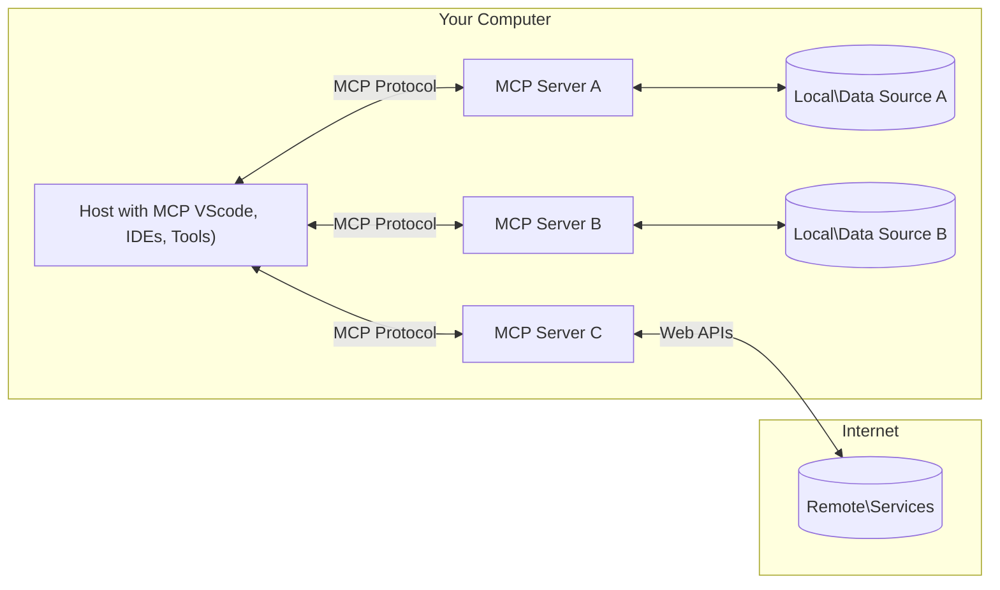

<!--
CO_OP_TRANSLATOR_METADATA:
{
  "original_hash": "b3b4a6ad10c3c0edbf7fa7cfa0ec496b",
  "translation_date": "2025-07-02T07:35:29+00:00",
  "source_file": "01-CoreConcepts/README.md",
  "language_code": "sr"
}
-->
# 📖 Основни појмови MCP: Мастеринг Протокола Контекста Модела за интеграцију вештачке интелигенције

[Model Context Protocol (MCP)](https://github.com/modelcontextprotocol) је моћан, стандардизовани оквир који оптимизује комуникацију између великих језичких модела (LLM) и спољних алата, апликација и извора података. Ова SEO оптимизована водич ће вас провести кроз основне појмове MCP-а, осигуравајући да разумете његову клијент-сервер архитектуру, кључне компоненте, механизме комуникације и најбоље праксе имплементације.

## Преглед

Овај час истражује фундаменталну архитектуру и компоненте које чине екосистем Протокола Контекста Модела (MCP). Научићете о клијент-сервер архитектури, кључним компонентама и механизмима комуникације који покрећу MCP интеракције.

## 👩‍🎓 Кључни циљеви учења

До краја овог часа, бићете у стању да:

- Разумете MCP клијент-сервер архитектуру.
- Идентификујете улоге и одговорности Hosts, Clients и Servers.
- Анализирате основне карактеристике које чине MCP флексибилним слојем за интеграцију.
- Научите како информације тече унутар MCP екосистема.
- Стекнете практична знања кроз примере кода у .NET, Java, Python и JavaScript.

## 🔎 MCP Архитектура: Дубљи увид

MCP екосистем је изграђен на клијент-сервер моделу. Ова модуларна структура омогућава AI апликацијама да ефикасно комуницирају са алатима, базама података, API-јима и контекстуалним ресурсима. Хајде да разложимо ову архитектуру на њене основне компоненте.

У сржи, MCP следи клијент-сервер архитектуру где хост апликација може да се повеже са више сервера:



- **MCP Hosts**: Програми као што су VSCode, Claude Desktop, IDE-ови или AI алати који желе да приступе подацима преко MCP-а
- **MCP Clients**: Протокол клијенти који одржавају 1:1 везе са серверима
- **MCP Servers**: Лаганих програма који сваки излаже специфичне могућности кроз стандардизовани Протокол Контекста Модела
- **Локални извори података**: Фајлови, базе података и сервиси на вашем рачунару које MCP сервери могу безбедно да приступе
- **Ремотни сервиси**: Спољни системи доступни преко интернета којима MCP сервери могу приступити преко API-ја.

MCP Протокол је еволуирајући стандард, најновија ажурирања можете видети у [спецификацији протокола](https://modelcontextprotocol.io/specification/2025-06-18/).

### 1. Hosts

У Протоколу Контекста Модела (MCP), Hosts играју кључну улогу као примарни интерфејс кроз који корисници комуницирају са протоколом. Hosts су апликације или окружења која иницирају везе са MCP серверима како би приступили подацима, алатима и упутствима. Примери Hosts укључују интегрисана развојна окружења (IDEs) као што је Visual Studio Code, AI алате попут Claude Desktop или агенте направљене за специфичне задатке.

**Hosts** су LLM апликације које иницирају везе. Они:

- Извршавају или комуницирају са AI моделима ради генерисања одговора.
- Иницирају везе са MCP серверима.
- Управљају током разговора и корисничким интерфејсом.
- Контролишу дозволе и безбедносне ограничења.
- Обрађују кориснички пристанак за дељење података и извршавање алата.

### 2. Clients

Clients су суштинске компоненте које олакшавају интеракцију између Hosts и MCP сервера. Clients делују као посредници, омогућавајући Hosts да приступе и користе функционалности које пружају MCP сервери. Они играју важну улогу у обезбеђивању глатке комуникације и ефикасне размене података унутар MCP архитектуре.

**Clients** су конектори унутар хост апликације. Они:

- Шаљу захтеве серверима са упутствима/порукама.
- Негоцирају могућности са серверима.
- Управљају захтевима за извршавање алата од стране модела.
- Обрађују и приказују одговоре корисницима.

### 3. Servers

Servers су одговорни за обраду захтева од MCP клијената и пружање одговарајућих одговора. Они управљају различитим операцијама као што су преузимање података, извршавање алата и генерисање упита. Servers обезбеђују да комуникација између клијената и Hosts буде ефикасна и поуздана, одржавајући интегритет процеса интеракције.

**Servers** су сервиси који пружају контекст и могућности. Они:

- Региструју доступне функције (ресурсе, упите, алате)
- Примају и извршавају позиве алата од клијента
- Пружају контекстуалне информације за побољшање одговора модела
- Враћају резултате клијенту
- Одржавају стање током интеракција када је потребно

Servers могу развити било ко да прошири могућности модела специјализованом функционалношћу.

### 4. Карактеристике сервера

Servers у Протоколу Контекста Модела (MCP) пружају основне грађевне блокове који омогућавају богате интеракције између клијената, хостова и језичких модела. Ове функције су дизајниране да побољшају могућности MCP-а нудећи структуриран контекст, алате и упите.

MCP сервери могу понудити неку од следећих функција:

#### 📑 Ресурси

Ресурси у Протоколу Контекста Модела (MCP) обухватају различите врсте контекста и података које корисници или AI модели могу користити. Ово укључује:

- **Контекстуални подаци**: Информације и контекст које корисници или AI модели могу искористити за доношење одлука и извршавање задатака.
- **Базе знања и репозиторијуми докумената**: Колекције структуираних и неструктуираних података, као што су чланци, приручници и научни радови, који пружају вредне увиде и информације.
- **Локални фајлови и базе података**: Подaци сачувани локално на уређајима или у базама података, доступни за обраду и анализу.
- **API-ји и веб сервиси**: Спољни интерфејси и сервиси који нуде додатне податке и функционалности, омогућавајући интеграцију са разним онлајн ресурсима и алатима.

Пример ресурса може бити шема базе података или фајл коме се приступа овако:

```text
file://log.txt
database://schema
```

### 🤖 Упити (Prompts)

Упити у Протоколу Контекста Модела (MCP) укључују различите унапред дефинисане шаблоне и обрасце интеракције дизајниране да поједноставе корисничке токове рада и побољшају комуникацију. Ово укључује:

- **Шаблонизоване поруке и токове рада**: Унапред структуиране поруке и процеси који воде кориснике кроз специфичне задатке и интеракције.
- **Унапред дефинисани обрасци интеракције**: Стандаризовани низови акција и одговора који олакшавају доследну и ефикасну комуникацију.
- **Специјализовани шаблони разговора**: Прилагодљиви шаблони намењени за специфичне типове разговора, осигуравајући релевантне и контекстуално прикладне интеракције.

Пример шаблона упита може изгледати овако:

```markdown
Generate a product slogan based on the following {{product}} with the following {{keywords}}
```

#### ⛏️ Алатке

Алатке у Протоколу Контекста Модела (MCP) су функције које AI модел може извршити да би обавио специфичне задатке. Ове алатке су дизајниране да прошире могућности AI модела пружајући структуиране и поуздане операције. Кључни аспекти укључују:

- **Функције које AI модел може извршити**: Алатке су извршне функције које AI модел може позвати да обави различите задатке.
- **Јединствено име и опис**: Свака алатка има јединствено име и детаљан опис који објашњава њену сврху и функционалност.
- **Параметри и излази**: Алатке прихватају одређене параметре и враћају структуиране излазе, осигуравајући доследне и предвидиве резултате.
- **Дискретне функције**: Алатке обављају дискретне функције као што су претрага веба, калкулације и упити у базу података.

Пример алатке може изгледати овако:

```typescript
server.tool(
  "GetProducts",
  {
    pageSize: z.string().optional(),
    pageCount: z.string().optional()
  }, () => {
    // return results from API
  }
)
```

## Карактеристике клијената

У Протоколу Контекста Модела (MCP), клијенти нуде неколико кључних функција серверима, побољшавајући укупну функционалност и интеракцију унутар протокола. Једна од значајних карактеристика је Sampling.

### 👉 Sampling

- **Агентске радње инициране од стране сервера**: Клијенти омогућавају серверима да аутономно иницирају специфичне акције или понашања, повећавајући динамичке могућности система.
- **Рекурзивне LLM интеракције**: Ова функција омогућава рекурзивне интеракције са великим језичким моделима (LLM), омогућавајући сложенију и итеративну обраду задатака.
- **Захтев за додатним моделским комплетирањима**: Сервери могу тражити додатне комплетирања од модела, осигуравајући да су одговори темељни и контекстуално релевантни.

## Ток информација у MCP

Протокол Контекста Модела (MCP) дефинише структуирани ток информација између хостова, клијената, сервера и модела. Разумевање овог тока помаже да се разјасни како се обрађују кориснички захтеви и како се спољни алати и подаци интегришу у одговоре модела.

- **Host иницира везу**  
  Хост апликација (нпр. IDE или интерфејс за чет) успоставља везу са MCP сервером, обично преко STDIO, WebSocket-а или другог подржаног транспорта.

- **Неговација могућности**  
  Клијент (уграђен у host) и сервер размењују информације о својим подржаним функцијама, алатима, ресурсима и верзијама протокола. Ово осигурава да обе стране разумеју које су могућности доступне током сесије.

- **Кориснички захтев**  
  Корисник комуницира са host-ом (нпр. уноси упит или команду). Host прикупља овај унос и прослеђује га клијенту на обраду.

- **Коришћење ресурса или алата**  
  - Клијент може затражити додатни контекст или ресурсе од сервера (као што су фајлови, уноси у бази података или чланци из базе знања) да обогати разумевање модела.
  - Ако модел процени да је потребан алат (нпр. за преузимање података, израчунавање или позив API-ја), клијент шаље захтев за позив алата серверу, прецизирајући име алата и параметре.

- **Извршење од стране сервера**  
  Сервер прими захтев за ресурс или алат, изврши потребне операције (као што су покретање функције, упит у базу података или преузимање фајла) и врати резултате клијенту у структурираном формату.

- **Генерисање одговора**  
  Клијент интегрише одговоре сервера (подаци ресурса, излази алата итд.) у текућу интеракцију са моделом. Модел користи ове информације да генерише свеобухватан и контекстуално релевантан одговор.

- **Приказ резултата**  
  Host прими коначни излаз од клијента и прикаже га кориснику, често укључујући и текст генерисан од стране модела и резултате извршења алата или претраге ресурса.

Овај ток омогућава MCP-у да подржи напредне, интерактивне и контекстуално свесне AI апликације повезујући моделе са спољним алатима и изворима података.

## Детаљи протокола

MCP (Model Context Protocol) је изграђен на врху [JSON-RPC 2.0](https://www.jsonrpc.org/), пружајући стандардизовани, језички неутралан формат порука за комуникацију између хостова, клијената и сервера. Ова основа омогућава поуздане, структуиране и прошириве интеракције преко различитих платформи и програмских језика.

### Кључне функције протокола

MCP проширује JSON-RPC 2.0 додатним конвенцијама за позив алата, приступ ресурсима и управљање упитима. Подржава више транспортних слојева (STDIO, WebSocket, SSE) и омогућава безбедну, прошириву и језички неутралну комуникацију између компоненти.

#### 🧢 Основни протокол

- **JSON-RPC формат порука**: Сви захтеви и одговори користе JSON-RPC 2.0 спецификацију, осигуравајући доследну структуру за позиве метода, параметре, резултате и обраду грешака.
- **Државне везе**: MCP сесије одржавају стање кроз више захтева, подржавајући текуће разговоре, акумулацију контекста и управљање ресурсима.
- **Неговација могућности**: Током успостављања везе, клијенти и сервери размењују информације о подржаним функцијама, верзијама протокола, доступним алатима и ресурсима. Ово осигурава да обе стране разумеју могућности једна друге и могу се прилагодити.

#### ➕ Додатне услужне функције

Испод су неке додатне услужне функције и проширења протокола које MCP пружа ради побољшања искуства програмера и омогућавања напредних сценарија:

- **Опције конфигурације**: MCP омогућава динамичку конфигурацију параметара сесије, као што су дозволе за алате, приступ ресурсима и подешавања модела, прилагођене за сваку интеракцију.
- **Праћење напретка**: Операције које трају дуже могу пријављивати ажурирања напретка, омогућавајући одзивне корисничке интерфејсе и боље корисничко искуство током сложених задатака.
- **Отказивање захтева**: Клијенти могу отказати захтеве

**Ограничење одговорности**:  
Овај документ је преведен коришћењем AI преводилачке услуге [Co-op Translator](https://github.com/Azure/co-op-translator). Иако тежимо тачности, молимо имајте у виду да аутоматски преводи могу садржати грешке или нетачности. Изворни документ на његовом оригиналном језику треба сматрати ауторитетним извором. За критичне информације препоручује се професионални људски превод. Нисмо одговорни за било каква неспоразума или погрешне тумачења настала коришћењем овог превода.