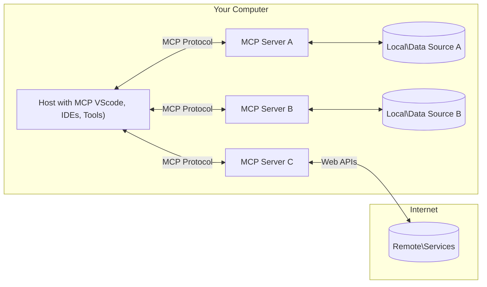

<!--
CO_OP_TRANSLATOR_METADATA:
{
  "original_hash": "355b12a5970c5c9e6db0bee970c751ba",
  "translation_date": "2025-07-04T19:00:01+00:00",
  "source_file": "01-CoreConcepts/README.md",
  "language_code": "sr"
}
-->
# 📖 Основни појмови MCP: Савладавање протокола контекста модела за интеграцију вештачке интелигенције

[Model Context Protocol (MCP)](https://github.com/modelcontextprotocol) је моћан, стандардизован оквир који оптимизује комуникацију између великих језичких модела (LLM) и спољних алата, апликација и извора података. Ова SEO-оптимизована водич ће вас провести кроз основне појмове MCP-а, осигуравајући да разумете његову клијент-сервер архитектуру, кључне компоненте, механизме комуникације и најбоље праксе имплементације.

## Преглед

Ова лекција истражује основну архитектуру и компоненте које чине екосистем Model Context Protocol-а (MCP). Научићете о клијент-сервер архитектури, кључним компонентама и механизмима комуникације који покрећу MCP интеракције.

## 👩‍🎓 Кључни циљеви учења

До краја ове лекције, моћи ћете да:

- Разумете MCP клијент-сервер архитектуру.
- Идентификујете улоге и одговорности Host-ова, Client-ова и Server-ова.
- Анализирате основне карактеристике које чине MCP флексибилним слојем за интеграцију.
- Научите како информације протичу унутар MCP екосистема.
- Стекнете практична знања кроз примере кода у .NET, Java, Python и JavaScript.

## 🔎 MCP архитектура: Детаљнији поглед

MCP екосистем је изграђен на клијент-сервер моделу. Ова модуларна структура омогућава AI апликацијама ефикасну интеракцију са алатима, базама података, API-јима и контекстуалним ресурсима. Хајде да разложимо ову архитектуру на њене основне компоненте.

У сржи, MCP прати клијент-сервер архитектуру где хост апликација може да се повеже са више сервера:



- **MCP Hosts**: Програми као што су VSCode, Claude Desktop, IDE-ови или AI алати који желе да приступе подацима преко MCP-а
- **MCP Clients**: Протокол клијенти који одржавају 1:1 везе са серверима
- **MCP Servers**: Лагани програми који сваки пружају специфичне могућности кроз стандардизовани Model Context Protocol
- **Локални извори података**: Фајлови, базе података и сервиси на вашем рачунару којима MCP сервери могу безбедно приступити
- **Удаљене услуге**: Спољни системи доступни преко интернета којима MCP сервери могу приступити преко API-ја.

MCP протокол је стандард у развоју, најновија ажурирања можете видети у [спецификацији протокола](https://modelcontextprotocol.io/specification/2025-06-18/)

### 1. Hosts

У Model Context Protocol-у (MCP), Hosts имају кључну улогу као примарни интерфејс кроз који корисници комуницирају са протоколом. Hosts су апликације или окружења која иницирају везе са MCP серверима ради приступа подацима, алатима и упутствима. Примери Hosts укључују интегрисана развојна окружења (IDE) као што је Visual Studio Code, AI алате као што је Claude Desktop или прилагођене агенте направљене за специфичне задатке.

**Hosts** су LLM апликације које иницирају везе. Они:

- Извршавају или интерагују са AI моделима ради генерисања одговора.
- Иницирају везе са MCP серверима.
- Управљају током разговора и корисничким интерфејсом.
- Контролишу дозволе и безбедносне ограничења.
- Обрађују кориснички пристанак за дељење података и извршавање алата.

### 2. Clients

Clients су суштинске компоненте које олакшавају интеракцију између Hosts и MCP сервера. Клијенти делују као посредници, омогућавајући Host-овима приступ и коришћење функционалности које пружају MCP сервери. Они имају важну улогу у обезбеђивању глатке комуникације и ефикасне размене података унутар MCP архитектуре.

**Clients** су конектори унутар хост апликације. Они:

- Слају захтеве серверима са упутствима/промптовима.
- Преговарају о могућностима са серверима.
- Управљају захтевима за извршавање алата од модела.
- Обрађују и приказују одговоре корисницима.

### 3. Servers

Servers су одговорни за обраду захтева од MCP клијената и пружање одговарајућих одговора. Они управљају разним операцијама као што су преузимање података, извршавање алата и генерисање упутстава. Servers обезбеђују да комуникација између клијената и Host-ова буде ефикасна и поуздана, одржавајући интегритет процеса интеракције.

**Servers** су сервиси који пружају контекст и могућности. Они:

- Региструју доступне функције (ресурсе, упутства, алате)
- Примају и извршавају позиве алата од клијента
- Пружају контекстуалне информације за побољшање одговора модела
- Враћају резултате назад клијенту
- Одржавају стање током интеракција када је потребно

Servers могу развијати било ко како би проширили могућности модела специјализованом функционалношћу.

### 4. Карактеристике сервера

Servers у Model Context Protocol-у (MCP) пружају основне грађевинске блокове који омогућавају богате интеракције између клијената, хостова и језичких модела. Ове карактеристике су дизајниране да побољшају могућности MCP-а нудећи структуриран контекст, алате и упутства.

MCP сервери могу понудити било коју од следећих карактеристика:

#### 📑 Ресурси

Ресурси у Model Context Protocol-у (MCP) обухватају различите типове контекста и података које корисници или AI модели могу користити. Ово укључује:

- **Контекстуалне податке**: Информације и контекст које корисници или AI модели могу искористити за доношење одлука и извршавање задатака.
- **Базе знања и складишта докумената**: Збирке структурираних и неструктурираних података, као што су чланци, приручници и научни радови, који пружају вредне увиде и информације.
- **Локалне датотеке и базе података**: Податке који се чувају локално на уређајима или у базама података, доступне за обраду и анализу.
- **API-ји и веб сервиси**: Спољни интерфејси и сервиси који нуде додатне податке и функционалности, омогућавајући интеграцију са разним онлајн ресурсима и алатима.

Пример ресурса може бити шема базе података или фајл коме се приступа овако:

```text
file://log.txt
database://schema
```

### 🤖 Упутства (Prompts)

Упутства у Model Context Protocol-у (MCP) укључују различите унапред дефинисане шаблоне и обрасце интеракције дизајниране да поједноставе корисничке токове рада и побољшају комуникацију. Ово укључује:

- **Шаблонизоване поруке и токове рада**: Унапред структуиране поруке и процеси који воде кориснике кроз специфичне задатке и интеракције.
- **Унапред дефинисани обрасци интеракције**: Стандардизовани низови акција и одговора који олакшавају доследну и ефикасну комуникацију.
- **Специјализовани шаблони разговора**: Прилагодљиви шаблони намењени специфичним типовима разговора, обезбеђујући релевантне и контекстуално прикладне интеракције.

Пример шаблона упутства може изгледати овако:

```markdown
Generate a product slogan based on the following {{product}} with the following {{keywords}}
```

#### ⛏️ Алатке (Tools)

Алатке у Model Context Protocol-у (MCP) су функције које AI модел може извршити да би обавио одређене задатке. Ове алатке су дизајниране да побољшају могућности AI модела пружајући структуиране и поуздане операције. Кључни аспекти укључују:

- **Функције које AI модел може извршити**: Алатке су извршне функције које AI модел може позвати да обави различите задатке.
- **Јединствено име и опис**: Свака алатка има јединствено име и детаљан опис који објашњава њену сврху и функционалност.
- **Параметри и излази**: Алатке прихватају одређене параметре и враћају структуиране резултате, обезбеђујући доследне и предвидиве исходе.
- **Дискретне функције**: Алатке обављају дискретне функције као што су претрага веба, калкулације и упити база података.

Пример алатке може изгледати овако:

```typescript
server.tool(
  "GetProducts",
  {
    pageSize: z.string().optional(),
    pageCount: z.string().optional()
  }, () => {
    // return results from API
  }
)
```

## Карактеристике клијената

У Model Context Protocol-у (MCP), клијенти нуде неколико кључних функција серверима, побољшавајући укупну функционалност и интеракцију унутар протокола. Једна од значајних карактеристика је Sampling.

### 👉 Sampling

- **Агентске радње инициране од стране сервера**: Клијенти омогућавају серверима да аутономно иницирају специфичне акције или понашања, побољшавајући динамичке могућности система.
- **Рекурзивне LLM интеракције**: Ова функција омогућава рекурзивне интеракције са великим језичким моделима (LLM), омогућавајући сложенију и итеративну обраду задатака.
- **Захтев за додатним завршетцима модела**: Сервери могу тражити додатне завршетке од модела, осигуравајући да су одговори темељни и контекстуално релевантни.

## Проток информација у MCP

Model Context Protocol (MCP) дефинише структуриран проток информација између хостова, клијената, сервера и модела. Разумевање овог протока помаже да се разјасни како се кориснички захтеви обрађују и како се спољни алати и подаци интегришу у одговоре модела.

- **Host иницира везу**  
  Хост апликација (нпр. IDE или интерфејс за ћаскање) успоставља везу са MCP сервером, обично преко STDIO, WebSocket-а или другог подржаног транспорта.

- **Преговарање о могућностима**  
  Клијент (уграђен у хост) и сервер размењују информације о својим подржаним функцијама, алатима, ресурсима и верзијама протокола. Ово осигурава да обе стране разумеју које могућности су доступне за сесију.

- **Кориснички захтев**  
  Корисник интерагује са хостом (нпр. уноси упутство или команду). Хост прикупља овај унос и прослеђује га клијенту на обраду.

- **Коришћење ресурса или алата**  
  - Клијент може затражити додатни контекст или ресурсе од сервера (као што су фајлови, уноси у бази података или чланци из базе знања) да обогати разумевање модела.
  - Ако модел одлучи да је потребан алат (нпр. за преузимање података, израчунавање или позив API-ја), клијент шаље захтев за позив алата серверу, наводећи име алата и параметре.

- **Извршење на серверу**  
  Сервер прими захтев за ресурс или алат, изврши потребне операције (нпр. покретање функције, упит базе података или преузимање фајла) и врати резултате клијенту у структурираном формату.

- **Генерисање одговора**  
  Клијент интегрише одговоре сервера (подаци ресурса, излази алата итд.) у текућу интеракцију са моделом. Модел користи ове информације да генерише свеобухватан и контекстуално релевантан одговор.

- **Приказ резултата**  
  Хост прими коначни излаз од клијента и прикаже га кориснику, често укључујући и текст који је генерисао модел и све резултате извршења алата или претраге ресурса.

Овај проток омогућава MCP-у да подржи напредне, интерактивне и контекстуално свесне AI апликације беспрекорним повезивањем модела са спољним алатима и изворима података.

## Детаљи протокола

MCP (Model Context Protocol) је изграђен на врху [JSON-RPC 2.0](https://www.jsonrpc.org/), пружајући стандардизован, језички неутралан формат порука за комуникацију између хостова, клијената и сервера. Ова основа омогућава поуздане, структуиране и прошириве интеракције на разним платформама и програмским језицима.

### Кључне карактеристике протокола

MCP проширује JSON-RPC 2.0 додатним конвенцијама за позив алата, приступ ресурсима и управљање упутствима. Подржава више транспортних слојева (STDIO, WebSocket, SSE) и омогућава сигурну, прошириву и језички неутралну комуникацију између компоненти.

#### 🧢 Основни протокол

- **JSON-RPC формат порука**: Сви захтеви и одговори користе JSON-RPC 2.0 спецификацију, обезбеђујући доследну структуру за позиве метода, параметре, резултате и обраду грешака.
- **Сесије са стањем**: MCP сесије одржавају стање кроз више захтева, подржавајући текуће разговоре, акумулацију контекста и управљање ресурсима.
- **Преговарање о могућностима**: Током успостављања везе, клијенти и сервери размењују информације о подржаним функцијама, верзијама протокола, доступним алатима и ресурсима. Ово осигурава да обе стране разумеју могућности једна друге и могу се прилагодити.

#### ➕ Додатне услуге

Испод су неке додатне услуге и проширења протокола које MCP пружа за побољшање искуства програмера и омогућавање напредних сценарија:

- **Опције конфигурације**: MCP омогућава динамичку конфигурацију параметара сесије, као што су дозволе за алате, приступ ресурсима и подешавања модела, прилагођена свакој интеракцији.
- **Праћење напретка**: Операције које трају дуже могу пријављивати ажурирања напретка, омогућавајући одзивне корисничке интерфејсе и боље корисничко искуство током сложених задатака.
- **Отказивање захтева**: Клијенти могу отказати захтеве у току, дозвољавају
MCP укључује неколико уграђених концепата и механизама за управљање безбедношћу и ауторизацијом кроз цео протокол:

1. **Контрола дозвола алата**:  
  Клијенти могу одредити које алате модел сме да користи током сесије. Ово осигурава да су доступни само експлицитно овлашћени алати, смањујући ризик од нежељених или небезбедних операција. Дозволе се могу динамички подешавати у складу са корисничким преференцама, организационим политикама или контекстом интеракције.

2. **Аутентификација**:  
  Сервери могу захтевати аутентификацију пре него што одобре приступ алатима, ресурсима или осетљивим операцијама. Ово може укључивати API кључеве, OAuth токене или друге шеме аутентификације. Правилна аутентификација осигурава да само поуздани клијенти и корисници могу да позивају могућности на страни сервера.

3. **Валидација**:  
  Валидација параметара се примењује за све позиве алата. Сваки алат дефинише очекиване типове, формате и ограничења за своје параметре, а сервер проверава долазне захтеве у складу са тим. Ово спречава да неисправни или злонамерни уноси стигну до имплементација алата и помаже у одржавању интегритета операција.

4. **Ограничење брзине (Rate Limiting)**:  
  Да би се спречила злоупотреба и обезбедила фер употреба ресурса сервера, MCP сервери могу имплементирати ограничења брзине за позиве алата и приступ ресурсима. Ограничења могу бити по кориснику, по сесији или глобално, и помажу у заштити од DoS напада или прекомерне потрошње ресурса.

Комбиновањем ових механизама, MCP пружа сигурну основу за интеграцију језичких модела са спољним алатима и изворима података, истовремено омогућавајући корисницима и програмерима прецизну контролу приступа и коришћења.

## Протоколске поруке

MCP комуникација користи структуиране JSON поруке како би омогућила јасне и поуздане интеракције између клијената, сервера и модела. Главне врсте порука укључују:

- **Захтев клијента**  
  Слање са клијента ка серверу, ова порука обично садржи:
  - Кориснички упит или команду
  - Историју разговора за контекст
  - Конфигурацију алата и дозволе
  - Додатне метаподатке или информације о сесији

- **Одговор модела**  
  Враћа га модел (преко клијента), ова порука садржи:
  - Генерисани текст или завршетак на основу упита и контекста
  - Опционална упутства за позив алата ако модел процени да треба позвати алат
  - Референце на ресурсе или додатни контекст по потреби

- **Захтев алата**  
  Слање са клијента ка серверу када је потребно извршити алат. Ова порука укључује:
  - Име алата који треба позвати
  - Параметре које алат захтева (валидација у складу са шемом алата)
  - Контекстуалне информације или идентификаторе за праћење захтева

- **Одговор алата**  
  Враћа га сервер након извршења алата. Ова порука пружа:
  - Резултате извршења алата (структурирани подаци или садржај)
  - Све грешке или статусне информације ако је позив алата неуспешан
  - Опционо, додатне метаподатке или записе везане за извршење

Ове структуиране поруке осигуравају да је сваки корак у MCP радном току јасан, пратљив и проширив, подржавајући напредне сценарије као што су вишекратни разговори, ланац алата и робусно руковање грешкама.

## Кључне поуке

- MCP користи клијент-сервер архитектуру за повезивање модела са спољним могућностима
- Екосистем се састоји од клијената, домаћина, сервера, алата и извора података
- Комуникација може да се одвија преко STDIO, SSE или WebSockets
- Алати су основне јединице функционалности изложене моделима
- Структурирани комуникациони протоколи обезбеђују доследне интеракције

## Вежба

Осмислите једноставан MCP алат који би био користан у вашој области. Дефинишите:
1. Како би се алат звао
2. Које параметре би прихватао
3. Који излаз би враћао
4. Како би модел могао да користи овај алат за решавање корисничких проблема


---

## Шта следи

Следеће: [Поглавље 2: Безбедност](../02-Security/README.md)

**Одрицање од одговорности**:  
Овај документ је преведен коришћењем AI преводилачке услуге [Co-op Translator](https://github.com/Azure/co-op-translator). Иако се трудимо да превод буде тачан, молимо вас да имате у виду да аутоматски преводи могу садржати грешке или нетачности. Оригинални документ на његовом изворном језику треба сматрати ауторитетним извором. За критичне информације препоручује се професионални људски превод. Нисмо одговорни за било каква неспоразума или погрешна тумачења која произилазе из коришћења овог превода.