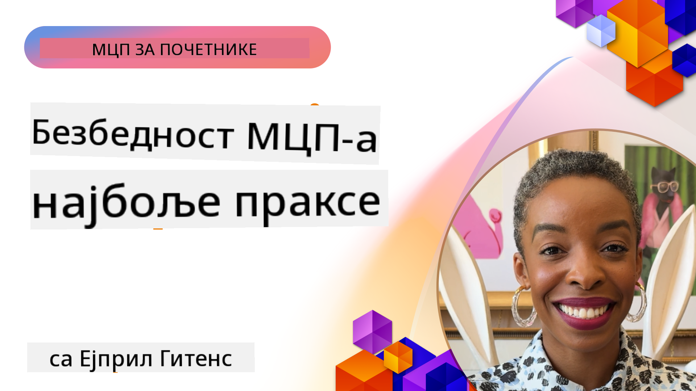

<!--
CO_OP_TRANSLATOR_METADATA:
{
  "original_hash": "1c767a35642f753127dc08545c25a290",
  "translation_date": "2025-08-19T17:23:44+00:00",
  "source_file": "02-Security/README.md",
  "language_code": "sr"
}
-->
# MCP Безбедност: Свеобухватна заштита за AI системе

_(Кликните на слику изнад да бисте погледали видео лекцију)_

Безбедност је основа дизајна AI система, због чега је постављамо као наш други одељак. Ово је у складу са Microsoft-овим принципом **Secure by Design** из [Secure Future Initiative](https://www.microsoft.com/security/blog/2025/04/17/microsofts-secure-by-design-journey-one-year-of-success/).

Протокол Model Context Protocol (MCP) доноси моћне нове могућности за апликације засноване на AI-у, али истовремено уводи јединствене безбедносне изазове који превазилазе традиционалне софтверске ризике. MCP системи се суочавају са већ познатим безбедносним проблемима (сигурно кодирање, принцип најмањих привилегија, безбедност ланца снабдевања) као и са новим претњама специфичним за AI, укључујући убризгавање упутстава, тровање алатима, отмицу сесија, нападе "збуњеног заменика", рањивости у преносу токена и динамичке модификације могућности.

Ова лекција истражује најкритичније безбедносне ризике у MCP имплементацијама—покривајући аутентификацију, ауторизацију, прекомерне дозволе, индиректно убризгавање упутстава, безбедност сесија, проблеме "збуњеног заменика", управљање токенима и рањивости ланца снабдевања. Научићете применљиве контроле и најбоље праксе за ублажавање ових ризика, уз коришћење Microsoft решења као што су Prompt Shields, Azure Content Safety и GitHub Advanced Security за јачање ваше MCP имплементације.

## Циљеви учења

До краја ове лекције, бићете у могућности да:

- **Идентификујете MCP-специфичне претње**: Препознате јединствене безбедносне ризике у MCP системима, укључујући убризгавање упутстава, тровање алатима, прекомерне дозволе, отмицу сесија, проблеме "збуњеног заменика", рањивости у преносу токена и ризике ланца снабдевања
- **Примените безбедносне контроле**: Имплементирате ефикасне мере као што су робусна аутентификација, приступ са најмањим привилегијама, сигурно управљање токенима, контроле безбедности сесија и верификацију ланца снабдевања
- **Искористите Microsoft безбедносна решења**: Разумете и примените Microsoft Prompt Shields, Azure Content Safety и GitHub Advanced Security за заштиту MCP радних оптерећења
- **Потврдите безбедност алата**: Препознате важност валидације метаподатака алата, праћења динамичких промена и одбране од индиректних напада убризгавања упутстава
- **Интегришете најбоље праксе**: Комбинујете утврђене безбедносне основе (сигурно кодирање, очвршћивање сервера, zero trust) са MCP-специфичним контролама за свеобухватну заштиту

# MCP Безбедносна архитектура и контроле

Модерне MCP имплементације захтевају слојевите безбедносне приступе који адресирају и традиционалне софтверске претње и претње специфичне за AI. Брзо еволуирајућа MCP спецификација наставља да унапређује своје безбедносне контроле, омогућавајући бољу интеграцију са корпоративним безбедносним архитектурама и утврђеним најбољим праксама.

Истраживање из [Microsoft Digital Defense Report](https://aka.ms/mddr) показује да би **98% пријављених пробоја било спречено робусном безбедносном хигијеном**. Најефикаснија стратегија заштите комбинује основне безбедносне праксе са MCP-специфичним контролама—доказане основне мере безбедности остају најзначајније у смањењу укупног безбедносног ризика.

## Тренутни безбедносни пејзаж

> **Note:** Ове информације одражавају MCP безбедносне стандарде од **18. августа 2025. године**. MCP протокол се брзо развија, а будуће имплементације могу увести нове обрасце аутентификације и унапређене контроле. Увек се позовите на актуелну [MCP спецификацију](https://spec.modelcontextprotocol.io/), [MCP GitHub репозиторијум](https://github.com/modelcontextprotocol) и [документацију најбољих пракси безбедности](https://modelcontextprotocol.io/specification/2025-06-18/basic/security_best_practices) за најновије смернице.

### Еволуција MCP аутентификације

MCP спецификација је значајно еволуирала у свом приступу аутентификацији и ауторизацији:

- **Првобитни приступ**: Ране спецификације су захтевале од програмера да имплементирају прилагођене сервере за аутентификацију, при чему су MCP сервери деловали као OAuth 2.0 сервери за ауторизацију који директно управљају корисничком аутентификацијом
- **Тренутни стандард (2025-06-18)**: Ажурирана спецификација омогућава MCP серверима да делегирају аутентификацију спољним провајдерима идентитета (као што је Microsoft Entra ID), побољшавајући безбедносну позицију и смањујући сложеност имплементације
- **Безбедност транспортног слоја**: Унапређена подршка за сигурне транспортне механизме са одговарајућим обрасцима аутентификације за локалне (STDIO) и удаљене (Streamable HTTP) везе

## Безбедност аутентификације и ауторизације

### Тренутни безбедносни изазови

Модерне MCP имплементације се суочавају са неколико изазова у аутентификацији и ауторизацији:

### Ризици и вектори претњи

- **Погрешно конфигурисана логика ауторизације**: Недостаци у имплементацији ауторизације на MCP серверима могу изложити осетљиве податке и неправилно применити контроле приступа
- **Компромитовање OAuth токена**: Крађа локалних MCP серверских токена омогућава нападачима да се представљају као сервери и приступају низводним сервисима
- **Рањивости у преносу токена**: Неправилно руковање токенима ствара заобилажење безбедносних контрола и празнине у одговорности
- **Прекомерне дозволе**: MCP сервери са превеликим привилегијама крше принцип најмањих привилегија и проширују површину напада

#### Пренос токена: Критичан анти-образац

**Пренос токена је изричито забрањен** у тренутној MCP спецификацији ауторизације због озбиљних безбедносних импликација:

##### Заобилажење безбедносних контрола
- MCP сервери и низводни API-ји имплементирају критичне безбедносне контроле (ограничавање брзине, валидација захтева, праћење саобраћаја) које зависе од правилне валидације токена
- Директно коришћење токена клијента за API заобилази ове основне заштите, подривајући безбедносну архитектуру

##### Изазови у одговорности и ревизији  
- MCP сервери не могу разликовати клијенте који користе токене издате узводно, нарушавајући трагове ревизије
- Логови низводних серверских ресурса приказују обмањујуће изворе захтева уместо стварних MCP серверских посредника
- Истраживање инцидената и ревизија усклађености постају знатно тежи

##### Ризици ексфилтрације података
- Невалидиране тврдње токена омогућавају злонамерним актерима са украденим токенима да користе MCP сервере као проксије за ексфилтрацију података
- Кршење граница поверења омогућава неовлашћене обрасце приступа који заобилазе предвиђене безбедносне контроле

##### Вектори напада на више сервиса
- Компромитовани токени прихваћени од стране више сервиса омогућавају латерално кретање кроз повезане системе
- Претпоставке о поверењу између сервиса могу бити нарушене када се порекло токена не може проверити

### Безбедносне контроле и мере ублажавања

**Критични безбедносни захтеви:**

> **ОБАВЕЗНО**: MCP сервери **НЕ СМЕЈУ** прихватати било које токене који нису изричито издати за MCP сервер

#### Контроле аутентификације и ауторизације

- **Ригорозна ревизија ауторизације**: Спроведите свеобухватне ревизије логике ауторизације MCP сервера како бисте осигурали да само предвиђени корисници и клијенти могу приступити осетљивим ресурсима
  - **Водич за имплементацију**: [Azure API Management као аутентификациони пролаз за MCP сервере](https://techcommunity.microsoft.com/blog/integrationsonazureblog/azure-api-management-your-auth-gateway-for-mcp-servers/4402690)
  - **Интеграција идентитета**: [Коришћење Microsoft Entra ID за аутентификацију MCP сервера](https://den.dev/blog/mcp-server-auth-entra-id-session/)

- **Сигурно управљање токенима**: Имплементирајте [Microsoft-ове најбоље праксе за валидацију и животни циклус токена](https://learn.microsoft.com/en-us/entra/identity-platform/access-tokens)
  - Валидација тврдњи о публици токена мора одговарати идентитету MCP сервера
  - Имплементирајте правилну ротацију и политику истека токена
  - Спречите нападе репродукције токена и неовлашћену употребу

- **Заштићено складиштење токена**: Осигурајте складиштење токена са енкрипцијом у мировању и у транзиту
  - **Најбоље праксе**: [Смернице за сигурно складиштење и енкрипцију токена](https://youtu.be/uRdX37EcCwg?si=6fSChs1G4glwXRy2)

#### Имплементација контрола приступа

- **Принцип најмањих привилегија**: Доделите MCP серверима само минималне дозволе потребне за предвиђену функционалност
  - Редовне ревизије и ажурирања дозвола како би се спречило накупљање привилегија
  - **Microsoft документација**: [Сигурни приступ са најмањим привилегијама](https://learn.microsoft.com/entra/identity-platform/secure-least-privileged-access)

- **Контрола приступа заснована на улогама (RBAC)**: Имплементирајте фино гранулисане доделе улога
  - Ограничите улоге на специфичне ресурсе и акције
  - Избегавајте широке или непотребне дозволе које проширују површину напада

- **Континуирано праћење дозвола**: Имплементирајте стално праћење и ревизију приступа
  - Пратите обрасце коришћења дозвола ради откривања аномалија
  - Брзо решавајте прекомерне или неискоришћене привилегије

## Претње специфичне за AI

### Напади убризгавања упутстава и манипулације алатима

Модерне MCP имплементације се суочавају са софистицираним нападима специфичним за AI које традиционалне безбедносне мере не могу у потпуности адресирати:

#### **Индиректно убризгавање упутстава (Cross-Domain Prompt Injection)**

**Индиректно убризгавање упутстава** представља једну од најкритичнијих рањивости у AI системима омогућеним MCP-ом. Нападачи уграђују злонамерна упутства у спољни садржај—документе, веб странице, е-поруке или изворе података—које AI системи касније обрађују као легитимне команде.

**Сценарији напада:**
- **Убризгавање у документима**: Злонамерна упутства скривена у обрађеним документима која покрећу нежељене AI акције
- **Експлоатација веб садржаја**: Компромитоване веб странице са уграђеним упутствима која манипулишу AI понашањем приликом скенирања
- **Напади путем е-поште**: Злонамерна упутства у е-порукама која узрокују да AI асистенти открију информације или изврше неовлашћене радње
- **Контаминација извора података**: Компромитоване базе података или API-ји који служе загађени садржај AI системима

**Утицај у стварном свету**: Ови напади могу довести до ексфилтрације података, кршења приватности, генерисања штетног садржаја и манипулације корисничким интеракцијама. За детаљну анализу, погледајте [Prompt Injection in MCP (Simon Willison)](https://simonwillison.net/2025/Apr/9/mcp-prompt-injection/).

#### **Напади тровања алата**

**Тровање алата** циља метаподатке који дефинишу MCP алате, експлоатишући начин на који LLM-ови тумаче описе алата и параметре за доношење одлука о извршењу.

**Механизми напада:**
- **Манипулација метаподацима**: Нападачи убацују злонамерна упутства у описе алата, дефиниције параметара или примере употребе
- **Невидљива упутства**: Скривени упити у метаподацима алата који се обрађују од стране AI модела, али су невидљиви људским корисницима
- **Динамичка модификација алата ("Rug Pulls")**: Алатке одобрене од стране корисника касније се модификују да извршавају злонамерне радње без знања корисника
- **Убризгавање параметара**: Злонамерни садржај уграђен у шеме параметара алата који утиче на понашање модела

**Ризици хостованих сервера**: Удаљени MCP сервери представљају повећане ризике јер се дефиниције алата могу ажурирати након почетног одобрења корисника, стварајући сценарије у којима претходно безбедни алати постају злонамерни. За свеобухватну анализу, погледајте [Tool Poisoning Attacks (Invariant Labs)](https://invariantlabs.ai/blog/mcp-security
- **Генерисање сигурних сесија**: Користите криптографски сигурне, недетерминистичке ID-ове сесија генерисане помоћу сигурних генератора случајних бројева  
- **Везивање за корисника**: Вежите ID-ове сесија за информације специфичне за корисника користећи формате попут `<user_id>:<session_id>` како бисте спречили злоупотребу сесија између корисника  
- **Управљање животним циклусом сесије**: Примените правилно истекање, ротацију и поништавање како бисте ограничили прозоре рањивости  
- **Сигурност транспорта**: Обавезан HTTPS за сву комуникацију како би се спречило пресретање ID-ова сесија  

### Проблем "Збуњеног заменика"

**Проблем "збуњеног заменика"** настаје када MCP сервери делују као аутентификациони проксији између клијената и услуга трећих страна, стварајући могућности заобилажења овлашћења кроз експлоатацију статичног ID-а клијента.

#### **Механика напада и ризици**

- **Заобилажење пристанка засновано на колачићима**: Претходна аутентификација корисника ствара колачиће пристанка које нападачи злоупотребљавају кроз злонамерне захтеве за овлашћење са измењеним URI-јем за преусмеравање  
- **Крађа кода за овлашћење**: Постојећи колачићи пристанка могу узроковати да сервери за овлашћење прескоче екране за пристанак, преусмеравајући кодове на крајње тачке под контролом нападача  
- **Неовлашћен приступ API-ју**: Украдени кодови за овлашћење омогућавају размену токена и имперсонацију корисника без експлицитног одобрења  

#### **Стратегије ублажавања**

**Обавезне контроле:**
- **Експлицитни захтеви за пристанак**: MCP прокси сервери који користе статичне ID-ове клијената **МОРАЈУ** добити пристанак корисника за сваког динамички регистрованог клијента  
- **Примена безбедности OAuth 2.1**: Пратите актуелне најбоље праксе за безбедност OAuth-а, укључујући PKCE (Proof Key for Code Exchange) за све захтеве за овлашћење  
- **Строга валидација клијената**: Примените ригорозну валидацију URI-ја за преусмеравање и идентификатора клијената како бисте спречили експлоатацију  

### Ризици проласка токена  

**Пролазак токена** представља експлицитни антипатерн где MCP сервери прихватају токене клијената без одговарајуће валидације и прослеђују их API-јима низводно, кршећи MCP спецификације овлашћења.

#### **Безбедносне импликације**

- **Заобилажење контрола**: Директна употреба токена клијента за API заобилази критичне контроле као што су ограничење брзине, валидација и праћење  
- **Корупција трагова ревизије**: Токени издати узводно онемогућавају идентификацију клијента, нарушавајући могућности истраге инцидената  
- **Експлоатација проксија за изношење података**: Невалидирани токени омогућавају злонамерним актерима да користе сервере као проксије за неовлашћен приступ подацима  
- **Нарушавање граница поверења**: Претпоставке о поверењу услуга низводно могу бити нарушене када се порекло токена не може проверити  
- **Ширење напада на више услуга**: Компромитовани токени прихваћени у више услуга омогућавају латерално кретање  

#### **Потребне безбедносне контроле**

**Непреговориви захтеви:**
- **Валидација токена**: MCP сервери **НЕ СМЕЈУ** прихватати токене који нису експлицитно издати за MCP сервер  
- **Провера публике**: Увек проверите да ли тврдње о публици токена одговарају идентитету MCP сервера  
- **Правилан животни циклус токена**: Примените токене за приступ кратког века са сигурним праксама ротације  

## Безбедност ланца снабдевања за AI системе

Безбедност ланца снабдевања еволуирала је изван традиционалних софтверских зависности како би обухватила цео AI екосистем. Модерне MCP имплементације морају ригорозно проверавати и надгледати све AI компоненте, јер свака уводи потенцијалне рањивости које могу угрозити интегритет система.

### Проширени елементи AI ланца снабдевања

**Традиционалне софтверске зависности:**
- Библиотеке и оквири отвореног кода  
- Слике контејнера и основни системи  
- Алатке за развој и цевоводи за изградњу  
- Компоненте инфраструктуре и услуге  

**Елементи специфични за AI:**
- **Основни модели**: Претходно обучени модели од различитих провајдера који захтевају проверу порекла  
- **Услуге уграђивања**: Спољне услуге за векторизацију и семантичко претраживање  
- **Пружаоци контекста**: Извори података, базе знања и репозиторијуми докумената  
- **API-ји трећих страна**: Спољне AI услуге, ML цевоводи и крајње тачке за обраду података  
- **Артефакти модела**: Тежине, конфигурације и варијанте модела након фино подешавања  
- **Извори података за обуку**: Скупови података коришћени за обуку и фино подешавање модела  

### Свеобухватна стратегија безбедности ланца снабдевања

#### **Провера компоненти и поверење**
- **Провера порекла**: Проверите порекло, лиценцирање и интегритет свих AI компоненти пре интеграције  
- **Процена безбедности**: Спроведите скенирање рањивости и безбедносне прегледе за моделе, изворе података и AI услуге  
- **Анализа репутације**: Процените безбедносни досије и праксе провајдера AI услуга  
- **Провера усклађености**: Осигурајте да све компоненте испуњавају организационе безбедносне и регулаторне захтеве  

#### **Сигурни цевоводи за распоређивање**  
- **Аутоматизована безбедност CI/CD**: Интегришите скенирање безбедности кроз аутоматизоване цевоводе за распоређивање  
- **Интегритет артефаката**: Примените криптографску проверу за све распоређене артефакте (код, модели, конфигурације)  
- **Фазно распоређивање**: Користите прогресивне стратегије распоређивања са безбедносном валидацијом на свакој фази  
- **Поверљиви репозиторијуми артефаката**: Распоређујте само из проверених, сигурних регистара и репозиторијума артефаката  

#### **Континуирано праћење и одговор**
- **Скенирање зависности**: Континуирано праћење рањивости за све софтверске и AI компоненте зависности  
- **Праћење модела**: Континуирана процена понашања модела, одступања у перформансама и безбедносних аномалија  
- **Праћење здравља услуга**: Надгледајте спољне AI услуге за доступност, безбедносне инциденте и промене политика  
- **Интеграција обавештајних података о претњама**: Укључите изворе претњи специфичне за AI и ML ризике  

#### **Контрола приступа и принцип најмањих привилегија**
- **Дозволе на нивоу компоненти**: Ограничите приступ моделима, подацима и услугама на основу пословне потребе  
- **Управљање сервисним налозима**: Примените наменске сервисне налоге са минималним потребним дозволама  
- **Сегментација мреже**: Изолујте AI компоненте и ограничите мрежни приступ између услуга  
- **Контроле API пролаза**: Користите централизоване API пролазе за контролу и праћење приступа спољним AI услугама  

#### **Одговор на инциденте и опоравак**
- **Процедуре брзог одговора**: Успостављени процеси за закрпљивање или замену компромитованих AI компоненти  
- **Ротација акредитива**: Аутоматизовани системи за ротацију тајни, API кључева и акредитива услуга  
- **Могућности враћања**: Способност брзог враћања на претходне верзије AI компоненти за које се зна да су исправне  
- **Опоравак од компромиса ланца снабдевања**: Специфичне процедуре за одговор на компромисе узводних AI услуга  

### Microsoft алати за безбедност и интеграција

**GitHub Advanced Security** пружа свеобухватну заштиту ланца снабдевања, укључујући:  
- **Скенирање тајни**: Аутоматско откривање акредитива, API кључева и токена у репозиторијумима  
- **Скенирање зависности**: Процена рањивости за зависности и библиотеке отвореног кода  
- **CodeQL анализа**: Статичка анализа кода за безбедносне рањивости и проблеме у кодирању  
- **Увид у ланац снабдевања**: Видљивост здравља и безбедносног статуса зависности  

**Azure DevOps и Azure Repos интеграција:**  
- Беспрекорна интеграција скенирања безбедности на Microsoft платформама за развој  
- Аутоматске провере безбедности у Azure Pipelines за AI радне оптерећења  
- Спровођење политика за сигурно распоређивање AI компоненти  

**Microsoft интерне праксе:**  
Microsoft примењује обимне праксе безбедности ланца снабдевања у свим производима. Сазнајте више о доказаним приступима у [Пут ка обезбеђивању софтверског ланца снабдевања у Microsoft-у](https://devblogs.microsoft.com/engineering-at-microsoft/the-journey-to-secure-the-software-supply-chain-at-microsoft/).
### **Microsoft Безбедносна Решења**
- [Microsoft Prompt Shields Документација](https://learn.microsoft.com/azure/ai-services/content-safety/concepts/jailbreak-detection)
- [Azure Content Safety Сервис](https://learn.microsoft.com/azure/ai-services/content-safety/)
- [Microsoft Entra ID Безбедност](https://learn.microsoft.com/entra/identity-platform/secure-least-privileged-access)
- [Azure Token Management Најбоље Практике](https://learn.microsoft.com/entra/identity-platform/access-tokens)
- [GitHub Напредна Безбедност](https://github.com/security/advanced-security)

### **Упутства за Имплементацију и Туторијали**
- [Azure API Management као MCP Аутентификациони Gateway](https://techcommunity.microsoft.com/blog/integrationsonazureblog/azure-api-management-your-auth-gateway-for-mcp-servers/4402690)
- [Microsoft Entra ID Аутентификација са MCP Серверима](https://den.dev/blog/mcp-server-auth-entra-id-session/)
- [Сигурно Чување Токена и Енкрипција (Видео)](https://youtu.be/uRdX37EcCwg?si=6fSChs1G4glwXRy2)

### **DevOps и Безбедност Ланца Снабдевања**
- [Azure DevOps Безбедност](https://azure.microsoft.com/products/devops)
- [Azure Repos Безбедност](https://azure.microsoft.com/products/devops/repos/)
- [Microsoft Путовање кроз Безбедност Ланца Снабдевања](https://devblogs.microsoft.com/engineering-at-microsoft/the-journey-to-secure-the-software-supply-chain-at-microsoft/)

## **Додатна Документација о Безбедности**

За свеобухватне смернице о безбедности, погледајте специјализоване документе у овом одељку:

- **[MCP Најбоље Практике за Безбедност 2025](./mcp-security-best-practices-2025.md)** - Комплетне најбоље праксе за MCP имплементације  
- **[Azure Content Safety Имплементација](./azure-content-safety-implementation.md)** - Практични примери имплементације за Azure Content Safety интеграцију  
- **[MCP Контроле Безбедности 2025](./mcp-security-controls-2025.md)** - Најновије контроле и технике безбедности за MCP примене  
- **[MCP Брзи Водич за Најбоље Практике](./mcp-best-practices.md)** - Брзи водич за основне MCP безбедносне праксе  

---

## Шта Следи

Следеће: [Поглавље 3: Почетак](../03-GettingStarted/README.md)

**Одрицање од одговорности**:  
Овај документ је преведен коришћењем услуге за превођење помоћу вештачке интелигенције [Co-op Translator](https://github.com/Azure/co-op-translator). Иако се трудимо да обезбедимо тачност, молимо вас да имате у виду да аутоматски преводи могу садржати грешке или нетачности. Оригинални документ на његовом изворном језику треба сматрати меродавним извором. За критичне информације препоручује се професионални превод од стране људи. Не преузимамо одговорност за било каква погрешна тумачења или неспоразуме који могу настати услед коришћења овог превода.