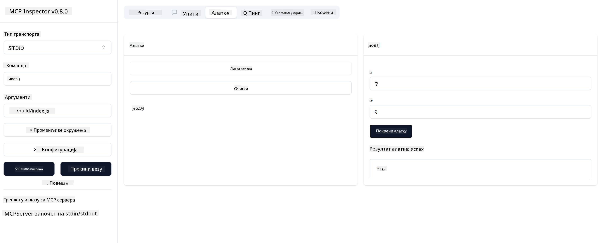

<!--
CO_OP_TRANSLATOR_METADATA:
{
  "original_hash": "5331ffd328a54b90f76706c52b673e27",
  "translation_date": "2025-05-17T08:56:38+00:00",
  "source_file": "03-GettingStarted/01-first-server/README.md",
  "language_code": "sr"
}
-->
# Uvod u MCP

Dobrodošli u vaše prve korake sa Model Context Protocol (MCP)! Bilo da ste novi u MCP-u ili želite da produbite svoje razumevanje, ovaj vodič će vas provesti kroz osnovnu postavku i proces razvoja. Otkrićete kako MCP omogućava besprekornu integraciju između AI modela i aplikacija i naučiti kako brzo pripremiti svoje okruženje za izgradnju i testiranje rešenja koja koriste MCP.

> Ukratko; Ako pravite AI aplikacije, znate da možete dodati alate i druge resurse svom LLM (velikom jezičkom modelu), kako bi LLM bio informisaniji. Međutim, ako te alate i resurse postavite na server, aplikacija i mogućnosti servera mogu biti korišćene od strane bilo kog klijenta sa/bez LLM-a.

## Pregled

Ova lekcija pruža praktične smernice za postavljanje MCP okruženja i izgradnju vaših prvih MCP aplikacija. Naučićete kako da postavite potrebne alate i okvire, izgradite osnovne MCP servere, kreirate host aplikacije i testirate svoje implementacije.

Model Context Protocol (MCP) je otvoreni protokol koji standardizuje način na koji aplikacije pružaju kontekst LLM-ovima. Zamislite MCP kao USB-C port za AI aplikacije - pruža standardizovan način povezivanja AI modela sa različitim izvorima podataka i alatima.

## Ciljevi učenja

Na kraju ove lekcije, bićete u mogućnosti da:

- Postavite razvojna okruženja za MCP u C#, Java, Python, TypeScript i JavaScript
- Izgradite i implementirate osnovne MCP servere sa prilagođenim funkcijama (resursi, upiti i alati)
- Kreirate host aplikacije koje se povezuju sa MCP serverima
- Testirate i otklonite greške u MCP implementacijama

## Postavljanje vašeg MCP okruženja

Pre nego što počnete da radite sa MCP, važno je da pripremite svoje razvojno okruženje i razumete osnovni tok rada. Ovaj odeljak će vas voditi kroz početne korake postavke kako biste osigurali nesmetan početak sa MCP.

### Preduslovi

Pre nego što se upustite u MCP razvoj, osigurajte da imate:

- **Razvojno okruženje**: Za izabrani jezik (C#, Java, Python, TypeScript ili JavaScript)
- **IDE/Uređivač**: Visual Studio, Visual Studio Code, IntelliJ, Eclipse, PyCharm ili bilo koji moderni uređivač koda
- **Menadžeri paketa**: NuGet, Maven/Gradle, pip ili npm/yarn
- **API ključeve**: Za bilo koje AI usluge koje planirate da koristite u svojim host aplikacijama

## Osnovna struktura MCP servera

MCP server obično uključuje:

- **Konfiguraciju servera**: Postavljanje porta, autentifikacije i drugih postavki
- **Resurse**: Podaci i kontekst dostupni LLM-ovima
- **Alate**: Funkcionalnosti koje modeli mogu pozvati
- **Upite**: Šablone za generisanje ili strukturiranje teksta

Evo pojednostavljenog primera u TypeScript-u:

```typescript
import { Server, Tool, Resource } from "@modelcontextprotocol/typescript-server-sdk";

// Create a new MCP server
const server = new Server({
  port: 3000,
  name: "Example MCP Server",
  version: "1.0.0"
});

// Register a tool
server.registerTool({
  name: "calculator",
  description: "Performs basic calculations",
  parameters: {
    expression: {
      type: "string",
      description: "The math expression to evaluate"
    }
  },
  handler: async (params) => {
    const result = eval(params.expression);
    return { result };
  }
});

// Start the server
server.start();
```

U prethodnom kodu mi:

- Uvozimo potrebne klase iz MCP TypeScript SDK-a.
- Kreiramo i konfigurišemo novu MCP instancu servera.
- Registrujemo prilagođeni alat (`calculator`) sa funkcijom rukovaoca.
- Pokrećemo server da osluškuje dolazne MCP zahteve.

## Testiranje i otklanjanje grešaka

Pre nego što počnete sa testiranjem vašeg MCP servera, važno je razumeti dostupne alate i najbolje prakse za otklanjanje grešaka. Efikasno testiranje osigurava da se vaš server ponaša kako se očekuje i pomaže vam da brzo identifikujete i rešite probleme. Sledeći odeljak opisuje preporučene pristupe za validaciju vaše MCP implementacije.

MCP pruža alate koji vam pomažu da testirate i otklonite greške na vašim serverima:

- **Alat za inspekciju**, ovaj grafički interfejs omogućava vam da se povežete sa vašim serverom i testirate vaše alate, upite i resurse.
- **curl**, možete se takođe povezati sa vašim serverom koristeći alat za komandnu liniju kao što je curl ili drugi klijenti koji mogu kreirati i pokretati HTTP komande.

### Korišćenje MCP Inspektora

[MCP Inspektor](https://github.com/modelcontextprotocol/inspector) je vizuelni alat za testiranje koji vam pomaže:

1. **Otkrivanje sposobnosti servera**: Automatsko otkrivanje dostupnih resursa, alata i upita
2. **Testiranje izvršavanja alata**: Isprobajte različite parametre i vidite odgovore u realnom vremenu
3. **Pregled metapodataka servera**: Ispitajte informacije o serveru, šeme i konfiguracije

```bash
# ex TypeScript, installing and running MCP Inspector
npx @modelcontextprotocol/inspector node build/index.js
```

Kada pokrenete gore navedene komande, MCP Inspektor će pokrenuti lokalni veb interfejs u vašem pregledaču. Možete očekivati da vidite kontrolnu tablu koja prikazuje vaše registrovane MCP servere, njihove dostupne alate, resurse i upite. Interfejs vam omogućava interaktivno testiranje izvršavanja alata, inspekciju metapodataka servera i pregled odgovora u realnom vremenu, što olakšava validaciju i otklanjanje grešaka u vašim MCP server implementacijama.

Evo snimka ekrana kako to može izgledati:


## Uobičajeni problemi pri postavljanju i rešenja

| Problem | Moguće rešenje |
|---------|----------------|
| Veza odbijena | Proverite da li server radi i da li je port ispravan |
| Greške pri izvršavanju alata | Pregledajte validaciju parametara i rukovanje greškama |
| Neuspeh autentifikacije | Proverite API ključeve i dozvole |
| Greške validacije šeme | Osigurajte da parametri odgovaraju definisanoj šemi |
| Server se ne pokreće | Proverite sukobe portova ili nedostajuće zavisnosti |
| CORS greške | Konfigurišite ispravne CORS zaglavlja za zahteve iz drugih domena |
| Problemi sa autentifikacijom | Proverite validnost tokena i dozvole |

## Lokalni razvoj

Za lokalni razvoj i testiranje, možete pokrenuti MCP servere direktno na vašem računaru:

1. **Pokrenite proces servera**: Pokrenite vašu MCP server aplikaciju
2. **Konfigurišite mrežu**: Osigurajte da je server dostupan na očekivanom portu
3. **Povežite klijente**: Koristite lokalne URL-ove za povezivanje kao što je `http://localhost:3000`

```bash
# Example: Running a TypeScript MCP server locally
npm run start
# Server running at http://localhost:3000
```

## Izgradnja vašeg prvog MCP servera

Pokrijeni su [Osnovni koncepti](/01-CoreConcepts/README.md) u prethodnoj lekciji, sada je vreme da tu teoriju primenimo u praksi.

### Šta server može da uradi

Pre nego što počnemo da pišemo kod, podsetimo se šta server može da uradi:

MCP server može, na primer:

- Pristupiti lokalnim datotekama i bazama podataka
- Povezati se sa udaljenim API-jima
- Izvršiti proračune
- Integrisati se sa drugim alatima i uslugama
- Pružiti korisnički interfejs za interakciju

Odlično, sada kada znamo šta možemo da uradimo, hajde da počnemo sa kodiranjem.

## Vežba: Kreiranje servera

Da biste kreirali server, potrebno je da pratite sledeće korake:

- Instalirajte MCP SDK.
- Kreirajte projekat i postavite strukturu projekta.
- Napišite kod servera.
- Testirajte server.

### -1- Instalirajte SDK

Ovo se malo razlikuje u zavisnosti od izabranog runtime-a, pa izaberite jedan od runtime-ova ispod:

Generativna AI može generisati tekst, slike, pa čak i kod.

### -2- Kreirajte projekat

Sada kada ste instalirali vaš SDK, hajde da kreiramo projekat:

### -3- Kreirajte datoteke projekta

### -4- Kreirajte kod servera

### -5- Dodavanje alata i resursa

Dodajte alat i resurs dodavanjem sledećeg koda:

### -6 Završni kod

Hajde da dodamo poslednji kod koji nam je potreban kako bi server mogao da se pokrene:

### -7- Testirajte server

Pokrenite server sledećom komandom:

### -8- Pokrenite koristeći inspektor

Inspektor je odličan alat koji može pokrenuti vaš server i omogućava vam interakciju sa njim kako biste testirali da li radi. Hajde da ga pokrenemo:

> [!NOTE]
> može izgledati drugačije u polju "komanda" jer sadrži komandu za pokretanje servera sa vašim specifičnim runtime-om

Trebalo bi da vidite sledeći korisnički interfejs:


1. Povežite se sa serverom tako što ćete odabrati dugme Connect
   Kada se povežete sa serverom, trebalo bi da vidite sledeće:

   

1. Izaberite "Tools" i "listTools", trebalo bi da vidite "Add" kako se pojavljuje, izaberite "Add" i popunite vrednosti parametara.

   Trebalo bi da vidite sledeći odgovor, tj. rezultat iz alata "add":

   

Čestitamo, uspeli ste da kreirate i pokrenete vaš prvi server!

### Zvanični SDK-ovi

MCP pruža zvanične SDK-ove za više jezika:
- [C# SDK](https://github.com/modelcontextprotocol/csharp-sdk) - Održava se u saradnji sa Microsoft-om
- [Java SDK](https://github.com/modelcontextprotocol/java-sdk) - Održava se u saradnji sa Spring AI
- [TypeScript SDK](https://github.com/modelcontextprotocol/typescript-sdk) - Zvanična TypeScript implementacija
- [Python SDK](https://github.com/modelcontextprotocol/python-sdk) - Zvanična Python implementacija
- [Kotlin SDK](https://github.com/modelcontextprotocol/kotlin-sdk) - Zvanična Kotlin implementacija
- [Swift SDK](https://github.com/modelcontextprotocol/swift-sdk) - Održava se u saradnji sa Loopwork AI
- [Rust SDK](https://github.com/modelcontextprotocol/rust-sdk) - Zvanična Rust implementacija

## Ključni zaključci

- Postavljanje MCP razvojnog okruženja je jednostavno uz SDK-ove specifične za jezik
- Izgradnja MCP servera uključuje kreiranje i registraciju alata sa jasnim šemama
- Testiranje i otklanjanje grešaka su ključni za pouzdane MCP implementacije

## Primeri

- [Java Kalkulator](../samples/java/calculator/README.md)
- [.Net Kalkulator](../../../../03-GettingStarted/samples/csharp)
- [JavaScript Kalkulator](../samples/javascript/README.md)
- [TypeScript Kalkulator](../samples/typescript/README.md)
- [Python Kalkulator](../../../../03-GettingStarted/samples/python)

## Zadatak

Kreirajte jednostavan MCP server sa alatom po vašem izboru:
1. Implementirajte alat u vašem omiljenom jeziku (.NET, Java, Python ili JavaScript).
2. Definišite ulazne parametre i povratne vrednosti.
3. Pokrenite inspektor alat da osigurate da server radi kako je predviđeno.
4. Testirajte implementaciju sa različitim unosima.

## Rešenje

[Rešenje](./solution/README.md)

## Dodatni resursi

- [MCP GitHub Repozitorijum](https://github.com/microsoft/mcp-for-beginners)

## Šta je sledeće

Sledeće: [Uvod u MCP Klijente](/03-GettingStarted/02-client/README.md)

**Одричање од одговорности**:  
Овај документ је преведен коришћењем AI услуге за превођење [Co-op Translator](https://github.com/Azure/co-op-translator). Иако се трудимо да обезбедимо тачност, молимо вас да будете свесни да аутоматизовани преводи могу садржати грешке или нетачности. Оригинални документ на његовом изворном језику треба сматрати ауторитативним извором. За критичне информације, препоручује се професионални превод од стране људи. Не преузимамо одговорност за било какве неспоразуме или погрешна тумачења која могу произаћи из употребе овог превода.