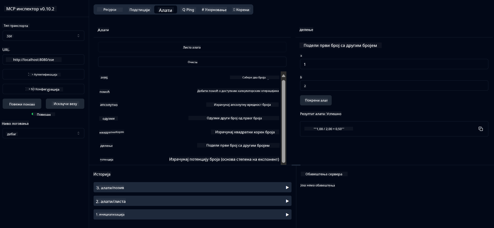

<!--
CO_OP_TRANSLATOR_METADATA:
{
  "original_hash": "dd0fdbbbebbef2b6b179ceba21d82ed2",
  "translation_date": "2025-07-17T11:53:42+00:00",
  "source_file": "03-GettingStarted/01-first-server/README.md",
  "language_code": "sr"
}
-->
# Почетак рада са MCP-ом

Добродошли у ваше прве кораке са Model Context Protocol-ом (MCP)! Без обзира да ли сте нови у MCP-у или желите да продубите своје знање, овај водич ће вас провести кроз основна подешавања и развојни процес. Открићете како MCP омогућава беспрекорну интеграцију између AI модела и апликација, и научити како брзо припремити своје окружење за креирање и тестирање решења која користе MCP.

> TLDR; Ако правите AI апликације, знате да можете додати алате и друге ресурсе вашем LLM-у (large language model) како бисте га учинили паметнијим. Међутим, ако те алате и ресурсе поставите на сервер, могућности апликације и сервера могу користити сви клијенти, са или без LLM-а.

## Преглед

Ова лекција пружа практичне смернице за подешавање MCP окружења и креирање ваших првих MCP апликација. Научићете како да подесите потребне алате и оквире, направите основне MCP сервере, креирате хост апликације и тестирате своје имплементације.

Model Context Protocol (MCP) је отворени протокол који стандардизује начин на који апликације пружају контекст LLM-овима. Замислите MCP као USB-C порт за AI апликације – пружа стандардизован начин повезивања AI модела са различитим изворима података и алатима.

## Циљеви учења

До краја ове лекције моћи ћете да:

- Подесите развојна окружења за MCP у C#, Java, Python, TypeScript и JavaScript
- Креирате и поставите основне MCP сервере са прилагођеним функцијама (ресурси, упити и алати)
- Направите хост апликације које се повезују са MCP серверима
- Тестирате и отклањате грешке у MCP имплементацијама

## Подешавање вашег MCP окружења

Пре него што почнете да радите са MCP-ом, важно је да припремите своје развојно окружење и разумете основни ток рада. Овај одељак ће вас провести кроз почетне кораке подешавања како бисте обезбедили глатак почетак рада са MCP-ом.

### Предуслови

Пре него што зароните у развој MCP-а, уверите се да имате:

- **Развојно окружење**: За изабрани језик (C#, Java, Python, TypeScript или JavaScript)
- **IDE/Уређивач**: Visual Studio, Visual Studio Code, IntelliJ, Eclipse, PyCharm или било који модеран уређивач кода
- **Пакет менаџере**: NuGet, Maven/Gradle, pip или npm/yarn
- **API кључеве**: За било које AI сервисе које планирате да користите у својим хост апликацијама

## Основна структура MCP сервера

MCP сервер обично укључује:

- **Конфигурацију сервера**: Подешавање порта, аутентификације и других опција
- **Ресурсе**: Податке и контекст доступне LLM-овима
- **Алате**: Функционалности које модели могу позивати
- **Упите**: Шаблоне за генерисање или структуирање текста

Ево поједностављеног примера у TypeScript-у:

```typescript
import { Server, Tool, Resource } from "@modelcontextprotocol/typescript-server-sdk";

// Create a new MCP server
const server = new Server({
  port: 3000,
  name: "Example MCP Server",
  version: "1.0.0"
});

// Register a tool
server.registerTool({
  name: "calculator",
  description: "Performs basic calculations",
  parameters: {
    expression: {
      type: "string",
      description: "The math expression to evaluate"
    }
  },
  handler: async (params) => {
    const result = eval(params.expression);
    return { result };
  }
});

// Start the server
server.start();
```

У претходном коду смо:

- Увезли потребне класе из MCP TypeScript SDK-а.
- Креирали и конфигурисали нову инстанцу MCP сервера.
- Регистровали прилагођени алат (`calculator`) са функцијом обраде.
- Покренули сервер да слуша долазне MCP захтеве.

## Тестирање и отклањање грешака

Пре него што почнете са тестирањем вашег MCP сервера, важно је да разумете доступне алате и најбоље праксе за отклањање грешака. Ефикасно тестирање осигурава да ваш сервер ради како се очекује и помаже вам да брзо идентификујете и решите проблеме. Следећи одељак описује препоручене приступе за валидацију ваше MCP имплементације.

MCP пружа алате који вам помажу да тестирате и отклањате грешке на серверима:

- **Inspector tool**, ова графичка интерфејс вам омогућава да се повежете на сервер и тестирате алате, упите и ресурсе.
- **curl**, такође можете да се повежете на сервер користећи командну линију као што је curl или друге клијенте који могу да креирају и извршавају HTTP команде.

### Коришћење MCP Inspector-а

[MCP Inspector](https://github.com/modelcontextprotocol/inspector) је визуелни алат за тестирање који вам помаже да:

1. **Откријете могућности сервера**: Аутоматски детектује доступне ресурсе, алате и упите
2. **Тестирате извршење алата**: Испробајте различите параметре и видите одговоре у реалном времену
3. **Погледате метаподатке сервера**: Испитајте информације о серверу, шеме и конфигурације

```bash
# ex TypeScript, installing and running MCP Inspector
npx @modelcontextprotocol/inspector node build/index.js
```

Када покренете горе наведене команде, MCP Inspector ће покренути локални веб интерфејс у вашем прегледачу. Можете очекивати да видите контролну таблу која приказује ваше регистроване MCP сервере, њихове доступне алате, ресурсе и упите. Интерфејс вам омогућава интерактивно тестирање извршења алата, преглед метаподатака сервера и приказ одговора у реалном времену, што олакшава валидацију и отклањање грешака у вашим MCP имплементацијама.

Ево снимка екрана како то може изгледати:


## Чести проблеми при подешавању и решења

| Проблем | Могуће решење |
|---------|---------------|
| Веза одбијена | Проверите да ли сервер ради и да ли је порт исправан |
| Грешке при извршењу алата | Прегледајте валидацију параметара и обраду грешака |
| Неуспех аутентификације | Проверите API кључеве и дозволе |
| Грешке валидације шеме | Уверите се да параметри одговарају дефинисаној шеми |
| Сервер се не покреће | Проверите да ли постоје конфликти портова или недостају зависности |
| CORS грешке | Конфигуришите исправне CORS заглавља за захтеве из других домена |
| Проблеми са аутентификацијом | Проверите ваљаност токена и дозволе |

## Локални развој

За локални развој и тестирање, можете покренути MCP сервере директно на свом рачунару:

1. **Покрените серверски процес**: Покрените вашу MCP сервер апликацију
2. **Конфигуришите мрежу**: Уверите се да је сервер доступан на очекиваном порту
3. **Повежите клијенте**: Користите локалне URL адресе као што је `http://localhost:3000`

```bash
# Example: Running a TypeScript MCP server locally
npm run start
# Server running at http://localhost:3000
```

## Креирање вашег првог MCP сервера

Покрили смо [Основне концепте](/01-CoreConcepts/README.md) у претходној лекцији, сада је време да то знање применимо.

### Шта сервер може да ради

Пре него што почнемо са писањем кода, подсетимо се шта сервер може да ради:

MCP сервер може, на пример:

- Приступати локалним фајловима и базама података
- Повезивати се на удаљене API-је
- Извршавати прорачуне
- Интегрисати се са другим алатима и сервисима
- Пружати кориснички интерфејс за интеракцију

Одлично, сада када знамо шта можемо да урадимо, хајде да почнемо са кодирањем.

## Вежба: Креирање сервера

Да бисте креирали сервер, потребно је да следите ове кораке:

- Инсталирајте MCP SDK.
- Креирајте пројекат и подесите структуру пројекта.
- Напишите серверски код.
- Тестирајте сервер.

### -1- Инсталирање SDK-а

Ово се мало разликује у зависности од изабраног окружења, па изаберите једно од следећих:

> [!NOTE]
> За Python, прво ћемо креирати структуру пројекта, а затим инсталирати зависности.

### TypeScript

```sh
npm install @modelcontextprotocol/sdk zod
npm install -D @types/node typescript
```

### Python

```sh
# Create project dir
mkdir calculator-server
cd calculator-server
# Open the folder in Visual Studio Code - Skip this if you are using a different IDE
code .
```

### .NET

```sh
dotnet new console -n McpCalculatorServer
cd McpCalculatorServer
```

### Java

За Java, креирајте Spring Boot пројекат:

```bash
curl https://start.spring.io/starter.zip \
  -d dependencies=web \
  -d javaVersion=21 \
  -d type=maven-project \
  -d groupId=com.example \
  -d artifactId=calculator-server \
  -d name=McpServer \
  -d packageName=com.microsoft.mcp.sample.server \
  -o calculator-server.zip
```

Распакујте zip фајл:

```bash
unzip calculator-server.zip -d calculator-server
cd calculator-server
# optional remove the unused test
rm -rf src/test/java
```

Додајте следећу комплетну конфигурацију у ваш *pom.xml* фајл:

```xml
<?xml version="1.0" encoding="UTF-8"?>
<project xmlns="http://maven.apache.org/POM/4.0.0"
    xmlns:xsi="http://www.w3.org/2001/XMLSchema-instance"
    xsi:schemaLocation="http://maven.apache.org/POM/4.0.0 http://maven.apache.org/xsd/maven-4.0.0.xsd">
    <modelVersion>4.0.0</modelVersion>
    
    <!-- Spring Boot parent for dependency management -->
    <parent>
        <groupId>org.springframework.boot</groupId>
        <artifactId>spring-boot-starter-parent</artifactId>
        <version>3.5.0</version>
        <relativePath />
    </parent>

    <!-- Project coordinates -->
    <groupId>com.example</groupId>
    <artifactId>calculator-server</artifactId>
    <version>0.0.1-SNAPSHOT</version>
    <name>Calculator Server</name>
    <description>Basic calculator MCP service for beginners</description>

    <!-- Properties -->
    <properties>
        <java.version>21</java.version>
        <maven.compiler.source>21</maven.compiler.source>
        <maven.compiler.target>21</maven.compiler.target>
    </properties>

    <!-- Spring AI BOM for version management -->
    <dependencyManagement>
        <dependencies>
            <dependency>
                <groupId>org.springframework.ai</groupId>
                <artifactId>spring-ai-bom</artifactId>
                <version>1.0.0-SNAPSHOT</version>
                <type>pom</type>
                <scope>import</scope>
            </dependency>
        </dependencies>
    </dependencyManagement>

    <!-- Dependencies -->
    <dependencies>
        <dependency>
            <groupId>org.springframework.ai</groupId>
            <artifactId>spring-ai-starter-mcp-server-webflux</artifactId>
        </dependency>
        <dependency>
            <groupId>org.springframework.boot</groupId>
            <artifactId>spring-boot-starter-actuator</artifactId>
        </dependency>
        <dependency>
         <groupId>org.springframework.boot</groupId>
         <artifactId>spring-boot-starter-test</artifactId>
         <scope>test</scope>
      </dependency>
    </dependencies>

    <!-- Build configuration -->
    <build>
        <plugins>
            <plugin>
                <groupId>org.springframework.boot</groupId>
                <artifactId>spring-boot-maven-plugin</artifactId>
            </plugin>
            <plugin>
                <groupId>org.apache.maven.plugins</groupId>
                <artifactId>maven-compiler-plugin</artifactId>
                <configuration>
                    <release>21</release>
                </configuration>
            </plugin>
        </plugins>
    </build>

    <!-- Repositories for Spring AI snapshots -->
    <repositories>
        <repository>
            <id>spring-milestones</id>
            <name>Spring Milestones</name>
            <url>https://repo.spring.io/milestone</url>
            <snapshots>
                <enabled>false</enabled>
            </snapshots>
        </repository>
        <repository>
            <id>spring-snapshots</id>
            <name>Spring Snapshots</name>
            <url>https://repo.spring.io/snapshot</url>
            <releases>
                <enabled>false</enabled>
            </releases>
        </repository>
    </repositories>
</project>
```

### TypeScript

```sh
mkdir src
npm install -y
```

### Python

```sh
# Create a virtual env and install dependencies
python -m venv venv
venv\Scripts\activate
pip install "mcp[cli]"
```

### Java

```bash
cd calculator-server
./mvnw clean install -DskipTests
```

### TypeScript

Креирајте *package.json* са следећим садржајем:

```json
{
   "type": "module",
   "bin": {
     "weather": "./build/index.js"
   },
   "scripts": {
     "build": "tsc && node build/index.js"
   },
   "files": [
     "build"
   ]
}
```

Креирајте *tsconfig.json* са следећим садржајем:

```json
{
  "compilerOptions": {
    "target": "ES2022",
    "module": "Node16",
    "moduleResolution": "Node16",
    "outDir": "./build",
    "rootDir": "./src",
    "strict": true,
    "esModuleInterop": true,
    "skipLibCheck": true,
    "forceConsistentCasingInFileNames": true
  },
  "include": ["src/**/*"],
  "exclude": ["node_modules"]
}
```

### Python

Креирајте фајл *server.py*
```sh
touch server.py
```

### .NET

Инсталирајте потребне NuGet пакете:

```sh
dotnet add package ModelContextProtocol --prerelease
dotnet add package Microsoft.Extensions.Hosting
```

### Java

За Java Spring Boot пројекте, структура пројекта се креира аутоматски.

### TypeScript

Креирајте фајл *index.ts* и додајте следећи код:

```typescript
import { McpServer, ResourceTemplate } from "@modelcontextprotocol/sdk/server/mcp.js";
import { StdioServerTransport } from "@modelcontextprotocol/sdk/server/stdio.js";
import { z } from "zod";
 
// Create an MCP server
const server = new McpServer({
  name: "Demo",
  version: "1.0.0"
});
```

Сада имате сервер, али он не ради много, хајде да то поправимо.

### Python

```python
# server.py
from mcp.server.fastmcp import FastMCP

# Create an MCP server
mcp = FastMCP("Demo")
```

### .NET

```csharp
using Microsoft.Extensions.DependencyInjection;
using Microsoft.Extensions.Hosting;
using Microsoft.Extensions.Logging;
using ModelContextProtocol.Server;
using System.ComponentModel;

var builder = Host.CreateApplicationBuilder(args);
builder.Logging.AddConsole(consoleLogOptions =>
{
    // Configure all logs to go to stderr
    consoleLogOptions.LogToStandardErrorThreshold = LogLevel.Trace;
});

builder.Services
    .AddMcpServer()
    .WithStdioServerTransport()
    .WithToolsFromAssembly();
await builder.Build().RunAsync();

// add features
```

### Java

За Java, креирајте основне серверске компоненте. Прво, измените главну апликациону класу:

*src/main/java/com/microsoft/mcp/sample/server/McpServerApplication.java*:

```java
package com.microsoft.mcp.sample.server;

import org.springframework.ai.tool.ToolCallbackProvider;
import org.springframework.ai.tool.method.MethodToolCallbackProvider;
import org.springframework.boot.SpringApplication;
import org.springframework.boot.autoconfigure.SpringBootApplication;
import org.springframework.context.annotation.Bean;
import com.microsoft.mcp.sample.server.service.CalculatorService;

@SpringBootApplication
public class McpServerApplication {

    public static void main(String[] args) {
        SpringApplication.run(McpServerApplication.class, args);
    }
    
    @Bean
    public ToolCallbackProvider calculatorTools(CalculatorService calculator) {
        return MethodToolCallbackProvider.builder().toolObjects(calculator).build();
    }
}
```

Креирајте сервис калкулатора *src/main/java/com/microsoft/mcp/sample/server/service/CalculatorService.java*:

```java
package com.microsoft.mcp.sample.server.service;

import org.springframework.ai.tool.annotation.Tool;
import org.springframework.stereotype.Service;

/**
 * Service for basic calculator operations.
 * This service provides simple calculator functionality through MCP.
 */
@Service
public class CalculatorService {

    /**
     * Add two numbers
     * @param a The first number
     * @param b The second number
     * @return The sum of the two numbers
     */
    @Tool(description = "Add two numbers together")
    public String add(double a, double b) {
        double result = a + b;
        return formatResult(a, "+", b, result);
    }

    /**
     * Subtract one number from another
     * @param a The number to subtract from
     * @param b The number to subtract
     * @return The result of the subtraction
     */
    @Tool(description = "Subtract the second number from the first number")
    public String subtract(double a, double b) {
        double result = a - b;
        return formatResult(a, "-", b, result);
    }

    /**
     * Multiply two numbers
     * @param a The first number
     * @param b The second number
     * @return The product of the two numbers
     */
    @Tool(description = "Multiply two numbers together")
    public String multiply(double a, double b) {
        double result = a * b;
        return formatResult(a, "*", b, result);
    }

    /**
     * Divide one number by another
     * @param a The numerator
     * @param b The denominator
     * @return The result of the division
     */
    @Tool(description = "Divide the first number by the second number")
    public String divide(double a, double b) {
        if (b == 0) {
            return "Error: Cannot divide by zero";
        }
        double result = a / b;
        return formatResult(a, "/", b, result);
    }

    /**
     * Calculate the power of a number
     * @param base The base number
     * @param exponent The exponent
     * @return The result of raising the base to the exponent
     */
    @Tool(description = "Calculate the power of a number (base raised to an exponent)")
    public String power(double base, double exponent) {
        double result = Math.pow(base, exponent);
        return formatResult(base, "^", exponent, result);
    }

    /**
     * Calculate the square root of a number
     * @param number The number to find the square root of
     * @return The square root of the number
     */
    @Tool(description = "Calculate the square root of a number")
    public String squareRoot(double number) {
        if (number < 0) {
            return "Error: Cannot calculate square root of a negative number";
        }
        double result = Math.sqrt(number);
        return String.format("√%.2f = %.2f", number, result);
    }

    /**
     * Calculate the modulus (remainder) of division
     * @param a The dividend
     * @param b The divisor
     * @return The remainder of the division
     */
    @Tool(description = "Calculate the remainder when one number is divided by another")
    public String modulus(double a, double b) {
        if (b == 0) {
            return "Error: Cannot divide by zero";
        }
        double result = a % b;
        return formatResult(a, "%", b, result);
    }

    /**
     * Calculate the absolute value of a number
     * @param number The number to find the absolute value of
     * @return The absolute value of the number
     */
    @Tool(description = "Calculate the absolute value of a number")
    public String absolute(double number) {
        double result = Math.abs(number);
        return String.format("|%.2f| = %.2f", number, result);
    }

    /**
     * Get help about available calculator operations
     * @return Information about available operations
     */
    @Tool(description = "Get help about available calculator operations")
    public String help() {
        return "Basic Calculator MCP Service\n\n" +
               "Available operations:\n" +
               "1. add(a, b) - Adds two numbers\n" +
               "2. subtract(a, b) - Subtracts the second number from the first\n" +
               "3. multiply(a, b) - Multiplies two numbers\n" +
               "4. divide(a, b) - Divides the first number by the second\n" +
               "5. power(base, exponent) - Raises a number to a power\n" +
               "6. squareRoot(number) - Calculates the square root\n" + 
               "7. modulus(a, b) - Calculates the remainder of division\n" +
               "8. absolute(number) - Calculates the absolute value\n\n" +
               "Example usage: add(5, 3) will return 5 + 3 = 8";
    }

    /**
     * Format the result of a calculation
     */
    private String formatResult(double a, String operator, double b, double result) {
        return String.format("%.2f %s %.2f = %.2f", a, operator, b, result);
    }
}
```

**Опционе компоненте за сервис спреман за продукцију:**

Креирајте стартуп конфигурацију *src/main/java/com/microsoft/mcp/sample/server/config/StartupConfig.java*:

```java
package com.microsoft.mcp.sample.server.config;

import org.springframework.boot.CommandLineRunner;
import org.springframework.context.annotation.Bean;
import org.springframework.context.annotation.Configuration;

@Configuration
public class StartupConfig {
    
    @Bean
    public CommandLineRunner startupInfo() {
        return args -> {
            System.out.println("\n" + "=".repeat(60));
            System.out.println("Calculator MCP Server is starting...");
            System.out.println("SSE endpoint: http://localhost:8080/sse");
            System.out.println("Health check: http://localhost:8080/actuator/health");
            System.out.println("=".repeat(60) + "\n");
        };
    }
}
```

Креирајте контролер здравља *src/main/java/com/microsoft/mcp/sample/server/controller/HealthController.java*:

```java
package com.microsoft.mcp.sample.server.controller;

import org.springframework.http.ResponseEntity;
import org.springframework.web.bind.annotation.GetMapping;
import org.springframework.web.bind.annotation.RestController;
import java.time.LocalDateTime;
import java.util.HashMap;
import java.util.Map;

@RestController
public class HealthController {
    
    @GetMapping("/health")
    public ResponseEntity<Map<String, Object>> healthCheck() {
        Map<String, Object> response = new HashMap<>();
        response.put("status", "UP");
        response.put("timestamp", LocalDateTime.now().toString());
        response.put("service", "Calculator MCP Server");
        return ResponseEntity.ok(response);
    }
}
```

Креирајте обрађивач изузетака *src/main/java/com/microsoft/mcp/sample/server/exception/GlobalExceptionHandler.java*:

```java
package com.microsoft.mcp.sample.server.exception;

import org.springframework.http.HttpStatus;
import org.springframework.http.ResponseEntity;
import org.springframework.web.bind.annotation.ExceptionHandler;
import org.springframework.web.bind.annotation.RestControllerAdvice;

@RestControllerAdvice
public class GlobalExceptionHandler {

    @ExceptionHandler(IllegalArgumentException.class)
    public ResponseEntity<ErrorResponse> handleIllegalArgumentException(IllegalArgumentException ex) {
        ErrorResponse error = new ErrorResponse(
            "Invalid_Input", 
            "Invalid input parameter: " + ex.getMessage());
        return new ResponseEntity<>(error, HttpStatus.BAD_REQUEST);
    }

    public static class ErrorResponse {
        private String code;
        private String message;

        public ErrorResponse(String code, String message) {
            this.code = code;
            this.message = message;
        }

        // Getters
        public String getCode() { return code; }
        public String getMessage() { return message; }
    }
}
```

Креирајте прилагођени банер *src/main/resources/banner.txt*:

```text
_____      _            _       _             
 / ____|    | |          | |     | |            
| |     __ _| | ___ _   _| | __ _| |_ ___  _ __ 
| |    / _` | |/ __| | | | |/ _` | __/ _ \| '__|
| |___| (_| | | (__| |_| | | (_| | || (_) | |   
 \_____\__,_|_|\___|\__,_|_|\__,_|\__\___/|_|   
                                                
Calculator MCP Server v1.0
Spring Boot MCP Application
```

</details>

### -5- Додавање алата и ресурса

Додајте алат и ресурс додавањем следећег кода:

### TypeScript

```typescript
  server.tool("add",
  { a: z.number(), b: z.number() },
  async ({ a, b }) => ({
    content: [{ type: "text", text: String(a + b) }]
  })
);

server.resource(
  "greeting",
  new ResourceTemplate("greeting://{name}", { list: undefined }),
  async (uri, { name }) => ({
    contents: [{
      uri: uri.href,
      text: `Hello, ${name}!`
    }]
  })
);
```

Ваш алат прима параметре `a` и `b` и извршава функцију која производи одговор у облику:

```typescript
{
  contents: [{
    type: "text", content: "some content"
  }]
}
```

Ваш ресурс се приступа преко стринга "greeting", прима параметар `name` и производи сличан одговор као алат:

```typescript
{
  uri: "<href>",
  text: "a text"
}
```

### Python

```python
# Add an addition tool
@mcp.tool()
def add(a: int, b: int) -> int:
    """Add two numbers"""
    return a + b


# Add a dynamic greeting resource
@mcp.resource("greeting://{name}")
def get_greeting(name: str) -> str:
    """Get a personalized greeting"""
    return f"Hello, {name}!"
```

У претходном коду смо:

- Дефинисали алат `add` који прима параметре `a` и `p`, оба целобројна.
- Креирали ресурс под називом `greeting` који прима параметар `name`.

### .NET

Додајте ово у ваш Program.cs фајл:

```csharp
[McpServerToolType]
public static class CalculatorTool
{
    [McpServerTool, Description("Adds two numbers")]
    public static string Add(int a, int b) => $"Sum {a + b}";
}
```

### Java

Алатке су већ креиране у претходном кораку.

### -6 Коначни код

Додајмо последњи код који је потребан да сервер може да се покрене:

### TypeScript

```typescript
// Start receiving messages on stdin and sending messages on stdout
const transport = new StdioServerTransport();
await server.connect(transport);
```

Ево комплетног кода:

```typescript
// index.ts
import { McpServer, ResourceTemplate } from "@modelcontextprotocol/sdk/server/mcp.js";
import { StdioServerTransport } from "@modelcontextprotocol/sdk/server/stdio.js";
import { z } from "zod";

// Create an MCP server
const server = new McpServer({
  name: "Demo",
  version: "1.0.0"
});

// Add an addition tool
server.tool("add",
  { a: z.number(), b: z.number() },
  async ({ a, b }) => ({
    content: [{ type: "text", text: String(a + b) }]
  })
);

// Add a dynamic greeting resource
server.resource(
  "greeting",
  new ResourceTemplate("greeting://{name}", { list: undefined }),
  async (uri, { name }) => ({
    contents: [{
      uri: uri.href,
      text: `Hello, ${name}!`
    }]
  })
);

// Start receiving messages on stdin and sending messages on stdout
const transport = new StdioServerTransport();
await server.connect(transport);
```

### Python

```python
# server.py
from mcp.server.fastmcp import FastMCP

# Create an MCP server
mcp = FastMCP("Demo")


# Add an addition tool
@mcp.tool()
def add(a: int, b: int) -> int:
    """Add two numbers"""
    return a + b


# Add a dynamic greeting resource
@mcp.resource("greeting://{name}")
def get_greeting(name: str) -> str:
    """Get a personalized greeting"""
    return f"Hello, {name}!"

# Main execution block - this is required to run the server
if __name__ == "__main__":
    mcp.run()
```

### .NET

Креирајте Program.cs фајл са следећим садржајем:

```csharp
using Microsoft.Extensions.DependencyInjection;
using Microsoft.Extensions.Hosting;
using Microsoft.Extensions.Logging;
using ModelContextProtocol.Server;
using System.ComponentModel;

var builder = Host.CreateApplicationBuilder(args);
builder.Logging.AddConsole(consoleLogOptions =>
{
    // Configure all logs to go to stderr
    consoleLogOptions.LogToStandardErrorThreshold = LogLevel.Trace;
});

builder.Services
    .AddMcpServer()
    .WithStdioServerTransport()
    .WithToolsFromAssembly();
await builder.Build().RunAsync();

[McpServerToolType]
public static class CalculatorTool
{
    [McpServerTool, Description("Adds two numbers")]
    public static string Add(int a, int b) => $"Sum {a + b}";
}
```

### Java

Ваша комплетна главна апликациона класа треба да изгледа овако:

```java
// McpServerApplication.java
package com.microsoft.mcp.sample.server;

import org.springframework.ai.tool.ToolCallbackProvider;
import org.springframework.ai.tool.method.MethodToolCallbackProvider;
import org.springframework.boot.SpringApplication;
import org.springframework.boot.autoconfigure.SpringBootApplication;
import org.springframework.context.annotation.Bean;
import com.microsoft.mcp.sample.server.service.CalculatorService;

@SpringBootApplication
public class McpServerApplication {

    public static void main(String[] args) {
        SpringApplication.run(McpServerApplication.class, args);
    }
    
    @Bean
    public ToolCallbackProvider calculatorTools(CalculatorService calculator) {
        return MethodToolCallbackProvider.builder().toolObjects(calculator).build();
    }
}
```

### -7- Тестирање сервера

Покрените сервер следећом командом:

### TypeScript

```sh
npm run build
```

### Python

```sh
mcp run server.py
```

> Да бисте користили MCP Inspector, користите `mcp dev server.py` који аутоматски покреће Inspector и обезбеђује потребан proxy session token. Ако користите `mcp run server.py`, мораћете ручно да покренете Inspector и конфигуришете везу.

### .NET

Уверите се да сте у директоријуму пројекта:

```sh
cd McpCalculatorServer
dotnet run
```

### Java

```bash
./mvnw clean install -DskipTests
java -jar target/calculator-server-0.0.1-SNAPSHOT.jar
```

### -8- Покретање помоћу инспектора

Inspector је одличан алат који може да покрене ваш сервер и омогућава вам интеракцију са њим како бисте тестирали да ли ради. Хајде да га покренемо:

> [!NOTE]
> Можда ће изгледати другачије у пољу "command" јер садржи команду за покретање сервера са вашим специфичним окружењем.

### TypeScript

```sh
npx @modelcontextprotocol/inspector node build/index.js
```

Или га додајте у ваш *package.json* овако: `"inspector": "npx @modelcontextprotocol/inspector node build/index.js"` и онда покрените `npm run inspect`

Python користи Node.js алат који се зове inspector. Могуће је позвати тај алат овако:

```sh
mcp dev server.py
```

Међутим, он не имплементира све методе доступне на алату, па се препоручује да директно покренете Node.js алат као у наставку:

```sh
npx @modelcontextprotocol/inspector mcp run server.py
```  
Ако користите алат или IDE који вам омогућава да конфигуришете команде и аргументе за покретање скрипти,  
обавезно подесите `python` у пољу `Command` и `server.py` као `Arguments`. Ово осигурава да скрипта ради исправно.

### .NET

Уверите се да сте у директоријуму пројекта:

```sh
cd McpCalculatorServer
npx @modelcontextprotocol/inspector dotnet run
```

### Java

Уверите се да ваш calculator сервер ради  
Покрените инспектор:

```cmd
npx @modelcontextprotocol/inspector
```

У веб интерфејсу инспектора:

1. Изаберите "SSE" као тип транспорта
2. Подесите URL на: `http://localhost:8080/sse`
3. Кликните на "Connect"



**Сада сте повезани са сервером**  
**Секција за тестирање Java сервера је сада завршена**

Следећи одељак говори о интеракцији са сервером.

Требало би да видите следећи кориснички интерфејс:


1. Повежите се на сервер кликом на дугме Connect  
  Када се повежете, требало би да видите следеће:

  

1. Изаберите "Tools" и "listTools", требало би да се појави "Add", изаберите "Add" и унесите вредности параметара.

  Требало би да видите следећи одговор, односно резултат из алата "add":

  

Честитамо, успели сте да креирате и покренете свој први сервер!

### Званични SDK-ови

MCP пружа званичне SDK-ове за више језика:

- [C# SDK](https://github.com/modelcontextprotocol/csharp-sdk) - Одржава се у сарадњи са Microsoft-ом
- [Java SDK](https://github.com/modelcontextprotocol/java-sdk) - Одржава се у сарадњи са Spring AI
- [
- [Swift SDK](https://github.com/modelcontextprotocol/swift-sdk) - Одржава се у сарадњи са Loopwork AI
- [Rust SDK](https://github.com/modelcontextprotocol/rust-sdk) - Званична Rust имплементација

## Кључне појединости

- Постављање MCP развојног окружења је једноставно уз SDK-ове специфичне за језик
- Изградња MCP сервера подразумева креирање и регистрацију алата са јасним шемама
- Тестирање и отклањање грешака су неопходни за поуздане MCP имплементације

## Примери

- [Java калкулатор](../samples/java/calculator/README.md)
- [.Net калкулатор](../../../../03-GettingStarted/samples/csharp)
- [JavaScript калкулатор](../samples/javascript/README.md)
- [TypeScript калкулатор](../samples/typescript/README.md)
- [Python калкулатор](../../../../03-GettingStarted/samples/python)

## Задатак

Направите једноставан MCP сервер са алатом по вашем избору:

1. Имплементирајте алат у жељеном језику (.NET, Java, Python или JavaScript).
2. Дефинишите улазне параметре и повратне вредности.
3. Покрените инспектор алат да бисте проверили да ли сервер ради како треба.
4. Тестирајте имплементацију са различитим улазима.

## Решење

[Решење](./solution/README.md)

## Додатни ресурси

- [Изградња агената користећи Model Context Protocol на Azure](https://learn.microsoft.com/azure/developer/ai/intro-agents-mcp)
- [Ремоте MCP са Azure Container Apps (Node.js/TypeScript/JavaScript)](https://learn.microsoft.com/samples/azure-samples/mcp-container-ts/mcp-container-ts/)
- [.NET OpenAI MCP агент](https://learn.microsoft.com/samples/azure-samples/openai-mcp-agent-dotnet/openai-mcp-agent-dotnet/)

## Шта следи

Следеће: [Почетак рада са MCP клијентима](../02-client/README.md)

**Одрицање од одговорности**:  
Овај документ је преведен коришћењем AI преводилачке услуге [Co-op Translator](https://github.com/Azure/co-op-translator). Иако се трудимо да превод буде тачан, молимо вас да имате у виду да аутоматски преводи могу садржати грешке или нетачности. Оригинални документ на његовом изворном језику треба сматрати ауторитетним извором. За критичне информације препоручује се професионални људски превод. Нисмо одговорни за било каква неспоразума или погрешна тумачења која произилазе из коришћења овог превода.