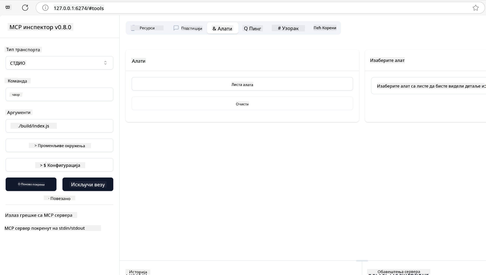
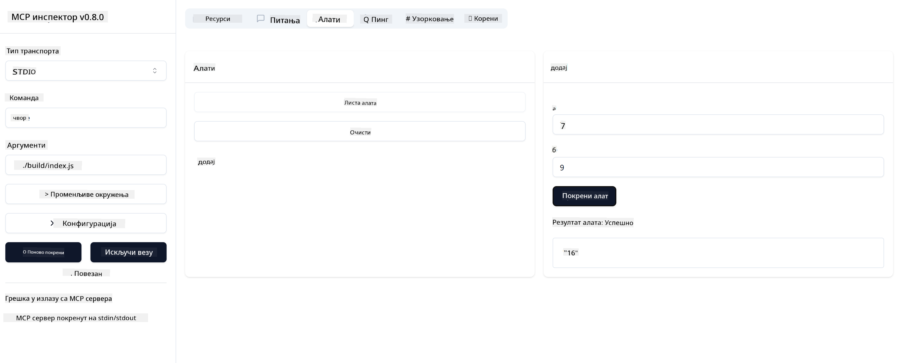

<!--
CO_OP_TRANSLATOR_METADATA:
{
  "original_hash": "e650db55873b456296a9c620069e2f71",
  "translation_date": "2025-06-02T11:17:42+00:00",
  "source_file": "03-GettingStarted/01-first-server/README.md",
  "language_code": "sr"
}
-->
### -2- Kreirajte projekat

Sada kada imate instaliran SDK, sledeći korak je da kreirate projekat:

### -3- Kreirajte fajlove projekta

### -4- Kreirajte kod servera

### -5- Dodavanje alata i resursa

Dodajte alat i resurs tako što ćete ubaciti sledeći kod:

### -6 Završni kod

Dodajmo poslednji deo koda koji je potreban da bi server mogao da se pokrene:

### -7- Testirajte server

Pokrenite server sledećom komandom:

### -8- Pokretanje koristeći inspector

Inspector je sjajan alat koji može da pokrene vaš server i omogući vam interakciju sa njim kako biste testirali da li radi. Hajde da ga pokrenemo:

> [!NOTE]
> Može izgledati drugačije u polju "command" jer sadrži komandu za pokretanje servera sa vašim specifičnim runtime-om.

Treba da vidite sledeći korisnički interfejs:

1. Povežite se sa serverom klikom na dugme Connect  
   Kada se povežete sa serverom, trebalo bi da vidite sledeće:

   

2. Izaberite "Tools" i zatim "listTools", trebalo bi da se pojavi opcija "Add". Izaberite "Add" i popunite vrednosti parametara.

   Trebalo bi da dobijete sledeći odgovor, tj. rezultat sa alata "add":

   

Čestitamo, uspešno ste kreirali i pokrenuli svoj prvi server!

### Zvanični SDK-ovi

MCP pruža zvanične SDK-ove za više programskih jezika:
- [C# SDK](https://github.com/modelcontextprotocol/csharp-sdk) - Održava se u saradnji sa Microsoft-om
- [Java SDK](https://github.com/modelcontextprotocol/java-sdk) - Održava se u saradnji sa Spring AI
- [TypeScript SDK](https://github.com/modelcontextprotocol/typescript-sdk) - Zvanična TypeScript implementacija
- [Python SDK](https://github.com/modelcontextprotocol/python-sdk) - Zvanična Python implementacija
- [Kotlin SDK](https://github.com/modelcontextprotocol/kotlin-sdk) - Zvanična Kotlin implementacija
- [Swift SDK](https://github.com/modelcontextprotocol/swift-sdk) - Održava se u saradnji sa Loopwork AI
- [Rust SDK](https://github.com/modelcontextprotocol/rust-sdk) - Zvanična Rust implementacija

## Ključni zaključci

- Postavljanje MCP razvojne okoline je jednostavno uz SDK-ove specifične za jezik
- Izgradnja MCP servera podrazumeva kreiranje i registrovanje alata sa jasno definisanim šemama
- Testiranje i otklanjanje grešaka su neophodni za pouzdane MCP implementacije

## Primeri

- [Java Kalkulator](../samples/java/calculator/README.md)
- [.Net Kalkulator](../../../../03-GettingStarted/samples/csharp)
- [JavaScript Kalkulator](../samples/javascript/README.md)
- [TypeScript Kalkulator](../samples/typescript/README.md)
- [Python Kalkulator](../../../../03-GettingStarted/samples/python)

## Zadatak

Kreirajte jednostavan MCP server sa alatom po vašem izboru:
1. Implementirajte alat u jeziku koji preferirate (.NET, Java, Python ili JavaScript).
2. Definišite ulazne parametre i vrednosti koje se vraćaju.
3. Pokrenite alat inspector da biste proverili da li server radi kako treba.
4. Testirajte implementaciju sa različitim ulazima.

## Rešenje

[Rešenje](./solution/README.md)

## Dodatni resursi

- [MCP GitHub repozitorijum](https://github.com/microsoft/mcp-for-beginners)

## Šta sledi

Sledeće: [Uvod u MCP klijente](/03-GettingStarted/02-client/README.md)

**Odricanje od odgovornosti**:  
Ovaj dokument je preveden korišćenjem AI servisa za prevođenje [Co-op Translator](https://github.com/Azure/co-op-translator). Iako težimo tačnosti, imajte na umu da automatski prevodi mogu sadržavati greške ili netačnosti. Originalni dokument na izvornom jeziku treba smatrati zvaničnim izvorom. Za važne informacije preporučuje se profesionalni ljudski prevod. Ne snosimo odgovornost za bilo kakva nesporazumevanja ili pogrešna tumačenja koja proizilaze iz korišćenja ovog prevoda.