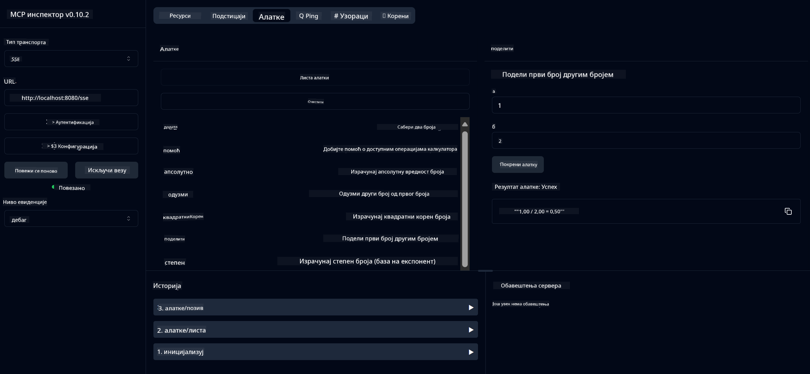

<!--
CO_OP_TRANSLATOR_METADATA:
{
  "original_hash": "ed9cab32cc67c12d8969b407aa47100a",
  "translation_date": "2025-07-13T17:56:48+00:00",
  "source_file": "03-GettingStarted/01-first-server/solution/java/README.md",
  "language_code": "sr"
}
-->
# Основна калкулатор MCP услуга

Ова услуга пружа основне калкулаторске операције преко Model Context Protocol (MCP) користећи Spring Boot са WebFlux транспортом. Дизајнирана је као једноставан пример за почетнике који уче о MCP имплементацијама.

За више информација, погледајте [MCP Server Boot Starter](https://docs.spring.io/spring-ai/reference/api/mcp/mcp-server-boot-starter-docs.html) референтну документацију.


## Коришћење услуге

Услуга излаже следеће API крајње тачке преко MCP протокола:

- `add(a, b)`: Сабери два броја
- `subtract(a, b)`: Одузми други број од првог
- `multiply(a, b)`: Помножи два броја
- `divide(a, b)`: Подели први број са другим (са провером на нулу)
- `power(base, exponent)`: Израчунај степен броја
- `squareRoot(number)`: Израчунај квадратни корен (са провером на негативан број)
- `modulus(a, b)`: Израчунај остатак при дељењу
- `absolute(number)`: Израчунај апсолутну вредност

## Зависности

Пројекат захтева следеће кључне зависности:

```xml
<dependency>
    <groupId>org.springframework.ai</groupId>
    <artifactId>spring-ai-starter-mcp-server-webflux</artifactId>
</dependency>
```

## Изградња пројекта

Изгради пројекат користећи Maven:
```bash
./mvnw clean install -DskipTests
```

## Покретање сервера

### Коришћење Јаве

```bash
java -jar target/calculator-server-0.0.1-SNAPSHOT.jar
```

### Коришћење MCP Inspector-а

MCP Inspector је користан алат за интеракцију са MCP услугама. Да бисте га користили са овом калкулаторском услугом:

1. **Инсталирајте и покрените MCP Inspector** у новом терминал прозору:
   ```bash
   npx @modelcontextprotocol/inspector
   ```

2. **Приступите веб интерфејсу** кликом на URL који апликација приказује (обично http://localhost:6274)

3. **Конфигуришите везу**:
   - Поставите тип транспорта на "SSE"
   - Поставите URL на SSE крајњу тачку вашег сервера: `http://localhost:8080/sse`
   - Кликните "Connect"

4. **Користите алате**:
   - Кликните "List Tools" да видите доступне калкулаторске операције
   - Изаберите алат и кликните "Run Tool" да извршите операцију



**Одрицање од одговорности**:  
Овај документ је преведен коришћењем AI сервиса за превођење [Co-op Translator](https://github.com/Azure/co-op-translator). Иако тежимо прецизности, молимо вас да имате у виду да аутоматски преводи могу садржати грешке или нетачности. Оригинални документ на његовом изворном језику треба сматрати ауторитетним извором. За критичне информације препоручује се професионални људски превод. Нисмо одговорни за било каква неспоразума или погрешна тумачења која произилазе из коришћења овог превода.