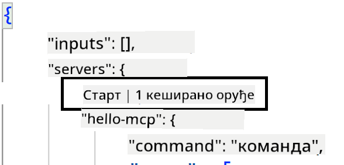
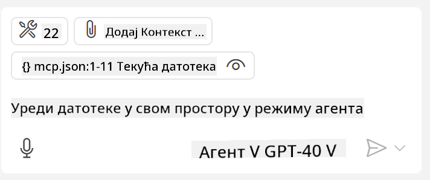

<!--
CO_OP_TRANSLATOR_METADATA:
{
  "original_hash": "c37fabfbc0dcbc9a4afb6d17e7d3be9f",
  "translation_date": "2025-05-17T11:16:48+00:00",
  "source_file": "03-GettingStarted/04-vscode/README.md",
  "language_code": "sr"
}
-->
Hajde da pričamo više o tome kako koristimo vizuelni interfejs u narednim sekcijama.

## Pristup

Evo kako treba da pristupimo ovome na visokom nivou:

- Konfigurišemo fajl da pronađemo naš MCP Server.
- Pokrenemo/Povežemo se sa tim serverom da bismo videli listu njegovih mogućnosti.
- Koristimo te mogućnosti kroz GitHub Copilotov interfejs za ćaskanje.

Odlično, sada kada razumemo tok, hajde da pokušamo da koristimo MCP Server kroz Visual Studio Code kroz vežbu.

## Vežba: Konsumiranje servera

U ovoj vežbi ćemo konfigurisati Visual Studio Code da pronađe vaš MCP server kako bi mogao da se koristi iz GitHub Copilotovog interfejsa za ćaskanje.

### -0- Prekorak, omogućite otkrivanje MCP Servera

Možda ćete morati da omogućite otkrivanje MCP Servera.

1. Idite na `File -> Preferences -> Settings` in Visual Studio Code.

1. Search for "MCP" and enable `chat.mcp.discovery.enabled` u fajlu settings.json.

### -1- Kreirajte konfiguracioni fajl

Počnite kreiranjem konfiguracionog fajla u korenu vašeg projekta, trebaće vam fajl nazvan MCP.json i da ga postavite u folder nazvan .vscode. Trebalo bi da izgleda ovako:

```text
.vscode
|-- mcp.json
```

Zatim, hajde da vidimo kako možemo dodati unos servera.

### -2- Konfigurišite server

Dodajte sledeći sadržaj u *mcp.json*:

```json
{
    "inputs": [],
    "servers": {
       "hello-mcp": {
           "command": "cmd",
           "args": [
               "/c", "node", "<absolute path>\\build\\index.js"
           ]
       }
    }
}
```

Evo jednostavnog primera kako pokrenuti server napisan u Node.js, za druge okruženja navedite odgovarajuću komandu za pokretanje servera koristeći `command` and `args`.

### -3- Pokrenite server

Sada kada ste dodali unos, hajde da pokrenemo server:

1. Pronađite svoj unos u *mcp.json* i uverite se da vidite ikonu "play":

    

1. Kliknite na ikonu "play", trebalo bi da vidite da se ikona alata u GitHub Copilotovom ćaskanju povećava broj dostupnih alata. Ako kliknete na tu ikonu alata, videćete listu registrovanih alata. Možete označiti/odznačiti svaki alat u zavisnosti od toga da li želite da GitHub Copilot koristi njih kao kontekst:

  

1. Da pokrenete alat, unesite prompt za koji znate da će odgovarati opisu jednog od vaših alata, na primer prompt poput "dodaj 22 na 1":

  

  Trebalo bi da vidite odgovor koji kaže 23.

## Zadatak

Pokušajte dodati unos servera u vaš *mcp.json* fajl i uverite se da možete pokrenuti/zaustaviti server. Uverite se da možete komunicirati sa alatima na vašem serveru preko GitHub Copilotovog interfejsa za ćaskanje.

## Rešenje

[Rešenje](./solution/README.md)

## Ključne tačke

Ključne tačke iz ovog poglavlja su sledeće:

- Visual Studio Code je odličan klijent koji vam omogućava da koristite nekoliko MCP Servera i njihovih alata.
- GitHub Copilotov interfejs za ćaskanje je način na koji komunicirate sa serverima.
- Možete tražiti od korisnika unos kao što su API ključevi koji se mogu proslediti MCP Serveru prilikom konfigurisanja unosa servera u *mcp.json* fajlu.

## Primeri

- [Java Kalkulator](../samples/java/calculator/README.md)
- [.Net Kalkulator](../../../../03-GettingStarted/samples/csharp)
- [JavaScript Kalkulator](../samples/javascript/README.md)
- [TypeScript Kalkulator](../samples/typescript/README.md)
- [Python Kalkulator](../../../../03-GettingStarted/samples/python) 

## Dodatni resursi

- [Visual Studio dokumentacija](https://code.visualstudio.com/docs/copilot/chat/mcp-servers)

## Šta je sledeće

- Sledeće: [Kreiranje SSE Servera](/03-GettingStarted/05-sse-server/README.md)

**Одрицање од одговорности**:  
Овај документ је преведен коришћењем услуге вештачке интелигенције [Co-op Translator](https://github.com/Azure/co-op-translator). Иако тежимо тачности, молимо вас да будете свесни да аутоматски преводи могу садржати грешке или нетачности. Оригинални документ на његовом изворном језику треба сматрати ауторитативним извором. За критичне информације, препоручује се професионални превод од стране људи. Не сносимо одговорност за било каква неразумевања или погрешна тумачења која проистичу из употребе овог превода.