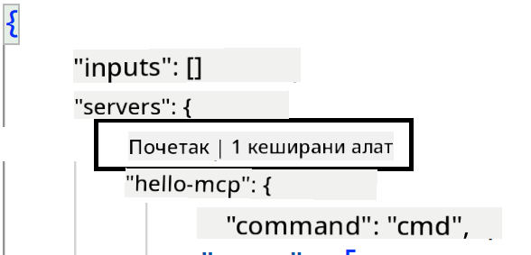
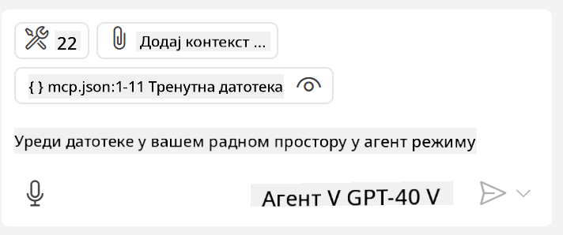
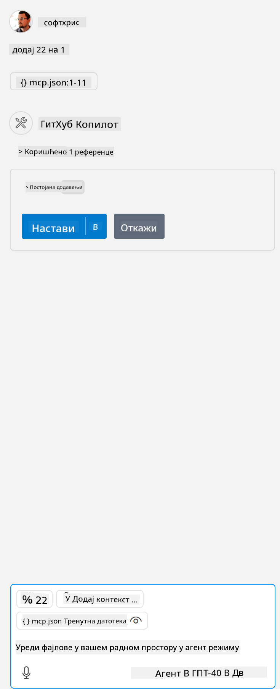

<!--
CO_OP_TRANSLATOR_METADATA:
{
  "original_hash": "54e9ffc5dba01afcb8880a9949fd1881",
  "translation_date": "2025-07-13T19:36:17+00:00",
  "source_file": "03-GettingStarted/04-vscode/README.md",
  "language_code": "sr"
}
-->
Хајде даље разговарамо о томе како користимо визуелни интерфејс у наредним одељцима.

## Приступ

Ево како треба да приступимо овоме на високом нивоу:

- Конфигурисати фајл да пронађе наш MCP сервер.
- Покренути/Повезати се са тим сервером да бисмо добили листу његових могућности.
- Користити те могућности преко GitHub Copilot Chat интерфејса.

Одлично, сада када разумемо ток, хајде да покушамо да користимо MCP сервер кроз Visual Studio Code у једној вежби.

## Вежба: Коришћење сервера

У овој вежби ћемо конфигурисати Visual Studio Code да пронађе ваш MCP сервер како би могао да се користи из GitHub Copilot Chat интерфејса.

### -0- Претходни корак, омогућити откривање MCP сервера

Можда ћете морати да омогућите откривање MCP сервера.

1. Идите на `File -> Preferences -> Settings` у Visual Studio Code-у.

1. Потражите „MCP“ и омогућите `chat.mcp.discovery.enabled` у фајлу settings.json.

### -1- Креирање конфигурационог фајла

Почните тако што ћете креирати конфигурациони фајл у корену вашег пројекта, потребан вам је фајл под називом MCP.json који треба да ставите у фасциклу .vscode. Требало би да изгледа овако:

```text
.vscode
|-- mcp.json
```

Следеће, хајде да видимо како можемо додати унос за сервер.

### -2- Конфигурисање сервера

Додајте следећи садржај у *mcp.json*:

```json
{
    "inputs": [],
    "servers": {
       "hello-mcp": {
           "command": "node",
           "args": [
               "build/index.js"
           ]
       }
    }
}
```

Горе је једноставан пример како покренути сервер написан у Node.js, за друге окружења наведите одговарајућу команду за покретање сервера користећи `command` и `args`.

### -3- Покретање сервера

Сада када сте додали унос, хајде да покренемо сервер:

1. Пронађите свој унос у *mcp.json* и уверите се да видите икону „play“:

    

1. Кликните на икону „play“, требало би да видите како икона алата у GitHub Copilot Chat повећава број доступних алата. Ако кликнете на ту икону алата, видећете листу регистрованих алата. Можете означити/одзначити сваки алат у зависности од тога да ли желите да GitHub Copilot користи те алате као контекст:

  

1. Да бисте покренули алат, укуцајте упит који знате да одговара опису неког од ваших алата, на пример упит као „add 22 to 1“:

  

  Требало би да добијете одговор 23.

## Задатак

Покушајте да додате унос за сервер у ваш *mcp.json* фајл и уверите се да можете да покренете/зауставите сервер. Такође проверите да ли можете да комуницирате са алатима на вашем серверу преко GitHub Copilot Chat интерфејса.

## Решење

[Решење](./solution/README.md)

## Кључне поуке

Поуке из овог поглавља су следеће:

- Visual Studio Code је одличан клијент који вам омогућава да користите више MCP сервера и њихове алате.
- GitHub Copilot Chat интерфејс је начин на који комуницирате са серверима.
- Можете тражити од корисника уносе као што су API кључеви који се могу проследити MCP серверу приликом конфигурисања уноса у *mcp.json* фајлу.

## Примери

- [Java калкулатор](../samples/java/calculator/README.md)
- [.Net калкулатор](../../../../03-GettingStarted/samples/csharp)
- [JavaScript калкулатор](../samples/javascript/README.md)
- [TypeScript калкулатор](../samples/typescript/README.md)
- [Python калкулатор](../../../../03-GettingStarted/samples/python)

## Додатни ресурси

- [Visual Studio документација](https://code.visualstudio.com/docs/copilot/chat/mcp-servers)

## Шта следи

- Следеће: [Креирање SSE сервера](../05-sse-server/README.md)

**Одрицање од одговорности**:  
Овај документ је преведен коришћењем AI услуге за превођење [Co-op Translator](https://github.com/Azure/co-op-translator). Иако се трудимо да превод буде тачан, молимо вас да имате у виду да аутоматски преводи могу садржати грешке или нетачности. Оригинални документ на његовом изворном језику треба сматрати ауторитетним извором. За критичне информације препоручује се професионални људски превод. Нисмо одговорни за било каква неспоразума или погрешна тумачења настала коришћењем овог превода.