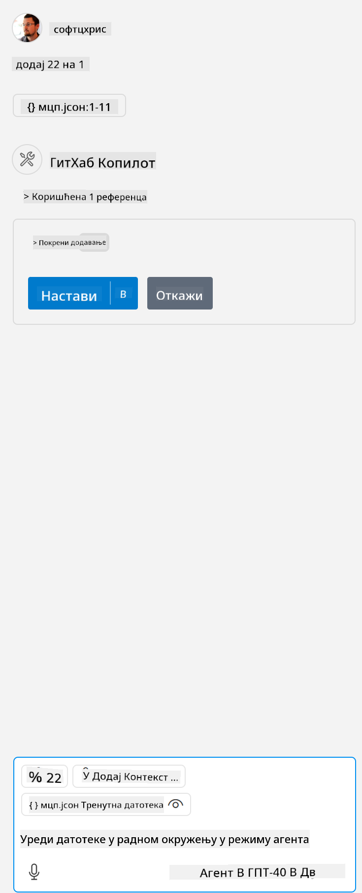

<!--
CO_OP_TRANSLATOR_METADATA:
{
  "original_hash": "96e08a8c1049dab757deb64cce4ea1e8",
  "translation_date": "2025-05-17T11:24:22+00:00",
  "source_file": "03-GettingStarted/04-vscode/solution/README.md",
  "language_code": "sr"
}
-->
# Pokretanje primera

Ovde pretpostavljamo da već imate radni kod servera. Molimo vas da pronađete server iz jednog od prethodnih poglavlja.

## Podešavanje mcp.json

Evo fajla koji koristite kao referencu, [mcp.json](../../../../../03-GettingStarted/04-vscode/solution/mcp.json). 

Izmenite unos za server po potrebi da ukažete na apsolutnu putanju do vašeg servera, uključujući potrebnu punu komandu za pokretanje.

U primer fajlu na koji smo se gore pozvali, unos za server izgleda ovako:

```json
"hello-mcp": {
    "command": "cmd",
    "args": [
        "/c", "node", "<absolute path>\\build\\index.js"
    ]
}
```

Ovo odgovara pokretanju komande kao što je ova: `cmd /c node <absolute path>\\build\index.js`. 

- Change this server entry to fit where your server file is located or to what's needed to startup your server depending on your chosen runtime and server location.

## Consume the features in the server

- Click the `play` icon, once you've added *mcp.json* to *./vscode* folder, 

    Observe the tooling icon change to increase the number of available tools. Tooling icon is located right above the chat field in GitHub Copilot.

## Run a tool

- Type a prompt in your chat window that matches the description of your tool. For example to trigger the tool `add` unesite nešto poput "dodaj 3 na 20".

    Trebalo bi da vidite alat koji se pojavljuje iznad polja za tekst za ćaskanje, što ukazuje da treba da izaberete da pokrenete alat kao na ovoj slici:

    

    Izbor alata bi trebalo da proizvede numerički rezultat koji kaže "23" ako je vaš unos bio kao što smo prethodno pomenuli.

**Одрицање од одговорности**:  
Овај документ је преведен коришћењем услуге вештачке интелигенције [Co-op Translator](https://github.com/Azure/co-op-translator). Иако тежимо тачности, молимо вас да будете свесни да аутоматски преводи могу садржати грешке или нетачности. Оригинални документ на његовом изворном језику треба сматрати меродавним извором. За критичне информације, препоручује се професионални превод од стране људи. Не сносимо одговорност за било каква неспоразумевања или погрешна тумачења која произилазе из коришћења овог превода.