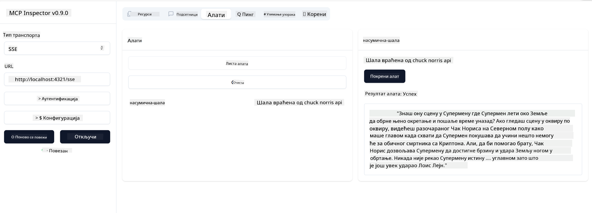

<!--
CO_OP_TRANSLATOR_METADATA:
{
  "original_hash": "0a8086dc4bf89448f83e7936db972c42",
  "translation_date": "2025-05-17T11:44:25+00:00",
  "source_file": "03-GettingStarted/05-sse-server/README.md",
  "language_code": "sr"
}
-->
Sada kada znamo malo više o SSE-u, hajde da sledeće izgradimo SSE server.

## Vežba: Kreiranje SSE servera

Da bismo kreirali naš server, potrebno je da imamo na umu dve stvari:

- Potrebno je da koristimo veb server za izlaganje krajnjih tačaka za konekciju i poruke.
- Izgradite naš server kao što to obično radimo sa alatima, resursima i upitima kada koristimo stdio.

### -1- Kreiranje instance servera

Da bismo kreirali naš server, koristimo iste tipove kao kod stdio. Međutim, za transport, potrebno je da izaberemo SSE.

Dodajmo potrebne rute sledeće.

### -2- Dodavanje ruta

Dodajmo sledeće rute koje će obrađivati konekciju i dolazne poruke:

Dodajmo sposobnosti serveru sledeće.

### -3- Dodavanje sposobnosti servera

Sada kada smo definisali sve specifično za SSE, hajde da dodamo sposobnosti serveru kao što su alati, upiti i resursi.

Vaš kompletan kod bi trebalo da izgleda ovako:

Odlično, imamo server koji koristi SSE, hajde da ga isprobamo sledeće.

## Vežba: Debugovanje SSE servera sa Inspectorom

Inspector je odličan alat koji smo videli u prethodnoj lekciji [Kreiranje vašeg prvog servera](/03-GettingStarted/01-first-server/README.md). Hajde da vidimo da li možemo koristiti Inspector čak i ovde:

### -1- Pokretanje inspectora

Da biste pokrenuli inspector, prvo morate imati pokrenut SSE server, pa hajde da to uradimo sledeće:

1. Pokrenite server

1. Pokrenite inspector

    > ![NOTE]
    > Pokrenite ovo u zasebnom terminalskom prozoru od onog u kojem server radi. Takođe imajte na umu da morate prilagoditi donju komandu da odgovara URL-u na kojem vaš server radi.

    ```sh
    npx @modelcontextprotocol/inspector --cli http://localhost:8000/sse --method tools/list
    ```

    Pokretanje inspectora izgleda isto u svim runtime okruženjima. Obratite pažnju kako umesto da prosleđujemo putanju do našeg servera i komandu za pokretanje servera, mi umesto toga prosleđujemo URL na kojem server radi i takođe navodimo rutu `/sse`.

### -2- Isprobavanje alata

Povežite server odabirom SSE u padajućem meniju i popunite polje za URL gde vaš server radi, na primer http:localhost:4321/sse. Sada kliknite na dugme "Connect". Kao i pre, izaberite da listate alate, izaberite alat i unesite ulazne vrednosti. Trebalo bi da vidite rezultat kao ispod:



Odlično, možete raditi sa inspectorom, hajde da vidimo kako možemo raditi sa Visual Studio Code sledeće.

## Zadatak

Pokušajte da izgradite svoj server sa više sposobnosti. Pogledajte [ovu stranicu](https://api.chucknorris.io/) da, na primer, dodate alat koji poziva API, vi odlučujete kako bi server trebalo da izgleda. Zabavite se :)

## Rešenje

[Rešenje](./solution/README.md) Evo mogućeg rešenja sa radnim kodom.

## Ključne tačke

Ključne tačke iz ovog poglavlja su sledeće:

- SSE je drugi podržani transport pored stdio.
- Da biste podržali SSE, potrebno je da upravljate dolaznim konekcijama i porukama koristeći veb okvir.
- Možete koristiti i Inspector i Visual Studio Code za konzumiranje SSE servera, baš kao i stdio servera. Obratite pažnju kako se malo razlikuje između stdio i SSE. Za SSE, potrebno je da zasebno pokrenete server i zatim pokrenete vaš inspector alat. Za inspector alat, takođe postoje neke razlike u tome što je potrebno da navedete URL.

## Primeri

- [Java Kalkulator](../samples/java/calculator/README.md)
- [.Net Kalkulator](../../../../03-GettingStarted/samples/csharp)
- [JavaScript Kalkulator](../samples/javascript/README.md)
- [TypeScript Kalkulator](../samples/typescript/README.md)
- [Python Kalkulator](../../../../03-GettingStarted/samples/python)

## Dodatni resursi

- [SSE](https://developer.mozilla.org/en-US/docs/Web/API/Server-sent_events)

## Šta je sledeće

- Sledeće: [Početak rada sa AI Toolkit za VSCode](/03-GettingStarted/06-aitk/README.md)

**Одрицање од одговорности**:  
Овај документ је преведен коришћењем AI услуге за превођење [Co-op Translator](https://github.com/Azure/co-op-translator). Иако тежимо ка тачности, молимо вас да будете свесни да аутоматски преводи могу садржати грешке или нетачности. Оригинални документ на његовом изворном језику треба сматрати меродавним извором. За критичне информације, препоручује се професионални људски превод. Не сносимо одговорност за било каква неспоразума или погрешна тумачења која проистекну из употребе овог превода.