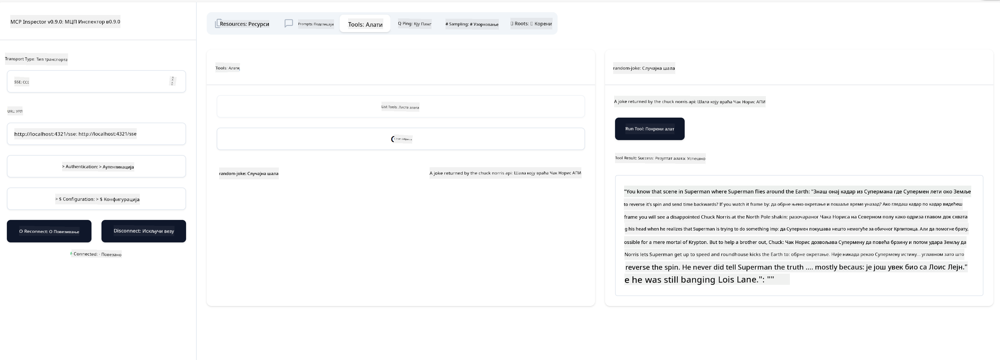

<!--
CO_OP_TRANSLATOR_METADATA:
{
  "original_hash": "6b1152afb5d4cb9a4175044694fd02ca",
  "translation_date": "2025-07-17T11:55:35+00:00",
  "source_file": "03-GettingStarted/05-sse-server/README.md",
  "language_code": "sr"
}
-->
# SSE сервер

SSE (Server Sent Events) је стандард за стримовање са сервера ка клијенту, који омогућава серверима да шаљу ажурирања у реалном времену клијентима преко HTTP-а. Ово је посебно корисно за апликације које захтевају ажурирања уживо, као што су чет апликације, обавештења или фидови података у реалном времену. Такође, ваш сервер може користити више клијената истовремено јер се налази на серверу који може бити покренут негде у облаку, на пример.

## Преглед

Ова лекција обухвата како изградити и користити SSE сервере.

## Циљеви учења

До краја ове лекције, моћи ћете да:

- Направите SSE сервер.
- Отстраните грешке на SSE серверу користећи Inspector.
- Користите SSE сервер у Visual Studio Code-у.

## SSE, како функционише

SSE је један од два подржана типа транспорта. Већ сте видели први, stdio, који је коришћен у претходним лекцијама. Разлика је следећа:

- SSE захтева да управљате две ствари: везом и порукама.
- Пошто је ово сервер који може бити било где, то мора да се одрази на начин рада са алатима као што су Inspector и Visual Studio Code. То значи да уместо да показујете како да покренете сервер, ви указујете на крајњу тачку (endpoint) где се може успоставити веза. Погледајте пример кода испод:

### TypeScript

```typescript
app.get("/sse", async (_: Request, res: Response) => {
    const transport = new SSEServerTransport('/messages', res);
    transports[transport.sessionId] = transport;
    res.on("close", () => {
        delete transports[transport.sessionId];
    });
    await server.connect(transport);
});

app.post("/messages", async (req: Request, res: Response) => {
    const sessionId = req.query.sessionId as string;
    const transport = transports[sessionId];
    if (transport) {
        await transport.handlePostMessage(req, res);
    } else {
        res.status(400).send('No transport found for sessionId');
    }
});
```

У претходном коду:

- `/sse` је подешен као рута. Када се упути захтев ка овој рути, креира се нова инстанца транспорта и сервер се *повезује* користећи овај транспорт.
- `/messages` је рута која обрађује долазне поруке.

### Python

```python
mcp = FastMCP("My App")

@mcp.tool()
def add(a: int, b: int) -> int:
    """Add two numbers"""
    return a + b

# Mount the SSE server to the existing ASGI server
app = Starlette(
    routes=[
        Mount('/', app=mcp.sse_app()),
    ]
)

```

У претходном коду:

- Креирамо инстанцу ASGI сервера (конкретно користећи Starlette) и монтирамо подразумевану руту `/`.

  Оно што се дешава у позадини је да су руте `/sse` и `/messages` подешене да обрађују везе и поруке. Остатак апликације, као што је додавање функција и алата, функционише као и код stdio сервера.

### .NET    

```csharp
    var builder = WebApplication.CreateBuilder(args);
    builder.Services
        .AddMcpServer()
        .WithTools<Tools>();


    builder.Services.AddHttpClient();

    var app = builder.Build();

    app.MapMcp();
    ```

Постоје две методе које нам помажу да пређемо са веб сервера на веб сервер који подржава SSE, а то су:

- `AddMcpServer`, ова метода додаје функционалности.
- `MapMcp`, ова додаје руте као што су `/SSE` и `/messages`.

Сада када знамо нешто више о SSE, хајде да направимо SSE сервер.

## Вежба: Креирање SSE сервера

Да бисмо направили наш сервер, морамо имати на уму две ствари:

- Потребно је користити веб сервер да бисмо изложили крајње тачке за везу и поруке.
- Направити сервер као и обично, користећи алате, ресурсе и упите као када смо користили stdio.

### -1- Креирање инстанце сервера

За креирање сервера користимо исте типове као и код stdio. Међутим, за транспорт морамо изабрати SSE.

### TypeScript

```typescript
import { Request, Response } from "express";
import express from "express";
import { McpServer } from "@modelcontextprotocol/sdk/server/mcp.js";
import { SSEServerTransport } from "@modelcontextprotocol/sdk/server/sse.js";

const server = new McpServer({
  name: "example-server",
  version: "1.0.0"
});

const app = express();

const transports: {[sessionId: string]: SSEServerTransport} = {};
```

У претходном коду смо:

- Креирали инстанцу сервера.
- Дефинисали апликацију користећи веб фрејмворк express.
- Креирали променљиву transports у коју ћемо чувати долазне везе.

### Python

```python
from starlette.applications import Starlette
from starlette.routing import Mount, Host
from mcp.server.fastmcp import FastMCP


mcp = FastMCP("My App")
```

У претходном коду смо:

- Увезли библиотеке које ће нам требати, укључујући Starlette (ASGI фрејмворк).
- Креирали MCP сервер инстанцу `mcp`.

### .NET

```csharp
var builder = WebApplication.CreateBuilder(args);
builder.Services
    .AddMcpServer();


builder.Services.AddHttpClient();

var app = builder.Build();

// TODO: add routes 
```

У овом тренутку смо:

- Креирали веб апликацију.
- Додали подршку за MCP функције преко `AddMcpServer`.

Хајде да додамо потребне руте.

### -2- Додавање рута

Додајмо руте које обрађују везу и долазне поруке:

### TypeScript

```typescript
app.get("/sse", async (_: Request, res: Response) => {
  const transport = new SSEServerTransport('/messages', res);
  transports[transport.sessionId] = transport;
  res.on("close", () => {
    delete transports[transport.sessionId];
  });
  await server.connect(transport);
});

app.post("/messages", async (req: Request, res: Response) => {
  const sessionId = req.query.sessionId as string;
  const transport = transports[sessionId];
  if (transport) {
    await transport.handlePostMessage(req, res);
  } else {
    res.status(400).send('No transport found for sessionId');
  }
});

app.listen(3001);
```

У претходном коду смо дефинисали:

- Руту `/sse` која инстанцира транспорт типа SSE и позива `connect` на MCP серверу.
- Руту `/messages` која обрађује долазне поруке.

### Python

```python
app = Starlette(
    routes=[
        Mount('/', app=mcp.sse_app()),
    ]
)
```

У претходном коду смо:

- Креирали ASGI апликацију користећи Starlette фрејмворк. У томе смо проследили `mcp.sse_app()` као део листе рута. То резултује монтирањем рута `/sse` и `/messages` на апликацију.

### .NET

```csharp
var builder = WebApplication.CreateBuilder(args);
builder.Services
    .AddMcpServer();

builder.Services.AddHttpClient();

var app = builder.Build();

app.MapMcp();
```

Додали смо једну линију кода на крају `add.MapMcp()`, што значи да сада имамо руте `/SSE` и `/messages`.

Хајде да додамо функционалности серверу.

### -3- Додавање функционалности серверу

Сада када смо дефинисали све што је специфично за SSE, додајмо функционалности као што су алати, упити и ресурси.

### TypeScript

```typescript
server.tool("random-joke", "A joke returned by the chuck norris api", {},
  async () => {
    const response = await fetch("https://api.chucknorris.io/jokes/random");
    const data = await response.json();

    return {
      content: [
        {
          type: "text",
          text: data.value
        }
      ]
    };
  }
);
```

Ево како можете додати алат, на пример. Овај конкретан алат креира алат под називом "random-joke" који позива Chuck Norris API и враћа JSON одговор.

### Python

```python
@mcp.tool()
def add(a: int, b: int) -> int:
    """Add two numbers"""
    return a + b
```

Сада ваш сервер има један алат.

### TypeScript

```typescript
// server-sse.ts
import { Request, Response } from "express";
import express from "express";
import { McpServer } from "@modelcontextprotocol/sdk/server/mcp.js";
import { SSEServerTransport } from "@modelcontextprotocol/sdk/server/sse.js";

// Create an MCP server
const server = new McpServer({
  name: "example-server",
  version: "1.0.0",
});

const app = express();

const transports: { [sessionId: string]: SSEServerTransport } = {};

app.get("/sse", async (_: Request, res: Response) => {
  const transport = new SSEServerTransport("/messages", res);
  transports[transport.sessionId] = transport;
  res.on("close", () => {
    delete transports[transport.sessionId];
  });
  await server.connect(transport);
});

app.post("/messages", async (req: Request, res: Response) => {
  const sessionId = req.query.sessionId as string;
  const transport = transports[sessionId];
  if (transport) {
    await transport.handlePostMessage(req, res);
  } else {
    res.status(400).send("No transport found for sessionId");
  }
});

server.tool("random-joke", "A joke returned by the chuck norris api", {}, async () => {
  const response = await fetch("https://api.chucknorris.io/jokes/random");
  const data = await response.json();

  return {
    content: [
      {
        type: "text",
        text: data.value,
      },
    ],
  };
});

app.listen(3001);
```

### Python

```python
from starlette.applications import Starlette
from starlette.routing import Mount, Host
from mcp.server.fastmcp import FastMCP


mcp = FastMCP("My App")

@mcp.tool()
def add(a: int, b: int) -> int:
    """Add two numbers"""
    return a + b

# Mount the SSE server to the existing ASGI server
app = Starlette(
    routes=[
        Mount('/', app=mcp.sse_app()),
    ]
)
```

### .NET

1. Прво хајде да направимо неке алате, за то ћемо креирати фајл *Tools.cs* са следећим садржајем:

  ```csharp
  using System.ComponentModel;
  using System.Text.Json;
  using ModelContextProtocol.Server;

  namespace server;

  [McpServerToolType]
  public sealed class Tools
  {

      public Tools()
      {
      
      }

      [McpServerTool, Description("Add two numbers together.")]
      public async Task<string> AddNumbers(
          [Description("The first number")] int a,
          [Description("The second number")] int b)
      {
          return (a + b).ToString();
      }

  }
  ```

  Овде смо додали следеће:

  - Креирали класу `Tools` са декоратором `McpServerToolType`.
  - Дефинисали алат `AddNumbers` тако што смо метод означили са `McpServerTool`. Такође смо обезбедили параметре и имплементацију.

1. Хајде да искористимо класу `Tools` коју смо управо направили:

  ```csharp
  var builder = WebApplication.CreateBuilder(args);
  builder.Services
      .AddMcpServer()
      .WithTools<Tools>();


  builder.Services.AddHttpClient();

  var app = builder.Build();

  app.MapMcp();
  ```

  Додали смо позив `WithTools` који одређује `Tools` као класу која садржи алате. То је то, спремни смо.

Сјајно, имамо сервер који користи SSE, хајде да га испробамо.

## Вежба: Отстрањивање грешака на SSE серверу помоћу Inspectora

Inspector је одличан алат који смо видели у претходној лекцији [Креирање вашег првог сервера](/03-GettingStarted/01-first-server/README.md). Хајде да видимо да ли можемо користити Inspector и овде:

### -1- Покретање Inspectora

Да бисте покренули Inspector, прво морате имати покренут SSE сервер, па хајде да то урадимо:

1. Покрените сервер

    ### TypeScript

    ```sh
    tsx && node ./build/server-sse.ts
    ```

    ### Python

    ```sh
    uvicorn server:app
    ```

    Обратите пажњу како користимо извршни фајл `uvicorn` који се инсталира када укуцате `pip install "mcp[cli]"`. Унос `server:app` значи да покушавамо да покренемо фајл `server.py` који садржи Starlette инстанцу под именом `app`.

    ### .NET

    ```sh
    dotnet run
    ```

    Ово би требало да покрене сервер. Да бисте комуницирали са њим, потребан вам је нови терминал.

1. Покрените Inspector

    > ![NOTE]
    > Покрените ово у посебном терминал прозору одвојено од оног у коме сервер ради. Такође, имајте у виду да морате прилагодити команду испод тако да одговара URL-у на ком ваш сервер ради.

    ```sh
    npx @modelcontextprotocol/inspector --cli http://localhost:8000/sse --method tools/list
    ```

    Покретање Inspectora изгледа исто у свим окружењима. Обратите пажњу како уместо да прослеђујемо пут до сервера и команду за покретање сервера, ми прослеђујемо URL где сервер ради и такође назначавамо руту `/sse`.

### -2- Испробавање алата

Повежите сервер тако што ћете изабрати SSE у падајућем менију и унети URL где ваш сервер ради, на пример http:localhost:4321/sse. Сада кликните на дугме "Connect". Као и раније, изаберите да листате алате, изаберите алат и унесите улазне вредности. Требало би да видите резултат као на слици испод:



Сјајно, можете радити са Inspector-ом, хајде да видимо како да радимо са Visual Studio Code-ом.

## Задатак

Покушајте да проширите свој сервер са више функционалности. Погледајте [ову страницу](https://api.chucknorris.io/) да, на пример, додате алат који позива API. Ви одлучујете како сервер треба да изгледа. Забавите се :)

## Решење

[Решење](./solution/README.md) Ево једног могућег решења са радним кодом.

## Кључне поуке

Кључне поуке из овог поглавља су следеће:

- SSE је други подржани транспорт поред stdio.
- Да бисте подржали SSE, морате управљати долазним везама и порукама користећи веб фрејмворк.
- Можете користити и Inspector и Visual Studio Code за коришћење SSE сервера, као и код stdio сервера. Обратите пажњу на разлике између stdio и SSE. За SSE, сервер морате покренути посебно, а затим покренути Inspector алат. За Inspector алат постоје и неке разлике у томе што морате назначити URL.

## Примери

- [Java калкулатор](../samples/java/calculator/README.md)
- [.Net калкулатор](../../../../03-GettingStarted/samples/csharp)
- [JavaScript калкулатор](../samples/javascript/README.md)
- [TypeScript калкулатор](../samples/typescript/README.md)
- [Python калкулатор](../../../../03-GettingStarted/samples/python)

## Додатни ресурси

- [SSE](https://developer.mozilla.org/en-US/docs/Web/API/Server-sent_events)

## Шта следи

- Следеће: [HTTP стримовање са MCP (Streamable HTTP)](../06-http-streaming/README.md)

**Одрицање од одговорности**:  
Овај документ је преведен коришћењем AI преводилачке услуге [Co-op Translator](https://github.com/Azure/co-op-translator). Иако се трудимо да превод буде тачан, молимо вас да имате у виду да аутоматски преводи могу садржати грешке или нетачности. Оригинални документ на његовом изворном језику треба сматрати ауторитетним извором. За критичне информације препоручује се професионални људски превод. Нисмо одговорни за било каква неспоразума или погрешна тумачења која произилазе из коришћења овог превода.