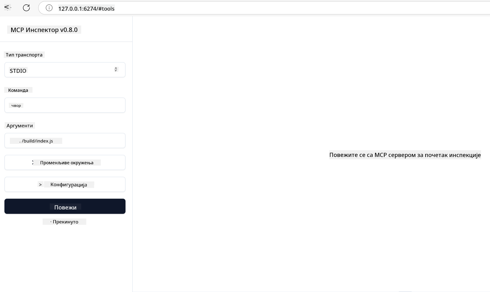

<!--
CO_OP_TRANSLATOR_METADATA:
{
  "original_hash": "717f34718a773f6cf52d8445e40a96bf",
  "translation_date": "2025-05-17T12:48:23+00:00",
  "source_file": "03-GettingStarted/07-testing/README.md",
  "language_code": "sr"
}
-->
## Testiranje i otklanjanje grešaka

Pre nego što počnete sa testiranjem vašeg MCP servera, važno je razumeti dostupne alate i najbolje prakse za otklanjanje grešaka. Efikasno testiranje osigurava da vaš server radi kako je očekivano i pomaže vam da brzo identifikujete i rešite probleme. Sledeći odeljak opisuje preporučene pristupe za validaciju vaše MCP implementacije.

## Pregled

Ova lekcija pokriva kako odabrati pravi pristup testiranju i najefikasniji alat za testiranje.

## Ciljevi učenja

Na kraju ove lekcije, bićete u mogućnosti da:

- Opisujete različite pristupe za testiranje.
- Koristite različite alate za efikasno testiranje vašeg koda.

## Testiranje MCP servera

MCP pruža alate koji vam pomažu da testirate i otklanjate greške na vašim serverima:

- **MCP Inspector**: Alatka komandne linije koja može da se koristi kao CLI alatka i kao vizuelna alatka.
- **Ručno testiranje**: Možete koristiti alatku kao što je curl za slanje web zahteva, ali bilo koja alatka sposobna za rad sa HTTP-om će biti dovoljna.
- **Jedinično testiranje**: Moguće je koristiti vaš omiljeni okvir za testiranje kako biste testirali funkcionalnosti servera i klijenta.

### Korišćenje MCP Inspector

Opisali smo upotrebu ove alatke u prethodnim lekcijama, ali hajde da pričamo o njoj malo na visokom nivou. To je alatka izgrađena u Node.js i možete je koristiti pozivanjem `npx` izvršnog fajla koji će privremeno preuzeti i instalirati samu alatku i očistiti se nakon što završi izvršavanje vašeg zahteva.

[MCP Inspector](https://github.com/modelcontextprotocol/inspector) vam pomaže da:

- **Otkrivate sposobnosti servera**: Automatski detektujete dostupne resurse, alate i podsticaje
- **Testirate izvršavanje alata**: Isprobate različite parametre i vidite odgovore u realnom vremenu
- **Pregledate metapodatke servera**: Ispitate informacije o serveru, šeme i konfiguracije

Tipičan pokretanje alatke izgleda ovako:

```bash
npx @modelcontextprotocol/inspector node build/index.js
```

Gore navedena komanda pokreće MCP i njegovu vizuelnu interfejs i lansira lokalni web interfejs u vašem pretraživaču. Možete očekivati da vidite kontrolnu tablu koja prikazuje vaše registrovane MCP servere, njihove dostupne alate, resurse i podsticaje. Interfejs vam omogućava interaktivno testiranje izvršavanja alata, inspekciju metapodataka servera i pregled odgovora u realnom vremenu, što olakšava validaciju i otklanjanje grešaka u vašim MCP implementacijama servera.

Evo kako to može izgledati: 

Možete pokrenuti ovu alatku i u CLI režimu u kojem dodajete atribut `--cli`. Evo primera pokretanja alatke u "CLI" režimu koji prikazuje sve alate na serveru:

```sh
npx @modelcontextprotocol/inspector --cli node build/index.js --method tools/list
```

### Ručno testiranje

Pored pokretanja alatke za inspekciju za testiranje sposobnosti servera, sličan pristup je da pokrenete klijenta sposobnog za korišćenje HTTP-a, kao na primer curl.

Sa curl-om, možete direktno testirati MCP servere koristeći HTTP zahteve:

```bash
# Example: Test server metadata
curl http://localhost:3000/v1/metadata

# Example: Execute a tool
curl -X POST http://localhost:3000/v1/tools/execute \
  -H "Content-Type: application/json" \
  -d '{"name": "calculator", "parameters": {"expression": "2+2"}}'
```

Kao što možete videti iz gore navedenog korišćenja curl-a, koristite POST zahtev za pokretanje alatke koristeći podatke koji se sastoje od imena alatke i njegovih parametara. Koristite pristup koji vam najbolje odgovara. CLI alati obično su brži za korišćenje i mogu se skriptovati, što može biti korisno u CI/CD okruženju.

### Jedinično testiranje

Kreirajte jedinične testove za vaše alate i resurse kako biste osigurali da rade kako je očekivano. Evo nekog primera koda za testiranje.

```python
import pytest

from mcp.server.fastmcp import FastMCP
from mcp.shared.memory import (
    create_connected_server_and_client_session as create_session,
)

# Mark the whole module for async tests
pytestmark = pytest.mark.anyio


async def test_list_tools_cursor_parameter():
    """Test that the cursor parameter is accepted for list_tools.

    Note: FastMCP doesn't currently implement pagination, so this test
    only verifies that the cursor parameter is accepted by the client.
    """

 server = FastMCP("test")

    # Create a couple of test tools
    @server.tool(name="test_tool_1")
    async def test_tool_1() -> str:
        """First test tool"""
        return "Result 1"

    @server.tool(name="test_tool_2")
    async def test_tool_2() -> str:
        """Second test tool"""
        return "Result 2"

    async with create_session(server._mcp_server) as client_session:
        # Test without cursor parameter (omitted)
        result1 = await client_session.list_tools()
        assert len(result1.tools) == 2

        # Test with cursor=None
        result2 = await client_session.list_tools(cursor=None)
        assert len(result2.tools) == 2

        # Test with cursor as string
        result3 = await client_session.list_tools(cursor="some_cursor_value")
        assert len(result3.tools) == 2

        # Test with empty string cursor
        result4 = await client_session.list_tools(cursor="")
        assert len(result4.tools) == 2
    
```

Prethodni kod radi sledeće:

- Koristi pytest okvir koji vam omogućava da kreirate testove kao funkcije i koristite assert izjave.
- Kreira MCP server sa dva različita alata.
- Koristi `assert` izjavu da proveri da li su određeni uslovi ispunjeni.

Pogledajte [ceo fajl ovde](https://github.com/modelcontextprotocol/python-sdk/blob/main/tests/client/test_list_methods_cursor.py)

S obzirom na gornji fajl, možete testirati vaš sopstveni server da osigurate da se sposobnosti kreiraju kako bi trebalo.

Svi glavni SDK-ovi imaju slične sekcije za testiranje tako da možete prilagoditi svom odabranom okruženju za izvršavanje.

## Primeri

- [Java Kalkulator](../samples/java/calculator/README.md)
- [.Net Kalkulator](../../../../03-GettingStarted/samples/csharp)
- [JavaScript Kalkulator](../samples/javascript/README.md)
- [TypeScript Kalkulator](../samples/typescript/README.md)
- [Python Kalkulator](../../../../03-GettingStarted/samples/python)

## Dodatni resursi

- [Python SDK](https://github.com/modelcontextprotocol/python-sdk)

## Šta je sledeće

- Sledeće: [Implementacija](/03-GettingStarted/08-deployment/README.md)

**Одрицање од одговорности**:  
Овај документ је преведен користећи AI услугу превођења [Co-op Translator](https://github.com/Azure/co-op-translator). Иако тежимо ка тачности, молимо вас да будете свесни да аутоматизовани преводи могу садржати грешке или нетачности. Оригинални документ на његовом изворном језику треба сматрати ауторитативним извором. За критичне информације, препоручује се професионални превод од стране људи. Не сносимо одговорност за било какве неспоразуме или погрешна тумачења која произилазе из употребе овог превода.