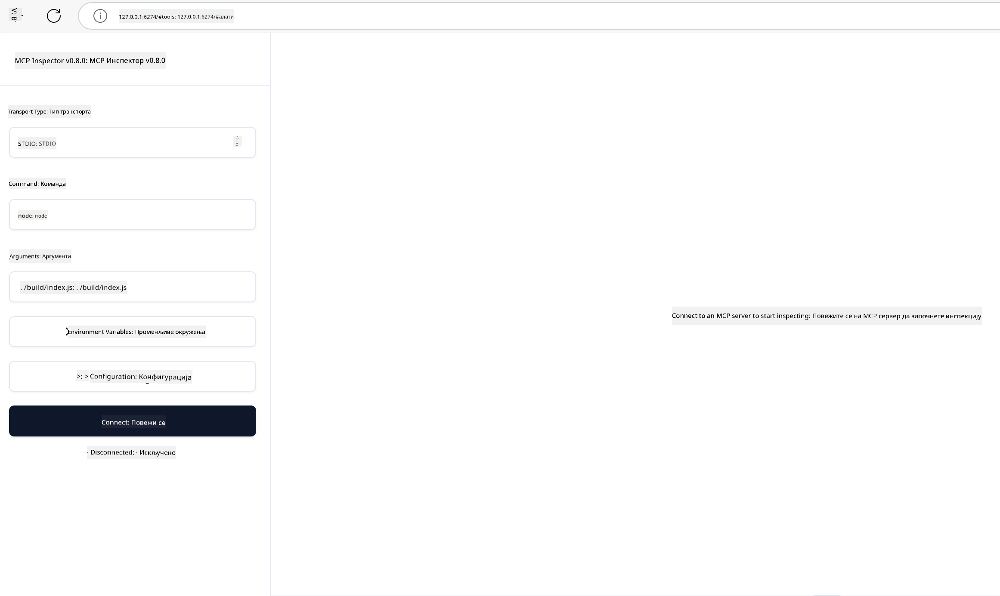

<!--
CO_OP_TRANSLATOR_METADATA:
{
  "original_hash": "4e34e34e84f013e73c7eaa6d09884756",
  "translation_date": "2025-07-13T22:04:11+00:00",
  "source_file": "03-GettingStarted/08-testing/README.md",
  "language_code": "sr"
}
-->
## Тестирање и отклањање грешака

Пре него што почнете са тестирањем вашег MCP сервера, важно је да разумете доступне алате и најбоље праксе за отклањање грешака. Ефикасно тестирање осигурава да ваш сервер ради онако како се очекује и помаже вам да брзо идентификујете и решите проблеме. Следећи одељак описује препоручене приступе за валидацију ваше MCP имплементације.

## Преглед

Ова лекција обухвата како одабрати прави приступ тестирању и најефикаснији алат за тестирање.

## Циљеви учења

До краја ове лекције, моћи ћете да:

- Опишете различите приступе тестирању.
- Користите различите алате за ефикасно тестирање вашег кода.

## Тестирање MCP сервера

MCP пружа алате који вам помажу да тестирате и отклањате грешке на вашим серверима:

- **MCP Inspector**: Алат за командну линију који се може покретати и као CLI и као визуелни алат.
- **Ручно тестирање**: Можете користити алат као што је curl за слање веб захтева, али било који алат који може да извршава HTTP захтеве ће бити погодан.
- **Јединично тестирање**: Могуће је користити ваш омиљени тестирачки фрејмворк за тестирање функција и сервера и клијента.

### Коришћење MCP Inspector-а

Овај алат смо описали у претходним лекцијама, али хајде да га укратко представимо. То је алат изграђен у Node.js и можете га користити позивањем извршног фајла `npx` који ће привремено преузети и инсталирати алат, а након извршења вашег захтева ће се сам очистити.

[MCP Inspector](https://github.com/modelcontextprotocol/inspector) вам помаже да:

- **Откријете могућности сервера**: Аутоматски детектује доступне ресурсе, алате и упите
- **Тестирате извршење алата**: Испробајте различите параметре и пратите одговоре у реалном времену
- **Погледате метаподатке сервера**: Испитујте информације о серверу, шеме и конфигурације

Типично покретање алата изгледа овако:

```bash
npx @modelcontextprotocol/inspector node build/index.js
```

Горња команда покреће MCP и његов визуелни интерфејс и отвара локални веб интерфејс у вашем прегледачу. Можете очекивати да видите контролну таблу која приказује ваше регистроване MCP сервере, њихове доступне алате, ресурсе и упите. Интерфејс вам омогућава интерактивно тестирање извршења алата, преглед метаподатака сервера и праћење одговора у реалном времену, што олакшава валидацију и отклањање грешака у вашим MCP имплементацијама.

Ево како то може изгледати: 

Такође можете покренути овај алат у CLI режиму додавањем атрибута `--cli`. Ево примера покретања алата у "CLI" режиму који приказује све алате на серверу:

```sh
npx @modelcontextprotocol/inspector --cli node build/index.js --method tools/list
```

### Ручно тестирање

Поред покретања инспектора за тестирање могућности сервера, сличан приступ је коришћење клијента који може да користи HTTP, као што је curl.

Помоћу curl-а можете директно тестирати MCP сервере користећи HTTP захтеве:

```bash
# Example: Test server metadata
curl http://localhost:3000/v1/metadata

# Example: Execute a tool
curl -X POST http://localhost:3000/v1/tools/execute \
  -H "Content-Type: application/json" \
  -d '{"name": "calculator", "parameters": {"expression": "2+2"}}'
```

Као што видите из горњег примера коришћења curl-а, користите POST захтев да позовете алат са подацима који садрже име алата и његове параметре. Користите приступ који вам највише одговара. CLI алати су генерално бржи за коришћење и лако се могу скриптовати, што може бити корисно у CI/CD окружењу.

### Јединично тестирање

Креирајте јединичне тестове за ваше алате и ресурсе како бисте били сигурни да раде како се очекује. Ево примера тест кода.

```python
import pytest

from mcp.server.fastmcp import FastMCP
from mcp.shared.memory import (
    create_connected_server_and_client_session as create_session,
)

# Mark the whole module for async tests
pytestmark = pytest.mark.anyio


async def test_list_tools_cursor_parameter():
    """Test that the cursor parameter is accepted for list_tools.

    Note: FastMCP doesn't currently implement pagination, so this test
    only verifies that the cursor parameter is accepted by the client.
    """

 server = FastMCP("test")

    # Create a couple of test tools
    @server.tool(name="test_tool_1")
    async def test_tool_1() -> str:
        """First test tool"""
        return "Result 1"

    @server.tool(name="test_tool_2")
    async def test_tool_2() -> str:
        """Second test tool"""
        return "Result 2"

    async with create_session(server._mcp_server) as client_session:
        # Test without cursor parameter (omitted)
        result1 = await client_session.list_tools()
        assert len(result1.tools) == 2

        # Test with cursor=None
        result2 = await client_session.list_tools(cursor=None)
        assert len(result2.tools) == 2

        # Test with cursor as string
        result3 = await client_session.list_tools(cursor="some_cursor_value")
        assert len(result3.tools) == 2

        # Test with empty string cursor
        result4 = await client_session.list_tools(cursor="")
        assert len(result4.tools) == 2
    
```

Горњи код ради следеће:

- Користи pytest фрејмворк који вам омогућава да креирате тестове као функције и користите assert изјаве.
- Креира MCP сервер са два различита алата.
- Користи `assert` изјаву да провери да ли су одређени услови испуњени.

Погледајте [целу датотеку овде](https://github.com/modelcontextprotocol/python-sdk/blob/main/tests/client/test_list_methods_cursor.py)

На основу ове датотеке, можете тестирати свој сервер како бисте били сигурни да су могућности креиране како треба.

Сви главни SDK-ови имају сличне секције за тестирање, па их можете прилагодити вашем одабраном окружењу.

## Примери

- [Java калкулатор](../samples/java/calculator/README.md)
- [.Net калкулатор](../../../../03-GettingStarted/samples/csharp)
- [JavaScript калкулатор](../samples/javascript/README.md)
- [TypeScript калкулатор](../samples/typescript/README.md)
- [Python калкулатор](../../../../03-GettingStarted/samples/python)

## Додатни ресурси

- [Python SDK](https://github.com/modelcontextprotocol/python-sdk)

## Шта следи

- Следеће: [Деплојмент](../09-deployment/README.md)

**Одрицање од одговорности**:  
Овај документ је преведен коришћењем AI услуге за превођење [Co-op Translator](https://github.com/Azure/co-op-translator). Иако се трудимо да превод буде тачан, молимо вас да имате у виду да аутоматски преводи могу садржати грешке или нетачности. Оригинални документ на његовом изворном језику треба сматрати ауторитетним извором. За критичне информације препоручује се професионални људски превод. Нисмо одговорни за било каква неспоразума или погрешна тумачења која произилазе из коришћења овог превода.