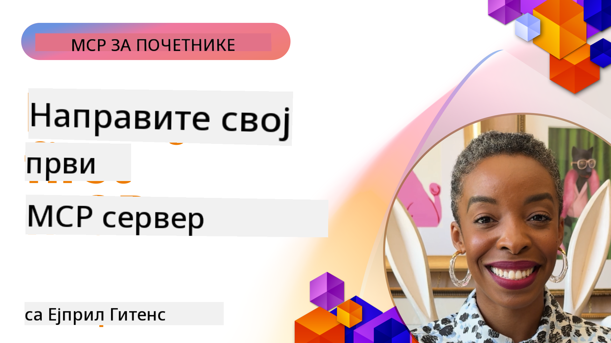

<!--
CO_OP_TRANSLATOR_METADATA:
{
  "original_hash": "858362ce0118de3fec0f9114bf396101",
  "translation_date": "2025-08-19T17:27:50+00:00",
  "source_file": "03-GettingStarted/README.md",
  "language_code": "sr"
}
-->
## Почетак  

_(Кликните на слику изнад да бисте погледали видео лекцију)_

Овај одељак се састоји од неколико лекција:

- **1 Ваш први сервер**, у овој првој лекцији научићете како да направите свој први сервер и прегледате га помоћу алата за инспекцију, што је вредан начин за тестирање и отклањање грешака на вашем серверу, [на лекцију](01-first-server/README.md)

- **2 Клијент**, у овој лекцији научићете како да напишете клијента који може да се повеже са вашим сервером, [на лекцију](02-client/README.md)

- **3 Клијент са LLM**, још бољи начин за писање клијента је додавање LLM-а како би могао да "преговара" са вашим сервером о томе шта да ради, [на лекцију](03-llm-client/README.md)

- **4 Коришћење GitHub Copilot Agent режима у Visual Studio Code**. Овде ћемо погледати како да покренемо наш MCP сервер из Visual Studio Code-а, [на лекцију](04-vscode/README.md)

- **5 Коришћење SSE (Server Sent Events)** SSE је стандард за стримовање са сервера на клијента, омогућавајући серверима да шаљу ажурирања у реалном времену клијентима преко HTTP-а [на лекцију](05-sse-server/README.md)

- **6 HTTP стримовање са MCP (Streamable HTTP)**. Научите о модерном HTTP стримовању, обавештењима о напретку и како да имплементирате скалабилне, реал-тиме MCP сервере и клијенте користећи Streamable HTTP. [на лекцију](06-http-streaming/README.md)

- **7 Коришћење AI Toolkit-а за VSCode** за тестирање и коришћење ваших MCP клијената и сервера [на лекцију](07-aitk/README.md)

- **8 Тестирање**. Овде ћемо се посебно фокусирати на то како можемо тестирати наш сервер и клијент на различите начине, [на лекцију](08-testing/README.md)

- **9 Деплојмент**. Ово поглавље ће размотрити различите начине за деплојмент ваших MCP решења, [на лекцију](09-deployment/README.md)

Model Context Protocol (MCP) је отворени протокол који стандардизује како апликације пружају контекст LLM-овима. Замислите MCP као USB-C порт за AI апликације - он пружа стандардизован начин за повезивање AI модела са различитим изворима података и алатима.

## Циљеви учења

До краја ове лекције, бићете у могућности да:

- Поставите развојна окружења за MCP у C#, Java, Python, TypeScript и JavaScript
- Направите и деплојујете основне MCP сервере са прилагођеним функцијама (ресурси, упити и алати)
- Креирате хост апликације које се повезују са MCP серверима
- Тестирате и отклањате грешке у MCP имплементацијама
- Разумете уобичајене изазове у подешавању и њихова решења
- Повежете своје MCP имплементације са популарним LLM сервисима

## Постављање MCP окружења

Пре него што почнете да радите са MCP-ом, важно је припремити своје развојно окружење и разумети основни ток рада. Овај одељак ће вас водити кроз почетне кораке подешавања како бисте осигурали несметан почетак рада са MCP-ом.

### Предуслови

Пре него што се упустите у развој MCP-а, уверите се да имате:

- **Развојно окружење**: За изабрани језик (C#, Java, Python, TypeScript или JavaScript)
- **IDE/Едитор**: Visual Studio, Visual Studio Code, IntelliJ, Eclipse, PyCharm или било који модеран едитор кода
- **Менаџери пакета**: NuGet, Maven/Gradle, pip или npm/yarn
- **API кључеве**: За било које AI сервисе које планирате да користите у својим хост апликацијама

### Званични SDK-ови

У наредним поглављима видећете решења изграђена коришћењем Python-а, TypeScript-а, Java-е и .NET-а. Овде су сви званично подржани SDK-ови.

MCP пружа званичне SDK-ове за више језика:
- [C# SDK](https://github.com/modelcontextprotocol/csharp-sdk) - Одржава се у сарадњи са Microsoft-ом
- [Java SDK](https://github.com/modelcontextprotocol/java-sdk) - Одржава се у сарадњи са Spring AI
- [TypeScript SDK](https://github.com/modelcontextprotocol/typescript-sdk) - Званична имплементација за TypeScript
- [Python SDK](https://github.com/modelcontextprotocol/python-sdk) - Званична имплементација за Python
- [Kotlin SDK](https://github.com/modelcontextprotocol/kotlin-sdk) - Званична имплементација за Kotlin
- [Swift SDK](https://github.com/modelcontextprotocol/swift-sdk) - Одржава се у сарадњи са Loopwork AI
- [Rust SDK](https://github.com/modelcontextprotocol/rust-sdk) - Званична имплементација за Rust

## Кључне напомене

- Постављање MCP развојног окружења је једноставно уз SDK-ове специфичне за језик
- Изградња MCP сервера укључује креирање и регистрацију алата са јасним шемама
- MCP клијенти се повезују са серверима и моделима како би искористили проширене могућности
- Тестирање и отклањање грешака су кључни за поуздане MCP имплементације
- Опције деплојмента укључују локални развој и решења заснована на облаку

## Вежбање

Имамо сет примера који допуњују вежбе које ћете видети у свим поглављима овог одељка. Поред тога, свако поглавље има своје вежбе и задатке.

- [Java Калкулатор](./samples/java/calculator/README.md)
- [.Net Калкулатор](../../../03-GettingStarted/samples/csharp)
- [JavaScript Калкулатор](./samples/javascript/README.md)
- [TypeScript Калкулатор](./samples/typescript/README.md)
- [Python Калкулатор](../../../03-GettingStarted/samples/python)

## Додатни ресурси

- [Изградња агената користећи Model Context Protocol на Azure-у](https://learn.microsoft.com/azure/developer/ai/intro-agents-mcp)
- [Remote MCP са Azure Container Apps (Node.js/TypeScript/JavaScript)](https://learn.microsoft.com/samples/azure-samples/mcp-container-ts/mcp-container-ts/)
- [.NET OpenAI MCP Agent](https://learn.microsoft.com/samples/azure-samples/openai-mcp-agent-dotnet/openai-mcp-agent-dotnet/)

## Шта следи

Следеће: [Креирање вашег првог MCP сервера](01-first-server/README.md)

**Одрицање од одговорности**:  
Овај документ је преведен коришћењем услуге за превођење помоћу вештачке интелигенције [Co-op Translator](https://github.com/Azure/co-op-translator). Иако се трудимо да обезбедимо тачност, молимо вас да имате у виду да аутоматски преводи могу садржати грешке или нетачности. Оригинални документ на његовом изворном језику треба сматрати меродавним извором. За критичне информације препоручује се професионални превод од стране људи. Не преузимамо одговорност за било каква погрешна тумачења или неспоразуме који могу настати услед коришћења овог превода.